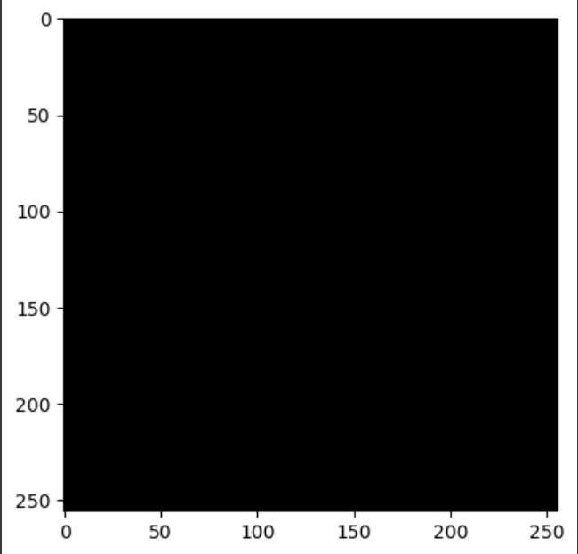
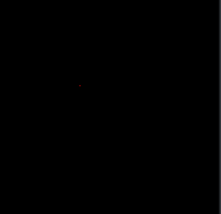
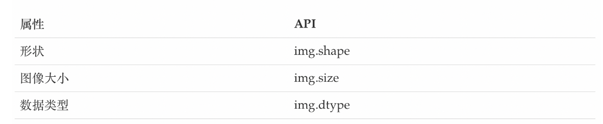
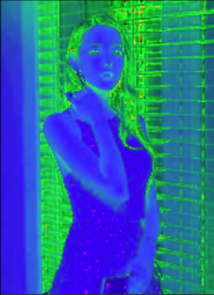
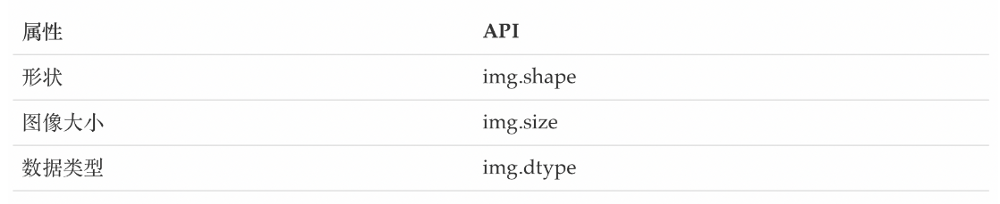
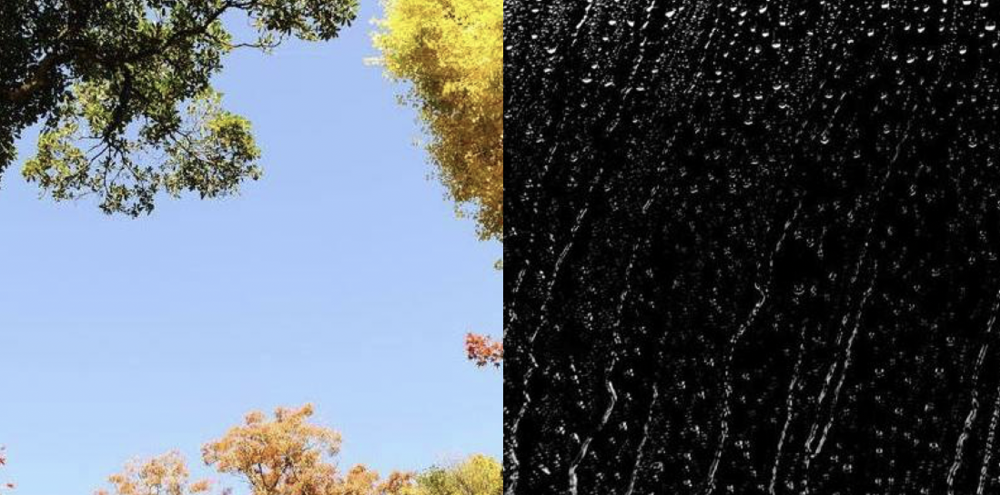
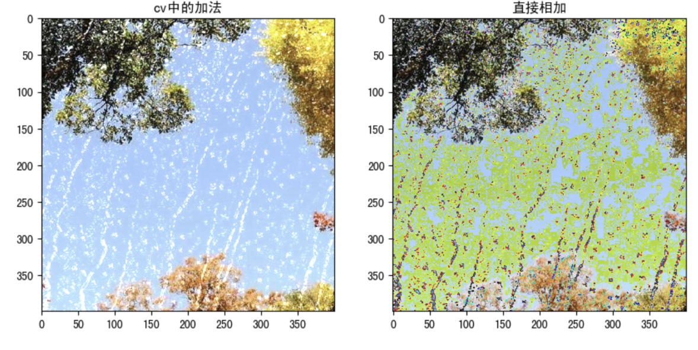
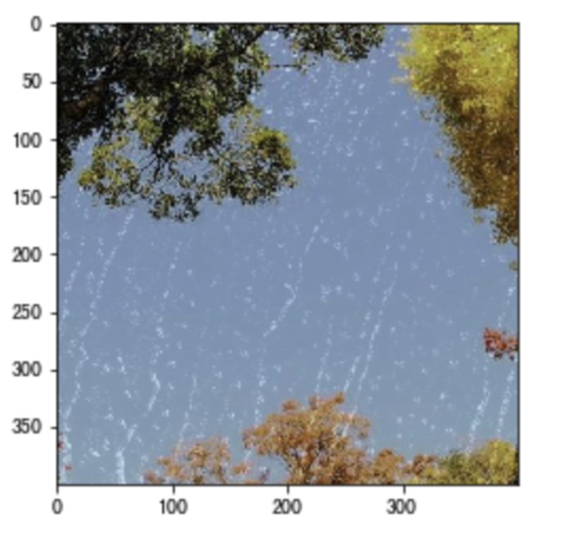

---

# 二，openCV基础

**说明：笔记是跟着B站黑马程序员的openCV课程时做的**


## 1，图像基本操作

### 1-1 图像基础操作

#### 1-1-1 安装相关库

```python
pip install opencv-python
pip install opencv-contrib-python 

## 尽量保持两个库安装的版本，比如我都是4.9.0.80
opencv-contrib-python         4.9.0.80
opencv-python                 4.9.0.80

```

#### 1-1-2 导入使用

```python
import cv2
import matplotlib.pyplot  as plt
import numpy as np
```

#### 1-1-3 导入图片

##### 1-3-1 cv2.imshow()   显示图片

参数：

- 显示图像的窗口名称，以字符串类型表示
- 要加载的图像

**注意：在调用显示图像的API后，要调用cv.waitKey()给图像绘制留下时间，否则窗口会出现无响应情况，并且图像无法显示出来**。

```python
img = cv2.imread('./img/01.jpg')
print(img)

## 图像的显示
cv2.imshow('image',img)
## 等待时间，毫秒级。0表示任意键终止
cv2.waitKey(0)
cv2.destroyAllWindows()
```

- cv.IMREAD*COLOR：以彩色模式加载图像，任何图像的透明度都将被忽略。这是默认参数。
- cv.IMREAD*GRAYSCALE：以灰度模式加载图像
- cv.IMREAD_UNCHANGED：包括alpha通道的加载图像模式。

```python
## 第二个参数，设置彩色还是灰度
img = cv2.imread('./img/01.jpg',cv2.IMREAD_GRAYSCALE )

# 以灰度图的形式读取图像
img = cv.imread('messi5.jpg',0)
```

##### 1-3-2 matplotlib 显示图片

彩色图

```python
import matplotlib.pyplot  as plt
img = cv2.imread('./img/01.jpg')
plt.imshow(img[:,:,::-1])
plt.show()
```

灰度图

```python
import matplotlib.pyplot  as plt
img = cv2.imread('./img/01.jpg'，0)
plt.imshow(img,cmap=plt.cm.gray)
plt.show()
```


#### 1-1-4 图片保存

参数：

- 文件名，要保存在哪里
- 要保存的图像

```python
# 路径和保存的图片
cv2.imwrite('nwe_img.png',img)
```

```Python
import numpy as np
import cv2 as cv
import matplotlib.pyplot as plt
# 1 读取图像
img = cv.imread('messi5.jpg',0)
# 2 显示图像
# 2.1 利用opencv展示图像
cv.imshow('image',img)
# 2.2 在matplotplotlib中展示图像
plt.imshow(img[:,:,::-1])
plt.title('匹配结果'), plt.xticks([]), plt.yticks([])
plt.show()
k = cv.waitKey(0)
# 3 保存图像
cv.imwrite('messigray.png',img)
```


#### 1-1-5 视频的读取

```python
# 不指定文件可以捕获摄像头
vc = cv2.VideoCapture()

## 指定文件路径，可以读取视频
vc = cv2.VideoCapture('test.mp4')

## 判断视频能否打得开
if vc.isOpened():
	open,frame = vc.read()
else:
	open = False
```

```Python
while open:
	ret,frame = vc.read()
	if frame is None:
		break
	if ret == True:
        ## 转换成黑白图
		gray = cv2.cvtColor(frame,cv2.COLOR_BGR2GRAY)
		cv2.imshow('result',gray)
        ## 100 是指处理完一帧等待的时间，单位是ms
		if cv2.waitKey(10) & 0xFF == 27:
			break
vc.release()
cv2.destroyAllWindows()
```

#### 1-1-6 截取部分图像数据

```python
img =cv2.imread('./img/01.jpg')
cat = img[0:200,0:200]
cv2.imshow('cat',cat)
```

#### 1-1-7 颜色通道提取

```python
b,g,r = cv2.split(img)
print(r.shape)
```

#### 1-1-8 通道的合并

```
img = cv2.merge(b,g,r)
img.shape
```

#### 1-1-9 只提取某个通道

##### 1-9-1 只保留R

```python
img =cv2.imread('./img/01.jpg')
cur_img = img.copy()
cur_img[:,:,0] = 0
cur_img[:,:,1] = 0
cv2.imshow('R',cur_img)

cv2.waitKey(0)
cv2.destroyAllWindows()
```

##### 1-9-2 只保留G

```python
img =cv2.imread('./img/01.jpg')
cur_img = img.copy()
cur_img[:,:,0] = 0
cur_img[:,:,2] = 0
cv2.imshow('G',cur_img)

cv2.waitKey(0)
cv2.destroyAllWindows()
```

##### 1-9-3 只保留B

```python
img =cv2.imread('./img/01.jpg')
cur_img = img.copy()
cur_img[:,:,1] = 0
cur_img[:,:,2] = 0
cv2.imshow('B',cur_img)

cv2.waitKey(0)
cv2.destroyAllWindows()
```

#### 1-1-10 边界填充

cv2.BORDER_REPLICATE ： 复制法，也就是复制最边缘像素

cv2.BORDER_REFLECT ： 反射法，对感兴趣的图像中的像素在两边进行复制

cv2.BORDER_REFLECT_101： 反射法，也就是以最边缘像素为轴，对称

cv2.BORDER_WRAP：外包装法

cv2.BORDER_CONSTANT：常量法：常数值填充

```Python
top_size,bottom_size,left_size,right_size = (50,50,50,50)
img = cv2.imread('./img/01.jpg')

replicate = cv2.copyMakeBorder(img,top_size,bottom_size,left_size,right_size,borderType=cv2.BORDER_REPLICATE)
reflect = cv2.copyMakeBorder(img,top_size,bottom_size,left_size,right_size,borderType=cv2.BORDER_REFLECT)
reflect101 = cv2.copyMakeBorder(img,top_size,bottom_size,left_size,right_size,borderType=cv2.BORDER_REFLECT_101)
wrap = cv2.copyMakeBorder(img,top_size,bottom_size,left_size,right_size,borderType=cv2.BORDER_WRAP)
constant = cv2.copyMakeBorder(img, top_size, bottom_size, left_size, right_size, borderType=cv2.BORDER_CONSTANT, value=0)

cv2.imshow('B',img)

cv2.waitKey(0)
cv2.destroyAllWindows()
```


#### 1-1-11，图像上绘制直线

##### 1-11-1 绘制直线

```
cv.line(img,start,end,color,thickness)

cv.line(img,(0,0),(511,511),(255,0,0),5)
```

参数：

- img:要绘制直线的图像
- Start,end: 直线的起点和终点
- color: 线条的颜色
- Thickness: 线条宽度

##### 1-11-2 绘制圆形

```python
cv.circle(img,centerpoint, r, color, thickness)
cv.circle(img,(447,63), 63, (0,0,255), -1)
```

参数：

- img:要绘制圆形的图像
- Centerpoint, r: 圆心和半径
- color: 线条的颜色
- Thickness: 线条宽度，为-1时生成闭合图案并填充颜色

##### 1-11-3 绘制矩形

```python
cv.rectangle(img,leftupper,rightdown,color,thickness)
cv.rectangle(img,(384,0),(510,128),(0,255,0),3)
```

参数：

- img:要绘制矩形的图像
- Leftupper, rightdown: 矩形的左上角和右下角坐标
- color: 线条的颜色
- Thickness: 线条宽度

##### 1-11-4 向图像中添加文字

```python
cv.putText(img,text,station, font, fontsize,color,thickness,cv.LINE_AA)

cv.putText(img,'OpenCV',(10,500), font, 4,(255,255,255),2,cv.LINE_AA)
```

参数：

- img: 图像
- text：要写入的文本数据
- station：文本的放置位置
- font：字体
- Fontsize :字体大小

##### 1-11-5 效果展示

我们生成一个全黑的图像，然后在里面绘制图像并添加文字

```python
import numpy as np
import cv2 as cv
import matplotlib.pyplot as plt
# 1 创建一个空白的图像
img = np.zeros((512,512,3), np.uint8)
# 2 绘制图形
cv.line(img,(0,0),(511,511),(255,0,0),5)
cv.rectangle(img,(384,0),(510,128),(0,255,0),3)
cv.circle(img,(447,63), 63, (0,0,255), -1)
font = cv.FONT_HERSHEY_SIMPLEX
cv.putText(img,'OpenCV',(10,500), font, 4,(255,255,255),2,cv.LINE_AA)
# 3 图像展示
plt.imshow(img[:,:,::-1])
plt.title('匹配结果'), plt.xticks([]), plt.yticks([])
plt.show()
```

#### 1-1-12，获取图像中的像素点

我们可以通过行和列的坐标值获取该像素点的像素值。对于BGR图像，它返回一个蓝，绿，红值的数组。对于灰度图像，仅返回相应的强度值。使用相同的方法对像素值进行修改。

```python
import numpy as np
import cv2 as cv
img = cv.imread('messi5.jpg')
# 获取某个像素点的值
px = img[100,100]
# 仅获取蓝色通道的强度值
blue = img[100,100,0]
# 修改某个位置的像素值
img[100,100] = [255,255,255]
```

```python
import numpy as np
import cv2 as cv
import matplotlib.pyplot as plt

img = np.zeros((256,256,3),np.uint8)
plt.imshow(img[:,:,::-1])
```



```python
# 获取（100,100）处的像素值
img[100,100]

## # 仅获取蓝色通道的强度值
img[100,100,0]

## 修改某一点的像素值
img[100,100] = (0,0,255)
```



#### 1-1-13 ，获取图像的属性

图像属性包括行数，列数和通道数，图像数据类型，像素数等。



```python
img.shape   ## （256,256,3） 256*256 的三个通道的
```

```python
img.dtype   ## dtype('uint8')
```

```Python
img.size   ## 196608
```

#### 1-1-14，图像通道的拆分与合并

有时需要在B，G，R通道图像上单独工作。在这种情况下，需要将BGR图像分割为单个通道。或者在其他情况下，可能需要将这些单独的通道合并到BGR图像。你可以通过以下方式完成。

```python
# 通道拆分
b,g,r = cv.split(img)
# 通道合并
img = cv.merge((b,g,r))
```


```python
dili = cv.imread("./image/dili.jpg")
plt.imshow(dili[:,:,::-1])


b,g,r = cv.split(dili)
## b通道灰色显示
plt.imshow(b,cmap=plt.cm.gray)

# 通道合并
img2 = cv.merge((b,g,r))
plt.imshow(img2[:,:,::-1])
```


#### 1-1-15，色彩空间的改变

OpenCV中有150多种颜色空间转换方法。最广泛使用的转换方法有两种，BGR↔Gray和BGR↔HSV。

API：

```python
cv.cvtColor(input_image，flag)
```

参数：

- input_image: 进行颜色空间转换的图像
- flag: 转换类型
  - cv.COLOR_BGR2GRAY : BGR↔Gray
  - cv.COLOR_BGR2HSV: BGR→HSV

```python
# 转换成灰度图片
gray = cv.cvtColor(dili,cv.COLOR_BGR2GRAY)
plt.imshow(gray,cmap=plt.cm.gray)

# 转换成hsv
hsv = cv.cvtColor(dili,cv.COLOR_BGR2HSV)
plt.imshow(hsv)

```



#### 1-1-16 总结

1. 图像IO操作的API：

   ```python
   cv.imread(): ## 读取图像
   cv.imshow()：## 显示图像
   cv.imwrite(): ## 保存图像
   ```

2. 在图像上绘制几何图像

   ```python
   cv.line(): ## 绘制直线
   cv.circle(): ## 绘制圆形
   cv.rectangle(): ## 绘制矩形
   cv.putText(): ## 在图像上添加文字
   ```

   

3. 直接使用行列索引获取图像中的像素并进行修改

4. 图像的属性

   

5. 拆分通道：cv.split()

   通道合并：cv.merge()

6. 色彩空间的改变

   cv.cvtColor(input_image，flag)

### 1-2 算数操作

#### 1-2-1 图像的加法

你可以使用OpenCV的cv.add()函数把两幅图像相加，或者可以简单地通过numpy操作添加两个图像，如res = img1 + img2。两个图像应该具有相同的大小和类型，或者第二个图像可以是标量值。

**注意：OpenCV加法和Numpy加法之间存在差异。OpenCV的加法是饱和操作，而Numpy添加是模运算。**

参考以下代码：

```python
import numpy as np
>>> x = np.uint8([250])
>>> y = np.uint8([10])
>>> print( cv.add(x,y) ) # 250+10 = 260 => 255
[[255]]
>>> print( x+y )          # 250+10 = 260 % 256 = 4  取模
[4]
```

这种差别在你对两幅图像进行加法时会更加明显。OpenCV 的结果会更好一点。所以我们尽量使用 OpenCV 中的函数。

我们将下面两幅图像：



代码：

```python
import numpy as np
import cv2 as cv
import matplotlib.pyplot as plt

# 1 读取图像
img1 = cv.imread("view.jpg")
img2 = cv.imread("rain.jpg")

# 2 加法操作
img3 = cv.add(img1,img2) # cv中的加法
img4 = img1+img2 # 直接相加

# 3 图像显示
fig,axes=plt.subplots(nrows=1,ncols=2,figsize=(10,8),dpi=100)
axes[0].imshow(img3[:,:,::-1])
axes[0].set_title("cv中的加法")
axes[1].imshow(img4[:,:,::-1])
axes[1].set_title("直接相加")
plt.show()
```

结果如下所示：



#### 1-2-1 图像的混合

这其实也是加法，但是不同的是两幅图像的权重不同，这就会给人一种混合或者透明的感觉。图像混合的计算公式如下：

> g(x) = (1−α)f0(x) + αf1(x)

通过修改 α 的值（0 → 1），可以实现非常炫酷的混合。

现在我们把两幅图混合在一起。第一幅图的权重是0.7，第二幅图的权重是0.3。函数cv2.addWeighted()可以按下面的公式对图片进行混合操作。

> dst = α⋅img1 + β⋅img2 + γ

这里γ取为零。

参考以下代码：

```python
import numpy as np
import cv2 as cv
import matplotlib.pyplot as plt

# 1 读取图像
img1 = cv.imread("view.jpg")
img2 = cv.imread("rain.jpg")

# 2 图像混合
img3 = cv.addWeighted(img1,0.7,img2,0.3,0)  # α⋅img1 + β⋅img2 + γ 对应五个参数

# 3 图像显示
plt.figure(figsize=(8,8))
plt.imshow(img3[:,:,::-1])
plt.show()
```

窗口将如下图显示：



#### 1-2-3  总结

1. 图像加法：将两幅图像加载一起

   cv.add()

2. 图像的混合：将两幅图像按照不同的比例进行混合

   cv.addweight()

注意：这里都要求两幅图像是相同大小的。