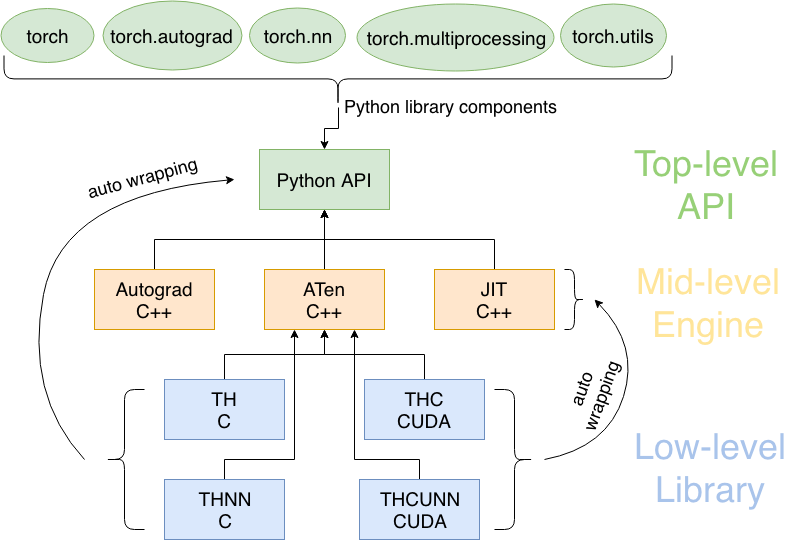

---

https://www.runoob.com/pytorch/pytorch-tutorial.html
PyTorch 是一个开源的深度学习框架，以其灵活性和动态计算图而广受欢迎。

PyTorch 主要有以下几个基础概念：张量（Tensor）、自动求导（Autograd）、神经网络模块（nn.Module）、优化器（optim）等。
### PyTorch 架构图
```

┌─────────────────────────────────────────────────────────────┐
│                    PyTorch 生态系统                          │
├─────────────────────────────────────────────────────────────┤
│  torchvision  │  torchtext  │  torchaudio  │  其他专业库     │
├─────────────────────────────────────────────────────────────┤
│                     PyTorch 核心                            │
├───────────────┬─────────────────┬───────────────────────────┤
│   torch.nn    │   torch.optim   │      torch.utils          │
│   (神经网络)   │   (优化器)      │      (工具函数)             │
├───────────────┼─────────────────┼───────────────────────────┤
│               │                 │   torch.utils.data        │
│  torch 核心    │  autograd       │   (数据加载)               │
│  (张量计算)    │  (自动微分)       │                           │
└───────────────┴─────────────────┴───────────────────────────┘
```

PyTorch 采用**分层架构**设计，从上层到底层依次为：

**1、Python API（顶层）**
- `torch`：核心张量计算（类似NumPy，支持GPU）。
- `torch.nn`：神经网络层、损失函数等。
- `torch.autograd`：自动微分（反向传播）。
- 开发者直接调用的接口，简单易用。

**2、C++核心（中层）**
- **ATen**：张量运算核心库（400+操作）。
- **JIT**：即时编译优化模型。
- **Autograd引擎**：自动微分的底层实现。
- 高性能计算，连接Python与底层硬件。

**3、基础库（底层）**
- **TH/THNN**：C语言实现的基础张量和神经网络操作。
- **THC/THCUNN**：对应的CUDA（GPU）版本。
- 直接操作硬件（CPU/GPU），极致优化速度。

**执行流程**：
Python代码 → C++核心计算 → 底层CUDA/C库加速 → 返回结果。


## 张量（Tensor）

张量（Tensor）是 PyTorch 中的核心数据结构，用于存储和操作多维数组。

张量可以视为一个多维数组，支持加速计算的操作。

在 PyTorch 中，张量的概念类似于 NumPy 中的数组，但是 PyTorch 的张量可以运行在不同的设备上，比如 CPU 和 GPU，这使得它们非常适合于进行大规模并行计算，特别是在深度学习领域。

- **维度（Dimensionality）**：张量的维度指的是数据的多维数组结构。例如，一个标量（0维张量）是一个单独的数字，一个向量（1维张量）是一个一维数组，一个矩阵（2维张量）是一个二维数组，以此类推。
    
- **形状（Shape）**：张量的形状是指每个维度上的大小。例如，一个形状为`(3, 4)`的张量意味着它有3行4列。
    
- **数据类型（Dtype）**：张量中的数据类型定义了存储每个元素所需的内存大小和解释方式。PyTorch支持多种数据类型，包括整数型（如`torch.int8`、`torch.int32`）、浮点型（如`torch.float32`、`torch.float64`）和布尔型（`torch.bool`）。

**张量创建：**
```
import torch

# 创建一个 2x3 的全 0 张量
a = torch.zeros(2, 3)
print(a)

# 创建一个 2x3 的全 1 张量
b = torch.ones(2, 3)
print(b)

# 创建一个 2x3 的随机数张量
c = torch.randn(2, 3)
print(c)

# 从 NumPy 数组创建张量
import numpy as np
numpy_array = np.array([[1, 2], [3, 4]])
tensor_from_numpy = torch.from_numpy(numpy_array)
print(tensor_from_numpy)

# 在指定设备（CPU/GPU）上创建张量
device = torch.device("cuda" if torch.cuda.is_available() else "cpu")
d = torch.randn(2, 3, device=device)
print(d)
```
输出结果类似如下：
```
tensor([[0., 0., 0.],
        [0., 0., 0.]])
tensor([[1., 1., 1.],
        [1., 1., 1.]])
tensor([[ 1.0189, -0.5718, -1.2814],
        [-0.5865,  1.0855,  1.1727]])
tensor([[1, 2],
        [3, 4]])
tensor([[-0.3360,  0.2203,  1.3463],
        [-0.5982, -0.2704,  0.5429]])
```

**常用张量操作：**
```
# 张量相加
e = torch.randn(2, 3)
f = torch.randn(2, 3)
print(e + f)

# 逐元素乘法
print(e * f)

# 张量的转置
g = torch.randn(3, 2)
print(g.t())  # 或者 g.transpose(0, 1)

# 张量的形状
print(g.shape)  # 返回形状
```

### 张量与设备
PyTorch 张量可以存在于不同的设备上，包括CPU和GPU，你可以将张量移动到 GPU 上以加速计算：
```
if torch.cuda.is_available():
    tensor_gpu = tensor_from_list.to('cuda')  # 将张量移动到GPU
```

### 梯度和自动微分
PyTorch的张量支持自动微分，这是深度学习中的关键特性。当你创建一个需要梯度的张量时，PyTorch可以自动计算其梯度：
```
# 创建一个需要梯度的张量
tensor_requires_grad = torch.tensor([1.0], requires_grad=True)

# 进行一些操作
tensor_result = tensor_requires_grad * 2

# 计算梯度
tensor_result.backward()
print(tensor_requires_grad.grad)  # 输出梯度
```
### 内存和性能
PyTorch 张量还提供了一些内存管理功能，比如.clone()、.detach() 和 .to() 方法，它们可以帮助你优化内存使用和提高性能。

## 自动求导（Autograd）

自动求导（Automatic Differentiation，简称Autograd）是深度学习框架中的一个核心特性，它允许计算机自动计算数学函数的导数。

在深度学习中，自动求导主要用于两个方面：**一是在训练神经网络时计算梯度**，**二是进行反向传播算法的实现**。

自动求导基于链式法则（Chain Rule），这是一个用于计算复杂函数导数的数学法则。链式法则表明，复合函数的导数是其各个组成部分导数的乘积。在深度学习中，模型通常是由许多层组成的复杂函数，自动求导能够高效地计算这些层的梯度。

**动态图与静态图：**

- **动态图（Dynamic Graph）**：在动态图中，计算图在运行时动态构建。每次执行操作时，计算图都会更新，这使得调试和修改模型变得更加容易。PyTorch使用的是动态图。
- **静态图（Static Graph）**：在静态图中，计算图在开始执行之前构建完成，并且不会改变。TensorFlow最初使用的是静态图，但后来也支持动态图。
    

PyTorch 提供了自动求导功能，通过 autograd 模块来自动计算梯度。

torch.Tensor 对象有一个 requires_grad 属性，用于指示是否需要计算该张量的梯度。

当你创建一个 requires_grad=True 的张量时，PyTorch 会自动跟踪所有对它的操作，以便在之后计算梯度。

创建需要梯度的张量:
```
# 创建一个需要计算梯度的张量
x = torch.randn(2, 2, requires_grad=True)
print(x)

# 执行某些操作
y = x + 2
z = y * y * 3
out = z.mean()

print(out)
```
输出结果类似如下：
```
tensor([[-0.1908,  0.2811],
        [ 0.8068,  0.8002]], requires_grad=True)
tensor(18.1469, grad_fn=<MeanBackward0>)
```

### 反向传播（Backpropagation）

一旦定义了计算图，可以通过 .backward() 方法来计算梯度。
```
# 反向传播，计算梯度
out.backward()

# 查看 x 的梯度
print(x.grad)
```
在神经网络训练中，自动求导主要用于实现反向传播算法。

反向传播是一种通过计算损失函数关于网络参数的梯度来训练神经网络的方法。在每次迭代中，网络的前向传播会计算输出和损失，然后反向传播会计算损失关于每个参数的梯度，并使用这些梯度来更新参数。

### 停止梯度计算
如果你不希望某些张量的梯度被计算（例如，当你不需要反向传播时），可以使用 torch.no_grad() 或设置 requires_grad=False。
```
# 使用 torch.no_grad() 禁用梯度计算
with torch.no_grad():
    y = x * 2
```

## 神经网络（nn.Module）
神经网络是一种模仿人脑神经元连接的计算模型，由多层节点（神经元）组成，用于学习数据之间的复杂模式和关系。

神经网络通过调整神经元之间的连接权重来优化预测结果，这一过程涉及前向传播、损失计算、反向传播和参数更新。

神经网络的类型包括前馈神经网络、卷积神经网络（CNN）、循环神经网络（RNN）和长短期记忆网络（LSTM），它们在图像识别、语音处理、自然语言处理等多个领域都有广泛应用。

PyTorch 提供了一个非常方便的接口来构建神经网络模型，即 torch.nn.Module。

我们可以继承 nn.Module 类并定义自己的网络层。

创建一个简单的神经网络：
```

import torch.nn as nn
import torch.optim as optim

# 定义一个简单的全连接神经网络
class SimpleNN(nn.Module):
    def __init__(self):
        super(SimpleNN, self).__init__()
        self.fc1 = nn.Linear(2, 2)  # 输入层到隐藏层
        self.fc2 = nn.Linear(2, 1)  # 隐藏层到输出层
    
    def forward(self, x):
        x = torch.relu(self.fc1(x))  # ReLU 激活函数
        x = self.fc2(x)
        return x

# 创建网络实例
model = SimpleNN()

# 打印模型结构
print(model)
```
输出结果：
```
SimpleNN(
  (fc1): Linear(in_features=2, out_features=2, bias=True)
  (fc2): Linear(in_features=2, out_features=1, bias=True)
)
```
**训练过程：**
1. **前向传播（Forward Propagation）**： 在前向传播阶段，输入数据通过网络层传递，每层应用权重和激活函数，直到产生输出。
2. **计算损失（Calculate Loss）**： 根据网络的输出和真实标签，计算损失函数的值。
3. **反向传播（Backpropagation）**： 反向传播利用自动求导技术计算损失函数关于每个参数的梯度。
4. **参数更新（Parameter Update）**： 使用优化器根据梯度更新网络的权重和偏置。
5. **迭代（Iteration）**： 重复上述过程，直到模型在训练数据上的性能达到满意的水平。
### 前向传播与损失计算
```
# 随机输入
x = torch.randn(1, 2)

# 前向传播
output = model(x)
print(output)

# 定义损失函数（例如均方误差 MSE）
criterion = nn.MSELoss()

# 假设目标值为 1
target = torch.randn(1, 1)

# 计算损失
loss = criterion(output, target)
print(loss)
```
### 优化器（Optimizers）
优化器在训练过程中更新神经网络的参数，以减少损失函数的值。
PyTorch 提供了多种优化器，例如 SGD、Adam 等。
使用优化器进行参数更新：
```
# 定义优化器（使用 Adam 优化器）
optimizer = optim.Adam(model.parameters(), lr=0.001)

# 训练步骤
optimizer.zero_grad()  # 清空梯度
loss.backward()  # 反向传播
optimizer.step()  # 更新参数
```
## 训练模型
训练模型是机器学习和深度学习中的核心过程，旨在通过大量数据学习模型参数，以便模型能够对新的、未见过的数据做出准确的预测。

训练模型通常包括以下几个步骤：
1. **数据准备**：
    - 收集和处理数据，包括清洗、标准化和归一化。
    - 将数据分为训练集、验证集和测试集。
2. **定义模型**：
    - 选择模型架构，例如决策树、神经网络等。
    - 初始化模型参数（权重和偏置）。
3. **选择损失函数**：
    - 根据任务类型（如分类、回归）选择合适的损失函数。
4. **选择优化器**：
    - 选择一个优化算法，如SGD、Adam等，来更新模型参数。
5. **前向传播**：
    - 在每次迭代中，将输入数据通过模型传递，计算预测输出。
6. **计算损失**：
    - 使用损失函数评估预测输出与真实标签之间的差异。
7. **反向传播**：
    - 利用自动求导计算损失相对于模型参数的梯度。
8. **参数更新**：
    - 根据计算出的梯度和优化器的策略更新模型参数。
9. **迭代优化**：
    - 重复步骤5-8，直到模型在验证集上的性能不再提升或达到预定的迭代次数。
10. **评估和测试**：
    - 使用测试集评估模型的最终性能，确保模型没有过拟合。
11. **模型调优**：
    - 根据模型在测试集上的表现进行调参，如改变学习率、增加正则化等。
12. **部署模型**：
    - 将训练好的模型部署到生产环境中，用于实际的预测任务。
```
import torch
import torch.nn as nn
import torch.optim as optim

# 1. 定义一个简单的神经网络模型
class SimpleNN(nn.Module):
    def __init__(self):
        super(SimpleNN, self).__init__()
        self.fc1 = nn.Linear(2, 2)  # 输入层到隐藏层
        self.fc2 = nn.Linear(2, 1)  # 隐藏层到输出层
    
    def forward(self, x):
        x = torch.relu(self.fc1(x))  # ReLU 激活函数
        x = self.fc2(x)
        return x

# 2. 创建模型实例
model = SimpleNN()

# 3. 定义损失函数和优化器
criterion = nn.MSELoss()  # 均方误差损失函数
optimizer = optim.Adam(model.parameters(), lr=0.001)  # Adam 优化器

# 4. 假设我们有训练数据 X 和 Y
X = torch.randn(10, 2)  # 10 个样本，2 个特征
Y = torch.randn(10, 1)  # 10 个目标值

# 5. 训练循环
for epoch in range(100):  # 训练 100 轮
    optimizer.zero_grad()  # 清空之前的梯度
    output = model(X)  # 前向传播
    loss = criterion(output, Y)  # 计算损失
    loss.backward()  # 反向传播
    optimizer.step()  # 更新参数
    
    # 每 10 轮输出一次损失
    if (epoch+1) % 10 == 0:
        print(f'Epoch [{epoch+1}/100], Loss: {loss.item():.4f}')
```
输出结果如下：
```
Epoch [10/100], Loss: 1.7180
Epoch [20/100], Loss: 1.6352
Epoch [30/100], Loss: 1.5590
Epoch [40/100], Loss: 1.4896
Epoch [50/100], Loss: 1.4268
Epoch [60/100], Loss: 1.3704
Epoch [70/100], Loss: 1.3198
Epoch [80/100], Loss: 1.2747
Epoch [90/100], Loss: 1.2346
Epoch [100/100], Loss: 1.1991
```
在每 10 轮，程序会输出当前的损失值，帮助我们跟踪模型的训练进度。随着训练的进行，损失值应该会逐渐降低，表示模型在不断学习并优化其参数。

训练模型是一个迭代的过程，需要不断地调整和优化，直到达到满意的性能。这个过程涉及到大量的实验和调优，目的是使模型在新的、未见过的数据上也能有良好的泛化能力。

## 设备（Device）
PyTorch 允许你将模型和数据移动到 GPU 上进行加速。
使用 torch.device 来指定计算设备。
将模型和数据移至 GPU:
```
device = torch.device("cuda" if torch.cuda.is_available() else "cpu")

# 将模型移动到设备
model.to(device)

# 将数据移动到设备
X = X.to(device)
Y = Y.to(device)
```