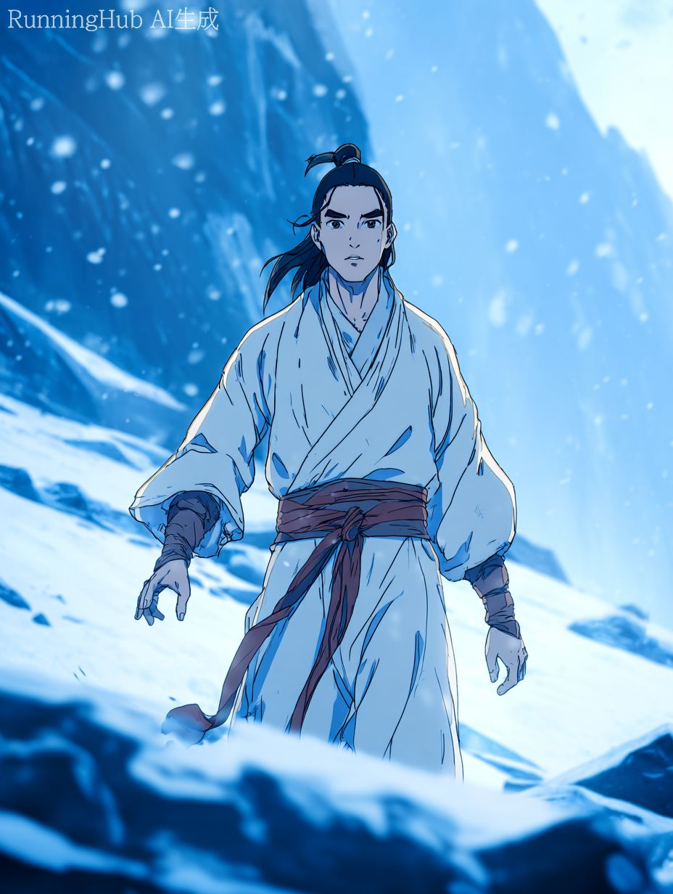
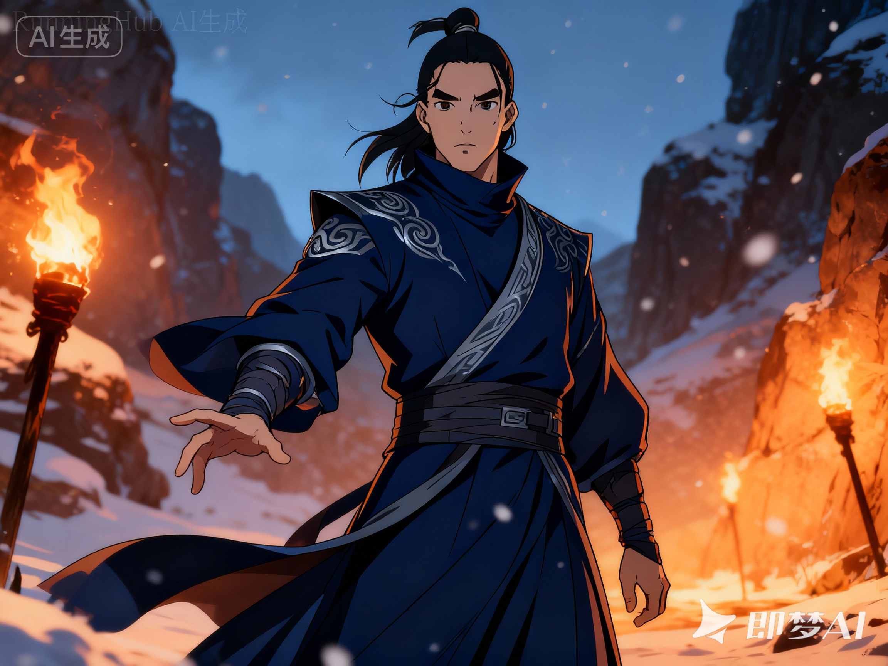
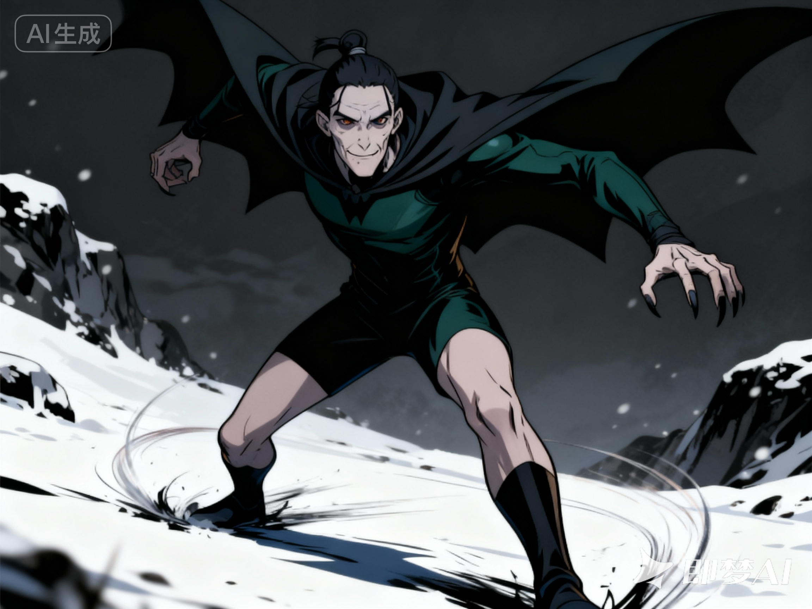
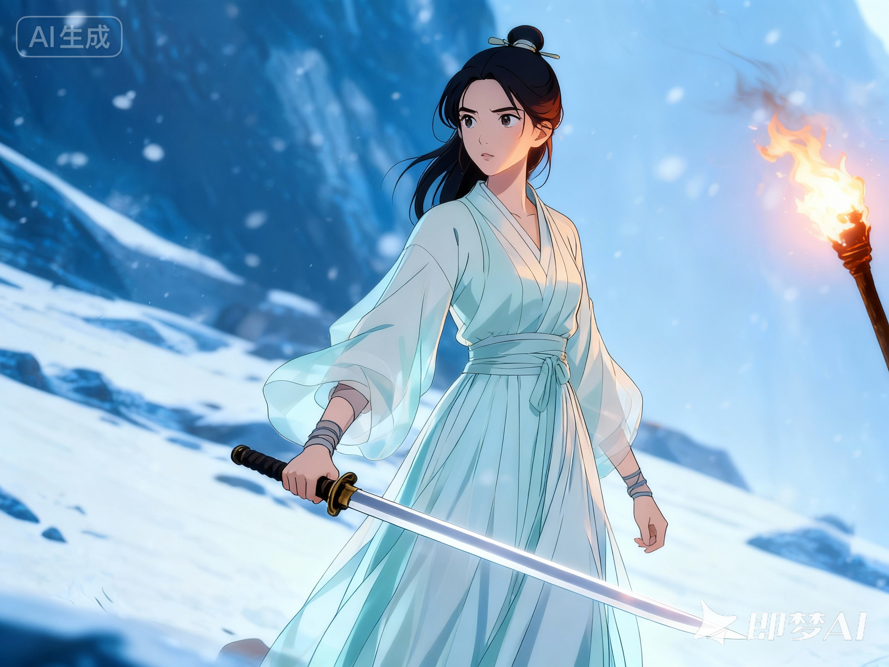
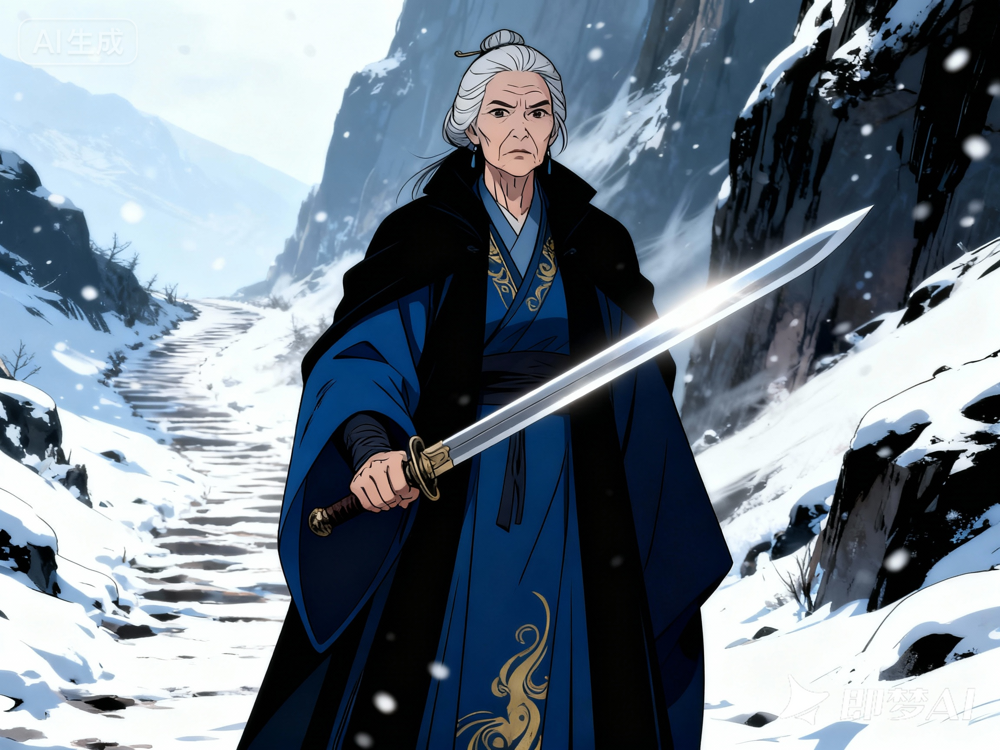
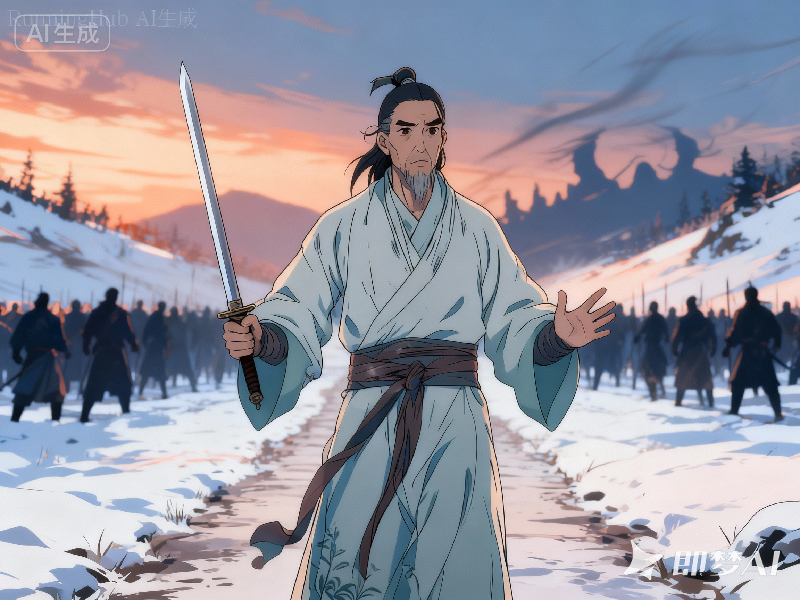

---

# 人物设定

## 通用风格前缀（建议每个角色都加在最前）

**Style Prefix（可复制到每个角色 prompt 前）**

- **水墨风，国风武侠动画，电影级分镜感，强对比光影，细腻线稿，干净的 cel shading，写实与动画融合，风雪山巅氛围，布料与金属细节清晰，动态姿势，浅景深，35mm cinematic, dramatic lighting, high detail, sharp focus**
    

**通用 Negative（可作为全局反向）**

- **lowres, blurry, bad anatomy, extra fingers, missing fingers, deformed hands, bad hands, bad face, asymmetry, cross-eye, duplicate, twin, watermark, logo, text, subtitle, jpeg artifacts, overexposed, underexposed, noisy, messy lines, worst quality, low quality**
    

---

# 1) 张无忌 Prompt

**Prompt（正向）**

- 国风武侠动画角色立绘，青年男子，清秀温和但眼神坚毅，修长身形，中长黑发束起少许散落，素白轻便布衣配暗红内衬，衣角微破损带战斗痕迹，腰间布带无门派标识，站在风雪山巅，周身隐约金色内力光晕（九阳真气），双掌微抬似将出招但克制，神情仁厚冷静，电影级光影，干净 cel shading，细致布料褶皱与雪尘粒子，浅景深，35mm cinematic
    

**Negative（反向）**

- （通用 Negative）+ blood gore, horror, nude, bare chest, modern clothing, sci-fi armor
    

---

# 2) 杨逍 Prompt

**Prompt（正向）**

- 国风武侠动画角色立绘，俊朗偏冷的中青年男子，目光锐利带审视感，身姿挺拔强压迫感，深蓝长袍高领剪裁锐利，银灰纹饰点缀，护腕与腰封干练利落，衣袂在山风中微扬，单手前引如指挥战局，气质冷静骄傲且有责任感，火把暖光与雪地冷光交错，电影感强对比，线稿清晰，cel shading 干净，细节丰富
    

**Negative（反向）**

- （通用 Negative）+ smiling goofy, childish, casual hoodie, modern suit, futuristic elements
    

---

# 3) 韦一笑 Prompt

**Prompt（正向）**

- 国风武侠动画角色立绘，消瘦苍白的中年男子，眼窝略深带几分阴冷邪气，嘴角微讽，墨绿与黑色紧身短袍便于高速移动，披风边缘似蝠翼造型，姿态前倾如瞬移前一刻，脚下带残影速度感与风切流线，指爪半抬随时突袭，整体机敏诡谲但忠诚，暗色调中带冷光高反差，干净 cel shading，锐利线条，动态构图
    

**Negative（反向）**

- （通用 Negative）+ fat body, bulky armor, cute chibi, cartoon comedy style, sci-fi cyberpunk
    

---

# 4) 周芷若 Pr
ompt

**Prompt（正向）**

- 国风武侠动画角色立绘，年轻女子，清秀柔美气质克制，神情隐忍与动摇交织，浅青/月白飘逸长裙，布料轻薄层叠，简洁发饰与束发，手持长剑但手腕微紧带犹豫感，目光侧望仿佛在冲突中停顿，风雪与火把光映在脸上，柔和冷暖对比，线稿细腻干净，cel shading 通透，电影级氛围
    

**Negative（反向）**

- （通用 Negative）+ heavy makeup, modern fashion, cleavage, bikini, exaggerated fantasy armor, loli, chibi
    

---

# 5) 灭绝师太 Prompt

**Prompt（正向）**

- 国风武侠动画角色立绘，严厉冷硬的年长女掌门，面部线条坚毅法令纹明显，目光如霜不带情绪，灰黑厚重长袍线条笔直，站姿极稳如磐石，手持名剑（倚天剑）剑尖微前压迫感强，气场极端刚烈黑白分明，背景风雪山道与肃杀气氛，强对比光影，线稿硬朗，cel shading 干净，金属剑身反光锐利
    

**Negative（反向）**

- （通用 Negative）+ young face, cute, friendly smile, modern accessories, sci-fi sword, neon lights
    

---

# 6) 武当代表（宋远桥型）Prompt

**Prompt（正向）**

- 国风武侠动画角色立绘，中年道者气质，眉目平和克制但带忧虑，青灰简朴道袍无多余装饰，衣料自然垂坠，站姿端正，双手微抬似劝止冲突，神情理性沉稳顾全大局，背景为风雪山道与人群压境的远景剪影，冷暖光交错，电影级构图，干净 cel shading，细节清晰
    

**Negative（反向）**

- （通用 Negative）+ angry screaming, evil grin, modern suit, flashy armor, cyberpunk
    

---

## 额外：想做“同风格角色卡”更稳的两招

1. **统一镜头词**：每个角色都加 `full body, character turnaround 느낌` 或 `front view, full body, neutral background`（如果你在做立绘库）
    
2. **统一背景成本**：如果你只要人物干净可抠图，背景改成：`plain gradient background, studio lighting`，后期再合成光明顶环境。
    

---

如果你告诉我：你是要做 **“角色立绘（全身）”**、还是 **“战斗分镜（动态半身/近景）”**，我还能把每个角色再各给你一版更针对的 Prompt（比如：拔剑瞬间、掌风、残影移动、九阳爆发等），并且把镜头焦段、构图关键词也一起配好。
# 详细分镜脚本：《倚天屠龙记·围攻光明顶》（约60s）

## 音乐基调

- 前半：低鼓点+风声（压迫、肃杀）
    
- 中段：打击乐加速（混战）
    
- 后段：音乐骤停→单音+心跳→九阳爆发→余音拉长（转折、震撼）
    

---

## 0:00–0:06 立势：光明顶与压境

### 镜头1（0:00–0:02）

- **景别/机位**：极远景｜航拍俯视
    
- **画面**：昆仑雪岭，山脊如刀。云层压低，光明顶在云下若隐若现。
    
- **旁白**：昆仑之巅，风起云涌。
    
- **音效/音乐**：狂风呼啸+低沉鼓点起。
    

### 镜头2（0:02–0:04）

- **景别/机位**：远景｜推镜（缓慢推进光明顶）
    
- **画面**：光明顶石阶蜿蜒上山，山口处火把点点，像一条红蛇。
    
- **旁白**：正邪恩怨，今夜要有个了断。
    
- **提示**：云层运动要快，压迫感。
    

### 镜头3（0:04–0:06）

- **景别/机位**：特写｜低机位仰拍
    
- **画面**：一面“六派联军”的旗帜猛地一甩，旗面抖动发响。
    
- **音效**：旗帜猎猎声+脚步声渐近（低频）。
    

---

## 0:06–0:16 对峙：六派推进 vs 明教备战

### 镜头4（0:06–0:09）

- **景别/机位**：中远景｜横移跟拍
    
- **画面**：六大门派队列压上山道，少林、武当、峨眉旗帜分层出现。
    
- **旁白**：六大门派联手围攻，只为“荡平魔教”。
    
- **提示**：人群要“层层叠叠”，营造规模。
    

### 镜头5（0:09–0:11）

- **景别/机位**：近景｜切到峨眉队列
    
- **画面**：灭绝师太握剑在前，周芷若跟随其后。周芷若目光复杂，欲言又止。
    
- **（可选对白，短促）**：灭绝（冷）：不许动摇。
    
- **音效**：剑鞘轻响。
    

### 镜头6（0:11–0:13）

- **景别/机位**：中景｜切到武当队列
    
- **画面**：武当代表（宋远桥型）眉头微皱，看向光明顶，像在衡量。
    
- **旁白**：也有人心存疑虑，却被洪流裹挟。
    
- **提示**：眼神要“克制”。
    

### 镜头7（0:13–0:16）

- **景别/机位**：内景中景｜明教总坛门前
    
- **画面**：火把照亮杨逍、韦一笑等人，背后教众列阵，兵器映火光。
    
- **旁白**：明教众人，早已做好以命相搏的准备。
    
- **音效**：火焰噼啪+金属轻碰。
    

---

## 0:16–0:34 爆发：山道混战（群像快速剪辑）

### 镜头8（0:16–0:18）

- **景别/机位**：远景｜俯拍
    
- **画面**：山道狭口，双方撞上，队列瞬间碎裂，像两股浪相撞。

- **音效**：喊杀声陡起，鼓点加速。
    

### 镜头9（0:18–0:20）

- **景别/机位**：近景｜手持感（轻抖）
    
- **画面**：刀剑交错，“铛”一声火花溅起。
    
- **旁白**：刀光剑影，仇恨一触即燃。
    
- **提示**：火花+慢0.2秒强调。
    

### 镜头10（0:20–0:22）

- **景别/机位**：中景｜跟拍
    
- **画面**：杨逍一记掌风逼退三人，袖摆如刃，动作干净。
    
- **音效**：掌风“轰”+衣袂破风。
    

### 镜头11（0:22–0:24）

- **景别/机位**：特写｜突然闪切
    
- **画面**：韦一笑从画面边缘“闪现”到敌侧，带残影，一爪逼退。
    
- **音效**：短促“嗖——”
    
- **提示**：用“跳帧式”速度感。
    

### 镜头12（0:24–0:26）

- **景别/机位**：中近景｜正反打
    
- **画面**：周芷若拔剑，先停半拍，目光掠过倒下的人，手腕一紧才出招。
    
- **音效**：拔剑“锵”+呼吸声。
    
- **旁白**：有人挥剑，有人迟疑。
    

### 镜头13（0:26–0:28）

- **景别/机位**：近景｜低机位仰拍
    
- **画面**：灭绝师太一剑劈落，剑气凌厉，把画面切成冷硬两半。
    
- **（可选对白）**：灭绝：魔教，皆该死。
    
- **音效**：剑鸣尖锐。
    

### 镜头14（0:28–0:31）

- **景别/机位**：中景｜摇镜（由乱到更乱）
    
- **画面**：人群拥挤，兵器穿梭，几名教众被逼到山道边缘，碎石滚落深谷。
    
- **音效**：石头坠落回声“咚…咚…”
    
- **提示**：增强“险峻”。
    

### 镜头15（0:31–0:34）

- **景别/机位**：特写｜慢镜（0.3秒）
    
- **画面**：一滴血落在雪上，迅速晕开红色。
    
- **旁白**：鲜血，让所有人更听不见真相。
    
- **音乐**：突然抽掉鼓点，只留低音“嗡”。
    

---

## 0:34–0:46 转折：张无忌出现（静->爆）

### 镜头16（0:34–0:37）

- **景别/机位**：中景｜从人群缝隙推入
    
- **画面**：张无忌被冲撞到中央，衣衫带伤，踉跄半跪，抬头看两边。
    
- **音效**：喘息声清晰，其他声音变“闷”。
    

### 镜头17（0:37–0:40）

- **景别/机位**：特写｜眼神
    
- **画面**：张无忌眼中倒映刀剑与火把，瞳孔微缩。
    
- **旁白**：他不想赢，只想止住这场杀。
    
- **提示**：火光反射做“跳动”。
    

### 镜头18（0:40–0:43）

- **景别/机位**：近景｜环绕半圈（顺时针）
    
- **画面**：张无忌站起，双掌缓缓合拢，衣摆被气流轻拂。
    
- **音效**：心跳+低频气流聚集声“呜——”
    

### 镜头19（0:43–0:46）

- **景别/机位**：中近景｜正面定镜
    
- **画面**：张无忌掌心隐现金色光纹，九阳真气如日晕扩散，尘雪浮起。
    
- **音乐**：单音拉长，进入“爆发前的空白”。
    

---

## 0:46–0:60 爆发与静场：震退群雄（结尾定格）

### 镜头20（0:46–0:50）

- **景别/机位**：远景｜冲击波式推拉（轻微变焦）
    
- **画面**：金色气浪向两侧推开，双方高手被迫后滑，脚底划出长痕。
    
- **音效**：轰鸣+雪尘“刷”地掀起。
    
- **提示**：冲击波要“圆形扩散”。
    

### 镜头21（0:50–0:53）

- **景别/机位**：近景｜连切反应
    
- **画面**：
    
    - 杨逍微眯眼，袖遮风尘（认可但警惕）
        
    - 韦一笑后退半步，嘴角一挑（兴奋）
        
    - 灭绝师太剑尖稳住，眼神更冷（不服）
        
    - 周芷若怔住，手指松了一瞬（动摇）
        
- **音效**：风声回归，其他声压低。
    

### 镜头22（0:53–0:56）

- **景别/机位**：中景｜侧面
    
- **画面**：武当代表抬手示意停，门人脚步渐止，兵刃缓缓放低。
    
- **旁白**：这一刻，才有人开始听“道理”。
    
- **提示**：动作要“克制”。
    

### 镜头23（0:56–0:59）

- **景别/机位**：近景｜张无忌正面
    
- **画面**：张无忌缓缓收掌，金光淡去，只留坚毅的眼神。
    
- **（可选对白，极短）**：张无忌：够了。
    
- **音乐**：余音延长，留空。
    

### 镜头24（0:59–1:00）

- **景别/机位**：特写｜定格+字幕
    
- **画面**：张无忌眼神定格，画面渐暗，字幕出现：  
    **《围攻光明顶》**
    
- **音效**：最后一声风铃般的余响。
    

---

## 动画制作小提示（实用向）

- **人群大战**：用“前景2-3个重点角色 + 中景人群简化循环 + 远景剪影”分层，成本可控又有规模。
    
- **九阳爆发**：用“尘雪浮起→衣摆反向飘→冲击波推开”三段让力量可信。
    
- **情绪对比**：混战快切之后，用“血滴落雪+闷声”把观众耳朵“按住”，转折更震撼。
    

# 分镜prompt

## 通用 Negative（建议全局反向）

**lowres, blurry, bad anatomy, extra fingers, missing fingers, deformed hands, bad hands, bad face, asymmetry, cross-eye, duplicate, twin, watermark, logo, text, subtitle, jpeg artifacts, overexposed, underexposed, noisy, messy lines, worst quality, low quality, modern clothing, sci-fi armor, neon cyberpunk**

---

## 分镜 Prompt（24 镜头）

## 镜头1（0:00–0:02）昆仑雪岭航拍俯视

**Prompt（正向）**  
国风武侠动画，电影级分镜感，强对比光影，细腻线稿，干净 cel shading，写实与动画融合，风雪山巅氛围，浅景深，35mm cinematic, dramatic lighting, high detail, sharp focus；极远景航拍俯视，昆仑雪岭连绵，刀锋般山脊，乌云翻滚压低，远处光明顶若隐若现，大片风雪与云层流动，史诗压迫感，无人物  
**Negative（反向）**  
（通用 Negative）

---

## 镜头2（0:02–0:04）推进光明顶与山道火把

**Prompt（正向）**  
国风武侠动画，电影级，干净 cel shading；远景推镜，光明顶石阶蜿蜒上山，山口火把点点连成红色光带像一条蛇，风雪横扫，冷暖对比强烈，云层快速移动，紧张氛围  
**Negative**  
（通用 Negative）

---

## 镜头3（0:04–0:06）旗帜特写低机位仰拍

**Prompt（正向）**  
国风武侠动画，电影级光影；特写，低机位仰拍，一面大旗在狂风中猛甩，布料纤维与褶皱清晰，旗面边缘抖动，背景虚化的雪岭与火把光点，强风动态模糊少量，肃杀  
**Negative**  
（通用 Negative）

---

## 镜头4（0:06–0:09）六派队列横移跟拍推进

**Prompt（正向）**  
国风武侠动画，电影级分镜；中远景横移跟拍，山道上六大门派联军推进，队列层层叠叠，少林/武当/峨眉旗帜分层出现，火把与雪光交错，人群铠甲与布衣混合（古代武侠），脚步踏雪扬尘，规模感  
**Negative**  
（通用 Negative）

---

## 镜头5（0:09–0:11）峨眉队列：灭绝+周芷若

**Prompt（正向）**  
国风武侠动画，电影级；近景，峨眉队列，灭绝师太在前（年长冷硬，灰黑厚重长袍，手握名剑），周芷若在后（浅青/月白飘逸长裙，神情隐忍动摇），火把暖光打在侧脸，风雪冷光补边，紧张对峙感  
**Negative**  
（通用 Negative）

---

## 镜头6（0:11–0:13）武当代表疑虑的近景

**Prompt（正向）**  
国风武侠动画，电影级；中景，武当代表（中年道者，青灰简朴道袍，眉目平和克制但带忧虑）站在队列侧前，目光望向光明顶，背景人群与旗帜虚化，冷暖光交错，情绪克制  
**Negative**  
（通用 Negative）

---

## 镜头7（0:13–0:16）明教总坛门前备战：杨逍+韦一笑

**Prompt（正向）**  
国风武侠动画，电影级；内景中景，明教总坛门前火把照明，杨逍（深蓝高领长袍、银灰纹饰、挺拔冷峻）站前指挥姿态，韦一笑（墨绿黑色紧身短袍、蝠翼披风边、消瘦苍白）侧后待机，后方教众列阵兵器反光，火焰噼啪，肃杀  
**Negative**  
（通用 Negative）

---

## 镜头8（0:16–0:18）山道狭口双方撞上俯拍远景

**Prompt（正向）**  
国风武侠动画，电影级；远景俯拍，狭窄山道关口，六派与明教两股人潮正面撞上，队列瞬间碎裂成混战团块，雪尘被踩起，火把光点摇晃，强烈动势与规模  
**Negative**  
（通用 Negative）

---

## 镜头9（0:18–0:20）刀剑交错火花近景手持感

**Prompt（正向）**  
国风武侠动画，电影级；近景手持感轻微抖动，刀剑猛然碰撞溅出火花，金属纹理清晰，背景混战虚化，雪尘飞舞，冲击瞬间凝固感（slight slow-motion feel）  
**Negative**  
（通用 Negative）

---

## 镜头10（0:20–0:22）杨逍掌风逼退多人

**Prompt（正向）**  
国风武侠动画，电影级；中景跟拍，杨逍一掌挥出，袖摆如刃，掌风卷起雪尘形成弧形气流，前方数名敌人被逼退后滑，动作干净利落，冷暖对比，强对比光影  
**Negative**  
（通用 Negative）

---

## 镜头11（0:22–0:24）韦一笑残影闪现突袭特写

**Prompt（正向）**  
国风武侠动画，电影级；特写闪切感，韦一笑以高速从画面边缘闪现到敌侧，带残影与风切流线，指爪半抬逼退对手，表情讥讽，暗色调冷光高反差，速度感强  
**Negative**  
（通用 Negative）

---

## 镜头12（0:24–0:26）周芷若拔剑迟疑

**Prompt（正向）**  
国风武侠动画，电影级；中近景正反打感，周芷若拔剑“锵”的瞬间先停半拍，目光掠过倒下的人，手腕微紧才出招，浅青月白长裙随风飘动，火把暖光与雪地冷光映脸，情绪矛盾清晰  
**Negative**  
（通用 Negative）

---

## 镜头13（0:26–0:28）灭绝师太剑气凌厉低机位仰拍

**Prompt（正向）**  
国风武侠动画，电影级；近景低机位仰拍，灭绝师太灰黑厚重长袍，挥剑下劈，剑身反光锐利，剑气把雪尘“切开”的视觉效果，面容冷硬，压迫感强，线条硬朗  
**Negative**  
（通用 Negative）

---

## 镜头14（0:28–0:31）人群拥挤险峻山道摇镜

**Prompt（正向）**  
国风武侠动画，电影级；中景摇镜感，混战人群拥挤推搡，边缘几名教众被逼到山道悬崖边，碎石滚落深谷，远处深谷雾气与回声氛围，火把摇晃，险峻紧张  
**Negative**  
（通用 Negative）

---

## 镜头15（0:31–0:34）血滴落雪慢镜特写

**Prompt（正向）**  
国风武侠动画，电影级；特写慢镜氛围，一滴血落在白雪上迅速晕开红色，雪粒细节清晰，背景声音被“闷住”的静场感（视觉上背景极虚化），压抑转折  
**Negative**  
（通用 Negative）+ gore, excessive blood

---

## 镜头16（0:34–0:37）张无忌被挤到中央踉跄半跪

**Prompt（正向）**  
国风武侠动画，电影级；中景推入人群缝隙，张无忌（青年清秀，素白布衣暗红内衬，衣角破损带伤痕）被冲撞到战场中央踉跄半跪，喘息明显，左右两侧刀剑与火把形成威胁性前景，雪尘漂浮，紧张  
**Negative**  
（通用 Negative）

---

## 镜头17（0:37–0:40）张无忌眼神特写倒映刀剑火把

**Prompt（正向）**  
国风武侠动画，电影级；特写，张无忌眼睛与面部细节，瞳孔里倒映火把与交错兵刃，眉间克制与坚定并存，火光跳动反射，背景完全虚化，情绪强  
**Negative**  
（通用 Negative）

---

## 镜头18（0:40–0:43）张无忌站起环绕半圈聚气

**Prompt（正向）**  
国风武侠动画，电影级；近景环绕半圈（旋转镜头感），张无忌站起双掌缓缓合拢，衣摆被无形气流轻拂反向飘起，雪尘围绕身体旋转聚集，低频压迫感画面，光影开始变暖  
**Negative**  
（通用 Negative）

---

## 镜头19（0:43–0:46）掌心金色光纹九阳聚能正面定镜

**Prompt（正向）**  
国风武侠动画，电影级；中近景正面定镜，张无忌掌心出现金色光纹与日晕般真气，周围雪尘浮起静止感，光从掌心向外渐强，人物表情冷静克制但坚定，强对比光影，干净 cel shading，高细节  
**Negative**  
（通用 Negative）

---

## 镜头20（0:46–0:50）冲击波推开双方远景推拉

**Prompt（正向）**  
国风武侠动画，电影级；远景，冲击波式推拉/轻微变焦感，金色真气冲击波呈圆形扩散向两侧推开，人群被迫后滑，雪地被划出长痕，尘雪被掀起形成墙，火把光点被吹得倾斜，震撼规模  
**Negative**  
（通用 Negative）

---

## 镜头21（0:50–0:53）连切反应：杨逍/韦一笑/灭绝/周芷若

**Prompt（正向）**  
国风武侠动画，电影级；近景连切反应感（可单张拼成四格也可分别出图），杨逍眯眼抬袖遮风尘（认可但警惕），韦一笑后退半步嘴角一挑（兴奋），灭绝师太剑尖稳住目光更冷（不服），周芷若怔住手指微松（动摇），风雪与金色余光扫过面部，强情绪对比  
**Negative**  
（通用 Negative）

---

## 镜头22（0:53–0:56）武当代表抬手示意停

**Prompt（正向）**  
国风武侠动画，电影级；中景侧面，武当代表青灰道袍，抬手示意停战，身后门人脚步渐止兵刃缓缓放低，远处混战尘雪逐渐落下，气氛从狂乱转为克制冷静，冷暖光交错  
**Negative**  
（通用 Negative）

---

## 镜头23（0:56–0:59）张无忌收掌金光淡去近景正面

**Prompt（正向）**  
国风武侠动画，电影级；近景正面，张无忌缓缓收掌，金色真气从明亮到淡去，仅留一圈微弱日晕边光，雪尘缓缓下落，面容坚毅平静，背景双方人群形成对峙式虚化轮廓，肃静压迫  
**Negative**  
（通用 Negative）

---

## 镜头24（0:59–1:00）眼神定格收尾（无字幕版）

**Prompt（正向）**  
国风武侠动画，电影级；特写定格感，张无忌眼神坚定，火把微光与雪地冷光在瞳孔里闪烁，画面边缘渐暗（vignette），史诗余韵，干净线稿与 cel shading，无文字无水印  
**Negative**  
（通用 Negative）+ text, subtitle, watermark, logo

---

## 额外两条“更好出片”的小建议（可直接加词）

- 如果你要做 **16:9 分镜**：在每条 prompt 里加 `widescreen, 16:9 composition, cinematic framing`
    
- 如果你要 **更强动画感**：加 `anime cinematic, clean lineart, limited color palette, strong silhouette readability`
    

---

如果你告诉我你 ComfyUI 里用的是 **Flux.1-dev** 还是 **Flux.1-schnell**，以及你常用画幅（16:9 / 2.39:1 / 9:16），我可以把每条 prompt 再“对齐”到更稳定的出图习惯（比如更明确：镜头高度、焦段、前景遮挡、角色位置、光源方向），让 24 张更像同一部片子里的镜头。