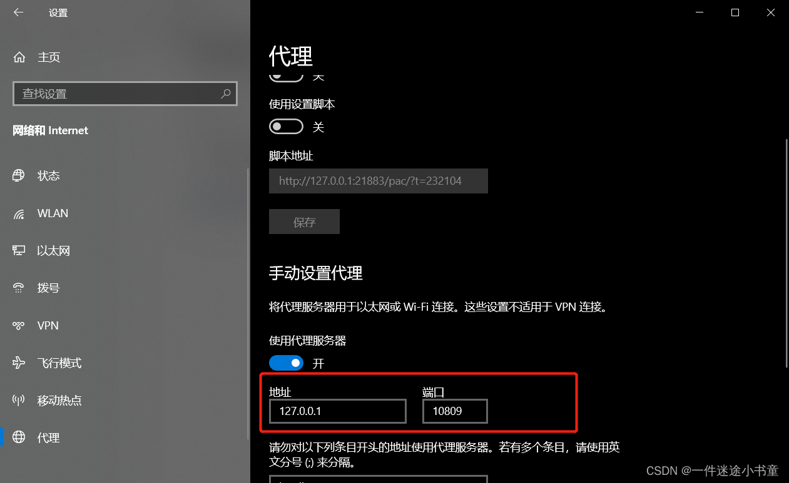

---

### 1.进入文件夹打开gitbash
### 2.初始化仓库
```
git config --global user.name "dying4ever"
git config --global user.email "1607782513@qq.com"
git config -l //查看
git init
```
git init 是一个 Git 命令，用于在当前目录中初始化一个新的 Git 仓库。通过运行该命令，Git 会在当前目录下创建一个隐藏的 .git 文件夹，用于存储仓库的相关信息和版本控制的历史记录。

如果执行成功，有输出：
```
Initialized empty Git repository in /path/to/your/repository/.git/
```
### 3.安装git lfs （处理大文件）
```
git lfs install（windows）
sudo apt install git-lfs（ubuntu）
```
如果执行成功，有输出：
```
Updated git hooks.
Git LFS initialized.
```
这表示 Git LFS 已成功安装和初始化。

现在，你的系统已安装 Git LFS，并可以在 Git 仓库中使用 Git LFS 来管理大文件。你可以使用其他 Git LFS 命令来跟踪大文件、添加文件到 Git LFS 管理、推送和拉取文件等操作。请确保你的 Git 服务器和其他协作者也已正确配置和支持 Git LFS，以便顺利地使用 Git LFS 功能。
### 3.1.git lfs用法
选择你想用 LFS 管理的文件类型，比如模型文件：
```
git lfs track "*.pt"
git lfs track "*.onnx"
git lfs track "*.zip"
```
这会自动生成一个 `.gitattributes` 文件，内容类似：
```
*.pt filter=lfs diff=lfs merge=lfs -text
*.onnx filter=lfs diff=lfs merge=lfs -text
*.zip filter=lfs diff=lfs merge=lfs -text
```
然后提交这个文件：
```
git add .gitattributes
git commit -m "Track large files with Git LFS"
```
现在你可以像普通文件一样提交大文件了：
```
git add model.pt
git commit -m "Add YOLOv8 model weights"
git push
```

或一个文件夹
```
git lfs track "models/*"
```
如何：
```
git add .gitattributes
git add models/
git commit -m "Add model folder with LFS"
git push
```

### 3.2查看跟踪状态
```
git lfs ls-files
```
如果还没有添加文件，这里不会显示内容；稍后提交后可以再看。
### 3.3. 迁移历史大文件为 LFS
```
git lfs migrate import --include="*.img,*.bin,*.hex,*.elf,*.tar.gz,*.tar.xz,*.tar.bz2,*.zip"
```
说明：仅 `git lfs track` 是不够的，历史文件不会被自动转换为 LFS，需要用 `migrate import` 扫描历史并替换为 LFS 对象，否则仍会出现 GitHub 上传失败的问题。
### 4.链接仓库
 将本地与新建仓库进行配对
```
git remote add origin git@github.com:zhangjingxuan123/VR-.git
```
确认添加成功
```
git remote -v
```
输出
```
origin  https://github.com/yourname/air_purifier_simulation.git (fetch)
origin  https://github.com/yourname/air_purifier_simulation.git (push)
```
### 5.上传并发送
#### 添加文件到暂存区
```
git add .
```
你可能会看到很多类似的警告（LF/CRLF），可忽略：
```
warning: LF will be replaced by CRLF the next time Git touches it
```
#### 提交更改
```
git commit -m "Initial commit with LFS tracking"
```
输出示例
```
[main (root-commit) 1def56f] Initial commit with LFS tracking
 77 files changed, 11 insertions(+), 3 deletions(-)
 create mode 100644 .gitattributes

```
#### 第一次建立关系并发送
```
git push --set-upstream origin main
```
输出示例
```
Uploading LFS objects: 100% (25/25), 1.2 GB | 5.6 MB/s, done.
Enumerating objects: 150, done.
Counting objects: 100% (150/150), done.
Delta compression using up to 8 threads
Compressing objects: 100% (120/120), done.
Writing objects: 100% (150/150), 15.43 MiB | 3.21 MiB/s, done.
Total 150 (delta 10), reused 0 (delta 0), pack-reused 0
To https://github.com/yourname/air_purifier_simulation.git
 * [new branch]      main -> main
Branch 'main' set up to track remote branch 'main' from 'origin'.
```
### 6.后续更改
```
git add .
git commit -m "update something"
git push
```
Git 会自动识别被 LFS 管理的文件并上传。

### 7.报错解决
> [!danger]- [报错解决] Failed to connect to github.com port 443 after ***** ms: Couldn‘t connect to server
```
git config --global http.proxy http://127.0.0.1:7890
git config --global https.proxy http://127.0.0.1:7890
```
7890是点口号


> [!danger]- [报错解决] 远程仓库不是空的（推送被拒）
> 远程仓库中已有 README / .gitignore / license 等文件，  
本地与远程的提交历史不同步。- 如果想保留远程文件（安全做法）：
- 如果想保留远程文件（安全做法）：
```
git pull --rebase origin main git push -u origin main
```
- 如果远程内容不重要（如空仓库自动生成的 README）：
```
git push -u origin main --force
```
> [!danger]- [报错解决] Please make sure you have the correct access rights
and the repository exists.
https://zhuanlan.zhihu.com/p/615525814