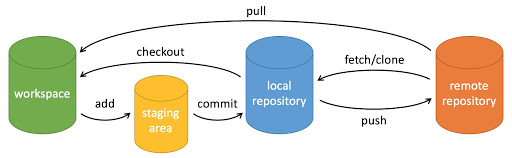

---


## 1.创建仓库
```
git init #初始化仓库
git clone #拷贝一份远程仓库，也就是下载一个项目
```
## 2.提交与修改
```
git add <file>              # 将文件添加到暂存区（stage）
git add .                   # 添加当前目录下所有改动的文件到暂存区

git status                  # 查看仓库当前状态（修改/暂存/未跟踪文件）

git diff                    # 查看工作区与暂存区之间的差异
git diff --staged           # 查看暂存区与上一次提交之间的差异

git difftool                # 使用外部差异工具查看文件差异

git range-diff A..B C..D    # 比较两个提交区间的差异（高级用法）

git commit -m "message"     # 将暂存区内容提交到本地仓库
git commit                  # 打开编辑器填写提交信息

git reset <commit>          # 回退到指定提交（默认 mixed）
git reset --soft <commit>   # 回退提交，保留暂存区
git reset --hard <commit>   # 强制回退（危险，会丢失修改）

git rm <file>               # 删除文件，并加入暂存区
git rm --cached <file>      # 仅从 Git 中移除文件（保留工作区文件）

git mv old new              # 重命名 / 移动文件（Git 可追踪）

git notes add -m "note"     # 给某次提交添加注释（不影响提交内容）

git checkout <branch>       # 切换分支（旧命令）
git checkout -b <branch>    # 创建并切换到新分支
```
## 3.提交日志
```
git log                     # 查看提交历史
git log --oneline --graph   # 简洁 + 图形化查看历史

git blame <file>            # 查看文件每一行是谁、何时修改的

git shortlog                # 按作者统计提交摘要

git describe                # 基于最近的 tag 描述当前提交

```
## 4.远程操作
```
git remote                  # 查看远程仓库列表
git remote -v               # 查看远程仓库及其 URL

git fetch                   # 从远程拉取更新（不自动合并）
git fetch <remote>          # 从指定远程仓库拉取

git pull                    # 拉取并合并（= fetch + merge）
git pull --rebase           # 拉取并 rebase（更干净的历史）

git push                    # 推送当前分支到远程
git push origin <branch>    # 推送指定分支

git submodule add <url>     # 添加子模块
git submodule update        # 更新子模块

```
## 5.git标签
```
git tag v1.0
git tag -d <tagname> #删除
git tag -a v1.0 #添加注释
git push origin <tagname>
git push origin --tags #推送所有标签
```