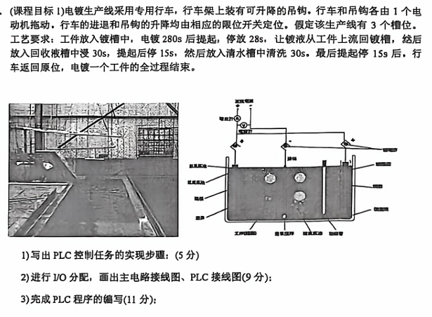
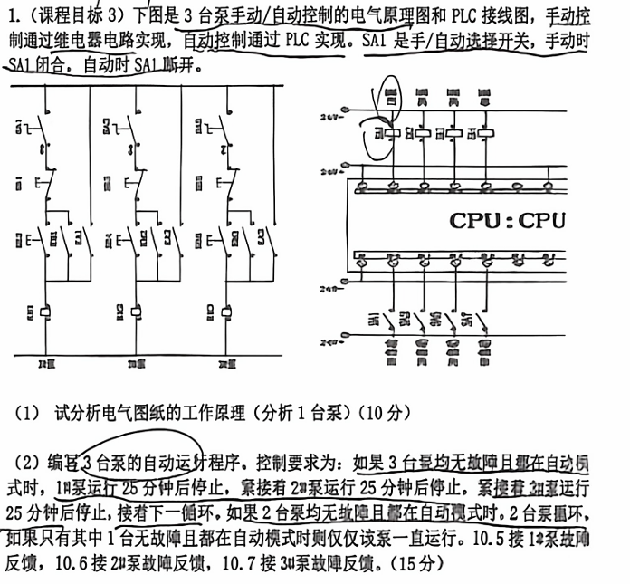

吧3.# 工业控制装置试题整理：课程目标分类+高分答案+表格公式流程图版

> 来源：用户上传PDF《2022-23学年第二学期工业控制试题.pdf》。本文件按PDF题目整理，并在解析中补充同类预测题、答题模板、表格、公式和流程图。扫描模糊处按课程语境补全，不改变原题考查方向。

## 0.课程目标与题型总表

| 课程目标 | PDF中对应题型 | 常考能力 | 高分答题结构 |
|---|---|---|---|
| 课程目标1 | PLC硬件、PLC/DCS/SIS、继电器控制、I/O分配、PLC程序 | 会分析控制对象，会做PLC接线和程序 | 控制流程→I/O表→主电路→互锁保护→程序 |
| 课程目标2 | PLC卡件选择、20%余量、方案评价 | 会选CPU、SB、SM、CM，会评价方案 | 点数统计→20%余量→选型→技术/安全/经济/环保 |
| 课程目标3 | DCS实验、PID、4~20mA、模拟调试 | 会做模拟量换算、DCS组态和实验台调试 | AI采集→工程量转换→PID→AO输出→调试 |
| 综合目标 | 仰望U8、停车库、电镀行车等综合系统 | 会把工程需求拆成输入、输出、流程和保护 | 需求分析→硬件选型→I/O→程序→评价→调试 |

---

# 一、课程目标1：PLC基础、继电器控制与顺序程序

## 题1：S7-1200 PLC硬件组成、PC与PB区别

**题目：简要说明西门子S7-1200 PLC系统硬件有哪些，各自作用是什么？S7-1200 PLC系统程序中PC与PB各是什么意思？有什么区别？题目可能拓展为：说明PLC扫描周期、输入映像区和输出映像区的作用。**
答案：
S7-1200 PLC系统由CPU模块、电源、数字量输入DI、数字量输出DO、模拟量输入AI、模拟量输出AO、信号板SB、信号模块SM、通信模块CM、存储卡、编程设备和现场传感器/执行器等组成。

| 硬件     | 作用                        | 考试关键词 |
| ------ | ------------------------- | ----- |
| CPU模块  | 执行用户程序、逻辑运算、定时计数、通信和诊断    | 控制核心  |
| 电源     | 为CPU和模块提供稳定电压             | 稳定供电  |
| DI     | 接收按钮、限位、接近开关、热继电器等开关量     | 采集输入  |
| DO     | 控制接触器、继电器、指示灯、电磁阀等        | 驱动输出  |
| AI     | 接收液位、温度、压力、速度等模拟量         | A/D转换 |
| AO     | 输出4~20mA或0~10V控制阀门、变频器等   | D/A输出 |
| SB信号板  | 少量I/O或通信扩展，安装在CPU前端       | 小扩展   |
| SM信号模块 | 扩展较多DI/DO/AI/AO           | 大扩展   |
| CM通信模块 | 实现RS232、RS485、PROFIBUS等通信 | 通信扩展  |
| 存储卡    | 程序备份、数据保存、固件升级            | 备份迁移  |
| 编程设备   | 通过TIA Portal编程、下载、监控、调试   | 工程组态  |
S7-1200 / TIA Portal 常见程序块是

| 程序块 | 中文  | 作用                                    |
| --- | --- | ------------------------------------- |
| OB  | 组织块 | 程序入口，如主循环 OB1、启动 OB、周期中断 OB           |
| FC  | 函数  | 无背景数据块，不保存内部状态，适合写公式计算、逻辑判断、通用功能      |
| FB  | 函数块 | 有实例数据块 DB，可以保存内部状态，适合写电机、阀门、PID、顺控等对象 |
| DB  | 数据块 | 存储程序数据、参数和中间变量                        |
FC 与 FB 的区别：

| 项目        | FC             | FB                        |
| --------- | -------------- | ------------------------- |
| 英文        | Function       | Function Block            |
| 中文        | 函数             | 函数块                       |
| 是否有背景数据块  | 没有             | 有                         |
| 是否能保存内部状态 | 一般不能长期保存       | 可以保存                      |
| 适合场景      | 计算、判断、转换、无记忆逻辑 | 电机控制、阀门控制、顺序控制、PID 等有状态功能 |
| 典型例子      | 温度换算、报警判断、数学运算 | 一个电机启停控制块、一个阀门控制块         |
## 题2：PLC、DCS、SIS名称与关系辨析

**题目：工业控制装备三大系统PLC、DCS、SIS的中文名称各是什么？“PLC是DCS的早期产品，SIS是DCS的下一代升级”这种表述是否正确？请说明理解。可能拓展为比较三者应用场景。**
答案：
PLC是可编程逻辑控制器，DCS是集散控制系统或分布式控制系统，SIS是安全仪表系统。题中说法不正确。PLC、DCS、SIS不是简单的前后代升级关系，**而是面向不同任务的工业控制系统。**

| 系统  | 中文名称                                    | 主要对象           | 特点                | 典型场景          |
| --- | --------------------------------------- | -------------- | ----------------- | ------------- |
| PLC | Programmable Logic Controller（可编程逻辑控制器） | 离散逻辑、顺序控制、设备控制 | 响应快、可靠、逻辑强        | 电机启停、生产线、机械设备 |
| DCS | Distributed Control System（分布式控制系统）     | 连续过程控制         | 分散控制、集中监视、适合大规模过程 | 化工、电力、冶金、石化   |
| SIS | Safety Instrumented System（安全仪表系统）      | 安全联锁、紧急停车      | 独立性高、安全完整性高、故障安全  | 超温超压保护、ESD停车  |

三者可以协同工作：PLC可完成**现场设备控制**，DCS负责过程**监控和连续控制**，SIS负责**安全联锁和事故保护**。它们**功能互补，不是简单替代**。
解析：**PLC 重在逻辑控制，DCS 重在过程控制，SIS 重在安全保护。三者可协同工作，但不是简单的代际替代关系。**
预测还会考：SIS为什么要独立于DCS；PLC能不能参与DCS系统；DCS为什么适合PID和模拟量多的场合。

## 题3：电镀生产线专用行车PLC控制

答案：
#### 1.该系统属于 **顺序控制 + 限位定位 + 定时控制**。完整工作过程如下：
1. **系统上电**，确认急停、热继电器、限位开关正常，行车处于原位，吊钩处于上限位。
2. 按下**启动按钮**后，行车运行到电镀槽位置。
3. 吊钩下降，到达下限位后停止下降。
4. 开始电镀定时 \(280s\)。
5. 定时结束后，吊钩上升，到达上限位后停止。
6. 在槽上方停留 \(28s\)，使镀液回流。
7. 行车移动到回收液槽位置。
8. 吊钩下降，到下限位后停，浸泡 \(30s\)。
9. 吊钩上升，到上限位后停留 \(15s\)。
10. 行车移动到清水槽位置。
11. 吊钩下降，到下限位后停，清洗 \(30s\)。
12. 吊钩上升，到上限位后停留 \(15s\)。
13. 行车返回原位，一个工作循环结束。
14. 全过程设置停止、急停、过载保护，行车前进/后退、吊钩上升/下降必须互锁。

| 类型  | 地址   | 名称      | 作用     |
| --- | ---- | ------- | ------ |
| 输入  | I0.0 | 启动SB1   | 启动自动循环 |
| 输入  | I0.1 | 停止SB0   | 停止系统   |
| 输入  | I0.2 | 原位SQ0   | 行车原点   |
| 输入  | I0.3 | 电镀槽SQ1  | 电镀槽定位  |
| 输入  | I0.4 | 回收槽SQ2  | 回收液槽定位 |
| 输入  | I0.5 | 清水槽SQ3  | 清水槽定位  |
| 输入  | I0.6 | 吊钩上限SQ4 | 上升到位   |
| 输入  | I0.7 | 吊钩下限SQ5 | 下降到位   |
| 输入  | I1.0 | 行车过载FR1 | 行车保护   |
| 输入  | I1.1 | 吊钩过载FR2 | 吊钩保护   |
| 输出  | Q0.0 | 行车前进KM1 | 行车向前   |
| 输出  | Q0.1 | 行车后退KM2 | 行车回原位  |
| 输出  | Q0.2 | 吊钩上升KM3 | 吊钩上升   |
| 输出  | Q0.3 | 吊钩下降KM4 | 吊钩下降   |
| 输出  | Q0.4 | 运行指示HL  | 运行显示   |
| 输出  | Q0.5 | 报警ALM   | 故障报警   |

主电路与 PLC 接线说明

主电路采用两个三相异步电动机：

- M1：行车电机，通过 KM1/KM2 实现正反转；
    
- M2：吊钩升降电机，通过 KM3/KM4 实现正反转；
    
- 每台电机前设置熔断器、接触器主触点、热继电器；
    
- KM1 与 KM2 必须机械互锁和电气互锁；
    
- KM3 与 KM4 必须机械互锁和电气互锁。
    

#### PLC 接线：

- 按钮、限位开关、热继电器常闭触点接 PLC 输入端；
    
- PLC 输出端驱动中间继电器或接触器线圈；
    
- 输出回路需根据 CPU 类型选择继电器输出或晶体管输出；
    
- 接触器线圈两端加浪涌吸收，增强可靠性。
    

#### 4）顺序功能图 / 步进逻辑

|步号|动作|转移条件|
|---|---|---|
|S0|初始待机|启动且原位、吊钩上限正常|
|S1|行车前进到电镀槽|SQ1 动作|
|S2|吊钩下降|SQ5 动作|
|S3|电镀定时 280s|T1 到时|
|S4|吊钩上升|SQ4 动作|
|S5|槽上停留 28s|T2 到时|
|S6|行车前进到回收槽|SQ2 动作|
|S7|吊钩下降|SQ5 动作|
|S8|回收液浸泡 30s|T3 到时|
|S9|吊钩上升|SQ4 动作|
|S10|停留 15s|T4 到时|
|S11|行车前进到清水槽|SQ3 动作|
|S12|吊钩下降|SQ5 动作|
|S13|清洗 30s|T5 到时|
|S14|吊钩上升|SQ4 动作|
|S15|停留 15s|T6 到时|
|S16|行车后退返回原位|SQ0 动作，循环结束|

#### 5）PLC 程序文字版

启动条件：  
M0.0 = SB1 且非停止 且非过载 且原位 SQ0 且吊钩上限 SQ4  
​  
故障条件：  
M0.7 = FR1动作 或 FR2动作 或 前进后退同时动作 或 上升下降同时动作  
​  
输出互锁：  
Q0.0 行车前进 = 对应步进位 且 非 Q0.1 且 非故障  
Q0.1 行车后退 = 对应步进位 且 非 Q0.0 且 非故障  
Q0.2 吊钩上升 = 对应步进位 且 非 Q0.3 且 非故障  
Q0.3 吊钩下降 = 对应步进位 且 非 Q0.2 且 非故障  
​  
定时器：  
T1 = 280s，电镀  
T2 = 28s，滴液  
T3 = 30s，回收液浸泡  
T4 = 15s，回收液槽滴液  
T5 = 30s，清水清洗  
T6 = 15s，清水槽滴液

#### 答题总结

该题拿高分必须体现：**顺序流程、限位转移、时间参数、I/O 分配、正反转互锁、过载保护、急停安全、步进程序。**

---

## 4. 三台泵手动/自动控制与自动轮换运行

### 题目

### 高分答案
#### （1）电气图纸工作原理
该系统由 **手动继电器控制回路** 和 **自动 PLC 控制回路** 两部分组成，通过转换开关 SA1 选择控制方式。
1. **手动模式** SA1 置于手动位置时，手动控制回路接通。操作人员通过各台泵的启动、停止按钮控制对应接触器线圈，使水泵启停。手动模式下 PLC 不参与泵启停控制，适合检修、调试和应急运行。
2. **自动模式** SA1 置于自动位置时，手动回路断开，PLC 根据程序逻辑、故障反馈和定时要求自动控制 3 台泵轮换运行。
3. **保护功能** 每台泵均有热继电器或故障反馈信号。当某台泵故障时，该泵退出自动轮换，同时可发出报警信号。正常泵继续按规则运行。
4. **轮换目的** 自动轮换可均衡各水泵运行时间，减少单台泵长期运行导致的磨损，提高系统可靠性。
#### （2）I/O 分配表

|地址|名称|说明|
|---|---|---|
|I0.0|自动允许|SA1 自动模式信号|
|I0.1|自动启动|自动运行启动|
|I0.2|自动停止|自动停止|
|I0.5|1# 泵故障|1 表示故障|
|I0.6|2# 泵故障|1 表示故障|
|I0.7|3# 泵故障|1 表示故障|
|Q0.0|1# 泵接触器|控制 1# 泵|
|Q0.1|2# 泵接触器|控制 2# 泵|
|Q0.2|3# 泵接触器|控制 3# 泵|
|Q0.3|故障报警|任一泵故障报警|

#### （3）控制逻辑

定义：

P1_OK = 自动模式 且 非 I0.5  
P2_OK = 自动模式 且 非 I0.6  
P3_OK = 自动模式 且 非 I0.7  
OK_NUM = P1_OK + P2_OK + P3_OK

运行规则：

|可运行泵数量|控制方式|
|---|---|
|3 台正常|1# → 2# → 3#，每台运行 25 min|
|2 台正常|两台正常泵轮换，每台运行 25 min|
|1 台正常|该泵连续运行|
|0 台正常|全部停止并报警|

#### （4）PLC 程序文字版

网络1：自动运行保持  
M0.0 = 自动模式 I0.0 且 启动 I0.1 后自保持；  
停止 I0.2 或无可用泵时，M0.0 复位。  
​  
网络2：故障判断  
P1_OK = M0.0 且 非 I0.5  
P2_OK = M0.0 且 非 I0.6  
P3_OK = M0.0 且 非 I0.7  
Q0.3 = I0.5 或 I0.6 或 I0.7  
​  
网络3：步进轮换  
若当前步为 1#，且 P1_OK，则 Q0.0=1，T1=25min；  
T1 到时后切换到下一台可用泵。  
​  
若当前步为 2#，且 P2_OK，则 Q0.1=1，T2=25min；  
T2 到时后切换到下一台可用泵。  
​  
若当前步为 3#，且 P3_OK，则 Q0.2=1，T3=25min；  
T3 到时后切换到下一台可用泵。  
​  
若当前步对应泵故障，则立即跳到下一台可用泵。

#### （5）SCL 参考程序

// 故障信号：TRUE 表示故障  
P1_OK := AutoRun AND NOT I0_5;  
P2_OK := AutoRun AND NOT I0_6;  
P3_OK := AutoRun AND NOT I0_7;  
​  
IF NOT AutoRun THEN  
    Q0_0 := FALSE;  
    Q0_1 := FALSE;  
    Q0_2 := FALSE;  
ELSIF P1_OK AND NOT P2_OK AND NOT P3_OK THEN  
    Q0_0 := TRUE;  Q0_1 := FALSE; Q0_2 := FALSE;  
ELSIF P2_OK AND NOT P1_OK AND NOT P3_OK THEN  
    Q0_0 := FALSE; Q0_1 := TRUE;  Q0_2 := FALSE;  
ELSIF P3_OK AND NOT P1_OK AND NOT P2_OK THEN  
    Q0_0 := FALSE; Q0_1 := FALSE; Q0_2 := TRUE;  
ELSE  
    CASE Step OF  
        1:  
            IF P1_OK THEN  
                Q0_0 := TRUE; Q0_1 := FALSE; Q0_2 := FALSE;  
                IF T25min_Q THEN Step := 2; END_IF;  
            ELSE  
                Step := 2;  
            END_IF;  
        2:  
            IF P2_OK THEN  
                Q0_0 := FALSE; Q0_1 := TRUE; Q0_2 := FALSE;  
                IF T25min_Q THEN Step := 3; END_IF;  
            ELSE  
                Step := 3;  
            END_IF;  
        3:  
            IF P3_OK THEN  
                Q0_0 := FALSE; Q0_1 := FALSE; Q0_2 := TRUE;  
                IF T25min_Q THEN Step := 1; END_IF;  
            ELSE  
                Step := 1;  
            END_IF;  
    END_CASE;  
END_IF;

#### 答题总结

本题重点不是死画梯形图，而是说明：**手自动切换、故障剔除、可用泵统计、25 分钟轮换、单泵连续运行、报警保护。**

---

## 5. 单台泵手动/自动运行控制

### 题目

**（课程目标1）1 台泵需要兼顾手动/自动运行： ① 利用挡位开关 SA1 实现手动/自动的切换； ② 拧到手动（继电器控制）时，点击启动按钮，泵即刻启动并保持，点击停止按钮，泵即刻停止。注：为防止 PLC 故障，手动状态为继电器控制，泵的启停逻辑与 PLC 无任何关系； ③ 拧到自动（PLC 控制）时，检测泵的过载热继电器 FR；如果 FR 闭合，则报警灯 ALM 闪烁；如果无过热（FR 断开），则泵运行 5 分钟，停 5 分钟，交替运行；泵运行的 5 分钟内，指示灯黄灯 P 不亮；泵停歇期间，指示灯黄灯 P 亮。 （1）完成该台泵的继电器原理图、主电路接线图、PLC 接线图； （2）进行 I/O 地址分配，编写该泵的自动运行程序。**

### 高分答案

#### （1）控制方案

该题核心是 **手动继电器独立控制 + 自动 PLC 定时控制 + 过载报警**。

- SA1 手动位：泵由继电器回路直接控制，启动按钮自锁，停止按钮断开，PLC 不参与。
    
- SA1 自动位：PLC 根据 FR 信号判断是否允许运行。
    
- 无过载：泵运行 5 min，停止 5 min，循环交替。
    
- 过载：泵停止，ALM 闪烁报警。
    
- 泵运行时黄灯 P 不亮，泵停止间歇时黄灯 P 亮。
    

#### （2）I/O 分配表

|类型|地址|名称|说明|
|---|---|---|---|
|输入|I0.0|SA1 自动位|自动控制允许|
|输入|I0.1|FR 过载|1 表示过载|
|输入|I0.2|自动启动|启动自动循环|
|输入|I0.3|自动停止|停止自动循环|
|输出|Q0.0|KM 泵接触器|控制水泵运行|
|输出|Q0.1|ALM 报警灯|过载闪烁报警|
|输出|Q0.2|P 黄灯|停歇指示|

#### （3）主电路接线

- 三相电源经断路器、熔断器、接触器 KM 主触点、热继电器 FR 后接电动机 M。
    
- 手动控制回路中，停止按钮为常闭，启动按钮为常开，KM 辅助常开触点并联启动按钮形成自锁。
    
- 自动控制回路中，PLC 输出 Q0.0 控制 KM 线圈。
    
- 手动与自动回路通过 SA1 进行电气隔离，避免同时控制。
    

#### （4）PLC 自动程序文字版

网络1：自动运行保持  
M0.0 = SA1自动位 且 自动启动 后自锁；  
自动停止、SA1退出自动、FR过载时复位。  
​  
网络2：过载报警  
若 I0.1 = 1，则 Q0.0 = 0，ALM 按 1Hz 闪烁；  
Q0.1 = I0.1 且 时钟脉冲 M1.0。  
​  
网络3：5分钟运行  
无过载且自动运行时，进入运行阶段 M0.1；  
Q0.0 = M0.1；  
运行计时 T1 = 5min；  
T1 到时，M0.1 复位，M0.2 置位。  
​  
网络4：5分钟停止  
M0.2 为停歇阶段；  
Q0.0 = 0；  
Q0.2 = 1；  
停歇计时 T2 = 5min；  
T2 到时，M0.2 复位，M0.1 置位。

#### （5）输出逻辑

|状态|Q0.0 泵|Q0.1 报警灯|Q0.2 黄灯|
|---|---|---|---|
|自动运行 5 min|1|0|0|
|自动停止 5 min|0|0|1|
|FR 过载|0|闪烁|可亮或灭，按题意以报警优先|
|非自动|0|0|0|

#### 答题总结

高分点：**手动与 PLC 独立、自动定时交替、过载优先停止、报警闪烁、黄灯状态与泵停歇绑定。**

---

## 6. 电动机继电器控制电路分析与 PLC 改造

### 题目

**（课程目标1）下图为电动机继电器控制电路，请： a. 勾选该电路控制和负载电路中各元器件的作用； b. 详细描述该控制电路的控制原理； c. 右侧控制电路如需要换成 PLC 控制，请画出 PLC 接线图及 PLC 梯形图。**

### 高分答案

#### a）元器件作用

|元件|作用|
|---|---|
|FU1|主电路熔断器，对电动机主回路进行短路保护|
|FU2|控制回路熔断器，对控制线路进行短路保护|
|KM1 主触点|接通或断开电动机三相电源|
|KM1 线圈|得电后吸合，使主触点和辅助触点动作|
|KM1 辅助常开触点|与启动按钮并联，实现自锁保持|
|FR 热继电器|电动机过载保护|
|FR 常闭触点|过载时断开控制回路，使接触器释放|
|SB0 停止按钮|常闭按钮，按下断开控制回路|
|SB1 启动按钮|常开按钮，按下使 KM1 线圈得电|
|M|三相异步电动机|

#### b）控制原理

合上电源后，主电路和控制电路带电。正常情况下，FU1、FU2 完好，FR 常闭触点闭合，SB0 停止按钮闭合。

按下启动按钮 SB1，KM1 线圈得电吸合，KM1 主触点闭合，电动机 M 接通三相电源开始正转运行。同时 KM1 辅助常开触点闭合并联在 SB1 两端，即使松开 SB1，KM1 线圈仍可通过辅助触点保持得电，实现自锁运行。

按下停止按钮 SB0，控制回路断开，KM1 线圈失电释放，KM1 主触点断开，电动机停止运行。

当电动机过载时，热继电器 FR 动作，其常闭触点断开，KM1 线圈失电，电动机停止，从而实现过载保护。

#### c）PLC 改造方案

##### I/O 分配

|地址|名称|说明|
|---|---|---|
|I0.0|SB0 停止|常闭输入|
|I0.1|SB1 启动|常开输入|
|I0.2|FR 热继电器|常闭输入|
|Q0.0|KM1 接触器|控制电动机|

##### PLC 接线图说明

- SB0、SB1、FR 的辅助触点接 PLC 输入端；
    
- PLC 输出 Q0.0 接中间继电器或接触器 KM1 线圈；
    
- KM1 主触点仍在主电路中控制电动机三相电源；
    
- FR 仍应保留在主回路中作为硬件保护。
    

##### 梯形图文字版

       I0.0      I0.2      I0.1  
----|  |----|  |----+----|  |------------( Q0.0 )  
                    |  
                    +----| Q0.0 |--------

其中：

- I0.0：停止按钮常闭有效；
    
- I0.2：热继电器未动作时有效；
    
- I0.1：启动按钮；
    
- Q0.0：自锁保持。
    

#### 答题总结

考试答题顺序：**先写元件作用，再写启动—自锁—停止—过载保护，最后写 I/O 表和 PLC 自锁梯形图。**

---

## 7. DCS 浮球液位控制设计

### 题目

**（课程目标1）设计与实现：上图中吊钩的上下行车固定，随着电镀工艺的进行，盛槽中的电镀液可能会由于缺少、工件无法完全被浸没，进而无法继续做电镀，发生问题。采用重量为 0–4 m 的浮球液位计，同时控制系统硬件 PLC 替换成科远 DCS6000，同时由 DCS 进行 PID 自动调节电镀液进液阀门，以期快速使液位到达设定值 3.5 m。 1）请简述模拟量的信号类型、A/D 模块选取、PID 计算、D/A 模块输出实现闭环原理； 2）简述本 DCS 的硬件选型、组态步骤； 3）利用科远 DCS：NT-6000 编程环境给出 PID 控制的 D/A 模块输出实现闭环原理。**

### 高分答案

#### 1）闭环控制原理

该系统是典型 **液位单回路 PID 控制系统**。

- 被控对象：电镀槽液位；
    
- 测量元件：浮球液位计；
    
- 变送信号：液位 (0–4m) 对应 (4–20mA)；
    
- 控制器：科远 DCS6000；
    
- 执行机构：进液调节阀；
    
- 控制目标：使液位稳定在设定值 (3.5m)。
    

信号流程：

液位变化 → 浮球液位计 → 4–20mA 模拟量 → AI 模块 A/D 转换  
→ DCS 中 PID 运算 → AO 模块 D/A 输出 4–20mA  
→ 调节阀开度变化 → 进液流量变化 → 液位趋近 3.5m

PID 控制规律：

[ u(t)=K_p e(t)+K_i\int e(t)\,dt+K_d\frac{de(t)}{dt} ]

其中 (e(t)=SP-PV)，(SP) 为设定液位 3.5 m，(PV) 为实时液位，(u(t)) 为阀门控制输出。

#### 2）模拟量模块选型

|信号|类型|模块要求|
|---|---|---|
|液位计输入|4–20 mA|AI 电流输入模块|
|阀门控制输出|4–20 mA|AO 电流输出模块|
|报警/联锁|开关量|DI/DO 模块|

A/D 转换：

[ PV = \frac{AI_{raw}-AI_{4mA}}{AI_{20mA}-AI_{4mA}}\times 4.0 ]

若 S7-1200 常用工程值范围取 5530–27648，则：

[ PV = \frac{AI_{raw}-5530}{27648-5530}\times 4.0 ]

当 (PV=3.5m) 时，对应电流：

[ I = 4 + \frac{3.5}{4.0}\times 16 = 18mA ]

#### 3）DCS 硬件选型

DCS6000 系统可包括：

|硬件|功能|
|---|---|
|工程师站|系统组态、下载、维护|
|操作员站|监视液位、阀门开度、报警、趋势|
|控制站|运行 PID 控制算法|
|AI 模块|接收液位计 4–20mA 信号|
|AO 模块|输出 4–20mA 控制调节阀|
|DI/DO 模块|实现启停、报警、联锁|
|通信网络|完成操作站、控制站、I/O 模块通信|

#### 4）DCS 组态步骤

1. 建立工程项目，配置控制站和 I/O 站；
    
2. 添加 AI 模块，建立液位测量点 `LT101`；
    
3. 设置量程 (0–4m)，信号类型 (4–20mA)；
    
4. 添加 AO 模块，建立阀门输出点 `LV101`；
    
5. 设置阀门输出范围 (0–100%) 或 (4–20mA)；
    
6. 建立 PID 功能块，设置 `SP=3.5m`；
    
7. 将 `LT101.PV` 接入 PID 的 PV 输入；
    
8. 将 PID 输出 `MV` 接入 `LV101.AO`；
    
9. 设置高低液位报警和联锁保护；
    
10. 制作操作画面、趋势曲线、报警画面；
    
11. 下载组态，进行手动调试、自动调试和参数整定。
    

#### 5）NT-6000 编程环境中的 PID 输出逻辑

AI_LT101 → 工程量转换 0–4m → PID 输入 PV  
SP = 3.5m  
PID 输出 MV = 0–100%  
MV → AO_LV101 → 4–20mA  
AO 输出控制调节阀开度

控制策略：

- 液位低于 3.5 m：误差为正，PID 输出增大，阀门开大；
    
- 液位接近 3.5 m：PID 输出逐渐减小，避免超调；
    
- 液位高于设定值：阀门关小或关闭；
    
- 设置高液位、低液位报警，避免溢流或空槽。
    

#### 答题总结

高分答案应体现：**AI 采集、A/D 工程量转换、PID 运算、AO 输出、D/A 控制阀门、DCS 组态步骤、液位设定 3.5m。**

---

# 课程目标 2：PLC 卡件选择与工程方案评价

## 8. 根据 4 个目标选择 S7-1200 PLC 卡件

### 题目

**（课程目标2）为完成第 4 题中的目标，请根据系统要求选择适当的 PLC 卡件，I/O 预留 20% 的余量，并从技术、安全、经济、环保等方面评价设计方案的合理性和可行性。**

### 高分答案

#### 1）选型原则

PLC 选型应根据控制对象需求进行，基本步骤为：

统计 I/O 点数 → 增加 20% 余量 → 判断模拟量需求 → 判断通信需求  
→ 选择 CPU → 选择信号板/信号模块/通信模块 → 校核扩展能力

#### 2）题中可选 CPU 特性

|CPU|本地数字量 I/O|本地模拟量 I/O|可扩展信号模块数|可扩展通信模块数|
|---|---|---|---|---|
|CPU1211C|6I/4O|2I|0|3|
|CPU1212C|8I/6O|2I|2|3|
|CPU1214C|14I/10O|2I|8|3|
|CPU1215C|14I/10O|2I/2O|8|3|
|CPU1217C|14I/10O|2I/2O|8|3|

#### 3）可选模块

|类型|可选模块|
|---|---|
|信号板|SB1221(4DI)、SB1222(4DO)、SB1223(2DI/2DO)、SB1231(1AI 热电阻/热电偶)、SB1231(1AI)、SB1232(1AO)|
|信号模块|SM1221(8DI/16DI)、SM1222(8DO/16DO)、SM1223(8DI/8DO、16DI/16DO、8DI/8DO AC)、SM1231(4AI/8AI)、SM1232(2AO/4AO)、SM1234(4AI/2AO)|
|通信模块|CM1241 RS232、CM1241 RS485、CM1243-5 PROFIBUS DP 主站、CM1242-5 PROFIBUS DP 从站|

#### 4）以 DCS 液位 PID 控制题为例的选型

该控制系统至少需要：

|信号|点数|
|---|---|
|液位 AI|1|
|阀门 AO|1|
|启动/停止/手自动/报警确认等 DI|约 4–6|
|报警灯、运行灯、电磁阀等 DO|约 3–5|

考虑 20% 余量后，推荐：

CPU1215C DC/DC/DC 或 CPU1215C AC/DC/RLY  
理由：本机 14DI/10DO，2AI/2AO，能够满足液位输入和阀门模拟量输出，  
且具有 8 个信号模块扩展能力，便于后续增加液位、流量、温度等信号。

若控制对象只有 1 路 AI、1 路 AO，也可以使用：

CPU1212C + SB1232(1AO)  
或 CPU1214C + SB1232(1AO)

但从扩展性和工程可靠性看，CPU1215C 更稳妥。

#### 5）方案评价

##### 技术性

CPU1215C 自带模拟量输入和输出，能满足 PID 闭环控制需要；数字量点数充足，支持扩展模块，便于后期增加报警、联锁和通信功能。

##### 安全性

系统可设置高液位、低液位、传感器断线、阀门故障、急停等联锁保护；关键设备可采用硬件保护与软件保护相结合，提高安全性。

##### 经济性

选用 CPU1215C 虽成本略高于 CPU1212C，但可减少外接模拟量模块，系统结构简单，后期扩展成本低，综合经济性较好。

##### 环保性

液位自动控制可避免电镀液溢流、浪费和污染；稳定控制液位有利于提高电镀质量，减少返工和废液排放。

#### 答题总结

PLC 选型题高分模板： **点数统计 + 20% 余量 + CPU 型号 + 扩展模块 + 技术/安全/经济/环保评价。**

---

## 9. 仰望 U8 原地掉头模拟控制方案

### 题目

**（课程目标综合）2023 年初中国汽车——仰望 U8 首次亮相时，它独特的“原地掉头”技术被德国会技术一般引人注目，不过之后有很多小伙伴发现，原地掉头并非仰望首创，其原理与麦克纳姆轮车相似。假设该仰望 U8 的 4 个车轮左前 ZQ、右前 YQ、左后 ZH、右后 YH 已给定。现需要在 6 个按钮控制下分别实现小车的：①前进；②后退；③左平移；④右平移；⑤原地左转掉头；⑥原地右转掉头。为模拟其功能，用 PLC 配合电机和正反转驱动的麦克纳姆轮实现。 控制要求： （1）6 个启动按钮分别实现小车 6 个方向运动，唯一的停止按钮按下小车停止； （2）车载速度传感器要采集小车速度并显示； 问题： （1）（课程目标1）确定控制方案：根据系统要求选择适当的 PLC 卡件，写出 I/O 点表，绘制 PLC 接线图，设计 4 个车轮系统的主回路电路图； （2）（课程目标1）填写 6 个按钮的一键启动控制程序； （3）（课程目标3）假定速度传感器供电电压为 24V，量程 0–180 km/h，对应输出电流 4–20 mA，请编写 PLC 的速度 A/D 转换程序； （4）（课程目标2）从技术、安全、经济、环境等方面评价设计方案的合理性和可行性； （5）（课程目标3）请说明通过 S7-1200 实验台实现本题模拟控制的方法和一般步骤，并分析模拟实验和实际控制的区别，说明模拟调试的局限性。**

### 高分答案

#### （1）控制方案

系统采用 S7-1200 PLC 作为控制核心，6 个方向按钮作为输入，PLC 输出控制 4 个车轮电机的正转和反转接触器或驱动器，使麦克纳姆轮组合产生前进、后退、平移和原地转向运动。速度传感器输出 4–20mA 模拟信号，由 PLC 模拟量输入采集并换算为速度值。

#### （2）I/O 点表

##### 输入

|地址|名称|说明|
|---|---|---|
|I0.0|SB1 前进|一键前进|
|I0.1|SB2 后退|一键后退|
|I0.2|SB3 左平移|一键左移|
|I0.3|SB4 右平移|一键右移|
|I0.4|SB5 原地左转|一键左掉头|
|I0.5|SB6 原地右转|一键右掉头|
|I0.6|SB0 停止|停止按钮|
|I0.7|急停/故障|安全保护|
|AIW64|速度传感器|4–20mA 速度输入|

##### 输出

|地址|名称|说明|
|---|---|---|
|Q0.0|ZQ_F 左前正转|左前轮正转|
|Q0.1|ZQ_R 左前反转|左前轮反转|
|Q0.2|YQ_F 右前正转|右前轮正转|
|Q0.3|YQ_R 右前反转|右前轮反转|
|Q0.4|ZH_F 左后正转|左后轮正转|
|Q0.5|ZH_R 左后反转|左后轮反转|
|Q0.6|YH_F 右后正转|右后轮正转|
|Q0.7|YH_R 右后反转|右后轮反转|
|Q1.0|运行指示|小车运行|
|Q1.1|报警指示|故障报警|

#### （3）PLC 卡件选择

所需点数：

- DI：6 个方向按钮 + 1 个停止 + 1 个急停/故障 = 8 点；
    
- DO：4 个电机 × 正反转 2 点 = 8 点，另加运行/报警 2 点，共 10 点；
    
- AI：速度传感器 1 路；
    
- 按 20% 余量：DI 至少 10 点，DO 至少 12 点，AI 至少 2 点。
    

推荐选型：

CPU1214C + SM1222(8DO) 或 CPU1215C

若需要本机带模拟量输出、后期扩展更多传感器，优先选择：

CPU1215C

理由：CPU1215C 本地 14DI/10DO、2AI/2AO，满足输入和模拟量采集需求；若 10 路 DO 不够，可增加 SM1222 输出模块，留有工程余量。

#### （4）麦克纳姆轮运动方向控制表

> 按题图备注：向上为正转前提下，组合关系可按下表设计。

|运动方式|左前 ZQ|右前 YQ|左后 ZH|右后 YH|
|---|---|---|---|---|
|前进|正转|正转|正转|正转|
|后退|反转|反转|反转|反转|
|左平移|反转|正转|正转|反转|
|右平移|正转|反转|反转|正转|
|原地左转|反转|正转|反转|正转|
|原地右转|正转|反转|正转|反转|

#### （5）主回路设计说明

每个车轮电机均采用正反转控制：

- 每台电机配置正转接触器和反转接触器；
    
- 正反转接触器之间必须电气互锁和机械互锁；
    
- 每台电机主回路配置断路器、熔断器、热继电器；
    
- PLC 输出只控制接触器线圈或驱动器使能/方向信号，不直接驱动电机；
    
- 急停和热继电器应能硬件切断控制回路。
    

#### （6）一键启动程序逻辑

按下前进按钮：M0.0 前进模式置位，其余模式复位；  
按下后退按钮：M0.1 后退模式置位，其余模式复位；  
按下左移按钮：M0.2 左移模式置位，其余模式复位；  
按下右移按钮：M0.3 右移模式置位，其余模式复位；  
按下左转按钮：M0.4 左转模式置位，其余模式复位；  
按下右转按钮：M0.5 右转模式置位，其余模式复位；  
按下停止或急停：所有模式复位，全部输出断开。

输出逻辑：

ZQ_F = 前进 或 右移 或 右转  
ZQ_R = 后退 或 左移 或 左转  
​  
YQ_F = 前进 或 左移 或 左转  
YQ_R = 后退 或 右移 或 右转  
​  
ZH_F = 前进 或 左移 或 右转  
ZH_R = 后退 或 右移 或 左转  
​  
YH_F = 前进 或 右移 或 左转  
YH_R = 后退 或 左移 或 右转

并且每个车轮必须加入互锁：

ZQ_F 与 ZQ_R 不能同时为 1；  
YQ_F 与 YQ_R 不能同时为 1；  
ZH_F 与 ZH_R 不能同时为 1；  
YH_F 与 YH_R 不能同时为 1。

#### （7）速度 A/D 转换程序

传感器量程：

4 mA → 0 km/h  
20 mA → 180 km/h

若模拟量原始值按 S7-1200 常用范围：

4 mA → 5530  
20 mA → 27648

则速度换算：

[ Speed = \frac{AIW64 - 5530}{27648 - 5530} \times 180 ]

SCL 程序：

Raw := INT_TO_REAL(AIW64);  
​  
IF Raw < 5530.0 THEN  
    Raw := 5530.0;  
END_IF;  
​  
IF Raw > 27648.0 THEN  
    Raw := 27648.0;  
END_IF;  
​  
Speed_kmh := (Raw - 5530.0) * 180.0 / (27648.0 - 5530.0);

若传感器电流已换算成 mA，则：

[ Speed = \frac{I-4}{16}\times 180 ]

#### （8）方案合理性评价

##### 技术性

采用 PLC 控制 4 个车轮正反转逻辑清晰，适合实现 6 种运动模式；速度传感器模拟量输入可实现速度采集和显示；程序采用互锁和模式复位，防止方向冲突。

##### 安全性

设置急停、停止按钮、热继电器、正反转互锁、故障报警，避免电机短路、误动作和机械碰撞；停止按钮优先级最高。

##### 经济性

PLC、接触器和传感器组成成本较低，适合实验模拟；相比真实整车控制系统，结构简单，维护方便。

##### 环保性

电机控制无明显污染，模拟实验可减少真实车辆测试能耗和场地风险，符合教学实验要求。

#### （9）S7-1200 实验台模拟步骤

1. 明确控制对象和运动方向表；
    
2. 统计 I/O 点数，完成 PLC 选型；
    
3. 在实验台上连接 6 个按钮、停止按钮和指示灯/继电器输出；
    
4. 将速度传感器或模拟电流源接入 AI 通道；
    
5. 在 TIA Portal 中建立项目，配置 CPU 和 I/O；
    
6. 编写一键启动、互锁、停止和 A/D 转换程序；
    
7. 下载程序到 PLC；
    
8. 在线监控输入、输出、速度工程量；
    
9. 逐个测试前进、后退、左移、右移、左转、右转；
    
10. 测试停止、急停、互锁和故障保护；
    
11. 记录实验现象，修改程序参数。
    

#### （10）模拟实验与实际控制区别、局限性

|对比项|模拟实验|实际控制|
|---|---|---|
|控制对象|指示灯、继电器或小功率电机|实际车轮、电机、驱动器和车体|
|负载特性|负载小、惯性小|存在惯性、摩擦、地面附着、侧滑|
|反馈信号|可用模拟量代替|需要真实速度、姿态、电流、位置反馈|
|安全风险|较低|较高，需要完整安全保护|
|调试结果|只能验证逻辑正确性|还要验证动力学、响应速度、稳定性|

模拟调试的局限性在于：不能完全反映真实车体动力学特性、轮胎与地面摩擦、负载变化、电机驱动延迟、机械安装误差和安全风险。因此模拟实验只能作为程序逻辑和基本控制流程验证，不能完全替代实车调试。

#### 答题总结

综合题高分结构： **控制方案 → I/O 表 → PLC 选型 → 主电路 → 方向控制表 → 程序逻辑 → A/D 换算 → 方案评价 → 实验步骤与局限。**

---

## 10. 智慧城市停车库车位搬运系统

### 题目

**（课程目标综合）随着城市车辆数量的激增，停车难的问题随之出现，为了解决一间宽 7 m、高 5 层、共 8 个车位的停车问题，该车位占地最里和最底均只有一个车位；每个车位上有一个标签，分别对应 1–8，车位立柱朝着控制按钮，分别对应按钮 1–8。 ① 当停车时，发现 3 号标签车位空闲，则按 3 号按钮，3 号标签车位检验当前是否处于底层，如果是，则不做任何响应，车主可直接驶入车位；如果不是，则 3 号标签车位应平移和旋转到该车主旁边，车主驶入车位后按正开关检测到到达地面正中间指定位置，停止，按钮常开，任何时候 8 个车位最多只有 1 个按钮灯亮； ② 当取车时，车主车刚好在底层，这直接上车开走；如果车主汽车非处于底层，则根据车主的标签序号，按对应的标签按钮，该标签车位应平移和旋转，直到该标签车位上的接近开关检测到到达地面正中间指定位置； ③ 为防止停车位置差异造成旋转过程中的碰撞损坏，每个车位的四周均离车位底板 30 cm 处设置 4 条光电开关；一旦超出边界极限位置，例如汽车前侧过于超前，则前部左侧光电发射器发出的光线将被阻挡，无法到达右侧感应器，则立柱上的 4 盏报警灯分别对应闪烁，同时蜂鸣器鸣叫，提醒车主移动至安全线内。 要求如下： （1）（课程目标1）确定控制方案：根据系统要求选择适当的 PLC 卡件，I/O 点预留余量，写出 I/O 点表，绘制 PLC 接线图； （2）（课程目标1）编写程序，实现所有功能； （3）（课程目标2）从技术、安全、经济、环境等方面评价设计方案的合理性和可行性； （4）（课程目标2）思考，如果车主停车不规范，整体旋转程序中会不灵敏，四路信号同时加什么环节？如果车主不知道每车位正向展开，误乘邻近车位，应采取包括摄像头识别的什么措施？ （5）（课程目标3）请说明如何通过 S7-1200 实验台实现本项目的功能模拟和测试。**

### 高分答案

#### （1）控制方案

该系统可抽象为 **8 个车位选择 + 车位搬运机构平移/旋转 + 到位检测 + 越界安全检测 + 报警提示** 的 PLC 顺序控制系统。

- 8 个按钮分别选择 1–8 号车位；
    
- 每次只允许一个车位请求有效；
    
- 被选车位若已在底层正中位置，则无需动作；
    
- 若不在底层，则控制平移电机和旋转电机，将目标车位移动到地面正中位置；
    
- 到位传感器动作后停止；
    
- 4 条光电边界检测任意异常时，立即报警并禁止旋转；
    
- 可增加摄像头识别车牌或车位标签，防止误入邻近车位。
    

#### （2）I/O 点表

##### 输入

|地址|名称|说明|
|---|---|---|
|I0.0–I0.7|SB1–SB8|1–8 号车位选择按钮|
|I1.0–I1.7|S1–S8|1–8 号车位底层/到位检测|
|I2.0|SQ_CENTER|地面正中间到位检测|
|I2.1|SQ_LEFT|左平移限位|
|I2.2|SQ_RIGHT|右平移限位|
|I2.3|SQ_ROTATE|旋转到位检测|
|I2.4|PE_F|前侧光电越界|
|I2.5|PE_B|后侧光电越界|
|I2.6|PE_L|左侧光电越界|
|I2.7|PE_R|右侧光电越界|
|I3.0|急停|安全停止|
|I3.1|复位|报警复位|
|I3.2|车辆到位确认|停车到指定位置|

##### 输出

|地址|名称|说明|
|---|---|---|
|Q0.0–Q0.7|HL1–HL8|1–8 号按钮指示灯|
|Q1.0|M_LEFT|平移左|
|Q1.1|M_RIGHT|平移右|
|Q1.2|M_ROT_F|旋转正转|
|Q1.3|M_ROT_R|旋转反转|
|Q1.4|ALM_F|前侧报警灯|
|Q1.5|ALM_B|后侧报警灯|
|Q1.6|ALM_L|左侧报警灯|
|Q1.7|ALM_R|右侧报警灯|
|Q2.0|BZ|蜂鸣器|
|Q2.1|RUN|运行指示|
|Q2.2|FAULT|故障指示|

#### （3）PLC 选型

点数统计：

- DI：8 个按钮 + 8 个车位检测 + 1 个正中到位 + 2 个平移限位 + 1 个旋转到位 + 4 个光电 + 急停/复位/确认约 3 点 = 27 点；
    
- DO：8 个指示灯 + 4 个电机方向输出 + 4 个报警灯 + 蜂鸣器 + 运行/故障 = 19 点；
    
- 按 20% 余量，DI 至少 33 点，DO 至少 23 点。
    

推荐选型：

CPU1214C 或 CPU1215C  
+ SM1221 16DI  
+ SM1221 16DI  
+ SM1222 16DO  
+ 必要时增加 SM1222 8DO

理由：CPU 本体点数不足以覆盖全部输入输出，需要扩展数字量模块；该题以开关量控制为主，无强制模拟量需求。

#### （4）程序设计思路

##### 车位选择互锁

按下任一车位按钮后，锁存对应车位编号 N；  
若已有车位请求未完成，则其他按钮无效；  
任意时刻 8 个按钮灯最多只有 1 个亮。

##### 车位搬运顺序

S0 待机  
S1 接收车位编号 N  
S2 判断该车位是否在底层/正中  
S3 若已到位，则允许停车/取车  
S4 若未到位，则启动平移机构  
S5 平移到指定位置后停止  
S6 检查 4 路光电是否安全  
S7 安全则启动旋转机构  
S8 旋转到位后停止  
S9 等待车辆到位确认  
S10 复位请求，返回待机

##### 安全联锁

若 PE_F、PE_B、PE_L、PE_R 任意一路触发：  
1. 平移和旋转输出立即断开；  
2. 对应报警灯闪烁；  
3. 蜂鸣器鸣叫；  
4. 系统进入故障保持状态；  
5. 复位按钮按下且光电恢复正常后，允许重新运行。

##### 输出控制

M_LEFT  = 平移左步骤 且 未到左限位 且 无故障  
M_RIGHT = 平移右步骤 且 未到右限位 且 无故障  
M_ROT_F = 旋转正转步骤 且 未旋转到位 且 无故障  
M_ROT_R = 旋转反转步骤 且 未旋转到位 且 无故障  
​  
BZ = 任一光电越界  
对应报警灯 = 对应光电越界 且 闪烁脉冲

#### （5）四路光电信号应加的环节

如果停车不规范导致旋转过程中检测不灵敏，四路光电信号应增加：

1. **滤波/消抖环节**：避免瞬时遮挡或抖动导致误报警；
    
2. **延时确认环节**：只有信号持续异常一定时间才判定故障；
    
3. **硬件冗余检测**：关键方向可增加双传感器；
    
4. **互锁禁止旋转环节**：任意越界未解除时禁止启动旋转；
    
5. **报警保持环节**：故障出现后保持报警，需人工确认复位。
    

考试可答：

四路光电信号同时加入滤波、延时确认、报警保持和旋转联锁保护环节。

#### （6）摄像头识别措施

为防止车主误入邻近车位，应采取：

1. 摄像头识别车牌号；
    
2. 识别车位标签号；
    
3. 将车牌与车位编号绑定；
    
4. 在 HMI 或指示灯上提示正确车位；
    
5. 若车辆进入错误车位，PLC 发出声光报警并禁止机构动作；
    
6. 可结合二维码、RFID、车牌识别进行身份确认。
    

考试可答：

增加机器视觉/车牌识别/车位标签识别系统，将识别结果与 PLC 选定车位编号进行比对，  
一致时允许停车和搬运，不一致时报警并禁止动作。

#### （7）方案评价

##### 技术性

PLC 开关量控制适合车位选择、限位检测和电机顺序控制；程序可采用步进顺控结构，逻辑清晰，便于调试与维护。

##### 安全性

通过急停、限位、光电越界检测、报警保持、电机互锁和禁止旋转联锁，可减少碰撞和误动作风险。

##### 经济性

PLC 与常规传感器成本较低，模块化扩展方便；与复杂机器人系统相比，性价比高。

##### 环境性

立体停车库提高单位面积停车数量，节约城市土地资源，减少车辆寻找车位造成的能耗和尾气排放。

#### （8）S7-1200 实验台模拟方法

1. 用按钮模拟 1–8 号车位选择；
    
2. 用指示灯模拟车位编号灯；
    
3. 用限位开关模拟底层、正中、平移、旋转到位；
    
4. 用 4 个开关模拟四路光电越界；
    
5. 用蜂鸣器或指示灯模拟报警；
    
6. 在 TIA Portal 中编写顺序控制、互锁、报警程序；
    
7. 下载到 S7-1200 PLC；
    
8. 逐个测试车位请求、互锁、到位停止；
    
9. 测试同一时间只能一个按钮灯亮；
    
10. 测试光电越界时停机、报警、复位；
    
11. 记录实验数据并优化程序。
    

#### 答题总结

本题属于典型综合设计题。高分关键是：**I/O 点数足够、单请求互锁、车位搬运顺序、光电安全联锁、报警保持、摄像头识别、防误入、实验模拟步骤。**

---

# 课程目标 3：DCS 实验、模拟量换算与调试

## 11. 污水池液位控制与两泵轮换

### 题目

**有一污水池，其控制要求：污水高于 1.2 米开启排水泵排水，污水低于 0.2 米停泵。为保证系统的稳定、可靠性，要求配备 2 台排污泵，2 台泵处于一用一备。正常情况下 1 台泵启动小于 5 分钟，即可排水到低水位；极端情况下 1 台泵启动大于 5 分钟，排水还未到低水位，启动另外 1 台备用泵；常规情况下 2 台泵处于轮换状态，即此次启动 A 泵，停泵后，下次污水达到高水位再启动时启动 B 泵，再下次就启动 A 泵。液位测量用液位变送器，输入 PLC 的信号为 4–20mA，量程为 0–1.5 米。**

### 高分答案

#### 1）控制要求分析

该系统为 **液位上下限控制 + 两泵一用一备 + 超时增泵 + 轮换运行**。

- 液位高于 1.2 m：启动排水；
    
- 液位低于 0.2 m：停止排水；
    
- 正常情况：单泵运行即可；
    
- 若单泵运行超过 5 min 仍未降到低水位：启动备用泵；
    
- 每次停泵后切换主泵，实现 A/B 轮换。
    

#### 2）I/O 分配

|地址|名称|说明|
|---|---|---|
|AIW64|液位变送器|4–20mA，对应 0–1.5m|
|I0.0|自动启动|自动运行允许|
|I0.1|停止|停止系统|
|I0.2|A 泵故障|故障反馈|
|I0.3|B 泵故障|故障反馈|
|Q0.0|A 泵|控制 A 泵|
|Q0.1|B 泵|控制 B 泵|
|Q0.2|报警|故障或超高液位报警|

#### 3）液位 A/D 转换

4–20mA 对应 0–1.5m，若原始值为 5530–27648：

[ Level=\frac{AIW64-5530}{27648-5530}\times 1.5 ]

SCL 程序：

Raw := INT_TO_REAL(AIW64);  
​  
IF Raw < 5530.0 THEN  
    Raw := 5530.0;  
END_IF;  
​  
IF Raw > 27648.0 THEN  
    Raw := 27648.0;  
END_IF;  
​  
Level_m := (Raw - 5530.0) * 1.5 / (27648.0 - 5530.0);

对应电流公式：

[ Level=\frac{I-4}{16}\times 1.5 ]

#### 4）控制程序逻辑

高液位条件：Level >= 1.2m  
低液位条件：Level <= 0.2m  
​  
当 Level >= 1.2m 且自动允许：  
    若本次轮换标志为 A 且 A 泵无故障，则启动 A 泵；  
    若 A 泵故障，则启动 B 泵；  
    若本次轮换标志为 B 且 B 泵无故障，则启动 B 泵；  
    若 B 泵故障，则启动 A 泵。  
​  
单泵运行后启动 5min 定时器：  
    若 5min 到而 Level > 0.2m，则启动另一台备用泵。  
​  
当 Level <= 0.2m：  
    A 泵、B 泵全部停止；  
    轮换标志取反；  
    系统等待下一次高液位启动。

#### 5）高分程序文字版

M0.0 = 自动运行允许  
M0.1 = 排水请求，Level >= 1.2 时置位，Level <= 0.2 时复位  
M0.2 = 轮换标志，0 表示优先 A，1 表示优先 B  
T1 = 单泵运行 5min 超时定时器  
​  
若 M0.1=1 且 M0.2=0：  
    A 无故障则 Q0.0=1；  
    A 故障则 Q0.1=1。  
​  
若 M0.1=1 且 M0.2=1：  
    B 无故障则 Q0.1=1；  
    B 故障则 Q0.0=1。  
​  
若 T1 到时且液位仍大于 0.2m：  
    另一台无故障泵投入运行。  
​  
若 Level <= 0.2m：  
    Q0.0=0，Q0.1=0；  
    M0.1=0；  
    M0.2 取反。

#### 6）注意事项

- 高水位和低水位之间形成回差，避免泵频繁启停；
    
- A/B 泵故障时应自动剔除故障泵；
    
- 两泵同时运行时，应考虑电源容量和管路承受能力；
    
- 设置超高液位报警，防止污水外溢。
    

#### 答题总结

本题高分关键词：**4–20mA 换算、1.2m 启泵、0.2m 停泵、5min 超时增泵、A/B 轮换、一用一备、故障剔除。**

---

## 12. 科远 DCS 实验台实现模拟控制的方法与步骤

### 题目

**（课程目标3）请说明通过实验室现有的科远 DCS 实验台实现第 4 题触摸控制的方法和一般步骤，浮球液位计的实时值绝对地址是多少？**

### 高分答案

> 注：扫描版题干中“绝对地址”需要结合实验台实际 I/O 表或教师给定地址确定；若考试未给地址，应按本实验台组态表填写。答题时可写“以实验台组态地址为准”，并说明查找方法。

#### 1）实现方法

通过科远 DCS 实验台实现触摸控制，本质是完成：

现场液位信号采集 → DCS I/O 组态 → 控制策略组态 → 触摸屏/操作站画面组态  
→ PID 自动控制 → 趋势与报警监视 → 在线调试

#### 2）一般步骤

1. **熟悉实验对象** 明确液位计、调节阀、水箱、泵、开关量信号和模拟量信号。
    
2. **硬件连接检查** 检查液位计 4–20mA 接线、AI 模块通道、AO 阀门输出、泵启停输出、供电和接地。
    
3. **建立 DCS 工程** 在 NT-6000 中新建工程，配置控制站、I/O 站、AI/AO/DI/DO 模块。
    
4. **建立测点** 建立液位测点，例如 `LT101`，设置通道号、量程 0–4m、信号类型 4–20mA。
    
5. **建立输出点** 建立调节阀输出点，例如 `LV101`，设置 AO 输出范围 4–20mA 或 0–100%。
    
6. **组态 PID 功能块** 设置 `SP=3.5m`，将液位 `PV` 接入 PID，将 PID 输出 `MV` 接至 AO。
    
7. **触摸画面组态** 在画面上显示液位实时值、设定值、阀门开度、手/自动切换、报警状态、趋势曲线。
    
8. **报警与联锁组态** 设置高液位、低液位、传感器故障、阀门故障报警。
    
9. **下载与运行** 编译无误后下载到控制站，进入运行状态。
    
10. **调试与记录** 先手动开阀测试方向，再投入自动 PID；观察液位曲线，整定 PID 参数。
    

#### 3）浮球液位计实时值绝对地址

高分回答方式：

浮球液位计实时值的绝对地址应在 NT-6000 工程的 I/O 测点表或实时数据库中查询。  
查找路径为：工程组态 → I/O 模块 → AI 模块 → 对应通道 → 测点属性 → 实时值地址。  
若实验台给定液位点名为 LT101，则实时值通常对应 LT101.PV 或 AI 通道工程量实时值。

若教师课堂已给地址，应直接写：

浮球液位计实时值绝对地址 = 教师给定 AI 通道实时值地址。

#### 答题总结

该题高分点：**不要只写软件步骤，要写硬件检查、I/O 组态、测点、PID、画面、下载、调试、实时值地址查询方法。**

---

# 二、课程目标出题规律总结

## 课程目标 1 常见出题模板

### 模板 1：概念辨析题

常考：

- PLC、DCS、SIS 中文名称及区别；
    
- S7-1200 硬件组成及作用；
    
- CPU、信号板、信号模块、通信模块区别；
    
- 程序块、扫描周期、输入采样、输出刷新。
    

高分答题结构：

先写定义 → 再写特点 → 再写应用场景 → 最后写区别和联系

### 模板 2：继电器控制分析题

常考：

- 三相异步电动机启停；
    
- 接触器自锁；
    
- 正反转互锁；
    
- 热继电器保护；
    
- 手动/自动切换。
    

高分答题结构：

元件作用 → 启动过程 → 自锁过程 → 停止过程 → 保护过程 → PLC 改造

### 模板 3：PLC 程序设计题

常考：

- 多台泵轮换；
    
- 行车顺序控制；
    
- 麦克纳姆轮方向控制；
    
- 停车库搬运系统；
    
- 定时启停控制。
    

高分答题结构：

控制流程 → I/O 分配 → 互锁保护 → 定时/计数 → 梯形图或文字程序 → 故障处理

---

## 课程目标 2 常见出题模板

### 模板 1：PLC 卡件选型题

常考：

- 给出 CPU1211C、CPU1212C、CPU1214C、CPU1215C、CPU1217C 表格；
    
- 要求 I/O 预留 20%；
    
- 根据信号板、信号模块、通信模块选择硬件。
    

高分答题结构：

统计 DI/DO/AI/AO 点数  
→ 加 20% 余量  
→ 选择 CPU  
→ 选择扩展模块  
→ 说明理由

### 模板 2：方案评价题

常考：

- 从技术、安全、经济、环保评价；
    
- 判断方案合理性和可行性；
    
- 对复杂系统提出优化措施。
    

高分答题结构：

技术：能否实现功能、是否可扩展、是否易维护  
安全：急停、限位、互锁、报警、故障保护  
经济：成本、模块数量、维护成本、性价比  
环保：节能、减少污染、减少浪费、提高资源利用率

---

## 课程目标 3 常见出题模板

### 模板 1：模拟量换算题

常考：

- 4–20mA 对应液位、速度、压力等工程量；
    
- S7-1200 原始值换算；
    
- A/D 转换程序。
    

高分公式：

[ 工程量 = \frac{原始值-5530}{27648-5530}\times 量程上限 ]

或：

[ 工程量 = \frac{I-4}{16}\times 量程上限 ]

### 模板 2：DCS/PID 控制题

常考：

- DCS 组态步骤；
    
- AI 采集、A/D 转换；
    
- PID 运算；
    
- AO 输出、D/A 转换；
    
- 液位闭环控制。
    

高分答题结构：

被控对象 → 测量元件 → AI 输入 → 工程量转换 → PID 运算  
→ AO 输出 → 执行机构 → 反馈闭环 → 报警联锁

### 模板 3：实验台调试题

常考：

- S7-1200 实验台模拟；
    
- 科远 DCS 实验台调试；
    
- 模拟实验和实际控制区别；
    
- 模拟调试局限性。
    

高分答题结构：

硬件连接 → I/O 分配 → 软件组态/编程 → 下载 → 在线监控  
→ 单步测试 → 故障测试 → 记录与优化

---

# 三、考试高分通用答题模板

## 1. PLC 综合设计题模板

一、控制对象分析  
说明被控对象、输入信号、输出执行器、控制目标。  
​  
二、控制方案  
采用 S7-1200 PLC，输入端采集按钮、限位、传感器、故障信号；  
输出端控制接触器、继电器、指示灯、报警器等。  
​  
三、I/O 分配  
列出 DI、DO、AI、AO 地址表。  
​  
四、硬件接线  
主电路包括断路器、熔断器、接触器、热继电器、电机；  
控制电路包括 PLC 输入、输出、中间继电器和外部电源。  
​  
五、程序设计  
采用自锁、互锁、定时、顺序控制、故障报警和复位逻辑。  
​  
六、安全保护  
急停、过载、限位、正反转互锁、报警保持。  
​  
七、调试方法  
先手动测试输入输出，再单步测试动作，最后联动运行。

---

## 2. PLC 选型题模板

根据系统要求统计 I/O 点数：  
DI = ...  
DO = ...  
AI = ...  
AO = ...  
​  
考虑 20% 余量：  
DI_min = DI × 1.2  
DO_min = DO × 1.2  
AI_min = AI × 1.2  
AO_min = AO × 1.2  
​  
选择 CPU：...  
选择模块：...  
理由：本方案点数满足要求，扩展能力充足，能满足后期维护和升级。

---

## 3. 模拟量转换题模板

传感器输出 4–20mA，对应工程量 0–X。  
​  
若按电流计算：  
工程量 = (I - 4) / 16 × X  
​  
若按 PLC 原始值计算：  
工程量 = (Raw - 5530) / (27648 - 5530) × X  
​  
程序中应对 Raw 进行上下限限制，防止断线或超量程导致显示异常。

---

## 4. 方案评价题模板

技术方面：PLC 控制逻辑清晰，I/O 点数满足需求，模块化设计便于扩展和维护。  
安全方面：设置急停、限位、过载、互锁、报警和故障保持，可防止误动作。  
经济方面：所选硬件满足功能且留有余量，避免过度配置，维护成本较低。  
环保方面：自动控制可提高效率、减少能源浪费、减少污染物排放或资源占用。  
综上，方案合理可行。

---

# 四、最可能继续出的题目预测

## 预测 1：三相异步电动机正反转 PLC 控制

### 可能题目

给出继电器正反转电路，要求分析工作原理，进行 PLC 改造，写出 I/O 表和梯形图。

### 答题重点

- KM 正反转互锁；
    
- SB 启动/停止；
    
- FR 过载保护；
    
- PLC 输出互锁；
    
- 主电路保留热继电器和接触器。
    

---

## 预测 2：两台或三台泵轮换控制

### 可能题目

水池液位达到高水位启动泵，低水位停泵，多台泵轮换，故障泵退出，超时启动备用泵。

### 答题重点

- 高低液位回差；
    
- A/B 或 1/2/3 泵轮换；
    
- 故障剔除；
    
- 超时增泵；
    
- 停泵后切换优先级。
    

---

## 预测 3：4–20mA 模拟量换算

### 可能题目

传感器 4–20mA 对应 0–X 工程量，写出 S7-1200 的 A/D 转换程序。

### 答题重点

[ 工程量 = \frac{Raw-5530}{27648-5530}\times X ]

要写上下限限幅和断线判断。

---

## 预测 4：DCS 液位 PID 控制

### 可能题目

用 DCS 控制水箱液位到设定值，要求说明 AI、PID、AO、D/A 输出和组态步骤。

### 答题重点

- 液位计 4–20mA；
    
- AI 工程量转换；
    
- PID 功能块；
    
- AO 控制调节阀；
    
- 趋势、报警、联锁；
    
- 手自动切换。
    

---

## 预测 5：PLC 卡件选型与方案评价

### 可能题目

给出系统 I/O 需求和 CPU/模块表，要求选择 S7-1200 卡件，预留 20% 余量，并进行方案评价。

### 答题重点

- 点数统计；
    
- 20% 余量；
    
- CPU1214C/CPU1215C 选择；
    
- SM1221、SM1222、SM1231、SM1232、SM1234 模块；
    
- 技术、安全、经济、环保评价。
    

---

# 五、考前速背版

1. **PLC 是可编程逻辑控制器，适合逻辑和顺序控制。DCS 是集散控制系统，适合连续过程控制。SIS 是安全仪表系统，负责安全联锁和紧急停车。**
    
2. **PLC 程序扫描过程：输入采样 → 程序执行 → 输出刷新。**
    
3. **继电器控制题一定写：启动、自锁、停止、过载保护。**
    
4. **正反转控制一定写：机械互锁 + 电气互锁 + 软件互锁。**
    
5. **多泵控制一定写：轮换、故障剔除、超时备用、低水位停泵。**
    
6. **选型题一定写：点数统计 + 20% 余量 + CPU + 模块 + 理由。**
    
7. **4–20mA 换算一定背：工程量 = ((Raw-5530)/(27648-5530)×量程)。**
    
8. **DCS/PID 题一定写：AI → 工程量 → PID → AO → 执行机构 → 反馈闭环。**
    
9. **方案评价一定从技术、安全、经济、环保四方面写。**
    
10. **实验调试题一定写：接线、组态/编程、下载、监控、单步测试、联动测试、故障测试。**