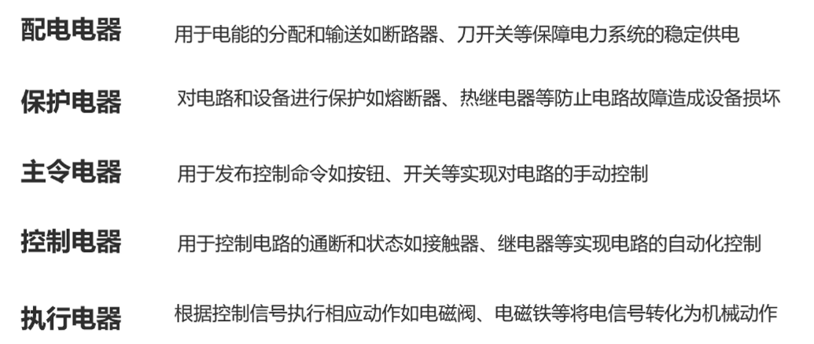
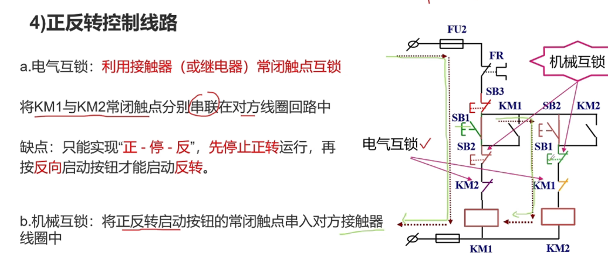

# 第2章 可编程控制器前言与低压电器
## 资料来源
- PPT：`第2.0 章 可编程控制器=前言=低压电器.ppt`
- PPT：`第2.1 章 可编程控制器=前言=续.ppt`
- 辅导书参考：`S7-1200 PLC编程及应用 第3版`，用于补充PLC等效电路、继电器控制与PLC控制对比。
## 1. 本章脉络

```text
低压电器与PLC前言
├─ 电力拖动系统组成
│  ├─ 主电路
│  └─ 控制电路
├─ 低压电器分类与作用
├─ 电磁式低压电器基础
│  ├─ 电磁机构
│  ├─ 电接触
│  └─ 电弧与灭弧
├─ 接触器
├─ 继电器
├─ 主令电器
├─ 其他低压电器
├─ 电机启动控制
└─ PLC控制与继电器控制比较
```

## 2. 电力拖动系统组成
#### 电力拖动系统通常由主电路和控制电路组成。

| 部分   | 构成                    | 电流特点 | 作用           |
| ---- | --------------------- | ---- | ------------ |
| 主电路  | 电动机、接触器主触点、熔断器、断路器等   | 电流大  | 直接给电动机或负载供电  |
| 控制电路 | 按钮、接触器线圈、继电器触点、PLC输出等 | 电流小  | 按工艺要求控制主电路通断 |
考试常问：为什么要区分主电路和控制电路？答：主电路负责传递能量，控制电路负责逻辑控制，两者电压电流等级和安全要求不同。

常见符号：


### 3.1 定义
电器：能够自动或手动接通、断开电路，并实现切换、保护、检测、变换、调节等功能的电气元件。
低压电器：==用于交流1200V、直流1500V及以下电路中的电器产品==。

### 3.2 按操作方式分类

| 类型   | 例子              | 特点                |
| ---- | --------------- | ----------------- |
| 手动电器 | 刀开关QS、按钮、转换开关   | 由人直接操作            |
| 自动电器 | 低压断路器QF、接触器、继电器 | 由电磁、热、机械或电子信号自动动作 |
#### 刀开关QS
作用：
- 隔离电路，方便检修
- ==无灭弧功能，一般配合熔断器工作==   QS-FU

#### 低压断路器QF
作用：
- 起手动开关作用，可进行欠压，失压，过载，短路保护等等
- 有灭弧功能
- =刀开关+熔断器FU+过电流/欠压继电器

#### 熔断器FU

#### 接触器KM 


## 4. 电磁式低压电器基础
### 4.1 电磁机构
电磁式低压电器通常由感测部分和执行部分构成。

| 部分 | 组成 | 作用 |
|---|---|---|
| 感测部分 | 吸引线圈、铁心、衔铁 | 将电信号转换为机械动作 |
| 执行部分 | 触点系统 | 接通或断开电路 |
工作原理：线圈通电后产生磁通，铁心对衔铁产生电磁吸力，衔铁运动带动触点闭合或断开。
### 4.2 电接触
触点接触形式包括点接触、线接触和面接触。
接触电阻是影响触点可靠性的重要因素。理想情况下，触点闭合时接触电阻为0，断开时为无穷大；实际中接触电阻过大会导致发热、熔焊和寿命降低。
### 4.3 电弧与灭弧
电弧产生于触点由闭合到断开的过程中。由于电场作用，触点间自由电子大量逸出，形成高温、高亮、电流密度大的导电通道。
危害：烧损触点、延长分断时间、引起误动作和安全事故。
常见灭弧方法：
- 电动力灭弧：迅速拉长电弧，降低单位长度电弧电压；
- 灭弧栅灭弧：把长电弧分割成多个短电弧，提高熄弧能力。
## 5. 接触器
### 5.1 定义与用途
接触器是用来自动接通或断开大电流电路的电器，主要用于电动机启动、反转、制动和调速，是电力拖动系统中最常见的控制电器。
### 5.2 组成

| 组成 | 作用 |
|---|---|
| 电磁机构 | 线圈通电产生吸力，使衔铁动作 |
| 主触点 | 接通/断开主电路，电流大 |
| 辅助触点 | 用于控制电路、联锁、自锁等 |
| 灭弧装置 | 熄灭主触点断开时产生的电弧 |
### 5.3 工作过程
线圈通电后，铁心产生磁通，衔铁吸合，主触点闭合，主电路接通；辅助触点同步改变状态。线圈断电后，弹簧使衔铁释放，触点恢复原状态。

### 5.4 主要技术参数

| 参数 | 含义 |
|---|---|
| 额定电压 | 主触点允许长期工作的电压 |
| 额定电流 | 主触点允许长期工作的电流 |
| 机械寿命 | 不带电操作次数 |
| 电气寿命 | 带负载操作次数 |
| 操作频率 | 每小时允许动作次数 |
| 接通与分断能力 | 能可靠接通和切断的电流范围 |
## 6. 继电器
### 6.1 定义与作用
继电器根据外来信号，如电压、电流、时间、速度、温度等，使触点动作，从而控制电路通断。
### 6.2 继电器与接触器区别

| 项目       | 继电器             | 接触器        |
| -------- | --------------- | ---------- |
| 用途       | 控制电路            | 主电路        |
| 电流       | 小               | 大          |
| ==灭弧装置== | 通常没有            | 通常有        |
| 动作信号     | 电压、电流、时间、速度、温度等 | 通常为线圈电压    |
| 能否直接控制负载 | 一般不能控制大负载       | 可以控制电动机等负载 |

### 6.3 继电器分类


| 类型            | 作用                 |
| ------------- | ------------------ |
| 电压继电器         | 根据电压大小动作，用于过压、欠压保护 |
| 电流继电器         | 根据电流大小动作，用于过流、欠流保护 |
| 速度继电器         | 用于电动机反接制动等速度相关控制   |
| ==中间继电器==（KA） | 扩展触点数量或放大控制能力      |
| ==热继电器==（FR）  | 利用热效应实现==过载和断相保护== |
| ==时间继电器==（KT） | 触点延时动作，用于==延时控制==  |

### 6.4 时间继电器
时间继电器符号常用KT。延时方式包括：

| 类型   | 工作特点              |     |
| ---- | ----------------- | --- |
| 通电延时 | 线圈通电后延迟动作，断电后瞬时复位 |     |
| 断电延时 | 通电时立即动作，断电后延迟复位   |     |


## 7. 主令电器
主令电器用于==发出控制命令==，直接或间接控制电力拖动系统。
### 7.1 控制按钮
控制按钮用于远距离手动控制电磁式电器，也可用于联锁和信号转换。

按钮结构：按钮帽、复位弹簧、触点、外壳。按下时通常先断开常闭触点，再接通常开触点；释放后触点复位。
### 7.2 行程开关与限位开关
行程开关根据机械运动位置发出控制信号。安装在行程终点，用于限制机械行程时称为限位开关。

接近开关属于非接触式位置检测装置，当物体接近一定距离时输出信号。
### 7.3 万能转换开关
万能转换开关由多组触点组件叠装而成，常用于控制线路转换、电压电流表换相测量、配电装置遥控等。
## 8. 其他低压电器
### 8.1 熔断器
熔断器在短路或严重过载时，熔体发热熔断，从而切断故障电路。主要用于短路保护，也可承担一定过载保护。
### 8.2 低压断路器
低压断路器能接通、承载和分断正常电流，也能在短路、过载、欠压等故障时自动切断电路。
### 8.3 漏电保护开关
漏电保护开关检测相线和中性线电流差，当漏电流超过设定值时跳闸，主要用于人身触电和漏电火灾保护。
## 9. 电动机启动控制

### 9.1 直接启动
直接启动结构简单，但==启动电流大，适用于小功率电动机或电源容量足够的场合==。
### 9.2 Y/△降压启动
Y/△启动先将==电动机定子绕组接成星形==，==降低相电压和启动电流==；==待转速升高后再切换为三角形正常运行==。

公式本身：

$$
I_Y \approx \frac{1}{3} I_\Delta
$$$$
T_Y \approx \frac{1}{3} T_\Delta
$$

| 符号         | 含义          | 备注      |
| ---------- | ----------- | ------- |
| $I_Y$      | 星形启动时线电流    | 降低启动冲击  |
| $I_\Delta$ | 三角形直接启动时线电流 | 正常运行接法  |
| $T_Y$      | 星形启动转矩      | 启动转矩也降低 |
| $T_\Delta$ | 三角形启动转矩     | 直接启动转矩  |

适用条件：电动机正常运行应为三角形接法，且负载启动转矩要求不高。
工程意义：降低启动电流，==减小对电网和机械系统的冲击==。
易错点：启动电流降低的同时，启动转矩也降低，==重载启动不适合简单Y/△启动==。
### 9.3 定子串电阻降压启动
启动时在定子回路串入电阻，降低电动机端电压和启动电流，启动后切除电阻。缺点是电阻耗能、启动转矩降低。
## 10. PLC控制与继电器控制比较

| 项目 | 继电器控制 | PLC控制 |
|---|---|---|
| 控制逻辑 | 硬接线实现 | 用户程序实现 |
| 修改功能 | 改实际接线 | 改程序 |
| 触点数量 | 受硬件限制 | 软件触点几乎不受限 |
| 控制速度 | 毫秒级，有机械抖动 | 微秒级，半导体逻辑快 |
| 定时精度 | 受环境影响较大 | 晶振定时，精度高 |
| 可靠性 | 触点磨损、电弧、噪声 | 可靠性高，维护方便 |
| 适合场景 | 简单固定逻辑 | 复杂、可变、可扩展逻辑 |

关键结论：继电器控制改变功能要改接线；PLC控制改变功能主要改程序。

## 11. PLC等效电路理解

PLC输入端可以等效为读取外部按钮、开关、传感器状态；PLC内部程序可以等效为大量“软触点”和“软线圈”；PLC输出端再驱动外部接触器线圈、电磁阀、指示灯等。

因此继电器控制图中的按钮、触点、线圈，可以转化为PLC输入地址、程序触点、输出地址。

## 12. 图表索引

| 图表 | 来源位置 | 作用 |
|---|---|---|
| 电力拖动系统主电路/控制电路 | 第2.0章PPT前部 | 理解主电路和控制电路区别 |
| 接触器结构图 | 第2.0章PPT接触器部分 | 认识电磁机构、触点、灭弧装置 |
| 时间继电器符号图 | 第2.0章PPT继电器部分 | 区分通电延时和断电延时 |
| Y/△启动接线图 | 第2.1章PPT前部 | 理解降压启动接触器配置 |
| 继电器控制与PLC控制对比图 | 第2.1章PPT后部 | 理解硬接线与软逻辑区别 |
| PLC等效电路图 | 第2.1章PPT后部 | 把继电器电路转换为PLC程序 |

## 13. 易错点

1. 接触器用于主电路，继电器主要用于控制电路。
2. 热继电器主要保护过载和断相，不适合短路保护；短路保护用熔断器或断路器。
3. 时间继电器要区分通电延时和断电延时。
4. 按钮常开常闭触点动作顺序通常是先断后合。
5. PLC输出不能直接驱动所有大功率负载，通常需要通过接触器、继电器或驱动模块。
6. Y/△启动降低电流，也降低转矩。
7. PLC控制并不是不要主电路，主电路仍由接触器、断路器等组成。

## 14. 考前补充：低压电器与电机控制细节

### 14.1 保护电器的分工

| 器件 | 主要保护对象 | 动作特点 | 不能混淆点 |
|---|---|---|---|
| 熔断器 | 短路保护 | 熔体熔断，一次性保护 | 不能作为正常频繁操作开关 |
| 低压断路器 | 短路、过载、欠压等 | 可重复合闸，保护功能较全 | 与接触器不同，主要不是频繁控制电机 |
| 热继电器 | 电动机长期过载、断相 | 反时限动作，动作较慢 | 不能代替短路保护 |
| 接触器 | 大电流主电路通断 | 可频繁吸合释放 | 本身不是过载保护器 |

### 14.2 自锁、互锁、联锁

- 自锁：启动按钮松开后，接触器/输出线圈靠自身辅助触点继续保持，具有记忆功能 。
- 互锁：两个相反动作不能同时发生，如电机正转和反转不能同时接通。
- 联锁：某动作必须满足前置安全或工艺条件，如压力到位后才允许钻头下行。

### 14.3 电机正反转控制常考点

正反转控制至少要有两类互锁：

1. 电气互锁：正转接触器（KM）辅助常闭触点串入反转线圈回路，反之亦然。
2. 机械互锁：两个接触器机械机构（SB）互锁，防止触点粘连或误动作造成相间短路。

PLC实现正反转时，程序中也要做软件互锁，但不能只依赖软件互锁，主电路仍需接触器和保护电器。

## 15. 本章预测题与答案

### 题1：电力拖动系统中主电路和控制电路有什么区别？

答案：主电路由电动机、接触器主触点、熔断器等组成，电流大，直接给负载供电；控制电路由按钮、继电器、接触器线圈、PLC输出等组成，电流小，用于按工艺要求控制主电路通断。

### 题2：什么是低压电器？

答案：低压电器是用于交流1200V、直流1500V及以下电路中，起接通、断开、保护、控制、检测或调节作用的电器产品。

### 题3：接触器由哪些部分组成？作用是什么？

答案：接触器由电磁机构、触点系统和灭弧装置组成。电磁机构实现吸合和释放，主触点控制主电路，辅助触点用于控制和联锁，灭弧装置用于熄灭断开大电流时产生的电弧。

### 题4：继电器和接触器的主要区别是什么？

答案：继电器主要用于小电流控制电路，通常无灭弧装置，不能直接分断大负载；接触器主要用于主电路，能接通和分断较大电流，通常带灭弧装置。

### 题5：热继电器主要保护什么故障？能否代替熔断器？

答案：热继电器主要用于电动机长期过载和断相保护，不能代替熔断器。熔断器主要用于短路保护，热继电器动作较慢，不适合切断短路大电流。

### 题6：说明通电延时和断电延时时间继电器的区别。

答案：通电延时是线圈通电后延迟动作，断电后立即复位；断电延时是线圈通电时立即动作，断电后延迟复位。

### 题7：为什么Y/△启动不适合重载启动？

答案：Y/△启动虽然使启动电流约降为三角形直接启动的三分之一，但启动转矩也约降为三分之一。重载启动需要较大启动转矩，因此不适合简单Y/△降压启动。

### 题8：PLC控制相对继电器控制的优势是什么？

答案：PLC控制通过用户程序实现逻辑，修改功能主要改程序，不必大量改线；软触点数量多，控制速度快，定时精度高，可靠性高，维护和扩展方便。

### 题9：什么是PLC等效电路图？

答案：PLC等效电路图是把外部按钮、开关等视作PLC输入，把程序中的触点和线圈视为内部软元件，把PLC输出视作驱动外部执行器的接口，用于帮助从继电器控制电路过渡到PLC梯形图程序。

### 题10：电弧有哪些危害？常见灭弧方法有哪些？

答案：电弧会烧损触点、降低电器寿命、延长分断时间并可能引起误动作。常见灭弧方法有电动力灭弧和灭弧栅灭弧等。
