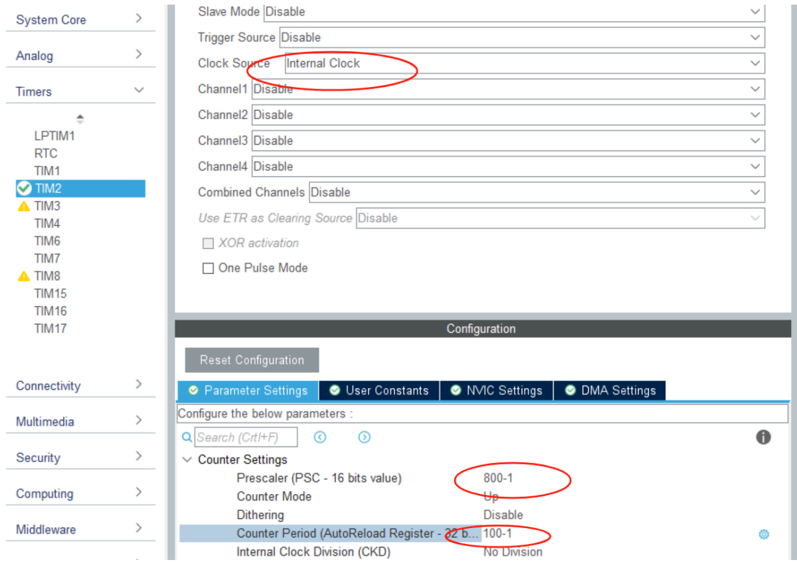
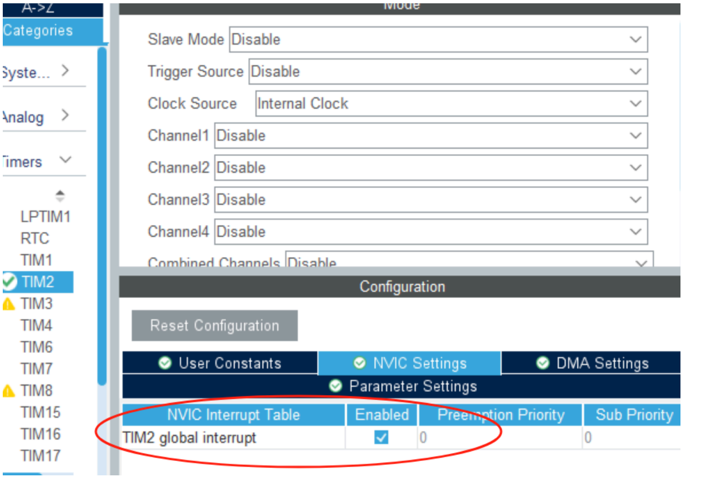
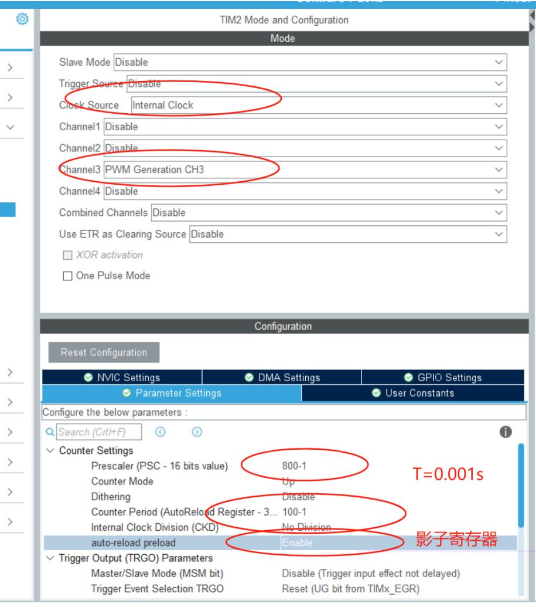
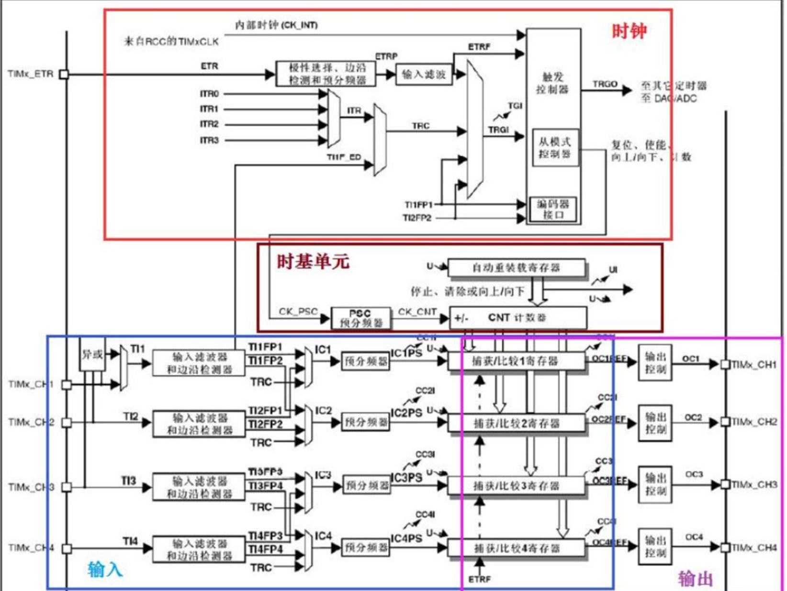

---

# 定时器：(interal clock别忘记!!)

$$
T
$$

**工作在定时模式时：**

**内部时钟**CK_INT

**定时器时钟**TIM_CLK
## 1.内部时钟

**PSC：**分频，psc/系统主频=计数器的“1”次有多久，
(16 位 PSC 最大值 65535)
**ARR：**周期，多少个psc更新一次
$$
T=[(PSC+1)*（ARR+1）]/f
$$

$$
例：系统时钟=80Mhz，设周期=1ms
$$

$$
0.001=[(799+1)*100]/(79 999 999+1)
$$


##### 定时器代码：

```
HAL_TIM_Base_Start_IT(&htim2);//打开终端
```

```
//终端处理函数
void HAL_TIM_PeriodElapsedCallback(TIM_HandleTypeDef *htim)
{
	if(htim==&htim2)//if (htim->Instance == TIM2)
	{
	led_toggle(LED_0);
	}
}
```

## 2.外部时钟

## 3.PWM产生波

### 原理:
​	**ARR（Auto Reload Register）**：决定 PWM 信号的周期。例如，若 ARR=99，则定时器计数从 0 到 99，形成一个 PWM 周期。

​	**CCR（Capture/Compare Register**）：决定高电平时间。例如，若 CCR3=50，则输出高电平持续 50 个计数值，对应的占空比大致为 50/100=50%。

​	**预分频器PSC（Prescaler）**：将系统时钟分频后作为定时器的计数时钟。比如，如果系统时钟为 80MHz，预分频器设为 79，则定时器计数频率为 80MHz/80 = 1MHz，也就是每个计数 1μs。

​	**Auto-reload preload(影子寄存器)**  ：在程序中更新ARR或CRR(即改变占空比时使用)，用于“缓冲写入值、延后更新”的硬件机制，能让 STM32 的定时器 **在更新参数时更加平滑、安全、同步**，避免在关键时刻跳变或抖动。

### 输入捕获模式:

STM32 定时器的输入捕获模式可以捕获信号边沿时定时器的计数值。通常的配置方法是：

- 使用**通道1**捕获上升沿（标记周期开始），得到一个周期的总计数值（记为 capture1）。
- 使用**通道2**捕获高电平结束的边沿（例如上升沿到下降沿之间），得到高电平持续的计数值（记为 capture2）。

### CubeMX 配置:

1. **TIM2 配置（PWM 输出）：**
   - 模式：选择 PWM Generation
   - 通道：配置 CH3 为 PWM 输出
   - 设置 ARR、CCR3、预分频器等（例如 ARR=99, CCR3=50, Prescaler=79）
2. **TIM3 配置（输入捕获）：**
   - 模式：选择 PWM Input 模式
   - 通道：配置 CH1 捕获上升沿，CH2 捕获下降沿
   - 设置预分频器同样设为 79，保证计数单位一致
   - 配置好对应的 GPIO（例如连接到需要测量的 PWM 信号）
3. **中断设置：**
   - 为 TIM3 开启输入捕获中断（如果需要中断方式测量）。


> [!NOTE]
>
> 不要中断           **TIM2--CH2:PA1**
>
> ​		          **TIM2--CH3:PA2**    //这里是PA2
>
> (要用杜邦线吧PA2和另外一个测频率的引脚(PA6)相连)

[Open: image-20251202153314505.jpg](定时器.assets/a0f22801e060a47b717d936228020300_MD5.jpg)

##### 初始化：

```
	HAL_TIM_PWM_Start(&htim2,TIM_CHANNEL_3);
	TIM2 -> CCR3 =50;//CCR3 寄存器:在PWM模式下,CCR的值决定了PWM输出的高电平持续时间。
```

$$
Duty= CCR/(ARR+1)  (ARR=99)
$$

## 4.PWM测频
有两种方法,这里只说PWM测频的
[文件已丢失]
##### cubemx配置：
[文件已丢失]
```
    HAL_TIM_IC_Start_IT(&htim3, TIM_CHANNEL_1); // 捕获上升沿（周期）
    HAL_TIM_IC_Start(&htim3, TIM_CHANNEL_2);  // 捕获下降沿（高电平时间）(可以没有)
```


```
uint32_t capture1;
uint32_t capture2;//	捕获某个边沿时 CNT 的当前值（计数值）

float freq;
float duty;

void HAL_TIM_IC_CaptureCallback(TIM_HandleTypeDef *htim)
{
		if(htim -> Instance ==TIM3 && htim -> Channel == HAL_TIM_ACTIVE_CHANNEL_1)
		{
			capture1 = HAL_TIM_ReadCapturedValue(&htim3,TIM_CHANNEL_1)+1;// 捕获上升沿（周期）
			capture2 = HAL_TIM_ReadCapturedValue(&htim3,TIM_CHANNEL_2)+1; // 捕获下降沿（高电平时间）
			//TIM1->CNT = 0;
			freq= 80000000/ (80 * capture1);
			duty =((float)capture2/capture1);//测量的占空比,输出捕获
			//duty = (float)TIM2->CCR/(TIM2-AAR+1);//自己生成的占空比
		}
}
```

## 5.比较

#### 1.中断回调:

```
//（2550）输入捕获中断,只需要改PSC,计算频率、占空比
void HAL_TIM_IC_CaptureCallback(TIM_HandleTypeDef *htim)
//（2547）定时器周期溢出中断回调,需要改PSC和ARR,做周期性任务
void HAL_TIM_PeriodElapsedCallback(TIM_HandleTypeDef *htim)

```

#### 2.初始化：

```
//PWM输出
HAL_TIM_PWM_Start(&htim2,TIM_CHANNEL_2);
TIM2->CCR2 = 50;
//输入捕获中断
HAL_TIM_IC_Start_IT(&htim3,TIM_CHANNEL_2);
//定时器中断,一定要加IT
HAL_TIM_Base_Start_IT(&htim4);
```

## 6.电路图
