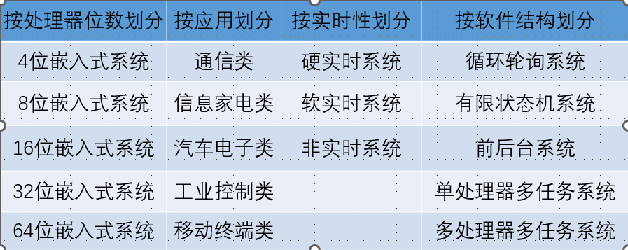
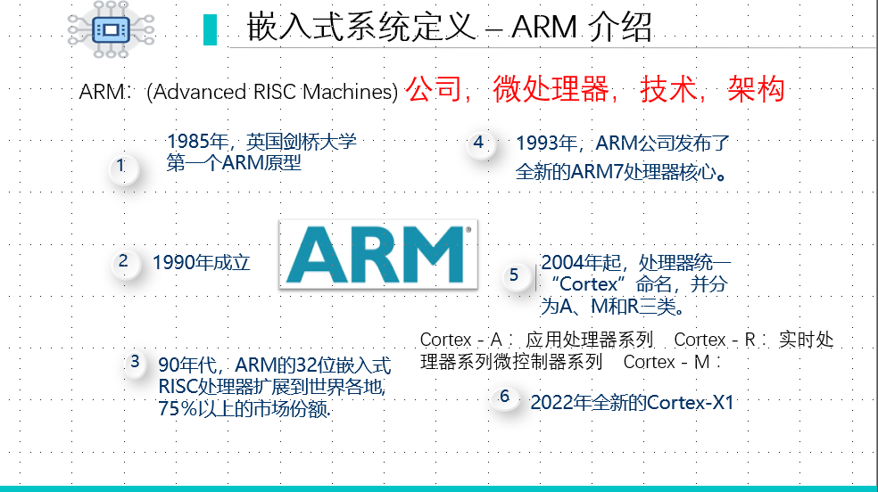
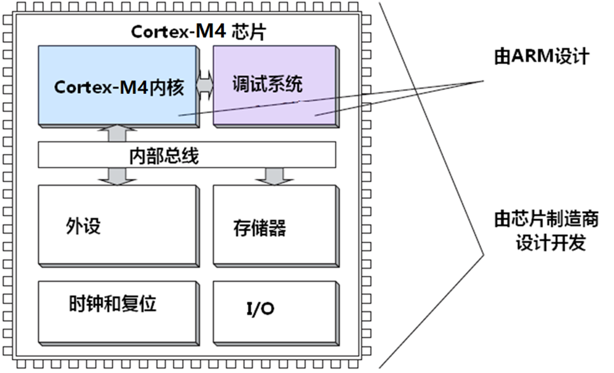
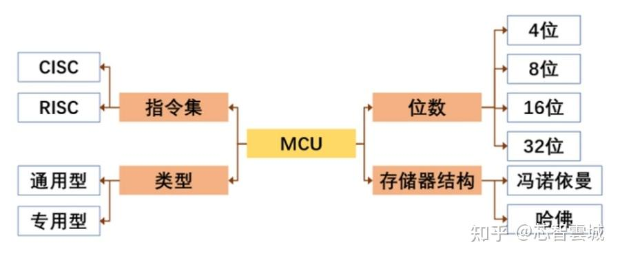
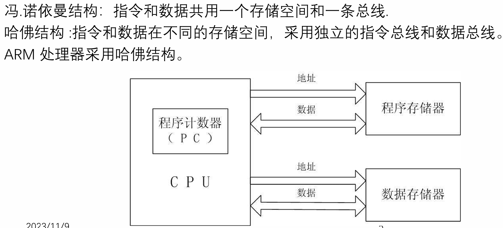
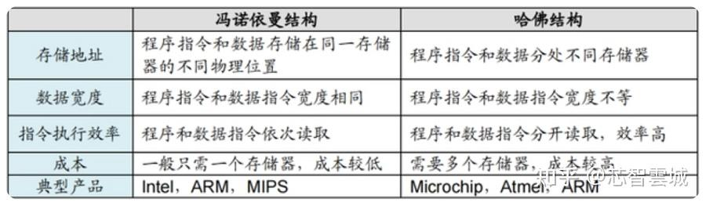
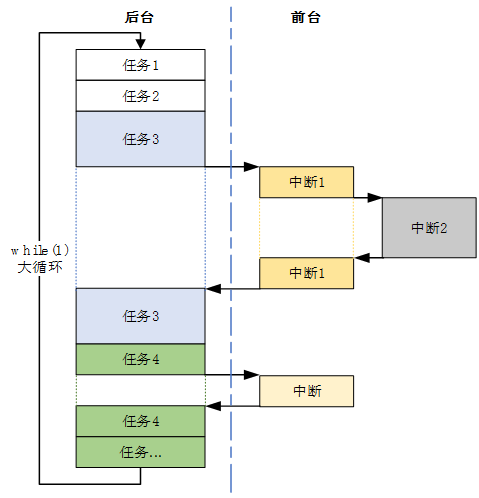
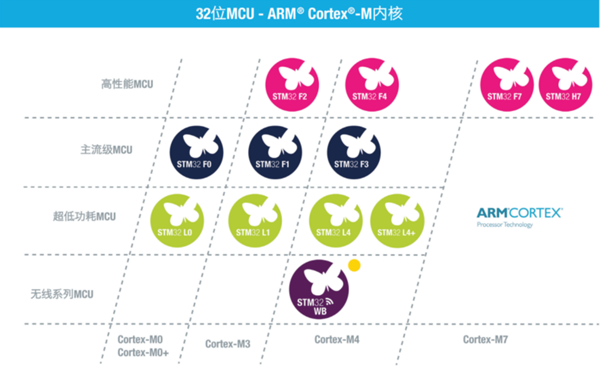
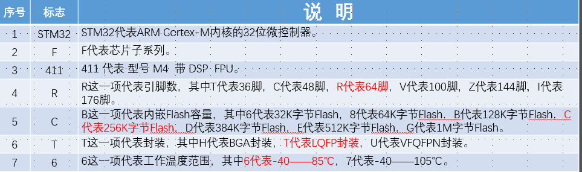

---

### 一、嵌入式系统的定义与发展
#### 1️⃣ 定义
- **核心定义**：
	嵌入式系统是以应用为中心，以现代计算机技术为基础，能够根据用户需求 ，如功能、可靠性、成本、体积、功耗、环境等灵活裁剪软硬件模块的专用计算机系统。  
- **中国国家标准 GB/T22033-2008**：
	置入应用对象内部，起信息处理和控制作用的专用计算机系统。  
- **IEEE 定义**：
	用于控制、监测或辅助设备运行的装置。  
- **维基百科定义**：
	嵌入到机械或电气系统中的计算机控制系统，具有实时性。

 **延伸理解：**
嵌入式系统不是通用计算机（如 PC），它通常“藏”在设备内部（如手机、洗衣机、无人机、工业控制器等）。其本质是一种**特定任务的计算机**，例如 STM32 微控制器控制电机或传感器。

---
#### 2️⃣ 发展阶段

| 阶段  | 时间        | 特点                                     |
| --- | --------- | -------------------------------------- |
| 出现  | 1960–1970 | 最早的机载专用数字计算机（Verdan）；实现工业直接数字控制 (DDC)。 |
| 兴起  | 1971–1989 | 微处理器出现，嵌入式计算机广泛应用于工业与军用领域。             |
| 繁荣  | 1990–现在   | 嵌入式系统深入工业、通信、汽车电子、家电等领域。               |

- 1971 年 Intel 推出 **4004** 微处理器，标志着嵌入式计算机时代的开端。
- 随着 **IoT（物联网）** 发展，嵌入式系统成为智能设备的基础。

### 二、通用计算机 vs 嵌入式系统

| 特征   | 通用计算机                    | 嵌入式系统                          |
| ---- | ------------------------ | ------------------------------ |
| 形式   | 可见计算机（如 PC）              | 融入设备内部，不以计算机形态出现               |
| 组成   | 通用 CPU；标准总线 + 外设；软硬件相对独立 | 专用 MCU；总线、外部接口集成在处理器内部；软硬件紧密结合 |
| 开发方式 | 本机开发                     | 交叉开发（PC 上编译 → 下载到目标板）          |
| 二次开发 | 可扩展                      | 固化程序，不可修改                      |
  **嵌入式系统的**不可二次开发性**源于程序固化在 Flash 中，适合**产品级部署**。但现代系统支持 OTA 更新和可配置固件。
### 三、嵌入式系统分类
1. **按处理器位数**：4位、8位（51，Arduino）、16位、32位（stm32）、64位。

2. **按应用**：通信类、信息家电、汽车电子、工业控制、移动终端等。  
3. **按实时性**：硬实时、软实时、非实时。  
4. **按软件结构**：循环轮询、状态机、前后台系统、RTOS 多任务系统。

位数：一次处理几位数据
		stm32 /32位控制器
		51单片机  /8位控制器
#### arm：

#### 芯片结构（f411）：

- 现代嵌入式系统多采用 **RTOS（实时操作系统）**，如 FreeRTOS、RT-Thread、Zephyr。
- 在汽车和工业领域，**硬实时性**是安全关键。
### 四、嵌入式系统特点
1. 特定应用性  
2. 实时性与可靠性  
3. 多种体系结构（ARM、RISC-V）  
4. 成本敏感  
5. 嵌入式操作系统支持  
6. 专用开发工具链（Keil、STM32CubeIDE）

在物联网时代，系统需兼顾 **功耗控制与网络通信**（如 BLE、Wi-Fi、CAN、RS485）。
##  第二部分：嵌入式软件开发方式
### 1️⃣ 编程模式
#### （1）前/后台系统（裸机系统）
- **主循环负责轮询**任务（后台系统）:一个无限循环，循环中断相关函数完成所需要的操作
- **中断响应实时**事件（前台系统）:若干个中断服务程序，用于处理系统的异步事件和实时性要求较高的任务
- 
#### （2）嵌入式操作系统（RTOS）
- 提供任务调度、同步通信、内存管理。
- 适合多任务并行与复杂系统。
RTOS 常见功能包括任务调度、信号量、消息队列、内存管理。
### 2️⃣ 程序开发方式

| 方式    | 特点         | 优缺点         |
| ----- | ---------- | ----------- |
| 寄存器方式 | 直接操作硬件寄存器  | 高效但复杂       |
| 库函数方式 | 使用厂家 HAL 库 | 简单易用，适合工程开发 |

STM32 开发常用：  
- HAL（Hardware Abstraction Layer）库  
- LL（Low Layer）库
##  第三部分：学习体系与方法
1. **硬件基础**：最小系统（电源、复位、时钟）。  
2. **软件基础**：GPIO、定时器、中断、串口通信。  
3. **通信接口**：UART、SPI、I²C、CAN、USB。  
4. **模块化设计**：使用扩展板开发。  
5. **RTOS 实践**：掌握任务调度与通信。

**学习建议：**
- 先易后难，从裸机到 RTOS。  
- 实践驱动，使用开发板实验。  
- 掌握调试手段（串口、逻辑分析仪、仿真器）。
##  第四部分：微控制器 MCU 与 STM32

### 1️⃣ MCU 概念

- MCU = Microcontroller Unit = 单片微型计算机  
- 集成 CPU、RAM、ROM、I/O、定时器、A/D、D/A  
- 常用于控制系统核心部分

MCU 与 MPU 区别：  
- MCU：资源有限，控制导向（STM32、51）  
- MPU：带 MMU，应用导向（树莓派）
### 2️⃣ STM32 系列命名规则
**STM32F103RBT6**  

| 项     | 含义              |
| ----- | --------------- |
| STM32 | ARM Cortex-M 系列 |
| F     | 芯片子系列           |
| 103   | 增强型系列           |
| R     | 64 引脚封装         |
| B     | 128 KB Flash    |
| T     | LQFP 封装         |
| 6     | -40～85℃         |

### 3️⃣ ARM 架构简述
- Cortex-A：高性能应用处理器  
- Cortex-R：实时控制类  
- Cortex-M：微控制器系列（STM32 属于此类）  

Cortex-M 使用 **Thumb-2 指令集**，内置 **NVIC** 支持嵌套中断，具备低功耗与高响应能力。

##  总结

| 模块 | 核心内容 | 延伸理解 |
|------|-----------|-----------|
| 嵌入式定义与发展 | 从机载系统到物联网时代 | ARM、RISC-V 引领低功耗趋势 |
| 分类 | 位数、应用、实时性、结构 | RTOS 与非 RTOS 各有适用场景 |
| 特点 | 实时性、可靠性、成本敏感 | IoT 需联网与低功耗设计 |
| 开发方式 | 裸机/RTOS；寄存器/库函数 | HAL 与 LL 结合开发 |
| 学习路径 | 硬件 + 软件 + 调试 + RTOS | STM32CubeMX + FreeRTOS 实践 |
| MCU | STM32 命名与架构 | 理解 Cortex-M4：NVIC、SysTick、FPU |

