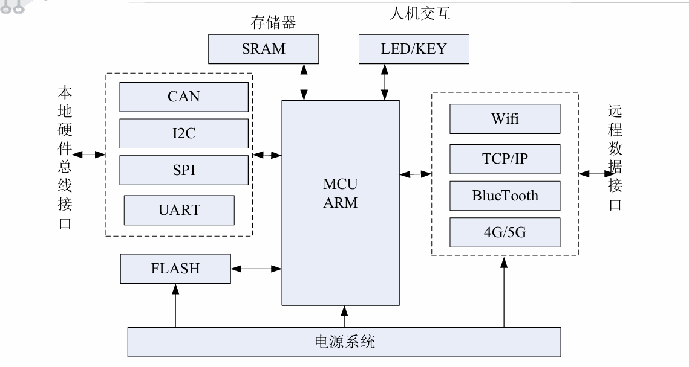
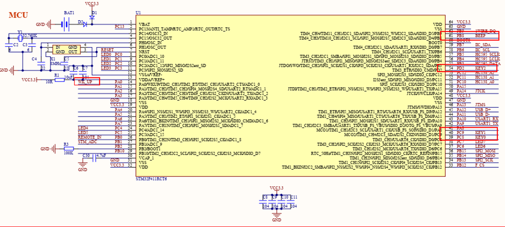
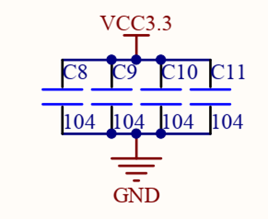
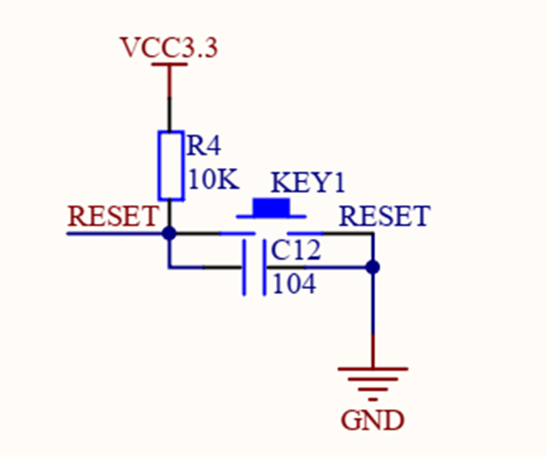
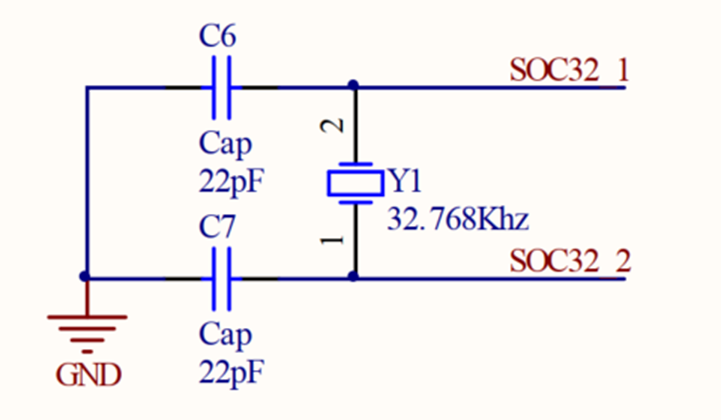
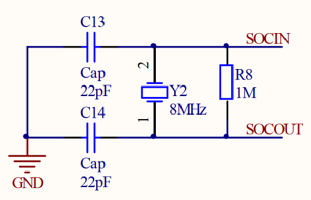
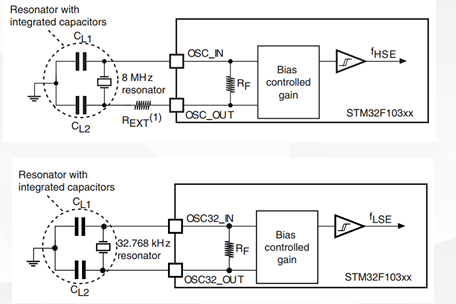
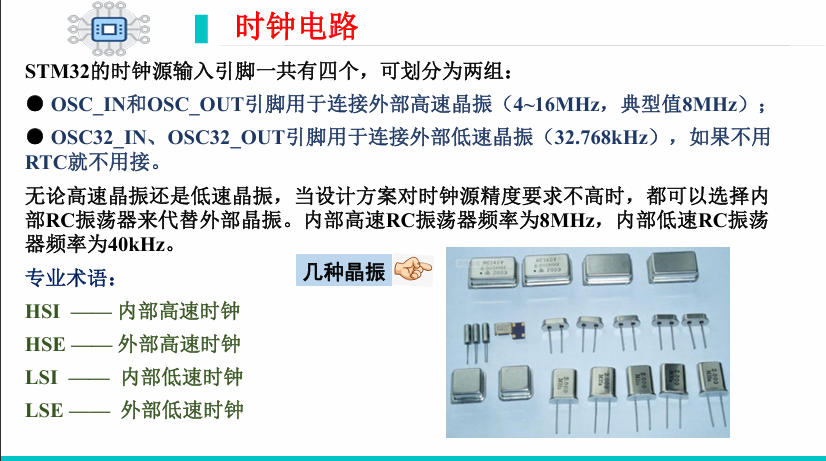
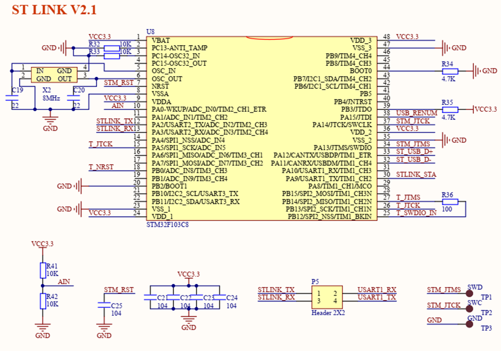

---

##  一、嵌入式系统的硬件基础
嵌入式系统硬件一般包括以下部分：

| 模块 | 功能 |
|------|------|
| **MCU / ARM 处理器** | 系统核心，负责指令执行与控制 |
| **电源系统** | 提供稳定工作电压（常见 3.3V / 5V） |
| **存储器模块** | 存储程序和数据（FLASH、SRAM） |
| **总线接口** | 内部与外部设备通信（I²C、SPI、UART、CAN 等） |
| **人机交互接口** | LED、按键、LCD、触摸屏等 |
| **远程通信接口** | Wi-Fi、蓝牙、4G/5G、以太网、TCP/IP |

==*MCU = CPU + 内部总线+ 存储器 + 外设  + 控制逻辑（全部集成在一颗芯片里）*==
定义：把中央处理器(Central Process Unit；CPU)的频率与规格做适当缩减，并将内存(memory)、计数器(Timer)、USB、A/D转换、UART、PLC、DMA等周边接口，甚至LCD驱动电路都整合在单一芯片上，形成芯片级的计算机，为不同的应用场合做不同组合控制。

**1.CPU（Cortex-M4 内核）**：运算 + 控制核心。
	内部包括： **运算单元（ALU）**、 **控制单元（CU）**、**寄存器组(通用寄存器、PC（程序计数器）、SP（堆栈指针）、状态寄存器)**
	
**2.存储器**：存放程序和数据。
	**Flash（程序存储器）**、**SRAM（数据存储器）**、**EEPROM（部分 MCU）**、**SFR（特殊功能寄存器）**
    （掉电不丢失 ）           全局变量、局部变量、 栈、堆（掉电丢失 ）    参数配置（掉电不丢失 ）
	SFR 属于 MCU 的存储器部分，是一种采用存储器映射方式的特殊功能寄存器，用于对外设进行配置和控制。
	
**3.外设**：CPU 以外的功能模块，用来和外部世界交互。
（1）数字外设
	 GPIO、定时器 / 计数器、 PWM、 看门狗（IWDG / WWDG）
（2）通信外设
	 UART / USART、SPI、 I2C、 CAN、 USB（部分）
（3）模拟外设
	ADC、 DAC、 比较器、运算放大器（部分型号）
	
**4.总线**：连接 CPU、存储器和外设的“高速公路”
	数据总线、控制总线、地址总线

**5.控制逻辑**：保证 MCU 各模块按规则协同工作的“幕后系统”
	时钟系统、复位系统、中断控制器、电源管理、启动配置逻辑

- 在现代 IoT 嵌入式系统中，MCU 通常通过无线通信（如 BLE 或 NB-IoT）与云端交互。  
- 电源系统需考虑 **功耗管理** 与 **EMC 抗干扰**，如使用 LDO 或 DCDC 转换模块、ESD 保护电路。

### stm32最小系统：
#### 1.电源电路：
##### （1）工作电压
- STM32 常见工作电压：**3.3V**
- 绝对不能直接接 5V（除非 5V 容忍 IO）
##### （2）必须连接的引脚
- **VDD / VSS**：数字电源 / 地
- **VDDA / VSSA**：模拟电源 / 地
- **VBAT**：备份电源（RTC，可选）
- 所有 VDD **必须全部接**
- VDDA 即使不用 ADC，也要接 3.3V（通过滤波）
##### （3）去耦电容
- 每个 VDD → **0.1µF**
- 电源入口 → **1–10µF**
- VDDA → 0.1µF + 1µF
**作用**：抑制电源噪声，保证系统稳定

电源及其滤波电路：

#### 2.复位电路：
若复位引脚有效，分为：外部复位和内部复位、冷复位和热复位、异步复位与同步复位。

#### 3.时钟电路
STM32 内部集成 RC 振荡器，但精度较低，通常在对时序和通信精度要求较高的应用中使用外部晶振，不接外部晶振也可以工作

**LSI**
**内部低速时钟。由芯片内部的RC振荡器提供，默认频率为32kHz。**
**HSI**
**内部高速时钟。由芯片内部的RC振荡器提供，默认频率为16MHz。**

                     振荡模式

**LSE**
**通过OSC32_IN、OSC32_OUT引脚用于连接外部低速晶振（32.768kHz），如果不用 RTC就不用接**
**HSE**
**外部高速时钟。通过OSC_IN和OSC_OUT引脚用于连接外部高速晶振（4~26MHz，典型值8MHz），也可以直接接入外部时钟，频率范围为1MHz~50MHz**

在MCU复位后，默认使用RC振荡器提供时钟，由于该时钟存在1%左右的误差，因此在实际使用中，通常通过软件切换HSE时钟

#### 4.下载（Boot）/调试电路（SWD）
下载调试接口有：STLINK接口、SWD接口、DAP接口

##   二、硬件 PCB 设计与封装

### 1️ PCB（Printed Circuit Board）
- PCB 是嵌入式系统的核心承载结构，负责电气连接与信号传输。  
- 常见层数：单层、双层、四层、六层。高性能系统可达 8 层以上。
### 2️ 封装类型
- **通孔封装（DIP）**：插针式，适合教学和原型板焊接。  
- **贴片封装（SMD）**：表面贴装技术，便于自动化生产和高密度集成。

 **延伸说明：**
- 常见贴片封装：QFP、QFN、BGA、LQFP、TQFP。  
- STM32 常用封装：LQFP48 / **LQFP64**（f411） / LQFP100 / LQFP144。  
- 在高速设计中应关注：  
  - 信号完整性（SI）  
  - 电磁兼容（EMC）  
  - 电源去耦与地平面设计  

##   三、存储器基础

### 1️ RAM（随机存取存储器）
- **DRAM（动态 RAM）**：高密度、成本低、速度慢、功耗高。  
- **SRAM（静态 RAM）**：速度快、成本高、常用于 CPU Cache 或嵌入式数据缓冲。

- 嵌入式系统中的 **SRAM** 一般容量较小（几十 KB 至几 MB），用于实时数据存取。  
- 大型系统（如 Cortex-A）可能外接 DDR SDRAM。  

### 2️ ROM（只读存储器）
- 包括：ROM、PROM、EPROM、EEPROM、FLASH。  
- **ROM**：内容固定，不可改写。  
- **EPROM**：可擦写，但需紫外线照射。  
- **EEPROM**：可电擦除与重写，适用于小容量数据存储。  
- **FLASH**：主流存储介质，可快速擦写大块数据。

- STM32 内部集成 **Flash + SRAM**。  
- 外部 Flash 通常为 SPI Flash 或 NOR Flash，用于程序或配置数据存储。  
- 在系统设计中应区分：  
  - **代码存储区**（Flash）  
  - **数据存储区**（SRAM/EEPROM）  

##  四、总线与接口

### 1️ 下载与调试接口

| 工具                                | 特点                      |
| --------------------------------- | ----------------------- |
| **JLINK / ULINK / STLINK**        | 常用的下载调试工具               |
| **JTAG（Joint Test Action Group）** | 边界扫描测试与在线编程标准，支持多引脚调试   |
| **SWD（Serial Wire Debug）**        | 两线制调试接口，STM32 标配，低针脚高性能 |

- **CMSIS-DAP** 是 ARM 官方通用调试协议标准，兼容多种 IDE（如 Keil、VSCode）。  
- SWD 具备下载固件、在线调试、单步执行、断点、内存查看等功能。

### 2️ GPIO（通用输入输出）
- MCU 最常见的接口方式。每个 GPIO 可配置为输入、输出、复用功能或中断输入。  
- 常见外设：LED 控制、按键扫描、继电器驱动等。

- GPIO 驱动电流有限（一般 10~20mA），驱动大负载需加三极管或 MOSFET。  
- 外部信号应加上 **上拉/下拉电阻** 防止悬空。  

### 3️ 模拟与数字信号转换

| 类型 | 英文缩写 | 功能 |
|------|------------|------|
| 模数转换 | ADC | 将模拟信号（电压/电流）转换为数字信号 |
| 数模转换 | DAC | 将数字信号输出为模拟电压波形 |

- STM32 内置 12 位或 16 位 ADC，可用于温度、光照、电流检测等。  
- DAC 可生成音频波形、参考电压或模拟输出。  

### 4️ PWM（脉宽调制）
- 通过占空比控制模拟电压或功率输出。  
- 应用：电机调速、LED 亮度控制、伺服控制。

- 频率高时可实现类似 DAC 的“数字模拟信号”。  
- 结合定时器模块使用，可精确输出固定频率信号。  

### 5️ 看门狗（Watchdog）
- 防止程序“跑飞”或死循环，自动复位系统。  
- 常见于无人值守设备（如机器人、传感终端）。

- STM32 内含两种看门狗：  
  - **独立看门狗（IWDG）**：基于独立低速时钟，掉电仍有效。  
  - **窗口看门狗（WWDG）**：需在指定时间窗口内喂狗，否则触发复位。  

### 6️ 通信总线

#### （1）UART（通用异步收发器）
- 基本通信线：TXD、RXD、GND。  
- 主从机波特率需一致。  
- 常用于调试输出（如串口打印）。

#### （2）I²C（Inter-Integrated Circuit）
- 由 Philips 公司开发，两线制（SCL、SDA）。  
- 支持主从多设备通信，典型速率 100kHz / 400kHz / 1MHz。  
- 适合短距离板级通信（如传感器）。

#### （3）SPI（Serial Peripheral Interface）
- Motorola 开发，全双工同步串行通信。  
- 常用信号线：MISO、MOSI、SCK、CS。  
- 比 I²C 更快，但需要更多线。

#### （4）CAN（Controller Area Network）
- 车载总线标准，全数字、高可靠性。  
- 支持多主通信与优先级仲裁。  
- 应用于汽车电子、工业自动化。

#### （5）USB（Universal Serial Bus）
- 高速、抗干扰强，支持即插即用。  
- 广泛用于 PC、嵌入式终端的数据通信。

- STM32 通常支持多种通信接口，可同时运行 UART + I²C + SPI。  
- 高级应用中可使用 **DMA + 中断机制** 提高通信效率。

## 🧍‍♂️ 五、人机交互接口（HMI）

### 1️ LCD 显示模块
- 负责显示字符、图形、菜单信息。  
- 常见类型：字符型（1602）、图形型（12864）、TFT 彩屏。  

 **延伸说明：**
- 现代嵌入式系统广泛使用 **SPI 接口 TFT 屏** 或 **电容触控屏**。 
- 常结合 GUI 库（如 LVGL）进行人机界面设计。  

### 2️ 键盘输入
- 基于矩阵扫描实现多键输入。  
- 常见结构：4×4 键盘矩阵、电容触摸按键。  

**延伸说明：**
- STM32 通过 **GPIO 扫描矩阵键盘**，可实现去抖、长按、短按识别。  
- 复杂输入系统可采用 **I²C 键盘控制器**（如 PCF8574）。

##  总结

| 模块 | 关键内容 | 拓展方向 |
|------|-----------|-----------|
| PCB 与封装 | DIP、SMD 封装；多层板设计 | 高频信号完整性与EMC设计 |
| 存储器 | RAM、ROM、FLASH | 外部 SPI Flash 与 EEPROM |
| 总线接口 | GPIO、ADC/DAC、PWM、通信总线 | DMA 加速与低功耗通信设计 |
| 调试接口 | JTAG、SWD、CMSIS-DAP | 在线调试、固件下载、断点分析 |
| 人机交互 | LCD 显示、按键输入 | GUI 界面设计与触控交互 |

