---

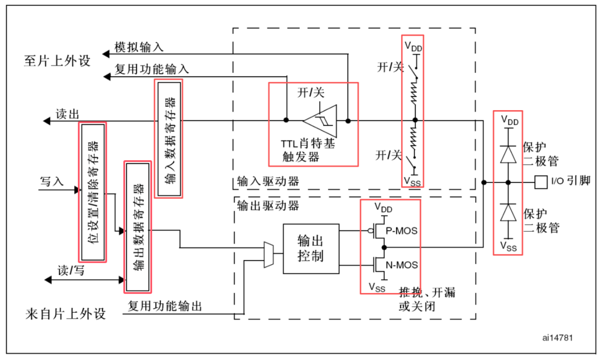
1. **保护二极管**：当瞬间电压进入I/O引脚时，若此电压大于VDD(3.3V)，则上方的保护二极管导通。
    ​ 当瞬间电压小于VSS(0V)，下方保护二极管导通。
    ​ 若输入电压在0~3.3V之间，那么2个二极管均不会导通。
    此结构只能抵御一瞬间的电压波动，长时间高电压接入I/O口依旧会损坏芯片。
    
2. **上拉/下拉电阻输入** ：为悬空的输入引脚提供一个**默认的稳定电平**。
    上拉 (P-UP) ： 内部电阻将其连接到 VDD，使默认电平为高电平。
    下拉 (P-DOWN) ： 内部电阻将其连接到 VSS，使默认电平为低电平。
    
3. **施密特触发器/TTL肖特基触发器**：电压比较器，有效消除输入信号中的噪声和抖动。高于上限输出高，低于上限输出低。
    
4. **输入数据寄存器-IDR** Input Data Register：存储施密特触发器输出的电平值（0或1），CPU 通过读取IDR得知引脚电平。
    
5. **输出数据寄存器-ODR** Output Data Register)：存储引脚期望的输出电平，ODR 的值会直接控制P-MOS 和 N-MOS，CPU **读取 ODR** 读取“期望的输出值”，而非“引脚的实际电平”。
    
6. **位设置/清除寄存器-BSRR** Bit Set/Reset Register：快速地设置或清除 ODR 中的某一位。
    
7. **N-MOS和P-MOS**：
	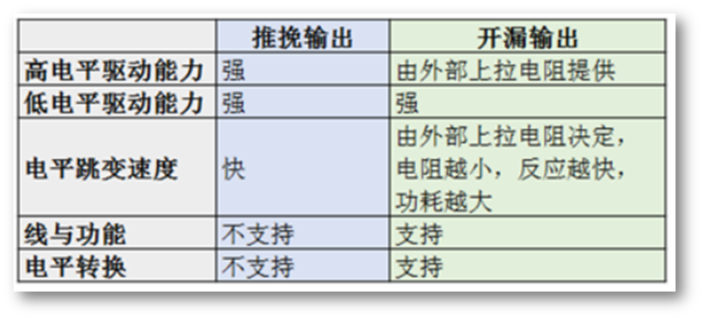
    ​ 在**推挽模式**下，STM32对IO口输出有绝对的控制权
    ​ 输出数据寄存器为1，P-MOS激活，N-MOS断开，输出接入VDD，输出高电平；
    ​ 输出数据寄存器为0，P-MOS断开，N-MOS激活，输出接入VSS，输出低电平；
    
    ​ 在**开漏模式**下，P-MOS管失效，只有N-MOS管工作
    ​ 输出数据寄存器为1，P-MOS无效，N-MOS关闭，GPIO引脚处于“高阻态”，输出电压由**外部电路**决定。
    ​ 输出数据寄存器为0，P-MOS无效，N-MOS导通，输出接入VSS，输出低电平；
    

> [!NOTE] 应用
>      开漏输出一般应用在
>      ① I2C、SMBUS 通讯等需要“线与”功能的总线电路中。
>      ②除此之外，还用在电平不匹配的场合，如需要输出 5 伏的高电平，就可以在外部接一个上拉电阻，上拉电源为 5 V，并且把引脚设置为开漏模式，当输出高阻态时，由上拉电阻和电源向外输出 5V电平，如右图所示。
>      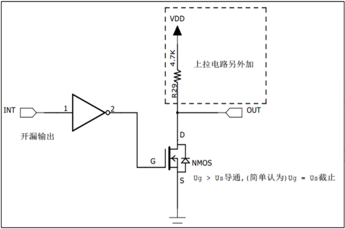

> [!NOTE]
>    “高阻态”：就是悬空，既不是高电平，也不是低电平，引脚上的电压未定义，易收到电磁信号的干扰。

### 1.定义
通用I/O：简称GPIO，是I/O的最基本形式。一般使用正逻辑，高电平对应数字信号“1”，低电平对应数字信号“0”
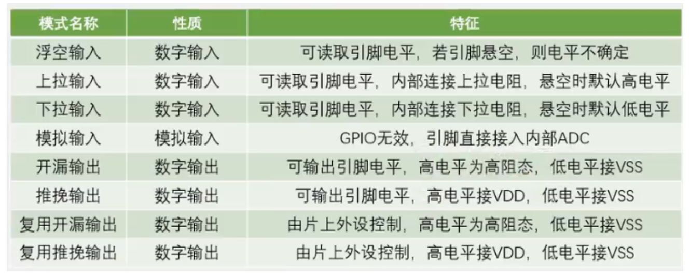
### 2.实战
#### 编程步骤：
第一步：使能GPIOx口的时钟  
第二步：指明GPIOx口的哪一位，这一位的速度大小以及模式。  
第三步：调用GPIOx口初始化函数，进行初始化。  
第四步：调用GPIO-SetBits函数，进行相应为的置位。
#### 函数一览
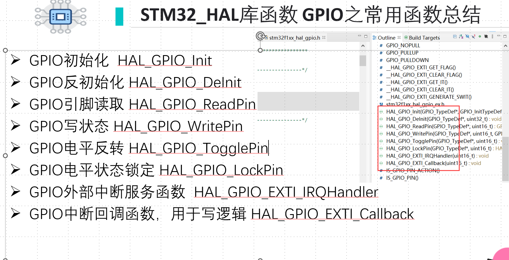
#### 实例如下：
**对于单个GPIO口的初始化如下**

```
```
```
```
```
GPIO_InitStructure.GPIO_Mode = GPIO_Mode_Out_PP; //设置为推挽输出
GPIO_InitStructure.GPIO_Speed = GPIO_Speed_50MHz; // IO口速度为50MHz
```
```
```
```
```
输出：
```
HAL_GPIO_WritePin(GPIOA, GPIO_PIN_5, GPIO_PIN_SET);//输出低电平
HAL_GPIO_TogglePin(GPIOA, GPIO_PIN_5);
//翻转电平
```
```
state = HAL_GPIO_ReadPin(GPIOC, GPIO_PIN_13);

```
```
```
```
RCC_APB2PeriphClockCmd(RCC_APB2Periph_GPIOE, ENABLE);
```
第三步：调用GPIOA口初始化函数，进行初始化。
第四步：调用GPIO-SetBits函数，进行相应为的置位。
把第二、三、四步合并分别设置GPIOA和GPIOE
先设置GPIOA
```
GPIO_InitStructure.GPIO_Mode = GPIO_Mode_Out_PP; //设置为推挽输出
GPIO_InitStructure.GPIO_Speed = GPIO_Speed_50MHz; // IO口速度为50MHz
GPIO_Init(GPIOA,&GPIO-InitST); //根据设定参数初始化GPIOA
GPIO_SetBits(GPIOA,GPIO_Pin_4); //输出高
```
```
GPIO_InitStructure.GPIO_Mode = GPIO_Mode_Out_PP; //设置为推挽输出
GPIO_InitStructure.GPIO_Speed = GPIO_Speed_50MHz; // IO口速度为50MHz
GPIO_Init(GPIOE,&GPIO-InitST); //根据设定参数初始化GPIOE
GPIO_SetBits(GPIOE,GPIO_Pin_3); //输出高
```
配置终端触发方式（上升沿/下降沿/双边沿）
```
```
```
HAL_NVIC_EnableIRQ(EXTI15_10_IRQn);
```
```
{
    if (GPIO_Pin == GPIO_PIN_13)
    {
        // 按键响应代码
    }
}

```
​ (1)、在STM32内部为了省电，所有外设（GPIO、USART、TIM…）默认是“关机”状态，即时钟被关闭。第一步永远是打开这个部门的电源（时钟）。
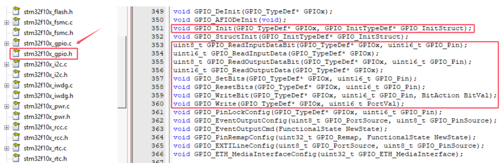                                        
_GPIO 配置与操作函数_
```
```
> [!NOTE] GPIO_Init(**GPIOA**, &GPIO_InitStruct) **为什么第一个参数实际填写`GPIOA`而不是`&GPIOA`
> 在 `stm32f10x.h`头文件中，有这样一行定义：`#define GPIOA ((GPIO_TypeDef *) 0x40010800)`所以 `GPIOA`本身已经是一个**指针**，它不是一个变量，而是一个宏定义 ，它代表的就是一个地址。

（2）、这些参数在`stm32f10x_gpio.h`头文件搜索
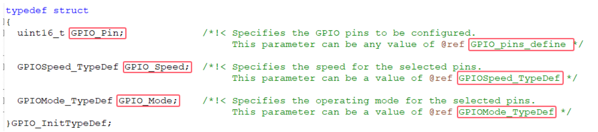
_GPIO初始化结构体_
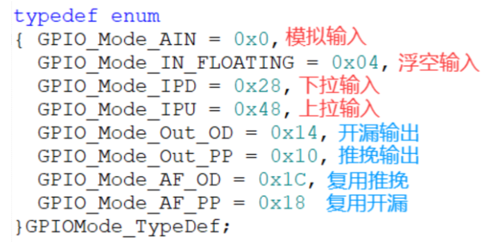
_GPIO模式_
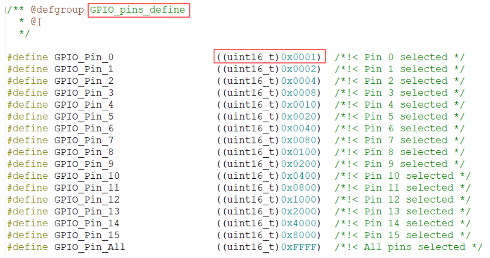
_GPIO引脚宏定义_
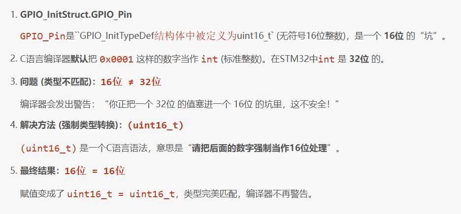
### 3、stm32寄存器与c语言
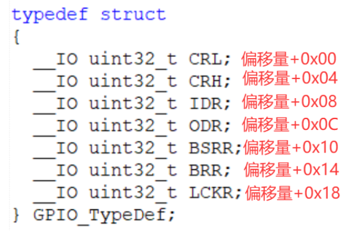
1. **核心原理：** STM32中**每一个硬件寄存器**（ODR, IDR…）都对应一个**固定的物理内存地址**。CPU 通过读写**固定的物理内存地址**来控制硬件（寄存器）。

2. **基地址 (Base Address)：**
	- 每个**外设**（如 `GPIOA`）都有一个起始地址。
	- `GPIOA` 基地址 = `0x40010800`
	- `GPIOB` 基地址 = `0x40010C00`
3. **`GPIO_TypeDef` 结构体：**
	- 它是一个C语言的 **“地图”** ，**定义了**`GPIOA` 内部所有寄存器（`CRL`, `CRH`, `IDR`, `ODR`…）的**排列顺序和偏移量**。

4. **偏移地址 (Offset)：**
	- 寄存器在“地图”上相对于基地址的位置。
	- 因为寄存器大多是 `uint32_t`（4字节），所以偏移量是 `0x00`, `0x04`, `0x08`…
	- `ODR` 寄存器的偏移量 = `0x0C`

5. **绝对地址 (Absolute Address)：**
	- 绝对地址 = 基地址 + 偏移地址
	- **举例 (GPIOA 的 ODR)：**`0x40010800` (GPIOA 基地址) + `0x0C` (ODR 偏移量) = `0x4001080C`

6. **C 代码翻译：**
    - **C 代码：**`GPIOA->ODR = 0x0001;`
    - **`GPIOA`** 是一个指向基地址 `0x40010800` 的**指针** ：**#define GPIOA ((GPIO_TypeDef *)GPIOA_BASE)**
    - [**->ODR**](https://www.cnblogs.com/jzssuanfa/%E5%B5%8C%E5%85%A5%E5%BC%8F/%E5%B5%8C%E5%85%A5%E5%BC%8F%E7%AC%94%E8%AE%B0.md#c-rule)是C语言语法，告诉编译器去 `GPIO_TypeDef`**结构体**“地图”上查找 `ODR` 的偏移量（`0x0C`）。
    - **编译器操作：** 生成机器码，将 `0x0001` 这个值，写入到最终的绝对地址 `0x4001080C`。


> [!NOTE] Title
> 个人理解：**STM32 正是利用了 `struct` 结构体能自动处理偏移量的特性，来满足了访问硬件寄存器时“基地址 + 偏移地址”的需求。**

 **`GPIOA`**：获取**基地址** (`0x40010800`)。
`ODR`：查找 `ODR` 成员对应的**偏移地址** (`0x0C`)。
= 0x0001：将值 `0x0001` 写入到算出来的**绝对地址** (`0x40010800 + 0x0C = 0x4001080C`) 中。
```
```
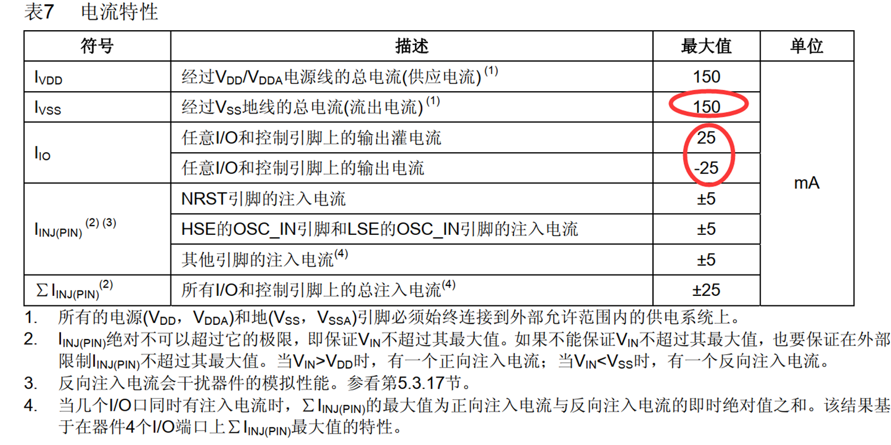
#### 1. 单个 GPIO 引脚电流限制

- 常见 MCU（如 STM32）：
    - **最大电流**：≈ 20 mA
    - **推荐工作电流**：**2 ~ 8 mA**      
> 超过推荐值可能导致：
> - IO 发热
> - 电平不稳   
> - 长期可靠性下降
#### 2. MCU 总电流限制
- 多个 GPIO 同时工作时，**总电流也有限制**
- 典型值（以 STM32 为例）：
    - 所有 GPIO 累计电流：≈ **120 ~ 150 mA**
> 常见问题：
> - 单个 LED 正常   
> - 多个 LED 同时点亮 → 芯片异常
### 3. GPIO 高低电平驱动能力不同
- 输出高电平：**拉电流（Source）**
- 输出低电平：**灌电流（Sink）**
- 两者能力 **通常不对称**
#### 二、拉电流（Source Current）
**拉电流**：  
GPIO 输出 **高电平** 时，**向外部负载提供电流** 的能力。

##### 三、灌电流（Sink Current）
**灌电流**：  
GPIO 输出 **低电平** 时，**从外部负载吸收电流** 的能力。
### 四、拉电流 vs 灌电流

|对比项|拉电流|灌电流|
|---|---|---|
|GPIO 电平|高电平|低电平|
|电流方向|GPIO → 负载|负载 → GPIO|
|驱动能力|较弱|**较强（推荐）**|
|工程常用|少|**多**|

> **工程经验**：  
> MCU 的 **灌电流能力通常强于拉电流能力**

参考：https://www.cnblogs.com/jzssuanfa/p/19339924#_68


