---

本文主要参考https://blog.csdn.net/qq_36347513/article/details/121474727
修正了部分错误，加入了自己的一部分注释
### 一、简介
蜂鸣器是一种一体化结构的电子讯响器，采用直流电压供电，广泛应用于计算机、打印机、复印机、报警器、电子玩具、汽车电子设备、电话机、定时器等电子产品中作发声器件。蜂鸣器主要分为**压电式蜂鸣器**和**电磁式蜂鸣器**两种类型。蜂鸣器在电路中用字母“H”或“HA”（旧标准用“FM”、“ZZG”、“LB”、“JD”等）表示。
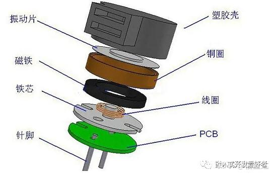
### 二、符号
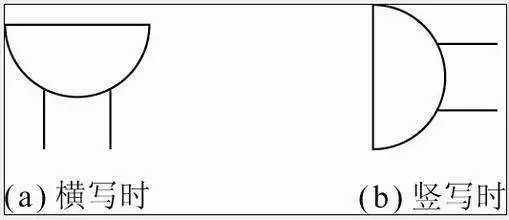

### 三、分类
按其驱动方式的原理分，可分为：
**有源蜂鸣器**（内含驱动线路，也叫自激式蜂鸣器）
**无源蜂鸣器**（外部驱动，也叫他激式蜂鸣器）；

#### 3.1 有源蜂鸣器和无源蜂鸣器区别
注意：这里的“源”不是指电源，而是指震荡源。也就是说，**有源蜂鸣器内部带震荡源，所以只要一通电就会叫**；**而无源内部不带震荡源，所以如果用直流信号无法令其鸣叫。必须用2K-5K的方波去驱动它**。有源蜂鸣器往往比无源的贵，就是因为里面多个震荡电路。

有源蜂鸣器的优点是：
		程序控制方便。
无源蜂鸣器的优点是：
		便宜
		声音频率可控，可以做出“多来米发索拉西”的效果
		在一些特例中，可以和LED复用一个控制口
#### 3.2 有源蜂鸣器和无源蜂鸣器区分
有源蜂鸣器有贴纸，无源没有贴纸
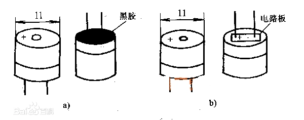
a、b外观上看，两种蜂鸣器好像一样，但仔细看，两者的高度略有区别，**有源蜂鸣器a**，高度为9mm，而**无源蜂鸣器b**的高度为8mm。如将两种蜂鸣器的引脚都朝上放置时，**可以看出有绿色电路板的一种是无源蜂鸣器**，没有电路板而用黑胶封闭的一种是有源蜂鸣器。

### 四、工作原理
无源他激型蜂鸣器的工作发声原理是：**方波信号输入谐振装置转换为声音信号输出，无源他激型蜂鸣器的工作发声原理图如图**：
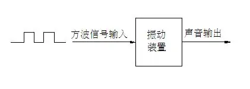
有源自激型蜂鸣器的工作发声原理是：**直流电源输入经过振荡系统的放大取样电路在谐振装置作用下产生声音信号，有源自激型蜂鸣器的工作发声原理图如图：**
==给有源蜂鸣器加pwm会发出粗糙 / 发抖 / 发闷的声音！！因为断断续续地供电，但不会改变频率（试过）==
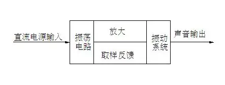
### 五、主要参数
#### 工作电压：
电磁式蜂鸣器从1.5到24V；
压电式蜂鸣器从3V到220V都是可行的，但一般压电的还是建议有9V以上的电压，以获得较大的声音。
#### 消耗电流：
电磁式蜂鸣器的依电压的不同，从几十到上百毫安培都有；
压电式蜂鸣器的就省电的多，几毫安培就可以正常的动作，且在蜂鸣器启动时，瞬间需消耗约三倍的电流。
#### 驱动方式：
二种蜂鸣器都有自激式的，只要接上直流电(DC)即可发声，因为已内建了驱动线路在蜂鸣器中了，因为动作原理的不同，
电磁式蜂鸣器要用1/2方波来驱动；
压电式蜂鸣器的用方波,才能有较好的声音输出。
#### 尺寸：
蜂鸣器的尺寸会影响到音量的大小，频率的高低，
电磁式蜂鸣器的最小从7mm到最大的25mm；
压电式蜂鸣器的从12mm到50mm或更大都有。
#### 连接方式：
一般常见的有插针(DIP)，焊线(Wire)，贴片(SMD)，压电式大颗的还有锁螺丝的方式。
#### 音压：
蜂鸣器常以10cm的距离做为测试的标准，距离增加一倍，大概会衰减6dB，反之距离缩短一倍则会增加6dB，
电磁式蜂鸣器大约能达到85dB / 10cm的水准；
压电式蜂鸣器就可以做的很大声，常见的警报器，大都是以压电蜂鸣器制成。
### 六、驱动电路
##### 6.1 基本构成
由于蜂鸣器的**工作电流一般比较大**，以致于==单片机的I/O 口是无法直接驱动的==（但AVR可以驱动小功率蜂鸣器），==所以要利用放大电路来驱动==，一般使用==三极管来放大电流==就可以了。

蜂鸣器驱动电路一般都包含以下几个部分：一个三极管、一个蜂鸣器、一个续流二极管和一个电源滤波电容。
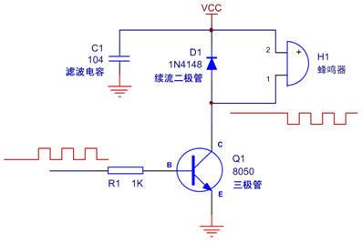
（少一个下拉电阻！）
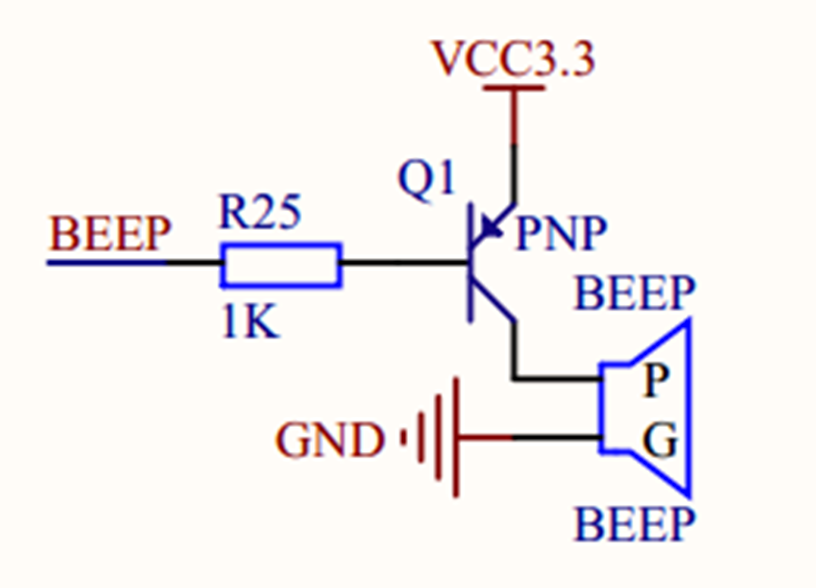
##### 蜂鸣器：
发声元件，在其两端施加直流电压（有源蜂鸣器）或者方波（无源蜂鸣器）就可以发声，其主要参数是外形尺寸、发声方向、工作电压、工作频率、工作电流、驱动方式（直流/方波）等。这些都可以根据需要来选择。
##### 续流二极管：
蜂鸣器本质上是一个感性元件，其电流不能瞬变，因此必须有一个续流二极管提供续流。否则，在蜂鸣器两端会产生几十伏的尖峰电压==（控制压降！！）==，可能损坏驱动三极管，并干扰整个电路系统的其它部分。
##### 滤波电容：
滤波电容C1的作用是滤波，滤除蜂鸣器电流对其它部分的影响，也可改善电源的交流阻抗，如果可能，最好是再并联一个220uF的电解电容。
##### 三极管：
三极管Q1起开关作用，其==基极的高电平==使三极管==饱和导通==，使蜂鸣器发声；而==基极低电平==则使==三极管关闭==，蜂鸣器停止发声。
#### 6.2 NPN型三极管控制蜂鸣器
##### 6.2.1 常规设计
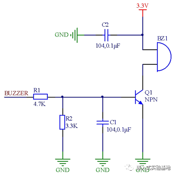

**电阻R1** 
	为限流电阻，防止流过基极电流过大损坏三极管。
**电阻R2** 有两个重要作用：
	**1.相当于基极的下拉电阻。**==（太小了吧！！感觉不合理啊，下拉电阻应该远大于限流）==
	如果A端被悬空则由于R2的存在能够使三极管保持在可靠的关断状态（在电路关断时，因为三极管有结间电容，三极管be段端电压由0.7V缓慢下降，三极管没有完全关断，且处较于长时间放大状态，会损坏三极管）。如果删除R2则当BUZZER输入端悬空时则易受到干扰而可能导致三极管状态发生意外翻转或进入不期望的放大状态，造成蜂鸣器意外发声。所以加个下拉电阻，进行放电。
	**2.提升高电平的门槛电压。**
	如果删除R2，则三极管的高电平门槛电压就只有0.7V，即A端输入电压只要超过0.7V 就有可能导通，添加R2的情况就不同了，当从A端输入电压达到约2.2V 时三极管才会饱和导通，具体计算过程如下：

> [!NOTE]
> 假定β =120为晶体管参数的最小值，蜂鸣器导通电流是15mA。那么集电极电流IC=15mA。则三极管刚刚达到饱和导通时的基极电流是 IB=15mA/120=0.125mA。流经R2的电流是0.7V/3.3kΩ=0.212mA，流经R1的电流 IR1=0.212mA +0.125mA=0.337 mA。最后算出BUZZER端的门槛电压是0.7V+0.337mA× 4.7kΩ=2.2839V≈2.3V。

**电容C1** 
	可以在有强干扰环境下，有效的滤除干扰信号，避免蜂鸣器变音和意外发声，在 RFID射频通讯、Mifare卡的应用时，这里初步选用0.1uF 的电容，具体可以根据实际情况选择。
**电容C2**
	为电源滤波电容，滤除电源高频杂波。
##### 6.2.2 改进设计1
在 NPN 3.3V 控制有源蜂鸣器时，在电路的 BUZZER 输入高电平，让蜂鸣器鸣叫，检测蜂鸣器输入管脚（NPN 三极管的C极处信号，**发现蜂鸣器在发声时，向外发生1.87KHz，-2.91V 的脉冲信号。**
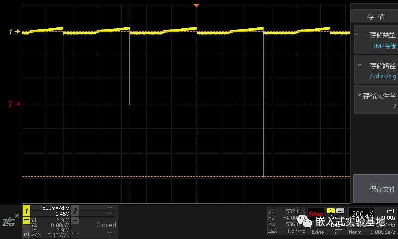
**为此我们可以考虑增加滤波电容将脉冲信号滤除**。在有源蜂鸣器的两端添加一个104的滤波电容C3，脉冲信号削减到-110mV，如下图所示，但顶部信号由于电容充电过慢，有点延时。
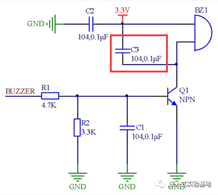
##### 6.2.3 改进设计2
**蜂鸣器本质上是一个感性元件，其电流不能瞬变**，因此必须有一个续流二极管D1提供续流。否则，在蜂鸣器两端会有反向感应电动势，产生几十伏的尖峰电压，可能损坏驱动三极管，并干扰整个电路系统的其它部分。而如果电路中工作电压较大，要使用耐压值较大的二极管，而如果电路工作频率高，则要选用高速的二极管
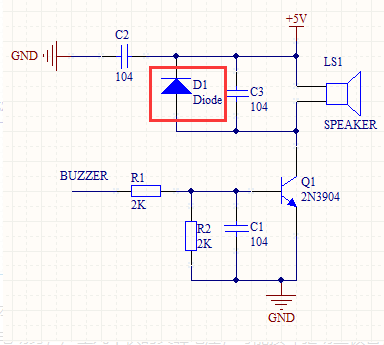

#### 6.3 PNP型三极管控制蜂鸣器
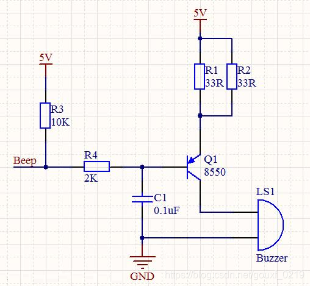

**●当网络节点Beep为高电平时，三极管Q1截止，蜂鸣器无电流，不响。**
**●当网络节点Beep为低电平时，三极管Q1导通，蜂鸣器有电流，会响。**

●**电阻R1,R2 是蜂鸣器的限流电阻**，这是很常见的一种安装方法，主要起到两个作用：
1.是这两个电阻并联一起，可以分流，使每个电阻上的的热量不会超过它的额定功耗，保证电阻寿命；
2.是方便调试。在一个电阻功率都能满足的情况下，如果要增加蜂鸣器响度，只需再并联一个电阻就行，而不需要重新拆下原来的电阻，调试方便。同时在选取不到合适电阻时，也可以用并联方式来解决。
●电阻R3 为上拉电阻，目的为了在Beep节点悬空时，三极管Q1的基极有一个稳定的高电平。
●电阻R4 为限流电阻，防止流过基极电流过大损坏三极管。
●电容C1 为滤波电容，对刺耳的高频信号能起到旁路作用。
三极管Q1 起开关管的作用，控制蜂鸣器。
#### 6.4 常见错误接法
**第一种典型的错误接法**
当 BUZZER 端输入高电平时蜂鸣器不响或响声太小。当 I/O 口为高电平时，基极电压为 （3.3/8）x3.3V≈1.36V。由于三极管的压降 0.6~0.7V，则三极管射 极电压为1.36-0.7=0.66V，驱动电压太低导致蜂鸣器无法驱动或者响声很小。
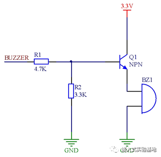
**第二种典型的错误接法**
由于上拉电阻R2，BUZZER 端在输出低电平时，由于 电阻R1和R2的分压作用，三极管不能可靠关断。
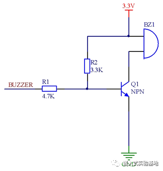
**第三种典型的错误接法**
三极管的高电平门槛电压就只有 0.7V，即在 BUZZER 端输入 压只要超过0.7V就有可能使三极管导通，显然0.7V的门槛电压对于数字电路来说太低了， 电磁干扰的环境下，很容易造成蜂鸣器鸣叫。
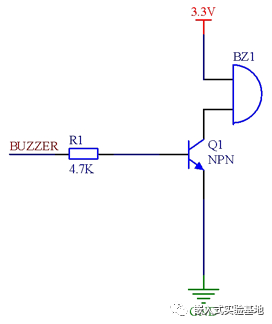

