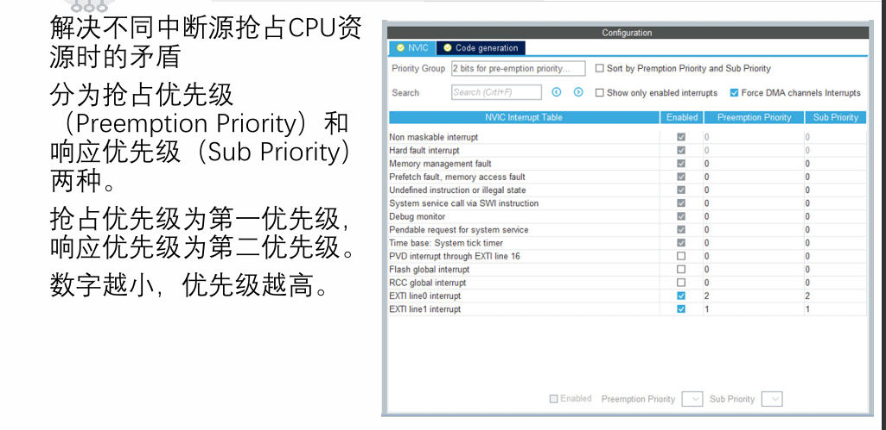
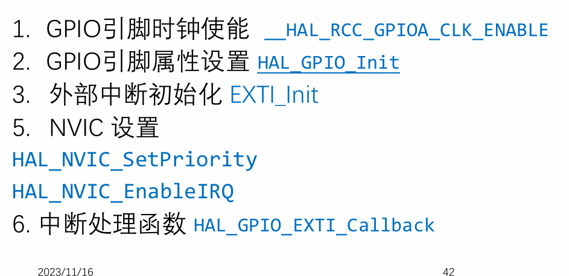

---

中断只整理部分概念，具体应用应当归类到各部分单独
### 一、中断的分类
异常包括：系统异常和外部中断。 也叫做 内中断和外中断
STM32中断分为两大类，通过中断向量表管理（参考《STM32F10x-中文参考手册》第九章“中断和事件”）：
- **系统异常（内中断）**：由内核本身触发，共1个。例如：
    - 复位中断（Reset）：优先级最高，芯片复位时触发。
    - 系统滴答定时器中断（SysTick）：用于操作系统时基。
    - 硬件错误中断（HardFault）：如内存访问错误。
    - 非屏蔽中断（NMI）：不可被屏蔽，用于紧急事件。
        
- **外部中断**：由片上外设外设触发，共60个。例如：
    - GPIO引脚变化中断（通过EXTI线）：如按键按下。
    - 串口（USART）发送/接收完成中断。
    - 定时器（TIM）溢出或捕获中断。
    - ADC转换完成中断。

### 二、中断优先级

|情况|结果|
|---|---|
|抢占优先级更高|✔ 可以打断|
|抢占优先级相同、子优先级更高|❌ 不能打断，只会排队优先执行|
### 三、中断设置步骤

