---

参考：https://www.cnblogs.com/wzzkaifa/p/19031126#%E4%B8%80%E3%80%81%E9%80%9A%E4%BF%A1%E6%8E%A5%E5%8F%A3
## 一、通信接口分类

| **名称** | **引脚**                | **双工**  | **时钟** | **电平** | **设备** |
| ------ | --------------------- | ------- | ------ | ------ | ------ |
| USART  | TX、RX                 | ==全双工== | 异步     | 单端     | 点对点    |
| I2C    | **SCL**、SDA           | 半双工     | 同步     | 单端     | 多设备    |
| SPI    | **SCLK**、MOSI、MISO、CS | ==全双工== | 同步     | 单端     | 多设备    |
| CAN    | CAN_H、CAN_L           | 半双工     | 异步     | 差分     | 多设备    |
| USB    | DP、DM                 | 半双工     | 异步     | 差分     | 点对点    |
#### 细分：
- **UART (Universal Asynchronous Receiver/Transmitter): 最基础的点对点串行协议。像两个人面对面聊天。**

> **TX (Transmit)**： 发数据的引脚。STM32的嘴巴。
> 
> **RX (Receive)：** 收数据的引脚。STM32的耳朵。
> 
> **(可选) RTS/CTS**: 硬件流控引脚，用于协调发送速度（防止数据淹没对方）。
> 
> （uart是通用异步收/发器，usart通用同步/异步收/发器，相较于UART多一个时钟输出，无时钟输入）

- **I2C (Inter-Integrated Circuit): 多设备共享“总线”的低速串行协议。像一个小组讨论，大家共用一条电话线，靠“名字”（地址）区分。**

> **SCL (Serial Clock)：** 时钟线。由主设备产生，像打拍子指挥节奏。大家共用。
> 
> **SDA (Serial Data)：** 数据线。主从设备都通过它收发数据。大家共用。
> 
> 注意： I2C总线需要上拉电阻（通常4.7KΩ）连接到电源（3.3V），让总线在空闲时保持高电平。

- **SPI (Serial Peripheral Interface): 高速全双工串行协议，通常点对点或点对少量设备。像两个人用两条专用电话线同时说和听。**

> **SCK (Serial Clock)：** 时钟线。由主设备产生，指挥节奏。
> 
> **MOSI (Master Out Slave In)：** 主设备发，从设备收的数据线。
> 
> **MISO (Master In Slave Out)：** 主设备收，从设备发的数据线。
> 
> **NSS / CS (Slave Select / Chip Select)：** 片选线。由主设备控制，低电平有效。拉低哪条线，就选中哪个从设备进行对话。主设备可以有多个CS引脚连接不同从设备。

- **USB (Universal Serial Bus): 复杂但强大的通用串行总线协议。**

> **DP (Data Positive)**
> 
> **DM (Data Negative)**
> 
> 专用差分信号线对，需要符合USB规范的硬件设计。

- **CAN (Controller Area Network): 主要用于汽车、工业的可靠网络协议。**

> **CAN_H (CAN High)**
> 
> **CAN_L (CAN Low)**
> 
> 专用差分信号线对，需要终端电阻(120Ω)。
 **通信方式：设备与设备之间的连接方式**

## 二、 通信方式：
### 1、串行并行
> **串行** ： 一根或几根线，一次传1个比特(bit)。 节省引脚，**适合远距离（相对并行）**，是主流。UART, I2C, SPI, USB, CAN都是串行。
> 
> **并行**： **多根线**（如8根, 16根），一次传多个比特(一个字节或字)。 速度快，但引脚占用多，线间干扰大，**距离短**。STM32内部总线常用，外部用得少了（如老式打印机接口）。
> 
> **有线** vs **无线**：STM32本身通常处理有线协议，无线（如WiFi, BLE）常通过额外模块（如ESP8266, HC-05）用UART/SPI连接STM32。
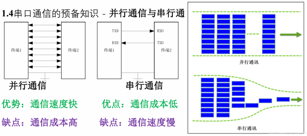
### 2、双工模式
- 比喻：对话的方向限制。是只能一方说（单工）？还是能轮流说（半双工）？还是能同时说和听（全双工）？
    
- ==**单工==： 数据只能单向流动**。例如：只读传感器、广播（电台发送，收音机只能接收）。STM32较少纯粹单工。
    
- ==**半双工==： 数据可以双向流动，但同一时间只能一个方向**。就像对讲机，说完“Over”才能听。I2C是半双工 (SDA线同一时刻只能一个设备驱动)。CAN也是半双工 (总线竞争)。
    
- ==**全双工==：数据可以同时双向流动。就像打电话，能边说边听**。UART、SPI是典型全双工 (有独立的TX/RX线或MOSI/MISO线)。注意： SPI虽然是物理全双工，但实际应用中，有时从设备在收到主设备命令前并不知道要发什么数据，所以主设备发的可能是命令，从设备发的可能是数据，看起来像半双工，但硬件上具备同时收发的能力。
    
### **1.3时钟特性**
- 比喻：对话的语速或节拍器。
    
- **同步通信 ： 通信双方共用同一个时钟信号来同步数据的发送和接收**。主设备提供时钟(SCK/SCL)，像指挥拍子。==SPI，I2C是同步通信==。（没有起始位，停止位！！）

> 优点： 速度快，**抗干扰**相对好（因为有时钟边沿采样）。
> 
> 缺点： 需要额外的时钟线。时钟频率限制通信距离。

- **异步通信**： 没有共享的时钟线。双方事先**约定好一个速度（==波特率==），依靠数据帧内部的==起始位、停止位==来同步每个字节。**==UART是异步通信==。

> 优点： 只需要两根数据线(TX/RX)，适合**远距离**（相对）。
> 
> 缺点： 需要精确的波特率发生器，双方波特率误差不能太大（通常<3%），速度相对同步通信慢。更容易受干扰（没有时钟边沿约束）。

- **波特率 (Baud Rate)：** 衡量异步通信速度的单位，表示每秒传输的符号数(1个符号通常代表1个比特bit)。常用值：9600, 19200, 38400, 115200等。波特率越高，速度越快，但对时钟精度和信号质量要求越高。
    
- **时钟频率 (SCK/SCL)：** 衡量同步通信速度的单位（Hz）。SPI可达几十MHz，I2C标准模式100KHz，快速模式400KHz，高速模式3.4MHz等。
    
### 4、信号传输方式
- **单端信号**
用1根信号线 + 公共地线（GND）传输数据。

> **逻辑状态**由信号线对地（GND）的电压差决定：
> 
> 逻辑1：信号线电压 > 高电平阈值（如3.3V系统为2.0V）
> 逻辑0：信号线电压 < 低电平阈值（如0.8V）
> 
> **通俗比喻**：像一个人用嗓门音量大小传递信息：
> 
> 大喊（高电平） = 1
> 小声（低电平） = 0
> 参考点是环境背景噪音（相当于GND）。

| 优点             | 缺点           |
| -------------- | ------------ |
| 电路简单，成本低（少1根线） | 抗干扰能力差       |
| 功耗较低           | 传输距离短（通常<1米） |
| 适合低速通信         | 地线噪声直接影响信号   |

- **差分信号**
用2根相位相反的信号线传输数据（无地线依赖）：

D+（正向信号线）
D-（反向信号线）

> **逻辑状态**由两根线之间的电压差决定：
> 
> 逻辑1：D+电压 - D-电压 > +阈值（如+200mV）
> 逻辑0：D+电压 - D-电压 < -阈值（如-200mV）
> 
> **通俗比喻**：像两个人用反义词对暗号：
> 
> A说“高”，B说“低” → 表示1
> A说“低”，B说“高” → 表示0> 
> 外界干扰同时影响两人（如噪音+10dB），但暗号差值不变。

| 优点            | 缺点         |
| ------------- | ---------- |
| 超强抗干扰（抑制共模噪声） | 电路复杂（多1根线） |
| 传输距离远（可达百米）   | 功耗较高       |
| 高速传输（GHz级）    | 成本更高       |
| 降低电磁辐射（EMI）   | 需阻抗匹配      |

**差异总结**

| 特性   | **单端信号**      | **差分信号**     |
| ---- | ------------- | ------------ |
| 信号线数 | 1根 + GND      | 2根（D+和D-）    |
| 抗干扰  | 弱（依赖GND质量）    | 极强（抵消共模噪声）   |
| 传输距离 | 短（<1米）        | 长（可达100米+）   |
| 速度   | 低速（通常<10Mbps） | 高速（可达Gbps）   |
| 成本   | 低             | 高（多1根线+专用芯片） |
| 噪声辐射 | 高（电流经地线形成环路）  | 低（磁场相互抵消）    |

### **1.5设备特性**
点对点：俩个设备直接传输数据
多设备：**需要寻址以确定通信对象**

## 三、串口通信
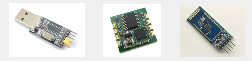
**USB转串口模块**:芯片型号CH340(将串口协议转换为USB协议),实现串口和电脑通信。
**陀螺仪传感器模块**：可测量角速度，加速度等姿态参数，左右各四个引脚，一边串口引脚，一边I2C引脚。
**蓝牙串口模块**：四个角是串口通信引脚，芯片可以和手机互联，实现手机遥控单片机功能
#### 硬件电路：
 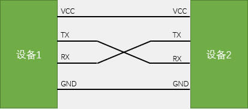
#### 电平标准
 电平标准是数据1和数据0的表达方式，是传输线缆中人为规定的电压与数据的对应关系，串口常用的电平标准有如下三种：

- **TTL电平：**+3.3V或+5V表示1，0V表示0
- **RS232电平：**-3~-15V表示1，+3~+15V表示0
一般在大型机器使用，由于环境可能恶劣，静电干扰较大，因此电瓶电压比较大，允许波动范围也大。
- **RS485电平：**两线压差+2~+6V表示1，-2~-6V表示0（差分信号）**
差分信号抗干扰能力强。其通信距离可达上千米。

(**TTL ↔ RS232：**必须使用电平转换芯片（如MAX3232）。)
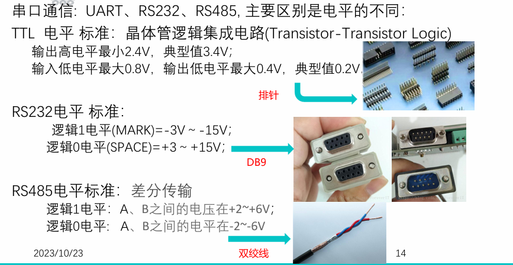
#### 串口参数
- **波特率**：串口通信的速率
> 	串口一般异步通信，需要双方确定通信速率（波特率，每秒传输码元的个数，二进制情况下，一个码元为一个比特，此时波特率=比特率）。
> 每位比特（bit）的持续时间 T = 1 / 波特率。
> 优先选用 11.0592MHz 晶振（可被常用波特率整除）
> 72MHz系统时钟下，9600波特率误差仅0.14%（推荐）
- **起始位**：标志一个数据帧的开始，固定为低电平
- **数据位**：数据帧的有效载荷，1为高电平，0为低电平，低位先行
> 若发送数据超过设定位数，高位会被截断。
- **校验位**：用于数据验证，根据数据位计算得来
> 三种方式：无校验，奇校验（数据位+校验位=奇数个1），偶校验
> 但是若俩个数据发送过程都出错，奇偶校验就检测不出来错误。
> 串口助手中，数据位为有效载荷，校验位是独立的1位
- **停止位**：用于数据帧间隔，固定为高电平

#### 串口数据帧整体结构（传输数据最小单位）
串口发送的字节格式，由串口协议规定。
串口每个字节都装载在一个数据帧，每个数据帧都由起始位，数据位和停止位组成。数据位8个代表一个字节8位。

**数据帧结构：**
**空闲态：**
- 通信未开始时，TX/RX线**保持高电平**（逻辑1）。

**起始位（Start Bit）：**
- 1个比特的**低电平**（0），向接收方宣告“数据开始传输！”
- 关键作用：实现帧同步（接收方检测到下降沿即启动计时）。

**数据位（Data Bits）：**

- 5~9个比特（通常选8位，兼容ASCII）
- 传输顺序：==LSB（最低位）先传！==  
    例如发送字符 'A' (0x41 = 二进制 01000001)：  
    实际传输顺序为 1→0→0→0→0→0→1→0（从D0到D7）

**校验位（Parity Bit）：**

- 可选，1个比特，用于检错（不能纠错）：
    - 奇校验（Odd）：数据位+校验位的“1”总数=奇数
    - 偶校验（Even）：数据位+校验位的“1”总数=偶数。

例：0x41 (01000001)有2个“1”（偶数），若用偶校验则校验位=0

**停止位（Stop Bit）：**

- 1~2个比特的**高电平**（1） ，表示“本帧结束”
- 强制拉高，为下一帧起始位的下降沿做准备。

###### 数据位8位，无校验位：
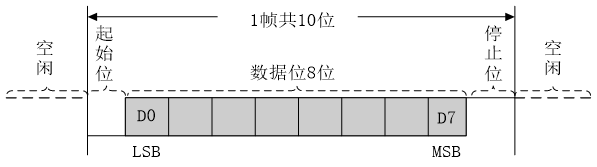
###### 数据位9位，有校验位：
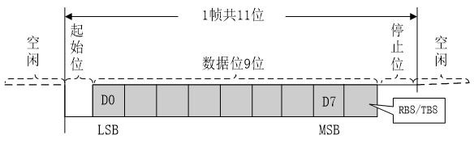

###### **串口通信实际波形**：
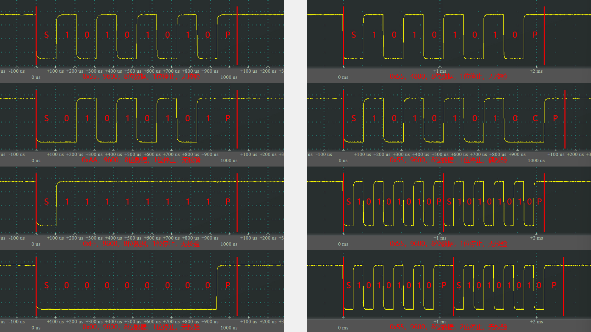
1000 000us/9600 ≈104us，所以为9600波特率（9600bits/s）
#### 上面的都是异步：
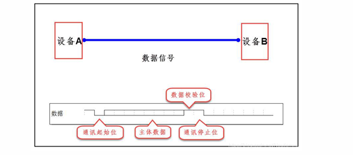

## 四、USART
- USART（Universal Synchronous/Asynchronous Receiver/Transmitter）通用同步/异步收发器

> 相较于UART模式，多一个时钟输出。> 
> USART=UART+同步通信扩展功能

USART 与 UART 的本质区别

| 特性      | **UART**   | **USART**       |
| ------- | ---------- | --------------- |
| 通信模式    | 仅异步        | 同步 + 异步         |
| 时钟线     | 无          | 同步模式需SCLK引脚     |
| 协议支持    | 基础串行协议     | 支持LIN、智能卡、IrDA等 |
| 硬件复杂度   | 简单         | 更复杂（寄存器更多）      |
| STM32资源 | 部分型号仅有UART | 主流型号均有USART     |

- USART是STM32内部集成的硬件外设，可根据数据寄存器的一个字节数据自动生成数据帧时序，从TX引脚发送出去，也可自动接收RX引脚的数据帧时序，拼接为一个字节数据，存放在数据寄存器里
- 自带波特率发生器，最高达4.5Mbits/s
> 波特率发生器相当于一个分频器。比如APB2总线72MHz，波特率发生器极性分频，得到波特率时钟（通信波特率），在此时钟下进行接收发送波形。波特率常用9600和115200.

- 可配置数据位长度（8/9）、停止位长度（0.5/1/1.5/2）
- 可选校验位（无校验/奇校验/偶校验）
- 支持同步模式、硬件流控制、DMA、智能卡、IrDA、LIN
- **STM32F103C8T6****USART****资源：** **USART1****（APB****2****）、** **USART2****、** **USART3**

#### 3.2USART六大高级功能
**1.多处理器通信（地址标记）**
- 用途：一主多从通信（类似I2C寻址）
- 原理：
发送特殊地址帧唤醒目标从机
从机忽略非自身地址的数据帧
- 配置：USART_CR2 寄存器的 ADD0~3 设置自身地址
    
**2. 硬件流控（RTS/CTS）**
- 引脚：
RTS：输出，指示“本机准备好接收”
CTS：输入，检测“对方是否允许发送”
- 作用：防止接收缓存溢出（尤其高速传输）

**3. LIN总线支持**
- LIN Break检测：自动识别13位低电平起始符
- 同步场生成：硬件自动发送 0x55 同步字节
- 配置：USART_CR2 寄存器的 LINEN 使能

**4. 智能卡模式（ISO 7816）**
- 支持T=0/T=1协议（SIM卡、金融IC卡）
- 自动生成ETU（Elementary Time Unit）时钟
- 硬件校验奇偶错误并重传

**5. IrDA红外编码**
- 内置编解码器：将数据转为3/16位脉宽红外信号
- 支持SIR（115.2kbps）和MIR（1.152Mbps）速率

**6. DMA联动**
- 解放CPU：自动搬运大量数据到USART缓存

### **USART框图**
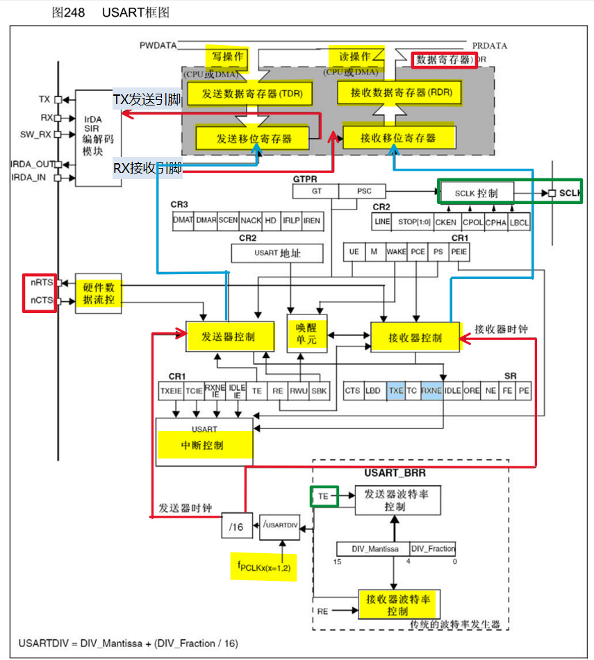

### **STM32_USART寄存器精要**

| 寄存器       | 作用                               | 关键位域                            |
| --------- | -------------------------------- | ------------------------------- |
| USART_SR  | 状态寄存器                            | RXNE(接收缓存非空), TC(发送完成), PE(校验错) |
| USART_DR  | 数据寄存器（读写合一）<br><br>（TDR发送+RDR接收） | 写入数据启动发送，读取获取数据                 |
| USART_BRR | 波特率寄存器（16位）                      | 存储 USARTDIV 值                   |
| USART_CR1 | 控制寄存器1                           | UE(使能), M(字长), PCE(校验使能)        |
| USART_CR2 | 控制寄存器2                           | STOP(停止位), CLKEN(同步时钟使能)        |
两个数据寄存器——**发送数据寄存器** **TDR**（Transmit DR）和**接收数据寄存器** **RDR**（Receive DR）。两个寄存器占用同一个地址（与51单片机串口的SBUF寄存器相似）。
在程序上只表现为一个寄存器——**数据寄存器** **DR**。但实际硬件中是分成两个寄存器，一个用于发送TDR，一个用于接收RDR。TDR只写，RDR只读。当进行写操作时，数据就写到TDR，当进行读操作时，数据就从RDR读出。

#### **发送数据流程**
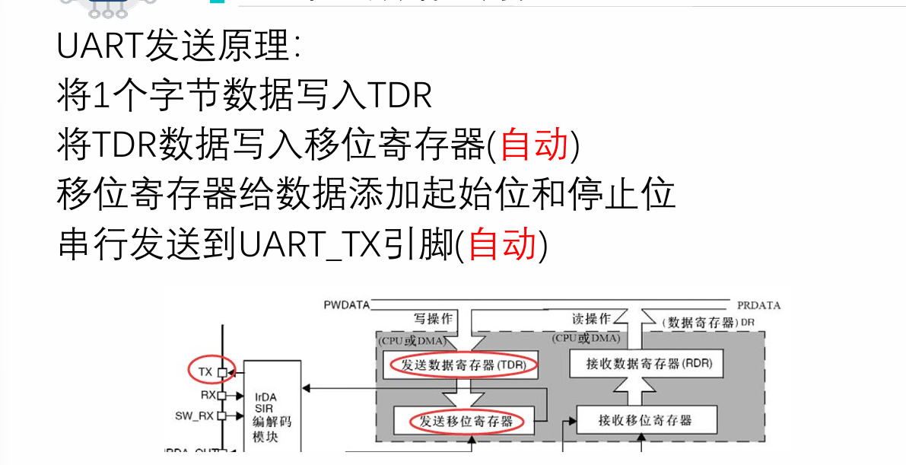
**发送数据寄存器TDR**：类似于快递站“打包台”（临时存放待发送的快递）
**发送移位寄存器**：快递站的“传送带”（把包裹逐个送出）

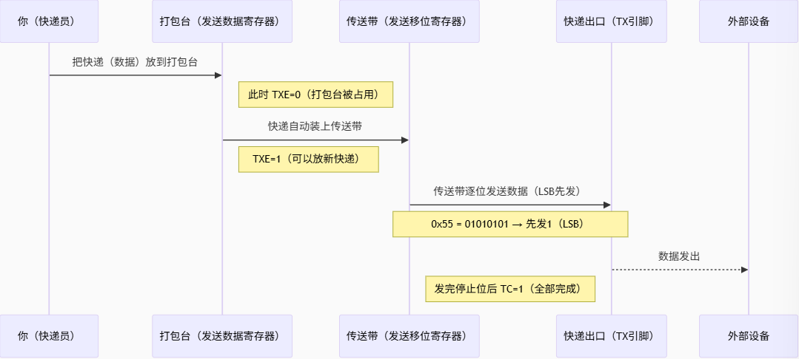
**关键状态标志位（USART_** **SR寄存器）**
**TXE（Transmit Data Register Empty）：**
- TXE=1：打包台空着，可以放新快递（CPU可写入新数据）
    - TXE=1：TDR为空（数据已转移到移位寄存器），可写入新数据
    - 写入USART_DR后自动清零
- TXE=0：打包台被占用（正在发送）

**TC（Transmission Complete）：**
- TC=1：所有快递已发出（包括最后的包装盒——停止位）
    - TC=1：移位寄存器发送完毕（包括停止位），一帧完成
    - 读SR寄存器 + 写USART_DR可清零
- TC=0：还在发送中
- 移位寄存器：像传送带一样，把数据从低位到高位逐个比特推出去

**发送数据流程文字描述**:
在某时刻给TDR写入0x55，在寄存器中二进制存储0101 0101。此时，**硬件检测**到写入的数据并检查当前**移位寄存器**是否有数据正在移位。如果没有，0101 0101全部移动到发送移位寄存器，准备发送。

当数据从TDR移动到移位寄存器时，会置一个**标志位****TXE**（TX Empty），发送寄存器空。我们检查这个标志位，如果置1了，我们就可以在TDR写入下一个数据了。若TXE=1，数据没有发送，但是数据已经从TDR转移到发送移位寄存器，从而可写入新数据。此时，**发送移位寄存器**会在**发送器控制**的驱动下向右移位，一位一位地把数据输出到TX引脚。这里是向右移位的，正好和串口协议规定的低位先行一致。

数据移位完成后，新的数据会再次自动地从TDR转移到发送移位寄存器。如果当前移位寄存器移位还没有完成，TDR的数据就会进行等待，一旦移位完成，就会立刻转移过来。

TDR和移位寄存器的双重缓存，可保证在连续发送数据时，数据帧之间不会有空闲，提高工作效率。简单来说，**数据一旦从TDR转移到移位寄存器了，不管有没有移位完成，都立刻把下一个数据放在TDR里等着，一旦移位完成，新的数据就会立刻跟上。**

#### **接收数据流程**
**接收移位寄存器：** 快递站的“扫描仪”（逐个检查收到的快递）
**接收数据寄存器RDR：** 快递站的“暂存架”（存放已扫描的完整快递）
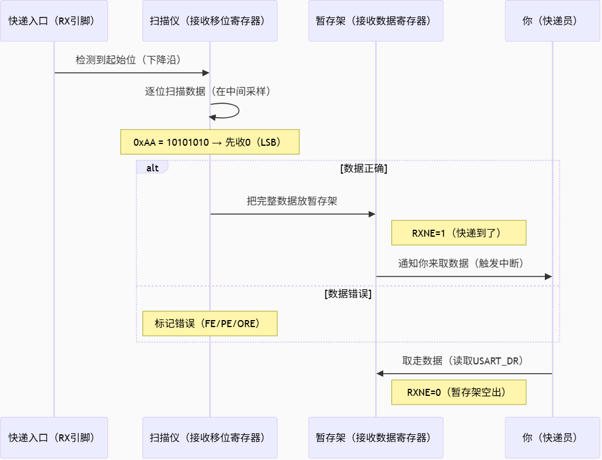

**关键状态标志位（USART_SR寄存器）**
**RXNE=1**：暂存架上有快递待取（CPU需及时读取）
移位寄存器：像扫描仪一样，从低位到高位逐个比特组装数据
错误处理：
- 停止位不对 → 标记为"破损快递"（帧错误FE）
- 暂存架未取又来新快递 → 标记"爆仓"（溢出错误ORE）
-
**发送数据流程文字描述**::
数据从RX引脚通向**接收移位寄存器**，在**接收器控制**的驱动下一位一位的读取RX电平，先放在最高位，然后往右移，移位八次之后就能接收一个字节。由于**串口协议规定低位先行**，因此接收移位器从高位往低位方向移动。当一个字节移位完成，一整个字节就会转移到接收数据寄存器RDR。在转移过程中产生**标志位RXNE**，接收数据寄存器非空。当RXNE=1时，可将数据读取。同样俩个寄存器进行缓存，当数据从移位寄存器转移到RDR时，可直接移位接收下一帧数据。

发送有帧头和帧尾，接收需要剔除它们，电路内部自动执行。

##### **常见问题：**

###### **Q1: 为什么发送时要先检查TXE？**

A：就像快递站——只有打包台空着（TXE=1），才能放新快递，否则会覆盖未处理的快递

###### **Q2: 数据为什么要从低位(LSB)开始传？**

A：就像写数字"123"——先写个位"3"，再十位"2"，最后百位"1"，接收方反过来组装即可还原

###### **Q3: 移位寄存器怎么知道何时停止？

A：根据配置的"数据位数"（如8位）——就像扫描仪知道快递单号有几位数字。

###### **Q4****：为什么发送时要用 **TXE** **和** **TC** **两个标志？**

TXE=1（打包台空着） 只表示可以放新数据到TDR，但可能还有数据在移位寄存器没发完。

TC=1 （所有快递发送完毕）表示所有数据（包括停止位）已经全部发出。

###### **Q5****：接收数据时为什么会丢数据？

原因1：CPU没有及时读取 USART_DR（导致 ORE 溢出错误）。

原因2：波特率不匹配（比如STM32设成115200，但对方发的是9600）。

解决方法：

- 使用DMA自动接收数据。
- 确保双方波特率一致。

###### **Q6****：发送和6接收能同时进行吗？

可以！ USART是 全双工 的，发送和接收完全独立（有各自的寄存器和引脚）。
## 五、代码
发送的信息都是&，表示都是地址
```
HAL_UART_Receive_IT(&huart1, &temp,1);
HAL_UART_Transmit(&huart1, &temp, 1, 0xffff);
```
（**串口收到字节**）RDR寄存器接收到一个字节数据 
**——》**
（**产生中断**）STM32 的 NVIC（嵌套向量中断控制器）响应 USART1 的中断请求，暂停当前任务，跳转到 USART1 对应的中断服务函数。
**——》**
（**USART1_IRQHandler**）作为 USART1 中断的 “入口”，仅负责调用 HAL 库的通用中断处理函数（不直接处理具体逻辑）
**——》**
（**HAL_UART_IRQHandler**）**HAL 库提供的 UART 通用中断处理函数**，读取 UART 的状态寄存器，判断当前中断的类型（是接收中断、发送中断还是错误中断），并分发给对应的处理分支 
**——》**
（**判断 “是不是接收中断？”**）：通过读取 UART 状态寄存器的 “接收数据寄存器非空” 标志位，确认当前中断是否由 “接收字节” 触发。
 **——》**
（**UART_Receive_IT**）读取接收数据寄存器中的字节、更新 “接收计数器”（用户提前设置的接收长度，每收 1 字节计数器减 1），同时配置下一次接收的中断（若还没接收完）
 **——》**
（**判断 “接收计数器为 0？”**）用户调用`HAL_UART_Receive_IT()`时指定的 “要接收的字节数”（比如要收 5 个字节，计数器初始值为 5，收 1 字节减 1）。

==UART_Receive_IT==：每收到若干个数据，调用一次回调函数；这是因为，每收到一个字节，都会把此函数的接收计数器-1，如果接收计数器为零，调用串口接收回调函数HAL_UART_RxCpltCallback。 
==HAL_UART_RxCpltCallback==：弱函数，在此函数中编写业务逻辑。
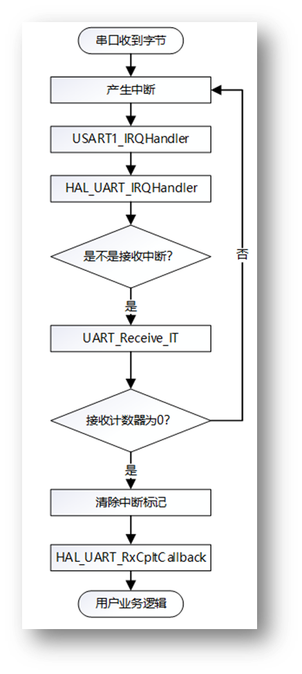
while外面
```
uint8_t rf=0;
uint8_t dat[1]={0xab};
//硬件初始化代码：
//启动一次中断接收
HAL_UART_Receive_IT(&huart1,dat,1);
```
```
  if(rf==1)
  {
  rf=0;
  x=dat[0];
//将x的高低字节交换
  dat[0]=(x<<4)|(x>>4);
//查询方式发送
  HAL_UART_Transmit(&huart1,dat,1,1);
//启动下一轮中断接收
  HAL_UART_Receive_IT(&huart1,dat,1);
  }
```
```
{
  if(huart==&huart1)
  {
  rf=1;
  }
}

```


