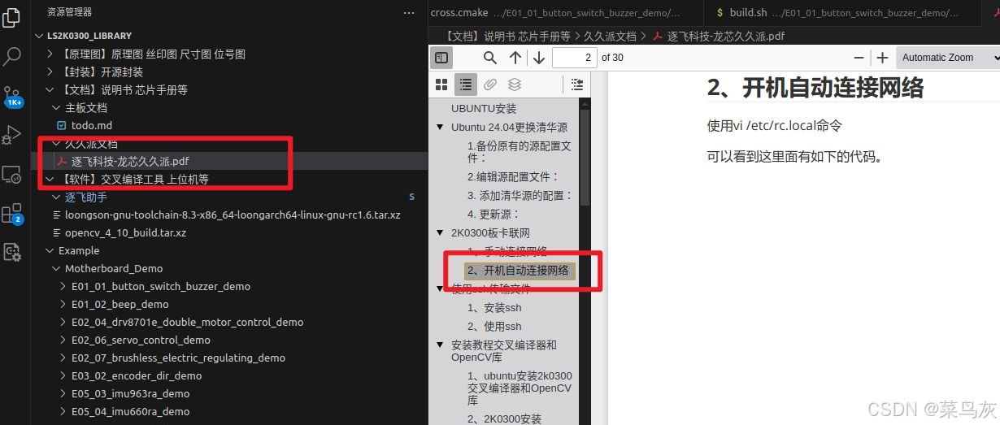
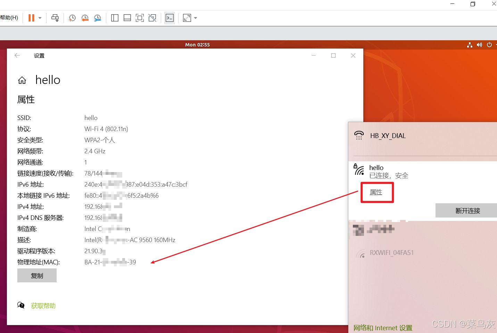
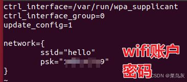
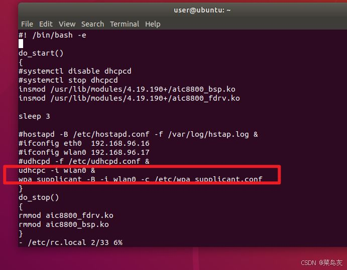
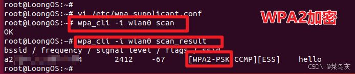
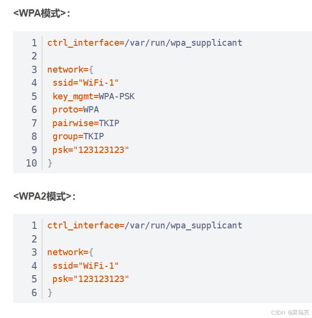
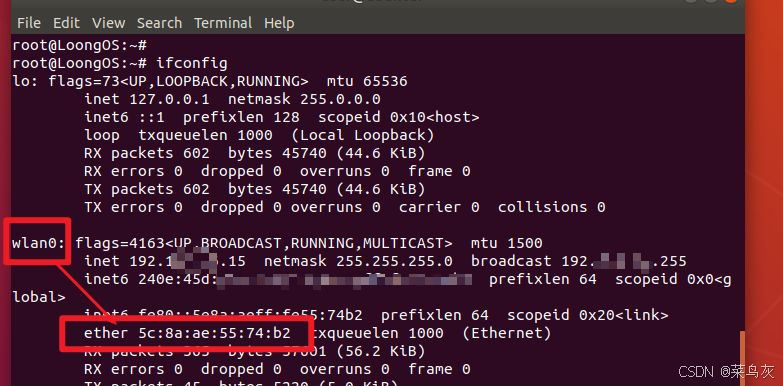
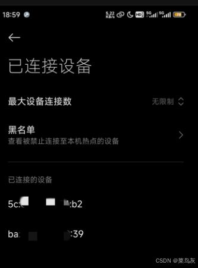
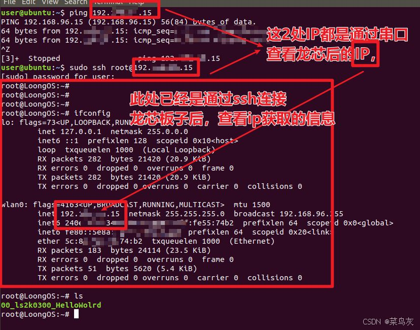
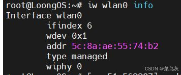

---

方法1：跟着逐飞教程可以实现的


方法2：（用于验证）
方法1和2，区别不大
1、开启手机热点
（1）让电脑和板子都连接手机热点，若都能连接，一般手机热点下，都会显示已连接热点的设备的MAC。
[Open: file-20250722172414215.png](龙芯2k3000%20联网.assets/958f7ad20e450f6496d26ec4a03ca61b_MD5.jpeg)

（2）电脑连接手机热点，会显示如下MAC
电脑MAC：
[Open: file-20250722172416973.png](龙芯2k3000%20联网.assets/d385272c6191517bb7e4e72d2fd059ce_MD5.jpeg)



2、使用USB转串口模块
使用TXD0、RX0、GND，另一端连接电脑

3、LS2K0300必要的配置
（1）配置wifi的账户密码和wifi的启动
```
vi /etc/wpa_supplicant.conf //配置wifi账户密码
```
[Open: file-20250722172440508.png](龙芯2k3000%20联网.assets/6779004429a90408f24c56aa198a03e4_MD5.jpeg)

配置龙芯板子（只需要添加红色处2行代码，其它部分，该注释的注释）

```
vi /etc/rc.local        接着按一下板子的复位键。
udhcpc -i wlan0 &
wpa_supplicant -B -i wlan0 -c /etc/wpa_supplicant.conf
```

[Open: file-20250722172448277.png](龙芯2k3000%20联网.assets/89ad6c0a3970cc72fae559838f5b33c5_MD5.jpeg)



（2）加密方式，因为有的wifi时WPA或者WPA2，需要修改对应的配置
（如下是WPA2配置）
```
wpa_cli -i wlan0 scan   //扫描—正常回显OK
wpa_cli -i wlan0 scan_result //扫描当前结果—热点信息
```
[Open: file-20250722172549641.png](龙芯2k3000%20联网.assets/91dae699916b9d4dcd5bd3a171a1087c_MD5.jpeg)


上述可知该热点是WPA2加密，若显示WPA则，需要根据如下进行配置
[Open: file-20250722172558310.png](龙芯2k3000%20联网.assets/88a60753be7cf787143e75446deb0656_MD5.jpeg)



3、正常登录ssh

（1）板子MAC地址：
[Open: file-20250722172607847.png](龙芯2k3000%20联网.assets/7f36c8b8aae97aaff2aa845ee94a3674_MD5.jpeg)



（2）手机热点显示的MAC：（如下图2个MAC和上述2个
[Open: file-20250722172641234.png](龙芯2k3000%20联网.assets/56fe567724fec619c78cf79d2ea7d23f_MD5.jpeg)


（3）ubuntu:远程登录成功（串口查看龙芯的IP是wl[Open: file-20250722172615178.png](龙芯2k3000%20联网.assets/dd7d6730da5c19e56fc0a433641aa497_MD5.jpeg)
an0--wifi，不是eth0--以太网），下图就是wifi配置成功。

上述操作，正常一般都能实现。


4、问题及解决方式
问题1：[Open: file-20250722172654077.png](龙芯2k3000%20联网.assets/0bc1e91f79f9c1ef0a602e9efe8d7a80_MD5.jpeg)
是不是当前这个模式？修改模式就行

问题2：[Open: file-20250722172702822.png](龙芯2k3000%20联网.assets/6191ccaf36cf171e355b2a21baeffde8_MD5.jpeg)
[Open: file-20250722172707817.png](龙芯2k3000%20联网.assets/e85790fedca321ff871236fd7f51599a_MD5.jpeg)
可能没重置文件


出现上述输出的日志，表明已经连上的情况

问题3：添加上述配置，有可能导致wlan0消失
解答：上述配置不是开启和关闭wlan0，而是对wlan0自动获取指定的热点，至于wlan0消失，只能说明你在使用vi指令时，导致rc.local内容不完整。


原文链接：https://blog.csdn.net/pointer_NULL/article/details/145380470