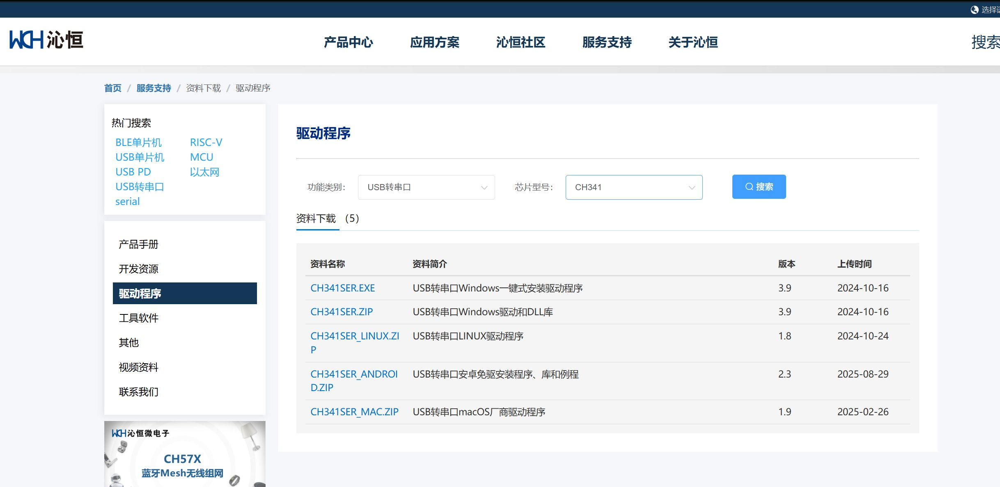

---

## 一、错误排查
遇到情况：lsusb有信息，ls /dev/tty* 没信息
插拔usb设备,查看信息
```
sudo dmesg | tail -n 30
```
初步确认jetson orin nano jetpack版本6.2（linux内核5.15.148）可能没有ch341驱动
查看内核版本信息(内核版本一定要匹配！)
```
uname -r
```
## 二、装驱动
具体参考：https://keaa.net/linux-ch34x-driver.html#:~:text=%E5%9C%A8%E5%AE%98%E6%96%B9Linux%E5%86%85%E6%A0%B8%E7%89%88%E6%9C%AC%E4%B8%AD%E8%87%AAKernel2.6%E4%BB%A5%E5%90%8E%E5%B0%B1%E9%BB%98%E8%AE%A4%E5%8C%85%E5%90%AB%E4%BA%86%E5%AF%B9CH340%2FCH341%E8%8A%AF%E7%89%87%E7%9A%84%E9%A9%B1%E5%8A%A8%E6%94%AF%E6%8C%81%EF%BC%8C%E5%B9%B6%E4%B8%94%E8%83%BD%E6%88%90%E5%8A%9F%E8%AF%86%E5%88%AB%E9%A9%B1%E5%8A%A8%E3%80%82,%E7%94%A8%E4%B8%B2%E5%8F%A3%E8%BD%AF%E4%BB%B6%E6%AD%A3%E5%B8%B8%E6%89%93%E5%BC%80%E4%B8%B2%E5%8F%A3%E5%8D%B4%E6%97%A0%E6%B3%95%E6%94%B6%E5%8F%91%EF%BC%8C%E5%85%B6%E5%AE%9E%E6%98%AF%E8%8A%AF%E7%89%87%E5%AE%98%E6%96%B9%E6%9B%B4%E6%96%B0%E8%8A%AF%E7%89%87%E7%89%88%E6%9C%AC%EF%BC%8C%E8%BF%99%E6%97%B6%E5%80%99%E5%8F%AA%E9%9C%80%E8%A6%81%E7%94%A8%E8%8A%AF%E7%89%87%E5%AE%98%E7%BD%91%E6%8F%90%E4%BE%9B%E7%9A%84%E6%96%B0%E9%A9%B1%E5%8A%A8%E8%BF%9B%E8%A1%8C%E6%9B%BF%E6%8D%A2%E5%8D%B3%E5%8F%AF%E4%BD%BF%E7%94%A8%E3%80%82
驱动下载地址：https://www.wch.cn/downloads/category/67.html
[Open: image-20251109180411587.png](ubuntu/linux%E9%A9%B1%E5%8A%A8CH341+%E7%BB%99%E6%9D%83%E9%99%90.assets/0edabc6a0264ad9c9f1885965e947464_MD5.jpeg)

解压后确认路径（不能有中文名，不能有（1）这种字符）
```
unzip CH341SER_LINUX.ZIP
cd CH341SER_LINUX
make
sudo make load
```
显示 insmod ch34x.ko则装成功，但这样重启驱动还是会丢，每次make load非常繁琐，故要设置开机自动加载驱动
把34x改成对应版本，这里是341
```
 sudo cp ch34x.ko /lib/modules/$(uname -r)/kernel/drivers/usb/serial/
 sudo depmod
```
## 依赖冲突
再次运行
```
sudo dmesg | tail -n 30
```
发现显示
```
new full-speed USB device number 10 using tegra-xusb 
[ 1511.403647] usb_ch341 1-2.4:1.0: ttyCH341USB0: ch341 USB device 
[ 1511.492491] usb 1-2.4: usbfs: interface 0 claimed by usb_ch341 while 'brltty' sets config #1 
[ 1511.493807] usb_ch341 1-2.4:1.0: ch341 usb device disconnect.
```
和brltty冲突了，遂查brltty是什么服务（盲人屏幕阅读器，用不到这个服务，故停止服务并删除）
参考博客：https://blog.csdn.net/weixin_49203415/article/details/136319128
```
sudo systemctl stop brltty
sudo systemctl disable brltty
sudo apt remove brltty
```
支持，ls /dev/tty* 显示ttyCH341USB!
..但是串口依旧无法访问
测试发现给读写权限后有用，故有下步
```
sudo chmod 666 /dev/ttyCH341USB0
```
## 设置权限
1.先查内容（CH341 的厂商 ID 和产品 ID 可以用 `lsusb` 查看，比如你的是 `1a86:7523`
```
lsusb
sudo nano /etc/udev/rules.d/99-ch341.rules
```
2.添加内容
```
SUBSYSTEM=="tty", ATTRS{idVendor}=="1a86", ATTRS{idProduct}=="7523", MODE="0666"
```
3.保存后，重新加载udev规则
```
sudo udevadm control --reload-rules
sudo udevadm trigger
```
4.再插拔设备后，你就可以直接用普通用户访问了。
## 驱动测试程序
```
#!/usr/bin/env python3
import serial
import time

# 串口配置
PORT = '/dev/ttyCH341USB0'  # 你的 CH341 串口设备
BAUDRATE = 115200

try:
    ser = serial.Serial(PORT, BAUDRATE, timeout=0.1)
    print(f"串口已打开: {PORT} @ {BAUDRATE} baud")
except Exception as e:
    print(f"打开串口失败: {e}")
    exit(1)

def read_serial():
    while True:
        try:
            if ser.in_waiting:
                data = ser.readline().decode('utf-8', errors='ignore').strip()
                if data:
                    print(f"接收: {data}")
        except Exception as e:
            print(f"读取串口出错: {e}")

def send_serial(msg: str):
    try:
        ser.write((msg + '\n').encode('utf-8'))
        print(f"发送: {msg}")
    except Exception as e:
        print(f"发送串口出错: {e}")

if __name__ == "__main__":
    import threading

    # 启动接收线程
    t = threading.Thread(target=read_serial, daemon=True)
    t.start()

    print("输入要发送的消息，按 Ctrl+C 退出")
    try:
        while True:
            s = input("> ")
            if s:
                send_serial(s)
    except KeyboardInterrupt:
        print("退出程序")
        ser.close()

```