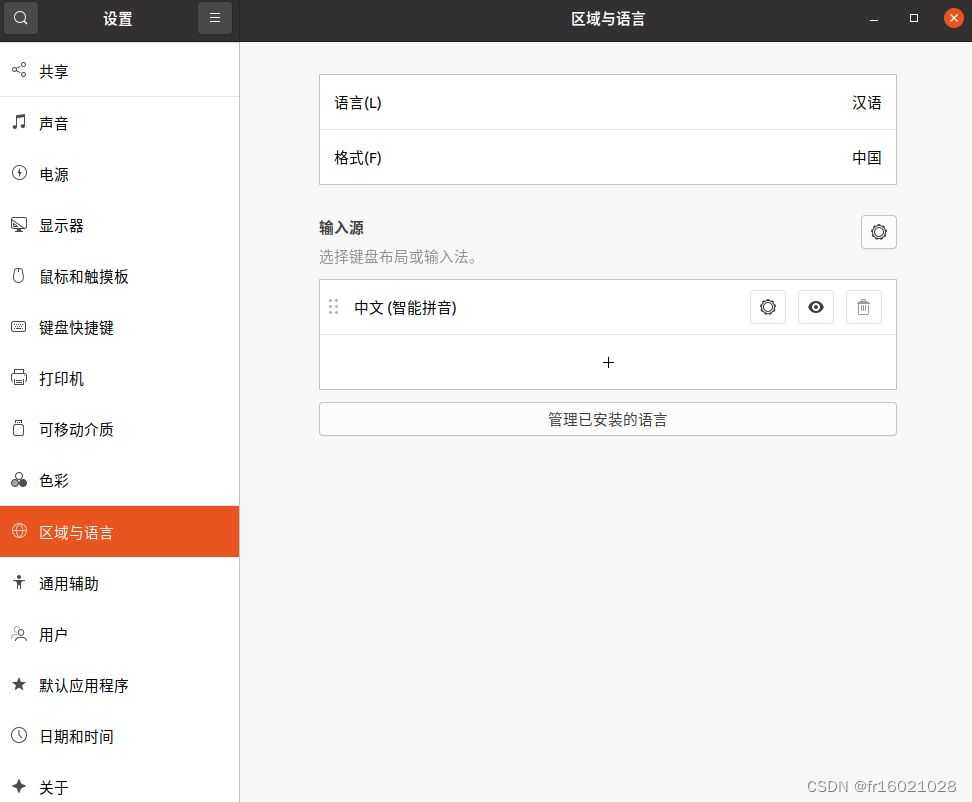

---

打开终端，输入
```
sudo apt install ibus
```
安装框架
2.安装完毕后，输入
```
im-config -s ibus
```
命令切换框架
3.由于Ubuntu Desktop 20.04使用的是GNOME桌面，所以需要安装相应的平台支持包，输入
```
sudo apt install ibus-gtk ibus-gtk3
```
进行安装
4.选择简体拼音输入法，输入
```
sudo apt install ibus-pinyin
```
完成安装
5.完成安装后，将中文输入法添加到输入源选项中
```
ibus-setup
```


原文链接：
https://blog.csdn.net/fr16021028/article/details/125891812