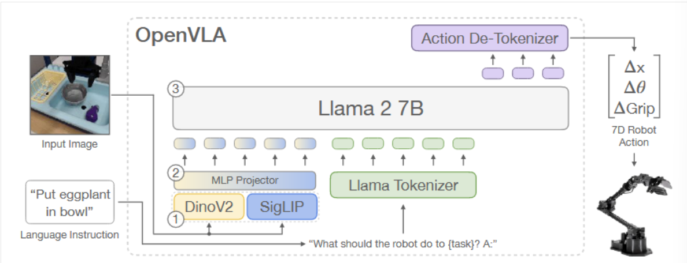

# <span style="color: rgb(25, 60, 71);"><span style="background-color: rgb(238, 249, 253);">(2024-09-05) OpenVLA: An Open-Source Vision-Language-Action Model</span></span>

| <!-- --> |
| ---------------------------------------------------------------------------------------------------------------------------------------------------------------------------------------------------------------------------------------------------------------------------------------------------------------------------------------------------------------------------------------------------------------------------------------------------------------------------------------------------------------------------------------------------------------------------------------------------------------------------------------------------------------------------------------------------------------------------------------------------------------------------------------------------------------------------------------------------------------------------------------------------------------------------------------------------------------------------------------------------------------------------------------------------------------------------------------------------------------------------------------------------------------------------------------------------------------------------------------------------------------------------------------------------------------------------------------------------------------------------------------------------------------------------------------------------------------------------------------------------------------------------------------------------------------------------------------------------------------------------------------------------------------------------------------------------------------------------------------------------------------------------------------------------------------------------------------------------------------------------------------------------------------------------------------------------------------------------------------------------------------------------------------------------------------------------------------------------------------------------------------------------------------------------------------------------------------- |
| **<span style="color: rgb(25, 60, 71);"><span style="background-color: rgb(219, 238, 221);">作者:</span></span>**<span style="color: rgb(25, 60, 71);"><span style="background-color: rgb(219, 238, 221);"> Moo Jin Kim; Karl Pertsch; Siddharth Karamcheti; Ted Xiao; Ashwin Balakrishna; Suraj Nair; Rafael Rafailov; Ethan Foster; Grace Lam; Pannag Sanketi; et al.</span></span>                                                                                                                                                                                                                                                                                                                                                                                                                                                                                                                                                                                                                                                                                                                                                                                                                                                                                                                                                                                                                                                                                                                                                                                                                                                                                                                                                                                                                                                                                                                                                                                                                                                                                                                                                                                                                              |
| **<span style="color: rgb(25, 60, 71);"><span style="background-color: rgb(243, 250, 244);">期刊: </span></span><span style="color: rgb(255, 0, 0);"><span style="background-color: rgb(243, 250, 244);">, </span></span><span style="background-color: rgb(243, 250, 244);">2024.</span>**                                                                                                                                                                                                                                                                                                                                                                                                                                                                                                                                                                                                                                                                                                                                                                                                                                                                                                                                                                                                                                                                                                                                                                                                                                                                                                                                                                                                                                                                                                                                                                                                                                                                                                                                                                                                                                                                                                                        |
| **<span style="color: rgb(25, 60, 71);"><span style="background-color: rgb(219, 238, 221);">期刊分区:</span></span>**                                                                                                                                                                                                                                                                                                                                                                                                                                                                                                                                                                                                                                                                                                                                                                                                                                                                                                                                                                                                                                                                                                                                                                                                                                                                                                                                                                                                                                                                                                                                                                                                                                                                                                                                                                                                                                                                                                                                                                                                                                                                                                |
| **<span style="color: rgb(25, 60, 71);"><span style="background-color: rgb(243, 250, 244);">本地链接: </span></span>**<span style="color: rgb(25, 60, 71);"><span style="background-color: rgb(243, 250, 244);"><a href="zotero://open-pdf/0_4UX85EAX" rel="noopener noreferrer nofollow">OPENVLA.pdf</a></span></span>                                                                                                                                                                                                                                                                                                                                                                                                                                                                                                                                                                                                                                                                                                                                                                                                                                                                                                                                                                                                                                                                                                                                                                                                                                                                                                                                                                                                                                                                                                                                                                                                                                                                                                                                                                                                                                                                                              |
| **<span style="color: rgb(25, 60, 71);"><span style="background-color: rgb(219, 238, 221);">DOI: </span></span>**<span style="color: rgb(25, 60, 71);"><span style="background-color: rgb(219, 238, 221);"><a href="https://doi.org/10.48550/arXiv.2406.09246" rel="noopener noreferrer nofollow">10.48550/arXiv.2406.09246</a></span></span>                                                                                                                                                                                                                                                                                                                                                                                                                                                                                                                                                                                                                                                                                                                                                                                                                                                                                                                                                                                                                                                                                                                                                                                                                                                                                                                                                                                                                                                                                                                                                                                                                                                                                                                                                                                                                                                                    |
| **<span style="color: rgb(25, 60, 71);"><span style="background-color: rgb(243, 250, 244);">摘要: </span></span>***<span style="color: rgb(25, 60, 71);"><span style="background-color: rgb(243, 250, 244);">Large policies pretrained on a combination of Internet-scale vision-language data and diverse robot demonstrations have the potential to change how we teach robots new skills: rather than training new behaviors from scratch, we can fine-tune such vision-language-action (VLA) models to obtain robust, generalizable policies for visuomotor control. Yet, widespread adoption of VLAs for robotics has been challenging as 1) existing VLAs are largely closed and inaccessible to the public, and 2) prior work fails to explore methods for efficiently fine-tuning VLAs for new tasks, a key component for adoption. Addressing these challenges, we introduce OpenVLA, a 7B-parameter open-source VLA trained on a diverse collection of 970k real-world robot demonstrations. OpenVLA builds on a Llama 2 language model combined with a visual encoder that fuses pretrained features from DINOv2 and SigLIP. As a product of the added data diversity and new model components, OpenVLA demonstrates strong results for generalist manipulation, outperforming closed models such as RT-2-X (55B) by 16.5% in absolute task success rate across 29 tasks and multiple robot embodiments, with 7x fewer parameters. We further show that we can effectively fine-tune OpenVLA for new settings, with especially strong generalization results in multi-task environments involving multiple objects and strong language grounding abilities, and outperform expressive from-scratch imitation learning methods such as Diffusion Policy by 20.4%. We also explore compute efficiency; as a separate contribution, we show that OpenVLA can be fine-tuned on consumer GPUs via modern low-rank adaptation methods and served efficiently via quantization without a hit to downstream success rate. Finally, we release model checkpoints, fine-tuning notebooks, and our PyTorch codebase with built-in support for training VLAs at scale on Open X-Embodiment datasets.</span></span>* |
| **<span style="color: rgb(25, 60, 71);"><span style="background-color: rgb(219, 238, 221);">标签:</span></span>**                                                                                                                                                                                                                                                                                                                                                                                                                                                                                                                                                                                                                                                                                                                                                                                                                                                                                                                                                                                                                                                                                                                                                                                                                                                                                                                                                                                                                                                                                                                                                                                                                                                                                                                                                                                                                                                                                                                                                                                                                                                                                                  |
| **<span style="color: rgb(25, 60, 71);"><span style="background-color: rgb(243, 250, 244);">笔记日期: </span></span>**<span style="color: rgb(25, 60, 71);"><span style="background-color: rgb(243, 250, 244);">2026/3/21 11:31:49</span></span>                                                                                                                                                                                                                                                                                                                                                                                                                                                                                                                                                                                                                                                                                                                                                                                                                                                                                                                                                                                                                                                                                                                                                                                                                                                                                                                                                                                                                                                                                                                                                                                                                                                                                                                                                                                                                                                                                                                                                                     |


## <span style="color: rgb(224, 255, 255);"><span style="background-color: rgb(102, 205, 170);">📜 研究核心</span></span>

***

> Tips: 做了什么，解决了什么问题，创新点与不足？

## 一、openvla模型架构

*   <span style="color: rgba(0, 0, 0, 0.75);"><span style="background-color: rgb(255, 255, 255);">输入 ：</span></span>

    *   <span style="color: rgba(0, 0, 0, 0.75);"><span style="background-color: rgb(255, 255, 255);">图像观测 (Input Image)：机器人的当前视角图像。</span></span>
    *   <span style="color: rgba(0, 0, 0, 0.75);"><span style="background-color: rgb(255, 255, 255);">语言指令 (Language Instruction)：例如 “Put eggplant in bowl”。</span></span>

*   处理流程：      **1.视觉编码器**：图像并非通过单一网络，而是同时通过两个预训练编码器：

    *   <span style="color: rgb(77, 77, 77);"><span style="background-color: rgb(255, 255, 255);">DINOv2：提供低层次的空间信息（对机器人精准操作至关重要）。</span></span>

    *   <span style="color: rgb(77, 77, 77);"><span style="background-color: rgb(255, 255, 255);">SigLIP：提供高层次的语义理解（有助于视觉泛化）。</span></span>

    *   这两个特征向量被串联起来。**2.投影器 (MLP** **Projector)：**一个 MLP 投影层，将视觉特征映射到语言模型的输入空间（Embedding Space）。\
        **3.大语言模型（主干网络）：**Llama 2 7B 模型，接收**图像特征**和**语言指令**作为输入。\
        **4.去词元化 (Action De-Tokenizer)**：Llama 2 输出的 token 被解码为离散的动作编号。\
        输出：7 维机器人动作：包含位置变化和夹爪状态 (Gripper)


## 二、Prismatic-7B（<span style="color: rgb(77, 77, 77);"><span style="background-color: rgb(255, 255, 255);">视觉语言模型</span></span>）

OpenVLA是基于Prismatic-7B (VLM)作微调和扩展的，其由如下构成：

### （1）语言编码器：

Llama Tokenizer。将自然语言分词，映射为索引，然后转化为嵌入向量序列。

### （2）视觉编码器：

使用Dinov2\[3]和SigLIP\[4]分别处理图像的低级空间特征(如纹理、位置、形状等)和高级语义特征(如类别、颜色等)。输入的图像分别经过Dinov2和SigLIP后，输出的特征向量按通道维度进行拼接，即 （H,W,C1） + （H,W,C2） -> （H,W,C1+C2 )

实验表明：与更常用的视觉编码器模块（如仅使用CLIP或者SigLIP）相比，增加Dinov2模块有助于提高LLM的空间推理能力。

#### <span style="color: rgb(77, 77, 77);"><span style="background-color: rgb(255, 255, 255);">双视觉编码器（预训练）：</span></span>

*   <span style="color: rgb(77, 77, 77);"><span style="background-color: rgb(255, 255, 255);">DINOv2：提供低层次的空间信息（对机器人精准操作至关重要）</span></span>**<span style="color: rgba(0, 0, 0, 0.75);">提取细粒度的信息</span>**<span style="color: rgb(77, 77, 77);"><span style="background-color: rgb(255, 255, 255);">。</span></span>

*   <span style="color: rgb(77, 77, 77);"><span style="background-color: rgb(255, 255, 255);">SigLIP：提供高层次的语义理解（有助于视觉泛化）</span></span>**<span style="color: rgba(0, 0, 0, 0.75);">提取image level的信息</span>**<span style="color: rgb(77, 77, 77);"><span style="background-color: rgb(255, 255, 255);">。</span></span>

    | 模型         | 核心功能         | 输出                 |
    | ---------- | ------------ | ------------------ |
    | **DINOv2** | 无监督视觉特征学习    | 空间感知特征（物体形状、位置、纹理） |
    | **SigLIP** | 多模态（图像-语言）对齐 | 高层语义特征（物体类别、语义信息）  |


### （3）MLP projector **多层感知机**

对每个视觉 patch 的特征向量做映射。

代码结构是：

（use\_fused\_vision\_backbone = False）单视觉编码器：

代码结构是：

```
fc1: vision_dim -> llm_dim
GELU
fc2: llm_dim -> llm_dim
```

数学形式是：

$$
\mathbf{z}_1 = \mathrm{GELU}(\mathbf{x}W_1 + \mathbf{b}_1)
$$

$$
\mathbf{z}_2 = \mathbf{z}_1W_2 + \mathbf{b}_2
$$

（use\_fused\_vision\_backbone=True）双视觉编码器：

代码结构是：

```
initial_projection_dim = 4 * vision_dim
fc1: vision_dim -> 4 * vision_dim
GELU
fc2: 4 * vision_dim -> llm_dim
GELU
fc3: llm_dim -> llm_dim
```

数学形式是：

$$
\mathbf{h}_1 = \mathrm{GELU}(\mathbf{x}W_1 + \mathbf{b}_1)
$$

$$
\mathbf{h}_2 = \mathrm{GELU}(\mathbf{h}_1W_2 + \mathbf{b}_2)
$$

$$
\mathbf{z} = \mathbf{h}_2W_3 + \mathbf{b}_3
$$

### （4）大语言模型：

Llama2 是 decoder-only Transformer。它本来的功能是：0

```
根据前面的 token，预测下一个 token
```

它是一个 **自回归语言模型**，输入一串 token，输出下一个 token 的概率分布。Llama2 官方介绍为 large language model，AWS 对 Llama2 的介绍也明确说它是 auto-regressive language model，用于生成文本。

数学上就是：

$$
p(x_{t+1}\mid x_1,x_2,\dots,x_t)
$$

Llama2 7B 是 Meta 发布的 **纯语言模型**，输入是文本 token，输出也是文本 token。官方模型卡明确写到：Llama 2 是 7B 到 70B 规模的生成式文本模型，7B 版本的输入是 text only，输出也是 generate text only。

在 OpenVLA 里，Llama2 的输出形式仍然是：下一个 token id


## 三、动作序列解码器

openvla 输入：单张分辨率128x128的图像+语言指令

Llama 2  7B输出?->Action DeTokenizer：**一组含有终止信号、机器人末端执行器平移、旋转、夹爪开合程度的动作序列**。

比如1 128 91 241 5 101 127 217


### 编码：

*   LLM（大语言模型）通常处理 **离散 token**（比如单词、子词）。机器人动作是 **连续值向量，故需要**把连续动作 **映射到 LLM 可以输出的离散 token 空间**。

为了使LLM能够直接输出动作参数，本文借鉴RT-2的做法，将每个动作维度的参数变化范围限定在\[P1，P99]，其中第1百分位设为P1，表示有1%的数据\<P1，然后将\[P1，P99]离散为256个箱子(小区间)，最后用离散的箱子索引(0,1...255)替代连续的动作参数值。

比如，假设若”夹爪开合程度”这个动作维度的训练数据的取值范围为\[0,120mm]，且有1%的数据<5，有99%的数据〈100

则

i）夹爪开合程度的取值范围为（5,100）

ii）箱宽 = （100-5）/ 256 ≈ 0.37

iii）若夹爪开合程度 = 5.5，则对应的索引为1


### 解码：

对于Llama生成的动作序列，比如1 128 91 241 5 101 127 217：直接返回各索引值对应箱子的中心值作为最终动作参数的输出。

注：由于Llama分词器词汇表中为微调保留的特殊token仅为100个，这<256，因此本文借鉴RT-2的做法，将Llama分词器词汇表中使用频率最小，即位置最靠后的256个token覆盖为动作序列的token。

#### RT-2（Robotics Transformer 2）：

RT-2 用 Transformer 模型，把机器人动作离散化成“token”，就像生成文本一样生成动作。

####

### ⚙️ 内容

### 💡 创新点

### 🧩 不足

## <span style="color: rgb(32, 178, 170);"><span style="background-color: rgb(175, 238, 238);">🔁 研究内容</span></span>

***

### 💧 数据

基于<span style="color: rgb(77, 77, 77);"><span style="background-color: rgb(255, 255, 255);"> Open X-Embodiment</span></span>（<span style="color: rgb(77, 77, 77);"><span style="background-color: rgb(255, 255, 255);">包含 97 万条机器人操控轨迹）上对其进行了微调。该数据集涵盖了广泛的机器人实体、任务和场景。</span></span>

（1）确保所有训练数据集输入一致、输出一致。

对此，本文只保留具有第三人称摄像头视角并采用单臂末端执行器控制的操作数据。

(2)确保最终训练混合数据集中包含平衡的机器人**形态、任务和场景**比例。

对此，本文采用Octo的数据混合权重策略，对多样性较低的数据集进行降权处理或剔除，同时提升包含更多任务和场景多样性的数据集的权重。

（3）过滤掉所有无效或异常的数据，如零值动作。

注：在训练初期，加入了10%的DROIO(但由于该数据集成功率太低，在训练最后1/3的时间里删除了DROIO，并在其它数据集中重新分配混合权重。

训练时间:使用64张A100，batchsize=2048，用时14天。

### 👩🏻‍💻 方法

### 🔬 实验

#### 实验一：测试不同机器人平台、环境、人物的效果：

实验一分别在WidowX和Google机器人平台上做了测试。在WidowX机器人平台上，用BridgeDataV2数据集测试泛化能力。测试了4种OOD泛化类型+1种语言定位的任务。

##### 1.在WidowX平台（BridgeDataV2）：

**视觉泛化**：不同背景、干扰物、颜色/外观；

比如将茄子放入锅中的任务，简单版OOD是指使用一只外观与BridgeDataV2训练数据集中的锅不同的纸锅。普通版OOD=简单版+改变机器人的末端执行器的初始位置。杂乱版OOD=普通版+场景有干扰物。

**运动泛化**：对象位置/朝向未见过；

**物理泛化**：对象大小/形状不同；

**语义泛化**：未见过对象或任务指令；

**语言条件**：在多对象环境中操控特定对象；

比如先把茄子放在锅中，在放在红瓶子中。


##### 2.在Google 移动操作机器人：


**实验一结论：**

**1.OpenVLA 在视觉、运动、物理和语言条件任务中性能最优**

2.RT-2-X 在语义泛化任务略好（受益于大规模 Internet 数据预训练）

3.Octo 和 RT-1-X 在含干扰物、多对象任务中表现差 → 缺乏 VLM 预训练的泛化能力

#### 实验二、探讨在新的机器人配置和任务上的微调能力

本实验在两种新的机器人配置进行测试。

**Franka-Tabletop**：一个固定在桌面的Franka Emika Panda 7 自由度机器臂。

**Franka-DROID：** 一个安装在可移动的站立式桌子上且来自于DROID数据集的Franka机器臂。

两种配置分别使用5Hz和15Hz的非阻塞控制器。

**微调设置**：

*   小数据集：10–150 条示例

*   机器人平台：Franka-Tabletop / Franka-DROID

*   微调方法：

    *   Full fine-tuning（全模型参数）
    *   LoRA（低秩适配）
    *   与 Diffusion Policy / Octo 对比

**任务类型**：

*   **单指令任务**（narrow, 单对象）
*   **多指令任务**（diverse, 多对象 + 干扰物）
*   **视觉鲁棒性任务**（不同场景）


OOD指 未见过的目标物体、桌面背景、干扰物、初始位置或朝向。

DIffusion Policy (matched)：指与OpenVla的输入输出维度想匹配的Diffusion Policy。

Openvla（scratch）：指未经OpenX数据集微调的OpenVLA

**实验二结论：**

Diffusion Policy 擅长单指令任务

OpenVLA 和 Octo 对多指令、多对象任务更强 → 利用 OpenX 预训练数据进行语言 grounding

OpenVLA 平均成功率最高，>50% 成功率覆盖所有任务

LoRA 微调只需训练 **1.4% 参数**，性能与 Full FT 接近，训练时间 10–15h（单 A100 GPU）

#### 实验三：探讨如何高效地参数微调

**方法**：

*   Full FT（全模型）
*   Last-layer only
*   Frozen vision
*   Sandwich（unfreeze vision encoder + last layer + embedding）
*   LoRA（rank 32 / 64）

**结果**（Table 1, 页 10）：

| 方法              | 成功率   | 训练参数   | VRAM    |
| --------------- | ----- | ------ | ------- |
| Full FT         | 69.7% | 7,188M | 163 GB  |
| Last-layer only | 30.3% | 465M   | 51 GB   |
| Frozen vision   | 47.0% | 6,760M | 156 GB  |
| Sandwich        | 62.1% | 914M   | 64 GB   |
| LoRA r=32       | 68.2% | 97.6M  | 59.7 GB |


LoRA 微调在 **成功率 / 显存 / 参数量** 之间达到最佳平衡

**实验四：探讨量化技术能否实现高效推理**

**方法**：

*   bfloat16（默认）
*   int8
*   int4

**结果**（Table 2 & 图 6, 页 10）：

*   int4 → 成功率 ≈ bfloat16，显存减半
*   int8 → 推理慢，低于训练控制频率
*   推理速率：RTX 4090 \~ 6Hz（bfloat16）
*   int4 → 3Hz，但性能保持


### 📜 结论


## <span style="color: rgb(0, 77, 153);"><span style="background-color: rgb(135, 206, 250);">🤔 个人总结</span></span>

***

> Tips: 你对哪些内容产生了疑问，你认为可以如何改进？

### 🙋‍♀️ 重点记录

### 📌 待解决

### 💭 思考启发
