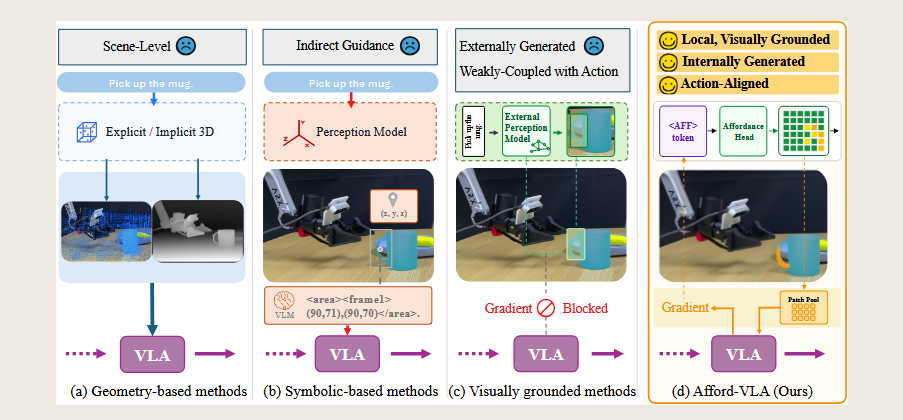
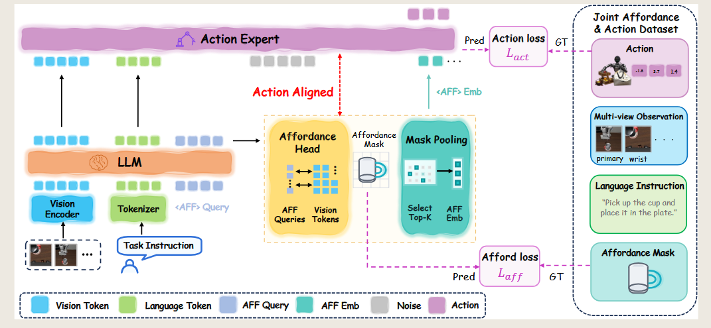
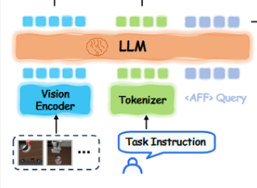
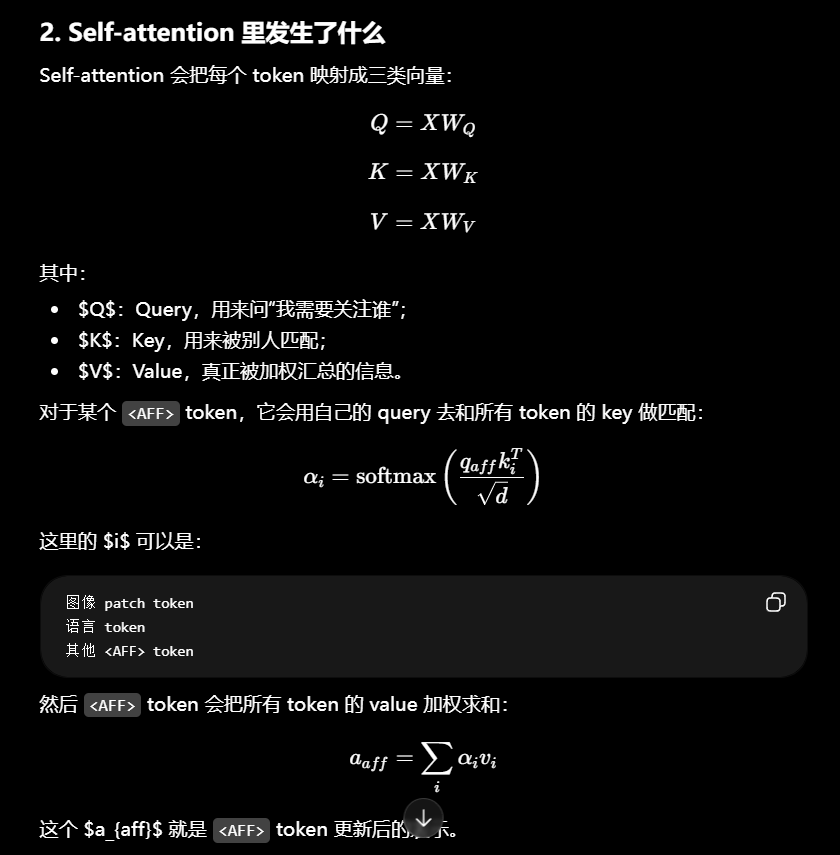
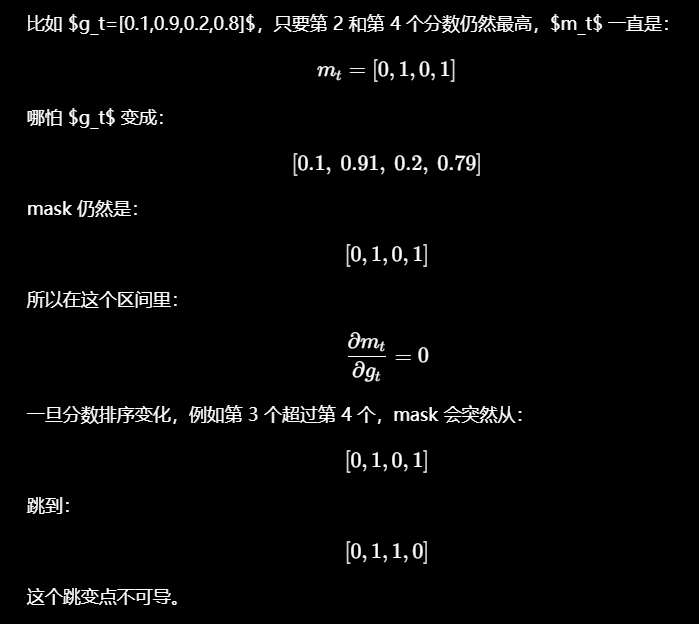
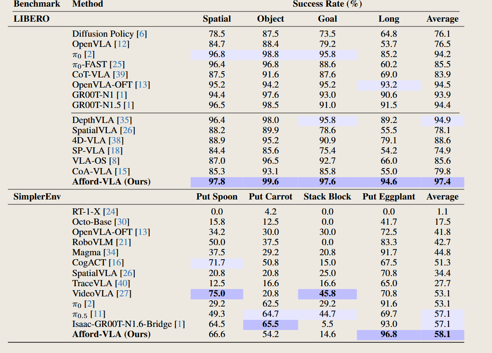
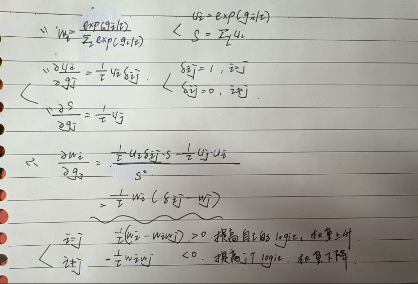

# <span style="color: rgb(25, 60, 71);"><span style="background-color: rgb(238, 249, 253);">(2026) Afford-VLA: Action-Aligned Visual Planning via Internalized Affordance</span></span>

| <!-- --> |
| -------------------------------------------------------------------------------------------------------------------------------------------------------------------------------------------------------------------------------------------------------------------------------------------------------------------------------------------------------------------------------------------------------------------------------------------------------------------------------------------------------------------------------------------------------------------------------------------------------------------------------------------------------------------------------------------------------------------------------------------------------------------------------------------------------------------------------------------------------------------------------------------------------------------------------------------------------------------------------------------------------------------------------------------------------------------------------------------------------------------------------------------------------------------------------------------------------------------------------------------------------------------------------------------------------------------------------------------------------------------------------------------------------------------------------------------------------------------------------------------------------------------------------------------------------------------------------------------------------------------------------------------------------------------------------------------------------------------------------------------------------------------------------------------------------------------------------------------------------------------------------------------------------------------------------------------------------------------------------------------------------------------------------------------------------------------------------------------------------------------- |
| **<span style="color: rgb(25, 60, 71);"><span style="background-color: rgb(219, 238, 221);">作者:</span></span>**<span style="color: rgb(25, 60, 71);"><span style="background-color: rgb(219, 238, 221);"> Runze Wang; Yuqian Fu; Yu Li; Tao Lin; Tianwen Qian; Mohamed Elhoseiny; Bo Zhao; Yanwei Fu; Yu-Gang Jiang; Xiangyang Xue;</span></span>                                                                                                                                                                                                                                                                                                                                                                                                                                                                                                                                                                                                                                                                                                                                                                                                                                                                                                                                                                                                                                                                                                                                                                                                                                                                                                                                                                                                                                                                                                                                                                                                                                                                                                                                                                    |
| **<span style="color: rgb(25, 60, 71);"><span style="background-color: rgb(243, 250, 244);">期刊: </span></span><span style="color: rgb(255, 0, 0);"><span style="background-color: rgb(243, 250, 244);">, </span></span><span style="color: rgb(25, 60, 71);"><span style="background-color: rgb(243, 250, 244);">2026.</span></span>**                                                                                                                                                                                                                                                                                                                                                                                                                                                                                                                                                                                                                                                                                                                                                                                                                                                                                                                                                                                                                                                                                                                                                                                                                                                                                                                                                                                                                                                                                                                                                                                                                                                                                                                                                                               |
| **<span style="color: rgb(25, 60, 71);"><span style="background-color: rgb(219, 238, 221);">期刊分区:</span></span>**                                                                                                                                                                                                                                                                                                                                                                                                                                                                                                                                                                                                                                                                                                                                                                                                                                                                                                                                                                                                                                                                                                                                                                                                                                                                                                                                                                                                                                                                                                                                                                                                                                                                                                                                                                                                                                                                                                                                                                                                    |
| **<span style="color: rgb(25, 60, 71);"><span style="background-color: rgb(243, 250, 244);">本地链接: </span></span>**<span style="color: rgb(25, 60, 71);"><span style="background-color: rgb(243, 250, 244);"><a href="zotero://open-pdf/0_RBZ9L22W" rel="noopener noreferrer nofollow">Wang 等 - 2026 - Afford-VLA Action-Aligned Visual Planning via Internalized Affordance.pdf</a></span></span>                                                                                                                                                                                                                                                                                                                                                                                                                                                                                                                                                                                                                                                                                                                                                                                                                                                                                                                                                                                                                                                                                                                                                                                                                                                                                                                                                                                                                                                                                                                                                                                                                                                                                                                    |
| **<span style="color: rgb(25, 60, 71);"><span style="background-color: rgb(219, 238, 221);">DOI: </span></span>**<span style="color: rgb(25, 60, 71);"><span style="background-color: rgb(219, 238, 221);"><a href="https://doi.org/10.48550/ARXIV.2605.24203" rel="noopener noreferrer nofollow">10.48550/ARXIV.2605.24203</a></span></span>                                                                                                                                                                                                                                                                                                                                                                                                                                                                                                                                                                                                                                                                                                                                                                                                                                                                                                                                                                                                                                                                                                                                                                                                                                                                                                                                                                                                                                                                                                                                                                                                                                                                                                                                                                        |
| **<span style="color: rgb(25, 60, 71);"><span style="background-color: rgb(243, 250, 244);">摘要: </span></span>***<span style="color: rgb(25, 60, 71);"><span style="background-color: rgb(243, 250, 244);">Vision-language-action (VLA) models have shown strong potential for generalist robot manipulation, yet they remain limited by insufficient spatial reasoning, particularly in determining where to interact in complex visual scenes. While recent efforts introduce various forms of visual planning to address this issue, existing approaches either rely on global geometric cues, symbolic intermediate representations, or externally generated visual signals, which are often weakly coupled with downstream action prediction. In this work, we revisit visual planning in VLA systems and argue that effective planning should be local, visually grounded, internally generated, and directly aligned with action. Based on this insight, we propose Afford-VLA, a unified framework that internalizes task-conditioned affordance as an explicit visual planning interface within VLA models. Concretely, we introduce learnable tokens to query task-relevant interaction regions, decode affordance masks from multimodal features, and convert them into compact embeddings that directly condition action generation. This design enables affordance to be both generated and utilized within the VLA, forming a tightly coupled perception–action pathway. To further support this integration, we adopt a training strategy that allows the affordance pathway to be jointly optimized with action prediction, improving its effectiveness for downstream control. We evaluate our method on multiple simulation benchmarks, including LIBERO, LIBERO-Plus, and SimplerEnv, achieving consistent state-of-the-art performance, along with strong real-world results. These findings demonstrate that internalizing affordance as action-aligned visual planning provides a powerful paradigm for improving VLA systems. Codes and Models will be released at Afford-VLA.</span></span>* |
| **<span style="color: rgb(25, 60, 71);"><span style="background-color: rgb(219, 238, 221);">标签:</span></span>**                                                                                                                                                                                                                                                                                                                                                                                                                                                                                                                                                                                                                                                                                                                                                                                                                                                                                                                                                                                                                                                                                                                                                                                                                                                                                                                                                                                                                                                                                                                                                                                                                                                                                                                                                                                                                                                                                                                                                                                                      |
| **<span style="color: rgb(25, 60, 71);"><span style="background-color: rgb(243, 250, 244);">笔记日期: </span></span>**<span style="color: rgb(25, 60, 71);"><span style="background-color: rgb(243, 250, 244);">2026/6/4 13:01:45</span></span>                                                                                                                                                                                                                                                                                                                                                                                                                                                                                                                                                                                                                                                                                                                                                                                                                                                                                                                                                                                                                                                                                                                                                                                                                                                                                                                                                                                                                                                                                                                                                                                                                                                                                                                                                                                                                                                                          |


## <span style="color: rgb(224, 255, 255);"><span style="background-color: rgb(102, 205, 170);">📜 研究核心</span></span>

***

> Tips: 做了什么，解决了什么问题，创新点与不足？

==**问题：**==
- VLA（视觉-语言-动作）模型在通用机器人操作任务中展现出很强的潜力，但它们仍然受到==空间推理能力==不足的限制，**尤其是在复杂视觉场景中判断“应该在哪里进行交互”这一点上表现不够好。**
- 虽然近期已有一些工作通过不同形式的视觉规划来解决这一问题，但现有方法往往依赖全局几何线索、符号化的中间表示，或者外部生成的视觉信号。这些信息通常和后续的动作预测结合得不够紧密。

==**架构：**==
- 在本文中，作者重新审视了 VLA 系统中的视觉规划问题，并认为有效的规划应该具备四个特点：  
           **局部的、视觉 grounded 的、模型内部生成的、并且与动作直接对齐的。**

基于这一观点，作者提出了 **Afford-VLA**，这是一个统一框架，它把任务条件下的 **affordance** 作为一种显式的视觉规划接口，内化到 VLA 模型内部。

- 具体来说，作者引入了==可学习的 `<AFF>` tokens==，用来查询与当前任务相关的交互区域；
- 然后从==多模态特征中解码出 affordance mask==；
- 再==把这些 mask 转换成紧凑的 embedding==，用来直接指导动作生成。
- 这种设计使 affordance 既能在 VLA 内部生成，又能被 VLA 内部使用，从而形成紧密耦合的“感知—动作”路径。

==**训练策略：**==
为了进一步支持这种结合，作者采用了一种训练策略，使 affordance 分支可以和动作预测一起联合优化，从而提升它对下游控制任务的有效性。

作者在多个仿真 benchmark 上评估了该方法，包括 **LIBERO、LIBERO-Plus 和 SimplerEnv**，并取得了持续的 SOTA 表现，同时在真实机器人实验中也获得了较强结果。

**==结论：==**
这些发现表明：把 affordance 作为一种与动作对齐的内部视觉规划机制，是提升 VLA 系统能力的一种有效范式。代码和模型将会在 Afford-VLA 中发布。

### ⚙️ 内容
#### introduce
##### 1.背景
VLA 模型需要根据图像观察和语言指令生成机器人动作，但一个核心难点是：  
  
> 模型如何判断应该在视觉场景中的哪个位置进行交互？  
> ==空间推理能力==
  
论文把这个能力称为 **visual planning**，即：  
  
> 引导模型决定在视觉空间中应该与哪里交互。  
  
例如指令是：  
  
> Pick up the mug.  
模型不仅要理解“拿起杯子”，还要知道：  

- 杯子在哪里；  
- 哪个区域是可交互区域；  
- 机械臂应该朝哪里移动；  
- 哪些视觉区域真正影响后续动作。  

##### 2.现有视觉规划方法
论文将已有方法分成三类：

| 方法类型              | 核心思想                          | 优点                       | 局限                                                                                   |
| ----------------- | ----------------------------- | ------------------------ | ------------------------------------------------------------------------------------ |
| Geometry-based    | 使用 3D 几何信息                    | 提升空间感知                   | Scene-Level<br>偏全局，缺少任务相关局部交互区域                                                      |
| Symbolic-based    | 使用文字、坐标、结构化 token 等中间表示       | 空间提示更明确                  | Indirect Guidance<br>间接引导，和视觉动作空间存在转换                                                |
| Visually grounded | 使用 mask、点、框等视觉提示              | 能直接指出图像区域                | Externally Generated ，Weakly-Coupled with Action<br>常依赖外部模型，和动作预测耦合弱                 |
| Afford-VLA        | 在 VLA 内部生成 affordance，并直接指导动作 | 局部、视觉 grounded、内部生成、动作对齐 | Local, Visually Grounded，Action-Aligned，Internally Genera<br>需要 affordance 监督和较高训练成本 |


###### 2.1 Geometry-based methods：基于几何的方法    
>  这类方法使用**显式或隐式的 3D 信息（Explicit / Implicit 3D cues）来增强空间理解**，例如：  
- 深度图；  
- 点云；  
- 多视角几何；  
- 3D 坐标；  
- 场景结构信息。  
  
但问题是：  
> 它通常提供的是==全局场景级别（provide global, scene-level context）==的信息，而不是精确的==任务相关交互区域（precise, task-conditioned interaction regions）。==  
  
> 它能让模型知道整体空间结构，但不一定能准确告诉模型：  
  当前任务应该抓杯子的哪一块。  
  
因此论文用 **Scene-Level** 来概括这类方法的局限。  
###### 2.2 Symbolic-based methods：基于符号的方法  
>这类方法会先把视觉信息转换成中间符号表示，再交给 VLA 模型。  
  常见形式包括：  

图中例子类似：  
  ```
<area><frame1>  
(90,71),(90,70)  
</area>
  ```

它的优点是比纯几何方法更聚焦，能够提供更明确的空间提示。

但问题是：

> 它不是直接在图像空间中引导动作，而是先转成符号，再由模型理解这些符号。
   所以它属于 **Indirect Guidance**，间接引导。

例如它可能告诉模型：

> 杯子区域坐标是某个范围。
> 但动作模型还需要再把这个符号信息转回视觉和动作空间，因此==中间存在信息损失。==
###### 2.3 Visually grounded methods：视觉 grounded 方法
这类方法**直接在图像空间中标出任务相关区域**，例如：在图像上预测 mask / heatmap / box / keypoint

但论文指出，已有 visually grounded 方法仍有两个问题：

- 问题 1：通常依赖外部感知模型

图中显示了：
> External Perception Model
   交互区域可能不是 VLA 自己生成的，而是由外部模块提前预测出来。
   
- 问题 2：与动作预测耦合不紧

图中写了：
> Gradient Blocked
> 动作预测的损失无法有效反向影响外部感知模块。
> 所以即使外部模块能生成 mask，这个 mask 也不一定是“对动作最有用”的 mask。

##### 3. Afford-VLA 的核心区别
###### 3.1 Local：局部的
Afford-VLA **关注任务相关的局部区域，而不是整张图像或全局场景。**
- 例如拿杯子时，模型应该重点关注杯子及其可抓取区域。
###### 3.2 Visually Grounded：视觉 grounded 的
它直接在图像空间中预测 affordance mask。
- 规划信息要**直接对应到图像中的具体区域**。
- 也就是说，它不是只生成文字描述或坐标，而是直接指出图像中可交互的区域。
###### 3.3 Internally Generated：内部生成的
Affordance mask 由 **VLA 模型内部生成**。
图中流程是：
```
<AFF> token (通过 attention 读取图像和语言信息)→ Affordance Head → Affordance Mask
```

这里的 `<AFF>` token 是可学习的查询 token，用来从图像和语言特征中查询任务相关交互区域。
###### 3.4 Action-Aligned：与动作对齐的
Afford-VLA 不只是预测 mask 给人看，而是把 mask 对应的视觉区域转成 affordance embedding，再送入动作生成模块。
- 应该与动作对齐，**使其能够被动作模型直接使用，并影响下游决策**。

图中对应：
```
Affordance Mask → 
选择重要图像 patch →
对这些 patch 的视觉特征做 pooling →
提取 affordance embedding →
输入 action head
```

并且动作 loss 的梯度可以反向传回 affordance 分支。
这意味着 affordance mask 会被训练成：
> 不只是视觉上合理，而且对动作生成真正有用。


##### 4.Afford-VLA 
**affordance-style reasoning** 可以理解成：

> 模型在生成动作前，先推理“当前任务下，图像中哪些区域可以被操作、应该被操作、怎样被操作”

这篇文章的 affordance 有三个特点：

1. **task-conditioned**  
    affordance 由任务决定。同一张图，不同指令对应不同区域。
2. **internalized**  
    affordance 不是外部模型单独生成的，而是在 VLA 内部由 `<AFF>` token 和 affordance head 预测。
3. **action-aligned**  
    affordance mask 不只是可视化结果，而是会通过 mask pooling 变成 $r_t$，直接送入动作头影响动作生成。

The core idea of our approach is to **treat ==task-conditioned affordance== as an internal interface that bridges perception and action.**
将任务导向的affordance视作衔接感知与行动的内在交互接口。

**task-conditioned affordance** 指的是 affordance 不是固定的，而是随任务变化。
> 同一张图里有杯子、盘子、叉子
> 任务：
> - pick up the cupaffordance 关注杯子任务
> - put the cup on the plateaffordance 关注盘子放置区域任务
> - pick up the forkaffordance 关注叉子


所以 affordance 是由任务指令决定的。
### 💡 创新点
#### 1. **指出了当前 VLA 系统中的关键缺失问题。**  
作者认为：

> 当前 VLA 最大的问题之一是缺少准确的 **where-to-interact（在哪里交互）** 能力。

并首次明确提出：

**好的视觉规划需要满足四个属性：**

- **Locality（局部性）**：关注任务相关的局部交互区域；
- **Visual Grounding（视觉 grounded）**：规划结果直接对应图像证据；
- **Internal Generation（内部生成）**：由 VLA 模型内部学习生成，而非外部模块提供；
- **Action Alignment（动作对齐）**：能够直接影响动作生成。

这相当于给 VLA 中的视觉规划定义了一套设计原则。
这个创新偏 ==**问题 formulation（问题建模）**==。

#### 2. **提出了 Afford-VLA 框架。**  
以往 affordance 方法通常是：
```
外部分割模型 → affordance mask → VLA
```
或者：
```
affordance 只是辅助 supervision
```

Afford-VLA 做的是：
```
VLA 内部生成 affordanceVLA 内部使用 affordance
```
具体实现是：

```
<AFF> token
      ↓
Affordance Head
      ↓
Affordance Mask
      ↓
Mask Pooling
      ↓
Affordance Embedding
      ↓
Action Head
```

所以它真正把：

> “应该操作哪里”变成了动作生成链路中的一部分。

这个创新偏 ==**模型结构设计（architecture innovation）**==。
#### 3. **提出了一种有效的训练与集成策略。**  
普通 affordance 方法的问题：
> affordance 和动作预测耦合不紧。

因为很多方法：
```
mask loss 单独优化
action loss 单独优化
```

Afford-VLA 使用：
> **straight-through gradient estimator**
>  (一种让“不可导操作”也能传播梯度的技巧。)
###### 前向传播（forward）

仍然使用：

```
硬 Top-K
```

真的只选最重要的 patch。

例如：

```
mask = [0,1,0,1]
```

这样保持局部性，不会变成全图平均。
###### 反向传播（backward）

作者不用真正的 Top-K 求梯度。

改成：

```
soft approximation
```

类似 softmax 权重：

$$
wi=exp⁡(gi/τ)∑jexp⁡(gj/τ)w_i = \frac{\exp(g_i / \tau)} {\sum_j \exp(g_j / \tau)}wi​=∑j​exp(gj​/τ)exp(gi​/τ)​
$$

这样梯度就能传回：
```
action loss      
↓
affordance logits      
↓
<AFF> token      
↓
affordance head
```
这个创新偏 ==**训练策略 / optimization design**==。


### 🧩 不足

## <span style="color: rgb(32, 178, 170);"><span style="background-color: rgb(175, 238, 238);">🔁 研究内容</span></span>

***

### 💧 数据

### 👩🏻‍💻 方法

#### 1、Formulating Affordance as Action-Aligned Visual Planning 
==**将Affordancee  定义为  动作对齐视觉规划**==
本节定义 Affordance 在 Afford-VLA 中的作用。
```
定位任务相关交互区域
        ↓
转换成动作模型可使用的紧凑特征
        ↓
直接指导动作预测
```
##### 1. 普通 VLA 的建模方式
标准 VLA 预测未来动作片段：

$$  
p(a_{t+H} \mid I_t, x, s_t)  
$$

其中：
- $I_t$：当前时刻的视觉输入；
- $x$：任务语言指令；
- $s_t$：机器人自身状态，如关节角、末端位姿、夹爪状态；
- $a_{t+H}$：从当前时刻 $t$ 到未来 $t+H$ 的动作序列，也叫 action chunk。

普通 VLA 的问题是：
```
动作头需要从全局视觉语言特征中隐式推断：
目标在哪里？
该抓哪里？
该放哪里？
哪些区域和动作有关？
```
##### 2. Afford-VLA 的改动
Afford-VLA 引入任务条件==视觉关注变量==：

$$  
M_t \in [0,1]^{H_I \times W_I}  
$$

其中：
- $M_t$：当前任务下的 affordance mask；
- $H_I$：图像高度；
- $W_I$：图像宽度；
- $[0,1]$：每个位置的 affordance 分数。

$M_t$ 可以理解成一张热力图：
```
接近 1：当前任务相关交互区域
接近 0：无关区域
```

例如：
```
指令：Pick up the cup
M_t：关注杯子的可抓取区域

指令：Put the cup on the plate
M_t：关注盘子的放置区域
```
##### 3. Afford-VLA 的策略公式
加入 affordance 后，动作预测变成：
$$  
p(a_{t+H} \mid I_t, x, s_t, M_t)  
$$
相比普通 VLA，多了 $M_t$。
这表示动作模型不仅依赖图像、语言和机器人状态，还显式依赖当前任务相关的交互区域。

> $M_t$ 不是单独输出给人看的 mask，而是**连接空间视觉 grounding** 和**机器人控制**的**内部**中间表示。

##### 4. 技术细节重点
###### 6.1 action chunk
$a_{t+H}$ 表示未来一段动作，而不是单步动作。
例如：

$$  
a_{t+H} = {a_t, a_{t+1}, \dots, a_{t+H}}  
$$

这样可以让机器人动作更连续、更平滑。
###### 6.2 task-conditioned affordance
Affordance 是由任务决定的。
同一张图像中可能有杯子、盘子、叉子，但不同任务对应不同 affordance 区域。

```
拿杯子：关注杯子可抓取区域
放杯子：关注目标放置区域
拿叉子：关注叉子区域
```
###### 6.3 compact features
Mask 本身是二维区域图，动作头更适合处理向量特征。
所以模型会将 affordance mask 对应的视觉区域压缩成 embedding：
```
affordance mask
        ↓
筛选相关视觉区域
        ↓
聚合视觉特征
        ↓
affordance embedding
        ↓
输入 action head
```
这个 embedding 会直接影响动作预测。

#### 2、affordance mask 如何生成
##### 1. 输入表示
给定：
- 图像观测：$I_t$
- 语言指令：$x$

VLM 会将它们转换成：
- 图像 token：$Q_{img}$
- 语言 token：$Q_{text}$

Afford-VLA 额外加入：
- $<AFF> token$：$Q_{aff}$



##### 2. `<AFF>` token 
`<AFF>` token 是可学习的 affordance query token，数学表示是：
$$  
Q_{aff} \in \mathbb{R}^{K_{aff} \times C_{llm}}  
$$

其中：
- $K_{aff}$：affordance query 的数量；
- $C_{llm}$：VLM 的隐藏层维度。

可以理解为：
- `<AFF> `token 是专门用来查询“当前任务应该关注哪里”的 token
- 训练前，它只是随机向量，没有明确含义。
- 训练后，它学会通过 attention 从图像和语言中提取 affordance 信息

例如指令是：
```
Pick up the cup
```

`<AFF>` token 要从图像和语言中聚合信息，判断和“拿杯子”相关的交互区域。

##### 3. VLM backbone 处理过程
加入 `<AFF>` token 后，序列输入同一个 VLM backbone：
$$  
[H_t, A_t] = f_{VLM}([Q_{img}, Q_{text}, Q_{aff}])  
$$
其中：
- $H_t$：图像 token 和语言 token 的上下文化隐藏状态；
- $A_t$：$A_{t} \in \mathbb{R}^{K_{aff} \times C_{llm}}$  `<AFF>` token 对应的隐藏状态；
- $f_{VLM}$：VLM backbone，大致包括：
```
Self-Attention
Feed Forward Network
LayerNorm
残差连接
多层 Transformer 堆叠
```

>由于 `<AFF>` token 和图像 token、语言 token 一起参与相同的 ==self-attention 层==，所以它们最终的状态同时受到当前视觉和语言指令的条件约束。
>
##### 4. 为什么 `<AFF>` token 能表示任务相关区域
==Self-attention 会让 `<AFF>` token 读取图像和语言中的相关信息。==

例如：
```
图像中有杯子、盘子、叉子
指令是 Pick up the cup
```
`<AFF>` token 会倾向于聚合与“cup”和“pick up”相关的信息。

所以 $A_t$ 可以理解成：
>当前任务下应该寻找什么交互证据
##### 5. 视觉 patch 特征 $P_t$
为了把 affordance 状态落到图像空间，需要使用图像 patch 特征：

$$  
P_t \in \mathbb{R}^{N \times C_{vis}}  
$$
其中：
$$  
N = H_p W_p  
$$
- $P_t$：图像编码器提取出的 patch 特征；
- $N$：patch 总数；
- $C_{vis}$：视觉特征维度，取决于视觉编码器，不是固定值。常见可能是：768、1024、1152、1408、1536 ...
- $(H_p, W_p)$：patch 网格个数。

> 例如:
> 
> 输入图像是 $224 \times 224$，patch grid 是 $16 \times 16$，则：
> $$
> N=16×16=256
> $$
> 也就是整张图被分成 256 个 patch。
> 
> 每个 patch 对应一个特征向量，比如假设：
> $$
> C_{vis} = 1024
> $$
> 那么：
> $$
> P_t \in \mathbb{R}^{256 \times 1024}
> $$

| 名称                 | 用途                              | 是否直接训练                 | 维度        |                                                                   |
| ------------------ | ------------------------------- | ---------------------- | --------- | ----------------------------------------------------------------- |
| 视觉 patch 特征 $P_t$  | affordance head 解码，mask pooling | 来自 encoder，encoder 可训练 | $C_{vis}$ | 是将图像 patch 特征映射到 **VLM 输入维度** 后形成的 token，用于送入 VLM / LLM backbone。 |
| 视觉 token $Q_{img}$ | 送入 VLM self-attention           | 通过 VLM backbone 参数参与训练 | $C_{llm}$ | 是通过 **视觉编码器（Vision Encoder）** 从图像 patch 提取的高维特征向量。                |
##### 6. Affordance Head $D_{aff}$

Affordance head 记作 $D_{aff}$。

它的输入是：
- `<AFF>` token 的上下文特征：$A_t$
- 图像 patch 特征：$P_t$

输出是 affordance logits对数几率：
$$  
G_t = D_{aff}(A_t, P_t), \quad G_t \in \mathbb{R}^{H_p \times W_p}  
$$
其中：
- $G_t$   affordance logits（应该也就是affordance mask）：每个 patch 的 affordance 分数；
>分数越高，说明该 patch 越可能是当前任务相关交互区域。


 **$D_{aff}$ 是一个轻量级 query-patch grounding decoder。**
>- `<AFF>`  状态编码了在当前指令下应该寻找什么交互证据；
>- patch 特征保留了这些证据在图像中的位置；
>- Decoder 将这两类信息结合起来，并为每个图像 patch 分配一个 affordance logit。

> 普通 VLA 的 action head 主要看全局隐藏特征 $H_t$，需要自己判断哪里重要。
> Afford-VLA 额外把“任务相关区域”的局部特征送进去，减少action head的空间推理压力。

例如：
```
指令：Pick up the cup
A_t：编码“找杯子的可抓取区域”
P_t：保留每个图像 patch 的视觉信息
D_aff：判断哪些 patch 是杯子的可抓取区域
G_t：输出 patch-level affordance logits
```
#### 3、affordance 如何条件化动作预测
$G_t$ 本身是一张 ==patch 级别的分数图，表示每个图像 patch 与当前任务的相关程度==。
action head 不能直接高效使用这张二维分数图，所以需要**mask pooling**，把它压缩成一个向量特征，也就是后面的 $r_t$。
$$  
G_t \in \mathbb{R}^{H_p \times W_p}  
$$
##### 1. 降维$G_t$
将 $G_t$ 展平成 
$$
g_t \in \mathbb{R}^{N}
$$
然后选择 $G_t$ 最高的 top-k 个 patch
$$  
m_{t,i} = \mathbb{I}[i \in \mathrm{TopK}(g_t, k)], \quad i = 1,\dots,N  
$$
其中：
- $\mathrm{TopK}(g_t,k)$：选出 $g_t$ 中分数最高的 $k$ 个位置；
- $\mathbb{I}[\cdot]$：指示函数；
- $m_{t,i}=1$：第 $i$ 个 patch 被选中；
- $m_{t,i}=0$：第 $i$ 个 patch 未被选中；

> 作用：
> 主要应该是为了和 $P_t$ 的形式对齐
>  $P_t$ 通常是 patch 序列：
>$$P_t \in \mathbb{R}^{N \times C_{vis}}$$​   所以要变成：$$
g_t \in \mathbb{R}^{N}
$$

例如：
$$  
g_t = [0.1, 0.9, 0.2, 0.8]  
$$
如果 $k=2$，top-k 位置是第 2 个和第 4 个 patch，那么：
$$  
m_t = [0,1,0,1]  
$$
##### 2. Mask pooling
有了二值 mask $m_t$ 后，作者用它聚合视觉 patch 特征 $P_t$：
$$  
\frac{1}{k}  
\sum_{i=1}^{N} m_{t,i}P_{t,i}  
$$
> 只对被选中的 top-k patch 特征求平均
> 动作头希望看到一个紧凑向量 $r_t \in \mathbb{R}^{C_{llm}}$，而不是 k 个分散向量。

- 视觉 patch 特征 $P_t$ 的维度是视觉编码器维度，通常记作 $C_{vis}$。
- VLM hidden state 的维度是 $C_{llm}$。
- 二者维度可能不同，所以需要一个投影矩阵 $W_{aff}$：
$$  
r_t = W_{aff}  
\left(  
\frac{1}{k}  
\sum_{i=1}^{N} m_{t,i}P_{t,i}  
\right)  
$$
> 将视觉特征维度 $C_{vis}$ 映射到 VLM hidden dimension $C_{llm}$ 
> 这样 $r_t$ 才能和 $H_t$ 拼接，作为 action head 的输入。
##### 3. $r_t$ **affordance embedding**。
它的维度是：
$$  
r_t \in \mathbb{R}^{C_{llm}}  
$$
> 当前任务相关局部交互区域的压缩视觉特征

例如任务是拿杯子，$r_t$ 就主要包含杯子可抓取区域的视觉信息。
它不是二维 mask，而是一个动作头可以直接处理的向量特征。

##### 4. 将 affordance embedding 拼接到原始 VLM hidden states
将 affordance embedding 拼接到原始 VLM hidden states 后面：
$$  
Z_t = [H_t; r_t]  
$$
其中：
- $H_t$：原始图像-语言 token 的上下文化特征；
- $r_t$：任务相关局部交互区域特征；
- $Z_t$：动作头最终使用的条件序列。

普通 VLA 的 action head 输入主要来自：
```
全局图像-语言特征 H_t
```

Afford-VLA 的 action head 输入变成：
```
全局图像-语言特征 H_t + 局部 affordance 特征 r_t
```

##### 5. 动作预测公式
动作头根据 $Z_t$ 和机器人状态 $s_t$ 预测未来动作片段：
$$  
\hat{a}_{t+H} = f_{act}(Z_t, s_t)  
$$
其中：
- $\hat{a}_{t+H}$：预测的未来动作 chunk；
- $f_{act}$：动作头；
- $Z_t$：融合了 affordance embedding 的条件序列；
- $s_t$：机器人本体状态。

在具体实现中，$f_{act}$ 采用 Isaac-GR00T 中使用的 flow-matching action head。==它通过学习动作轨迹上的条件向量场来预测连续动作片段。==

Flow matching 的目标是学习一个条件向量场，使模型可以从噪声或初始轨迹逐步生成目标动作轨迹。
在这篇文章里，作者没有修改 action head 的主体结构，只是在它的输入条件中加入了 $r_t$。

#### 4、Action-Aligned Training 动作对齐训练
前面 2 和 3 已经说明：
- 先预测 affordance logits $G_t$
- 再通过 mask pooling 得到 affordance embedding $r_t$
- 最后用 $r_t$ 辅助 action head 预测动作

本节进一步解决训练问题：
> affordance 不只是学会预测 mask，还要学会预测对动作有用的 mask。

==**解决：**==
训练信号来自两部分：
$$  
L_{aff}  
$$
让 affordance 区域在视觉上接近监督 mask。
$$  
L_{act}  
$$
让 affordance 区域对动作预测有帮助。

最终目标是：

$$  
G_t  
\rightarrow  
r_t  
\rightarrow  
\hat{a}_{t:t+H}  
$$
这条路径能够被联合训练，使 affordance prediction 和 action learning 紧密联系起来。
##### 1. 为什么需要 Action-Aligned Training
普通 affordance 监督只要求模型预测的区域和标签相似，例如：
$$  
G_t \approx Y_t  
$$
但这只能说明 mask 在视觉上合理，不能保证它对动作生成有用。

Afford-VLA 希望 affordance 满足两点：
- 视觉上正确：能定位任务相关区域；
- 动作上有用：选出的区域能提升 action prediction。
    

所以训练时同时使用：
- affordance grounding loss：监督 mask；
- action prediction loss：监督动作。
##### 2. Top-K 选择的问题
在 3.3 节中，模型会从 $G_t$ 中选择 affordance 分数最高的 top-k patch，然后做 mask pooling：
$$  
r_t = \Phi_{TopK}(P_t, G_t)  
$$
问题是：
> hard top-k selection 是不可导的。

结果是：
> action loss 无法反向更新 affordance logits $G_t$ 和 affordance head。
> 
##### 3. Straight-Through Mask Pooling
为了解决 top-k 不可导的问题，作者使用 straight-through 版本的 mask pooling：
$$  
r_t = \Phi_{ST}(P_t, G_t)  
$$
它的核心机制是：
###### 前向传播
前向传播仍然使用 hard top-k mask pooling。

也就是：
- 只选择 affordance 分数最高的 top-k patch；
- 保持稀疏、局部的视觉选择；
- 得到 affordance embedding $r_t$。
###### 反向传播
反向传播时，用 ==soft surrogate== 替代不可导的 top-k 选择。
>**Soft surrogate** 指的是：
>用一个连续、可导的“软近似函数”来替代 hard top-k 这种不可导的离散选择，在反向传播时传梯度。
##### 5. Affordance Grounding Loss
Afford-VLA 使用 ground-truth affordance mask $Y_t$ 监督预测 logits $G_t$。

损失函数为：
$$  
L_{aff} = \mathrm{BCEWithLogits}(G_t, Y_t)  
=-\frac{1}{N}  
\sum_{i=1}^{N}  
\left[  
y_i \log(\sigma(g_i))  
+  
(1-y_i)\log(1-\sigma(g_i))  
\right]  
$$
$$  
\sigma(g)=\frac{1}{1+e^{-g}}  
$$
其中：
- $G_t$：模型预测的 patch-level affordance logits；
- $Y_t$：监督用的 affordance mask，告诉是否是任务相关的交互区域；
- $L_{aff}$：约束预测区域与监督 mask 对齐。

###### BCEWithLogits  二分类交叉熵 
> 适合做二分类 mask 监督，可以理解为==判断每个 patch 是否属于 affordance 区域==
> 只有是、不是两种情况

普通 BCE 的输入是概率 $p$：
$$
L_{BCE} = - \left[ y\log(p)+(1-y)\log(1-p) \right]
$$
其中：
- $y=1$：希望预测概率 $p$ 越接近 1 越好；
- $y=0$：希望预测概率 $p$ 越接近 0 越好。

但是 $G_t$ 是 logit，不是概率。
所以 **BCEWithLogits** 做的是：先对 Gt 做 sigmoid，再计算 BCE

也就是：
$$
L_{aff} = \mathrm{BCE}(\sigma(G_t), Y_t)
$$
它写成：

$$
Laff=BCEWithLogits(Gt,Yt)
$$
是因为这样数值更稳定

**梯度下降路径：**
$$  
L_{aff}  
\rightarrow  
G_t  
\rightarrow  
D_{aff}  
\rightarrow  
A_t  
\rightarrow  
Q_{aff}  
$$
**可更新参数：**
- $D_{aff}$   affordance head 参数 $\theta_{aff}$；
- `<AFF>` token 参数 $Q_{aff}$；
- 若 VLM / vision encoder 未冻结，也可以更新相关 backbone 参数。
##### 6. Action Prediction Loss
动作头根据 $Z_t$ 和机器人状态 $s_t$ 预测未来动作片段：

$$  
L_{act} = \ell_{FM}(f_{act}(Z_t, s_t), a_{t:t+H})  
$$

其中：
- $Z_t$：加入 affordance embedding 后的 action-conditioning sequence；
- $s_t$：机器人本体状态；
- $a_{t:t+H}$：真实未来动作 chunk；
- $\ell_{FM}$：flow-matching training objective。 pi0?
    
==action head 根据当前条件预测未来动作，然后用 flow-matching loss 衡量预测动作和真实动作之间的差距。==

**梯度下降路径：**
$$  
L_{act}  
\rightarrow  
\hat{a}_{t:t+H}  
\rightarrow  
Z_t  
\rightarrow  
r_t  
\rightarrow  
G_t  
\rightarrow  
D_{aff}  
\rightarrow  
A_t  
\rightarrow  
Q_{aff}  
$$

##### 7. 两阶段训练策略
作者使用 two-stage training 提高训练稳定性。
###### Stage 1：Affordance Warmup
第一阶段只训练 affordance head，使用 dense mask supervision(监督信号不是只有一个整体标签，而是对图像中**每个 patch / 像素位置**都有监督标签)：
$$  
L_{aff}  
$$
这一阶段的作用是：
> 先让 affordance head 学会稳定定位任务相关区域。

这样可以避免一开始预测很差的 affordance mask 直接进入动作头，影响动作学习。
###### Stage 2：Joint Training
第二阶段使用模型自己预测的 affordance logits $G_t$ 进行 mask pooling：
$$  
r_t = \Phi_{ST}(P_t, G_t)  
$$
然后联合优化：

$$  
L_{joint} = L_{act} + L_{aff}  
$$

这一阶段中，ground-truth mask $Y_t$ 只用于计算 $L_{aff}$，不用于构造 $r_t$。
流程是：

$$G_t \rightarrow r_t$$
而不是：

$$Y_t \rightarrow r_t$$
##### 8. 推理阶段
Afford-VLA 的推理流程是：
1. 根据当前图像和指令预测 affordance logits $G_t$；
2. 使用 hard top-k mask pooling 得到 affordance embedding $r_t$；  
3. 将 $r_t$ 拼接到 $H_t$ 后面；
4. 输入 action head 预测未来动作。

公式为： 
$$  
\hat{a}_{t:t+H}

f_{act}([H_t; \Phi_{TopK}(P_t, G_t)], s_t)  
$$
#### 5.拓展与实现细节
##### 1.多视角拓展
多视角时，假设有 $V$ 个摄像头，例如：
- 腕部相机 wrist camera  
- 外部第三视角相机 external camera
$$  
I_t=\{I_t^v\}_{v=1}^{V}  
$$
其中 $V$ 表示视角数量，$I_t^v$ 表示第 $v$ 个视角的图像。

每个视角独立执行相同的 affordance 生成和 pooling 流程：  
  
$$  
I_t^v \rightarrow \hat{M}_t^v \rightarrow r_t^v  
$$
其中：
- $\hat{M}_t^v$：第 $v$ 个视角预测出的 affordance mask；  
- $r_t^v$：第 $v$ 个视角对应的 affordance embedding。

##### Action Head 输入  
所有视角的 affordance embedding 会和原始 VLM hidden states 拼接：  
  
$$  
Z_t = [H_t; r_t^1; \dots; r_t^V]  
$$
然后 action head 基于 $Z_t$ 预测动作。  

### 🔬 实验
### 实验前提：
#### 1. 硬件条件
**仿真实验使用 NVIDIA H200 GPU：**

- LIBERO 模型训练：**4 张 H200**
- SimplerEnv 模型训练：**8 张 H200**
- 仿真推理与评估：**4 张 H200**

**真实机器人实验使用：**

- 机器人：**6-DoF ARX X5 机械臂**
- 相机：**两台 Intel RealSense D435**
    - wrist-mounted camera：腕部相机
    - primary third-person camera：第三视角主相机
- 遥操作示教设备：**U-Arm**

#### 2. 模型实现条件
==VLM backbone 使用：==
- **Qwen3-VL-4B-Instruct**

==视觉特征使用：==
- 从 Qwen3-VL 原生 vision encoder 中提取 **pre-projector patch features**
- 这些特征用于：
    - affordance decoding
    - mask pooling

==动作头使用：==
- **GR00T-style flow-matching action head**
- backbone：**DiT-B**
- 输出：**8-step 7-DoF action chunks**
- 推理步数：**4 inference steps**

==Affordance 分支设置：==
- 每个视角使用 **4 个可学习 `<AFF>` queries**
- decoder：轻量级 two-way decoder
- decoder 层数：**2 layers**
- attention heads：**8 heads**
- hidden size：**256**

#### 3. 训练策略
训练分两阶段：

Stage 1：Affordance warmup
- 只训练 affordance branch
- 使用 dense mask supervision
- 冻结：
    - VLM
    - action head
作用：
> 先让 affordance 分支学会稳定预测任务相关交互区域。

### 实验效果：
#### 1.使用的仿真 benchmark

论文在三个仿真 benchmark 上评估 Afford-VLA：

- **LIBERO**：标准语言条件机器人操作 benchmark，==主要测试基础操作能力==。
>说明 Afford-VLA 在需要空间 grounding 和交互区域定位的任务中表现突出。

- **SimplerEnv**：更接近真实桌面操作场景，==测试视觉和空间泛化能力==。
>但论文也指出，Afford-VLA 在部分任务上仍弱于一些方法，例如 block stacking。原因可能是这类任务更依赖轨迹动态、长时序协调和精细控制，而局部 affordance guidance 对这类任务的帮助没有那么直接

- **LIBERO-Plus**：LIBERO 的鲁棒性扩展版本，LIBERO-Plus 在 LIBERO 基础上加入多种扰动，用于测试模型的 zero-shot robustness。
>Afford-VLA 能减少无关视觉因素的干扰。

其中，LIBERO-Plus 直接使用在 LIBERO 上训练好的模型测试，不进行 fine-tuning。



#### 2.消融实验：
设计了四种设置的消融实验：
- (a) 无 affordance 的原始 VLA 基线；
- (b) 外部生成的 affordance 注入动作头；
- (c) 内部生成 affordance 但无 affordance 条件化的动作预测；
- (d) 完整 Afford-VLA 设计，联合学习 affordance 生成与动作条件化。
所有变体均在 LIBERO 上采用相同的训练协议进行评估。


#### 3.真实世界实验
进一步在两项真实世界的桌面操作任务上评估 Afford-VLA：
- 一项是放置任务“杯子放到盘子”
- 另一项是抓取任务“叉子放入碗中”
测试过程中，任务相关物体在预定义工作空间内随机放置。每个方法在每个任务上评估 20 次试验。

如图  所示，Afford-VLA 在两个任务上均取得最佳性能，其中“杯子放到盘子”任务成功率达到 80%，“叉子放入碗中”任务成功率为 70%。这些结果表明，所提出的内部 affordance 规划能够改善真实世界的操作能力，特别是在需要精确定位交互区域的任务中效果明显。
### 📜 结论

## <span style="color: rgb(0, 77, 153);"><span style="background-color: rgb(135, 206, 250);">🤔 个人总结</span></span>

***

> Tips: 你对哪些内容产生了疑问，你认为可以如何改进？

### 🙋‍♀️ 重点记录
### 反向传播不可导问题
#### 1. Hard Top-K 的问题
Hard Top-K 会根据 affordance logits 选择分数最高的 $k$ 个 patch，并输出 0/1 mask：

$$  
m_{t,i} = \mathbb{I}[i \in \mathrm{TopK}(g_t,k)]  
$$
> 例如：
> $$
>  g_t = [0.1,\ 0.9,\ 0.2,\ 0.8]  
> $$
> 当 $k=2$ 时，分数最高的是第 2 和第 4 个 patch：
> $$
>  m_t = [0,\ 1,\ 0,\ 1]  
> $$
> 这里的 $m_t$ 是离散选择结果。**只要排序不变，$m_t$ 就不变；排序一旦变化，$m_t$ 会突然跳变**。
> 因此：
> $$
>  \frac{\partial m_t}{\partial g_t}  
> $$
> 大多数时候为 0，在排序切换点不可导。

==结果是 action loss 的梯度路径被阻断：==

$$  
L_{act} \rightarrow r_t \rightarrow m_t \not\rightarrow G_t  
$$

所以，动作损失很难直接更新 affordance logits $G_t$ 和 affordance head $D_{aff}$。
#### 2. Soft Surrogate 的做法
Soft surrogate 用连续权重替代 0/1 选择，使反向传播可以计算梯度。
常见形式是 softmax：

$$  
w_i =  
\frac{\exp(g_i / \tau)}  
{\sum_j \exp(g_j / \tau)}  
$$
其中：
- $g_i$：第 $i$ 个 patch 的 affordance logit；
- $\tau$：temperature，用来控制分布软硬程度；
- $w_i$：第 $i$ 个 patch 的软权重。
    
例如：
$$  
g_t = [0.1,\ 0.9,\ 0.2,\ 0.8]  
$$
softmax 后可能得到：
$$  
w \approx [0.158,\ 0.351,\ 0.174,\ 0.317]  
$$
此时每个 patch 都有连续权重，池化可以写成：
$$  
r_t^{soft} = \sum_{i=1}^{N} w_i P_{t,i}  
$$
而 softmax 对g的梯度是：
$$
\frac{1}{\tau}w_i(\delta_{ij}-w_j)  
$$

所以：
$$
\frac{\partial r_t^{soft}}{\partial g_j}=
\sum_{i=1}^{N}  
\frac{\partial w_i}{\partial g_j}P_{t,i}=\frac{1}{\tau}w_j  
\left(  
P_{t,j} - r_t^{soft}  
\right)  
$$


> 假设有 4 个 patch：
> $$
>  g_t = [0.1,\ 0.9,\ 0.2,\ 0.8]  
> $$
> 设：
> $$
>  \tau = 1  
> $$
> softmax 后近似得到：
> $$
>  w = [0.158,\ 0.351,\ 0.174,\ 0.317]  
> $$
> 假设每个 patch 的视觉特征是一维：
> $$
>  P_t = [1,\ 10,\ 2,\ 8]  
> $$
> 那么 soft pooling 为：
> $$
>  0.158 \times 1  
>  +  
>  0.351 \times 10  
>  +  
>  0.174 \times 2  
>  +  
>  0.317 \times 8  
> $$
> 计算得到：
> $$
>  r_t^{soft}  
>  \approx 6.552  
> $$
>  **求第 2 个 patch 的梯度**
> 
> 要求：
> $$
>  \frac{\partial r_t^{soft}}{\partial g_2}  
> $$
> 根据公式：
> $$
>  w_2(P_{t,2} - r_t^{soft})  
> $$
> 
> 代入： 
> $$
>  w_2 = 0.351  
> $$
> $$
>  P_{t,2} = 10  
> $$
> 
> $$
> r_t^{soft} = 6.552  
> $$
> 
> 所以：
> $$
>  0.351(10 - 6.552)  
> $$
> 
> $$
>  \frac{\partial r_t^{soft}}{\partial g_2}  
>  \approx 1.21  
> $$
> 
> 含义是：提高第 2 个 patch 的 affordance logit，会让 $r_t^{soft}$ 增大，因为第 2 个 patch 的特征值 $10$ 高于当前 pooled feature $6.552$。
> 
> 
>  **求第 1 个 patch 的梯度**
> 
> 同理：
> $$
>  w_1(P_{t,1} - r_t^{soft})  
> $$
> 
> 代入：
> 
> $$
>  w_1 = 0.158  
> $$
>
> $$
>  P_{t,1} = 1  
> $$
> 
> $$
> r_t^{soft} = 6.552  
> $$
> 
> 所以：
> $$
> 0.158(1 - 6.552)  
> $$
> 
> $$
>  \frac{\partial r_t^{soft}}{\partial g_1}  
>  \approx -0.877  
> $$
> 含义是：提高第 1 个 patch 的权重，会把 pooled feature 往低值方向拉，因为第 1 个 patch 的特征值 $1$ 低于当前 pooled feature $6.552$。
#### 3. 可以更新的参数
使用 soft surrogate 后，$L_{act}$ 可以更新：
- action head 参数：$f_{act}$
- affordance 投影层：$W_{aff}$
- affordance head：$D_{aff}$
- `<AFF>` query tokens：$Q_{aff}$
- 参与生成 $A_t$、$P_t$ 的 VLM / vision encoder 参数

具体哪些参数参与更新，取决于训练阶段是否冻结。

训练总目标是：

$$  
L_{joint} = L_{act} + L_{aff}  
$$
其中：

$$  
L_{aff} = \mathrm{BCEWithLogits}(G_t,Y_t)  
$$

$L_{aff}$ 负责让 affordance mask 和监督标签对齐。
$L_{act}$ 负责让 affordance mask 对动作预测有用。
#### 4. 其他替代方法
##### 4.1 Dense Soft Mask Pooling
直接用 softmax 权重池化所有 patch：
$$  
r_t = \sum_{i=1}^{N} w_i P_{t,i}  
$$

优点：完全可导。  
缺点：所有 patch 都参与池化，容易混入背景和无关物体，局部性变弱。

##### 4.2 Gumbel-Softmax / Gumbel-TopK
用 Gumbel 噪声近似离散采样。

优点：接近离散选择，也能传梯度。  
缺点：训练更不稳定，对 temperature 敏感。

##### 4.3 Soft Top-K / Differentiable Sorting
使用可导排序或可导 top-k 近似。

优点：更接近 top-k 排序过程。  
缺点：实现复杂，计算成本更高。

##### 4.4 REINFORCE / Policy Gradient
把选择 patch 看成采样动作，用强化学习估计梯度。

优点：可以处理离散选择。  
缺点：梯度方差大，训练不稳定。

##### 4.5 只用 Affordance Loss
只用监督 mask 训练 affordance head：

$$  
L_{aff}  
$$

优点：简单。  
缺点：只能让 mask 接近监督标签，不能保证 mask 对动作预测最有用。


### 📌 待解决

### 💭 思考启发
