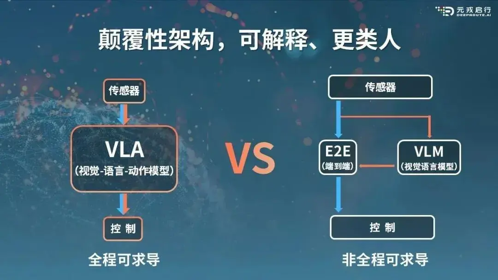
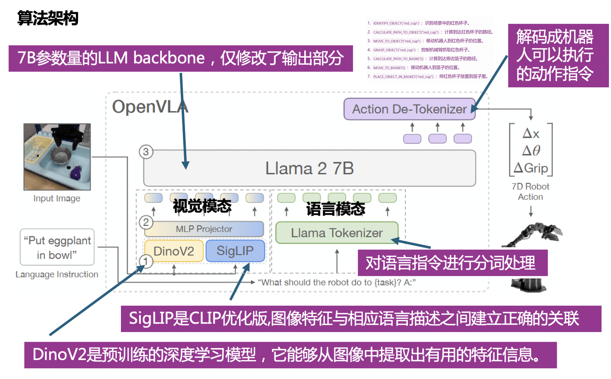

---

## 名词
### **Token embedding** 
是指：  把一个离散的 token 编号映射成一个连续向量的过程或结果。
##### 1.大模型不能直接处理文字，也不能直接理解 token 编号。

比如一个词被 tokenizer 编成编号：

```
cube → 3456
```

但是编号 `3456` 本身没有语义，只是一个索引。
##### 2.所以模型会查一张 **embedding 表**，把它变成一个向量：

```
3456 → [0.21, -0.44, 0.73, ...]
```

- 这个向量才是**模型真正参与计算的输入**
- 这样模型才能进行**矩阵乘法、注意力计算、相似度计算**
- embedding 向量不是人工规定的，而是**训练学出来**的。

训练之后，**语义相近的 token，它们的 embedding 往往也会更接近**。

##### 3.在 Llama2 里，每个 token 会变成一个高维向量。
Llama2 7B 的 hidden size 是 4096，所以每个 token 会被映射成一个 4096 维向量。

然后这些向量会被送进 Transformer 层，进行注意力计算


## 具身智能
### 1. 什么是具身智能 (What is Embodied AI)
具身智能（Embodied AI）是指能够在物理或虚拟环境中**通过感知、行动和交互**来学习与完成任务的人工智能。不同于仅在静态数据（文本、图像、语音等）上进行训练和推理的传统 AI，具身智能的智能体（agent）往往有一个“身体”（body）或“化身”（avatar），它们可以与环境交互，改变环境，并随着环境的改变自己作出调整。

**核心特征：**
- 拥有多模态感知能力（视觉、触觉、语音等）
- 能够执行动作并影响环境
- 学习可以通过**与环境交互**而不仅仅是被动监督完成

### 2. 具身智能与其他AI的区别 (Differences from Traditional AI)
具身智能与传统 AI 的主要区别在于它的**主动性、交互性，以及对动作数据的依赖**。传统 AI 可以利用互联网上丰富的图像、文本、语音等大规模数据集进行训练（参考LLM的成功），而具身智能体所需的动作数据必须通过与环境的真实交互来收集，这使得数据获取代价高昂且规模有限。一言以蔽之，数据问题是具身智能目前最大的bottleneck。那么很自然的两个关键问题是，

- 如何scale up机器人数据？ 例如：[GraspVLA](https://pku-epic.github.io/GraspVLA-web/)（在仿真中以合成的方式猛猛造）, [pi0](https://www.physicalintelligence.company/blog/pi0)和[AgiBot-World](https://agibot-world.com/)（在真实世界猛猛遥操采）, [UMI](https://umi-gripper.github.io/)和[AirExo](https://airexo.github.io/)（可穿戴设备，如外骨骼的高效数据采集装置）
- 在不能scale up机器人数据的情况下，如何利用好已有的数据实现你的目的？ 例如：[Diffusion Policy](https://diffusion-policy.cs.columbia.edu/) (100条机器人数据训一个特定任务的policy）, [Being-H0](https://arxiv.org/pdf/2507.15597)（利用human video参与policy训练），[MimicGen](https://mimicgen.github.io/)、[DemoGen](https://demo-generation.github.io/)、[Robosplat](https://yangsizhe.github.io/robosplat/)（从一条机器人轨迹中augment得到更多数据）

### 3. 研究具身智能的核心原则 (Core Principles)
- **首先把任务定义（task formulation）想清楚，而不是一开始就盯着模型**。在CV领域，研究者之所以可以直接关注模型，是因为任务往往已经被定义得很清晰，数据集也由他人整理好， 比如图像分类就是输入图片输出类别标签，检测就是输出四个数的bounding box；
    
    但在具身智能中，如何合理地建模任务、确定目标与评价指标，往往比模型选择更为关键。说白了，你得知道你想让机器人学会什么样的技能，输入是啥，输出是啥，用的什么传感器？你所研究的问题是否在合理的setting下？有没有有可能通过更好的setting来解决问题（比如机器人头部相机对场景观测不全，那我们可以考虑加装腕部相机，或者使用鱼眼相机）
    
- 必须认识到**用学习（learning）来解决机器人问题并不是理所当然的选择**。在许多场景中，传统的控制（Control）、规划（Planning）或优化方法（Optimization）依然高效且可靠，而学习方法更多是在任务复杂、环境多变(泛化性) 或缺乏解析建模手段时才展现优势。因此，做具身智能研究时，首先要想回答，为什么你研究的这件事传统robotics解决不了？为什么非得用learning？
## Vision-Language-Action Model（视觉-语言-动作模型）
VLA模型是在视觉语言模型（VLM）的基础上发展而来的。VLM是一种能够处理图像和自然语言文本的机器学习模型，它可以将一张或多张图片作为输入，并生成一系列标记来表示自然语言。然而，VLA不仅限于此，它还利用了机器人或汽车运动轨迹的数据，进一步训练这些现有的VLM，以输出可用于机器人或汽车控制的动作序列。通过这种方式，VLA可以解释复杂的指令并在物理世界中执行相应的动作。



==典型输入输出：==
- 输入：
    - 相机图像
    - 自然语言指令（“把红色积木放到盒子里”）
- 输出：
    - 关节角度 / 末端位姿 / 力 / 速度等动作

#### 优点
- 能听懂自然语言
- 泛化性强（新物体、新指令）
- 端到端，工程简单
#### 缺点
- 不懂物理、不懂因果
- 只在「静态图像 + 文本」上预训练
- 所有物理与时序 → 靠昂贵机器人示教学

## 世界模型（World Model）
指能够对环境或世界的状态进行表征，并预测状态之间转移的模型 。这个模型的核心目标是让AI系统能够像人类一样，在内部构建一个对外部物理环境的模拟和理解 。通过这种方式，AI可以在“脑海”中模拟和预测不同行为可能导致的后果，从而进行有效的规划和决策。世界模型的概念源于**认知科学和机器人学**，它强调**AI系统需要具备对物理世界的直观理解，而不仅仅是处理离散的符号或数据** 。例如，一个具备世界模型的自动驾驶系统，可以在遇到湿滑路面时，预判到如果车速过快可能会导致刹车距离延长，从而提前减速，避免危险。这种能力源于AI内部对物理规律（如摩擦力、惯性）的模拟，而不是简单地记忆“湿滑路面要减速”这条规则。
世界模型的构建通常依赖于大量的交互数据。智能体在环境中执行各种动作，并观察这些动作带来的结果。通过这些观察，模型学习到如何根据当前的世界状态和智能体采取的行动来预测下一个状态。训练的目标是最小化预测误差，即模型预测的状态与实际发生的状态之间的差异。这种学习方式使得模型能够内化关于物理规律、因果关系以及物体间相互作用的知识。例如，一个经过充分训练的世界模型能够理解“物体上升后必然会下落”这一基本物理常识，或者预测“推动一个物体会使其移动”这一简单因果关系。这种对世界的内在表征，被认为是实现通用人工智能（_AGI_）的关键一步，因为它赋予了AI系统真正的常识性理解能力，而不仅仅是模式识别或数据拟合。
#### 优点
- 显式学物理与时序
- 可用于规划和推演
- 数据效率高（可用视频）
####  缺点
- 生成视频计算昂贵
- 误差会逐步累积
- 单独用来控制不够稳定

