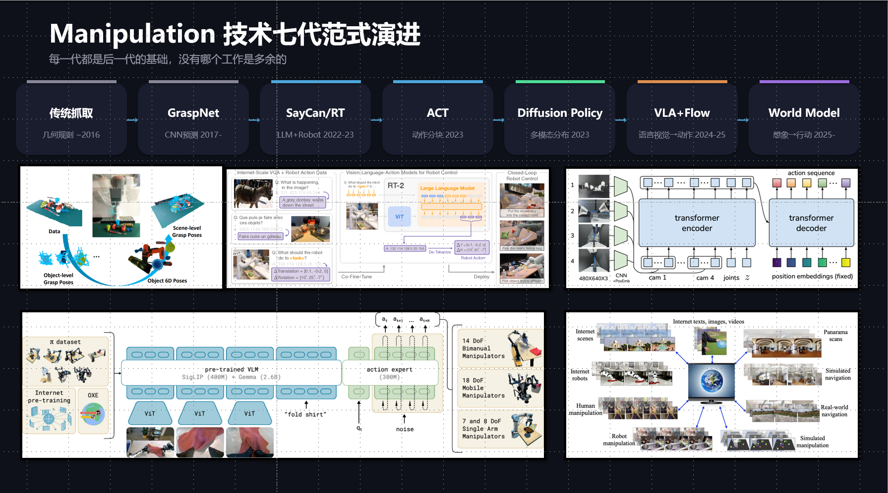
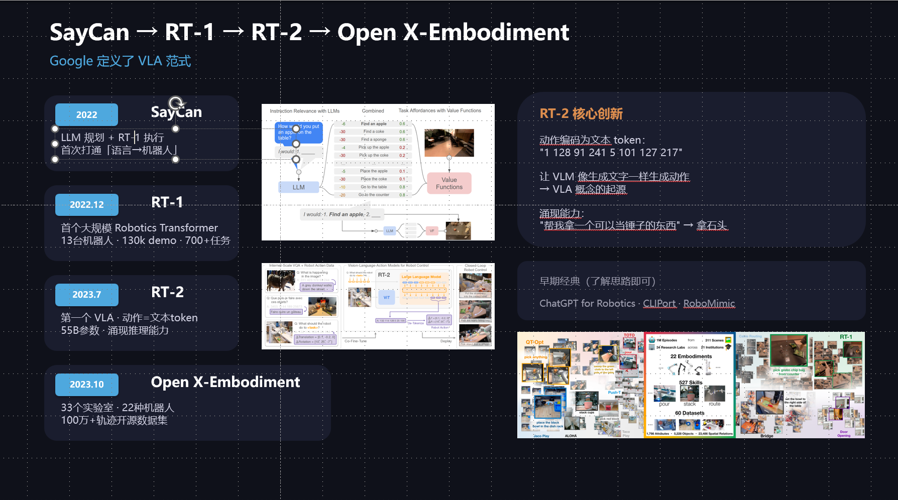
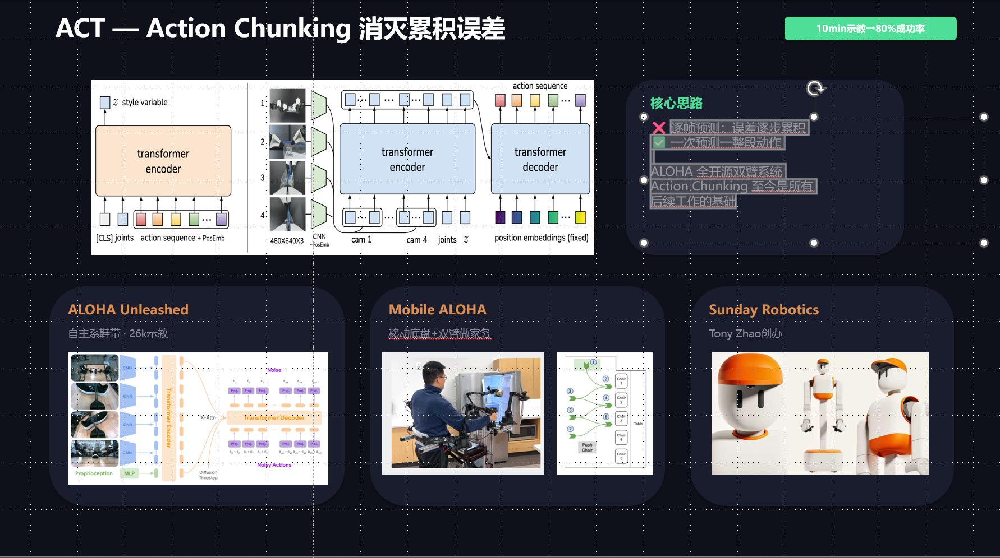
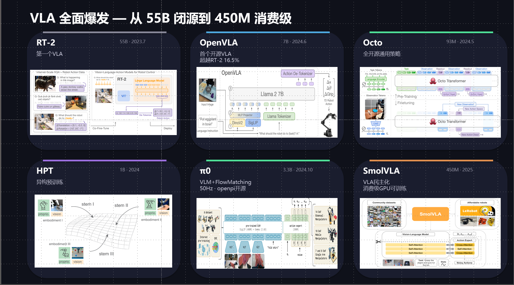
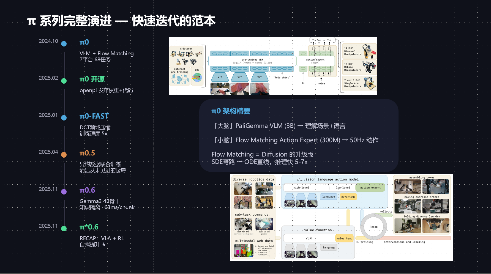
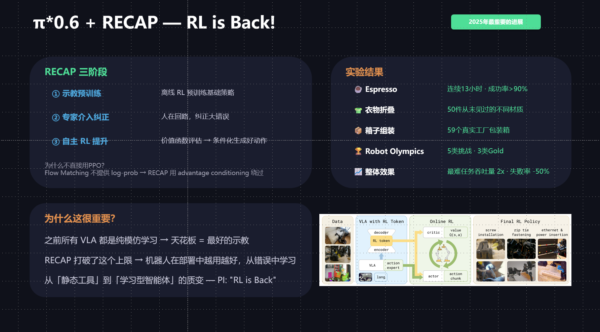
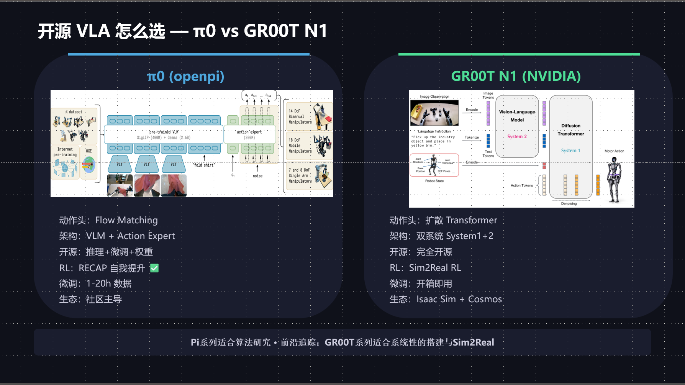
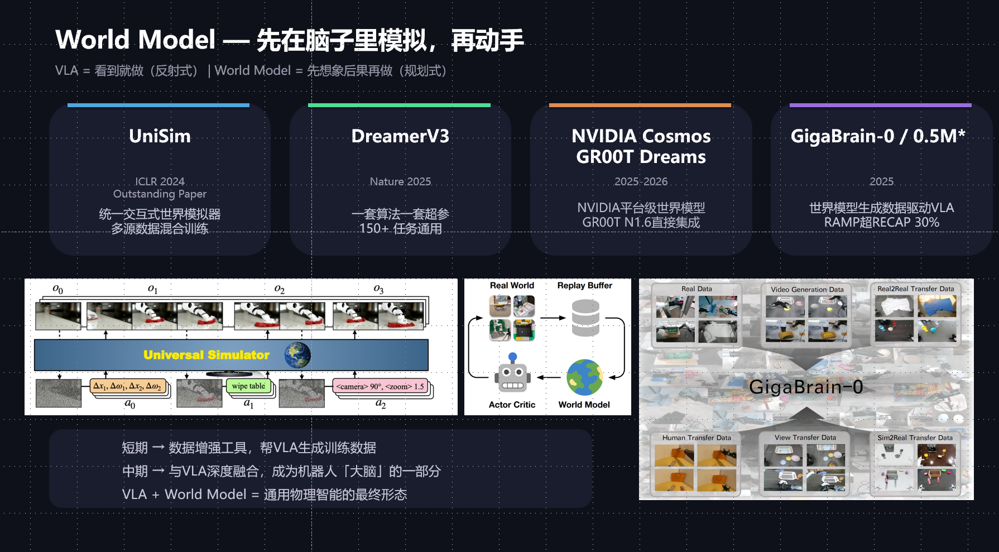
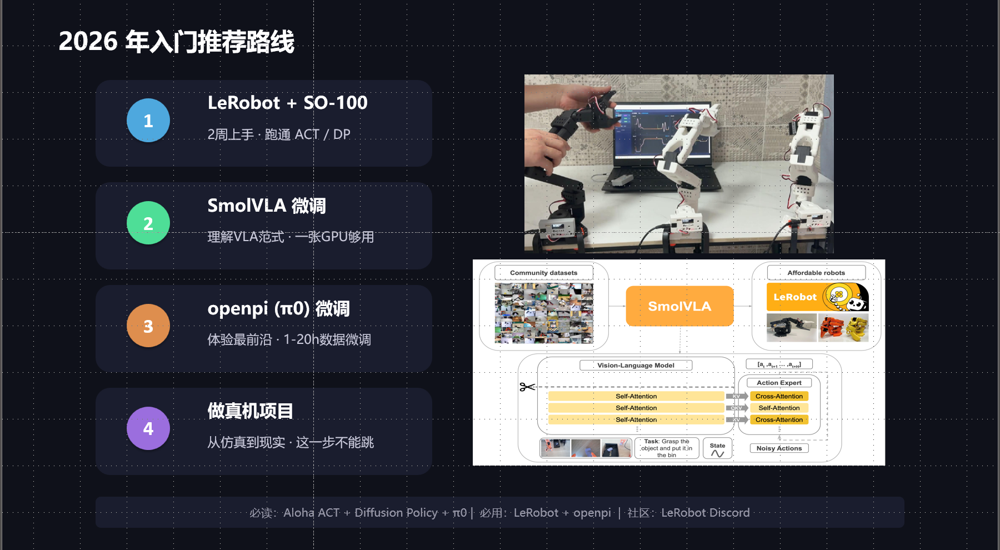
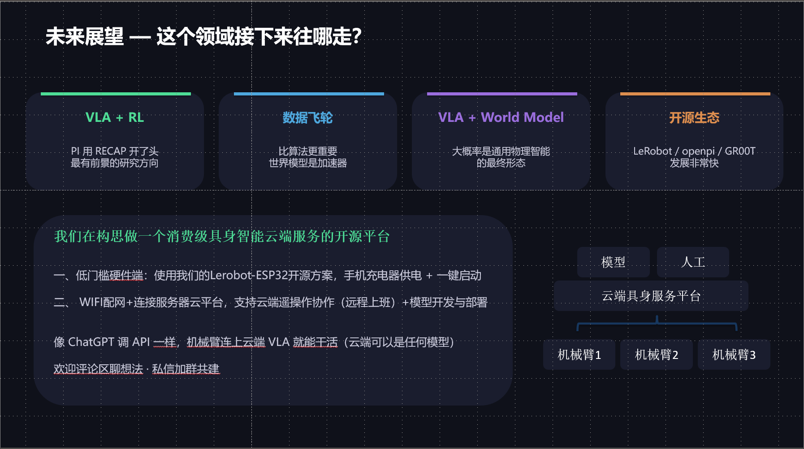

---

## 一、技术七代范式演进

**机器人操作（Manipulation）技术的发展不是某一代完全推翻前一代，而是在前面能力的基础上不断叠加和扩展。**  

Manipulation 技术的七代演进逻辑：

1. **传统抓取**：解决“能不能抓”
2. **GraspNet / CNN**：解决“能不能从数据中**学**会抓”
3. **SayCan / RT**：解决“能不能**听懂任务**并调度技能”
4. **ACT**：解决“长时序动作如何**减少误差累积**”
5. **Diffusion Policy**：解决“**多种合理动作**如何生成”
6. **VLA + Flow**：解决“视觉、语言、动作如何统一建模”
7. **World Model**：解决“机器人如何先预测后行动”

**从单步抓取 → 多任务控制 → 语言条件任务 → 稳定动作生成 → 通用视觉语言动作策略 → 具备预测和规划能力的智能体。**
### 1. 传统抓取：几何规则阶段（~2016）

这一阶段的核心任务是解决“机器人怎么抓住物体”。

主要方法依赖：
- 几何分析
- 深度图/点云
- 抓取姿态规划
- 人工设计规则

其特点是：
- 可解释性强
- 针对单步抓取效果较好
- 更像局部技能，而不是完整任务策略

局限在于：
- 很难处理复杂长时序任务
- 泛化能力弱
- 不能理解语言和高层任务目标

所以这一阶段解决的是最基础的“能抓”，但离“会做事”还很远。

---

### 2. GraspNet / CNN 预测阶段（2017-）

这一阶段开始把**深度学习**引入抓取任务。

核心变化是：
- 不再完全依赖手工几何规则
- 开始用 CNN 直接预测抓取点、抓取姿态或抓取质量

相较于传统几何方法，这一阶段的提升在于：
- 对复杂视觉场景的适应能力更强
- 能从数据中学习抓取模式
- 提高了抓取检测和泛化能力

但它本质上还是在解决“抓哪里、怎么抓”的问题，  
还没有真正进入“多步骤任务执行”和“通用机器人智能”的阶段。

---

### 3. SayCan / RT：LLM + Robot 阶段（2022-2023）

这一阶段的重要变化是：  
**机器人开始接入语言模型，能够理解任务指令。**

代表性思路：
- 用**大语言模型**做高层规划
- 用机器人已有技能做低层执行

这意味着机器人不再只是“看见物体去抓”，  
而是开始能处理类似：
- “帮我拿一瓶水”
- “把桌子上的垃圾丢掉”

这样的自然语言任务。

这一代的意义在于：
- **第一次真正把“语言”和“机器人动作”连接起来**
- 让机器人从“执行固定技能”走向“根据任务调度技能”

但问题是：
- **高层规划和低层执行仍然是分开的**
- 技能接口依赖人工设计
- 任务链条一长，误差和不稳定性就会增加

---

### 4. ACT：动作分块阶段（2023）

ACT 的核心思想是：  
**不要一帧一帧预测动作，而是一次预测一整段动作。**

为什么会提出这个方法？  
因为逐帧控制有一个严重问题：  
前一帧错一点，后一帧继续接着错，误差会不断累积，导致长任务越来越不稳定。

ACT 的解决方法是：
- 把连续动作按 chunk 分块
- 每次输出未来一小段动作序列
- 提高长时序任务的稳定性

它的重要意义在于：
- 显著缓解累积误差问题
- 特别适合双臂操作和精细任务
- 成为后续很多方法的基础思想

可以说，ACT 解决的是：
**机器人在长任务中“动作怎么稳定输出”的问题。**

---

### 5. Diffusion Policy：多模态动作分布阶段（2023）

这一阶段开始引入扩散模型来生成动作。

它出现的原因是：  
很多机器人任务不是只有唯一正确动作，而是存在**多种合理路径**。  
例如抓一个杯子，可以从左边抓，也可以从右边抓。

传统回归模型容易把这些不同解“平均”掉，结果就变成一个不合理的中间动作。  
扩散模型则不同，它把动作生成看成“从噪声逐步去噪”的过程，因此更适合处理多模态动作分布。

这一代的突破在于：
- 能表示多个可能的合理动作轨迹
- 对复杂接触任务更稳定
- 显著提升操作任务表现

所以 Diffusion Policy 解决的是：
**机器人动作不是单一答案时，该怎么生成合理动作。**

---

### 6. VLA + Flow：视觉语言到动作统一阶段（2024-2025）

这一阶段的核心是 **VLA（Vision-Language-Action）**。

也就是说，把：
- 视觉输入
- 语言指令
- 动作输出

放进同一个统一模型中。

相比前面的路线，这一代不再是：
- 语言模型负责规划
- 单独控制器负责动作

而是尝试直接学习：
$$
(\text{vision}, \text{language}) \rightarrow \text{action}
$$

这样做的意义是：
- 模型结构更统一
- 更容易形成跨任务、跨场景的泛化能力
- 更接近真正的通用机器人策略

其中 Flow Matching 可以看成 Diffusion 的进一步升级：
- 推理更快
- 轨迹生成更高效
- 更适合高频控制

因此这一阶段解决的是：
**如何把感知、语言理解和动作生成统一到一个端到端框架中。**

---

### 7. World Model：想象到行动阶段（2025-）

这一阶段比 VLA 更进一步。

VLA 更像“看到就做”，是一种偏反射式的策略；  
World Model 则强调：  
**机器人先在内部预测未来后果，再决定怎么行动。**

也就是：
- 先“想象”动作可能带来的结果
- 再选择更优动作
- 形成更强的规划和长期决策能力

它的重要意义在于：
- 不再只依赖当前观测直接反应
- 开始具有“预测未来”的能力
- 更适合复杂长任务、稀疏奖励任务和开放环境

可以理解为，World Model 解决的是：
**机器人不仅要会动，还要会在动之前先想一想。**

---

## 二、谷歌/DeepMind 的一部分过渡性工作(2022-2023)

**Google / DeepMind 在 2022 到 2023 年间，通过一系列连续工作，把机器人操作从“语言调技能”逐步推进到了“视觉-语言-动作统一建模”的 VLA 范式。**  
因此，这一页不是单独介绍几个模型，而是在展示一条非常清晰的技术演进路线：  
**[SayCan](https://say-can.github.io/?utm_source=chatgpt.com) → RT-1 → RT-2 → Open X-Embodiment。** 

1. **SayCan**：解决“语言任务如何映射到机器人可执行技能”  
2. **RT-1**：解决“机器人能不能直接学到统一的多任务控制策略”  
3. **RT-2**：解决“视觉、语言、动作能不能统一到一个生成模型中”  
4. **Open X-Embodiment**：解决“通用机器人模型所需的大规模跨平台数据从哪里来”  
  
**谷歌系工作一方面推动了机器人从“语言调技能”走向“VLA 范式”，另一方面也推动了通用机器人大模型所需的数据基础设施建设。**  
  
**SayCan 让机器人开始理解语言任务，RT-1 让机器人开始学统一策略，RT-2 让视觉-语言-动作真正合流，而 Open X-Embodiment 则为通用机器人策略提供了跨平台大规模数据底座。**

---
### 1. SayCan：语言规划 + 技能执行阶段（2022）

SayCan 可以看成是这条路线的起点。

它的核心思想不是让大模型直接输出机械臂底层动作，  
而是把机器人系统拆成两层：
==（zjx——Ps：貌似就是选择已经存在的技能）==
- 上层：大语言模型负责理解任务，并选择“下一步应该做什么”
- 下层：机器人已有技能系统负责判断“这个动作能不能做成”

因此，SayCan 的本质是：
**把“应该做什么”和“能不能做到”结合起来进行决策。**

例如，面对“帮我拿点喝的”这种指令时，  
系统不会直接生成控制量，而是先在高层规划步骤，再从已有技能中==选择==当前最合适、最可执行的那个技能。

这一代的重要意义在于：
- 第一次比较完整地打通了“自然语言任务 → 机器人执行”这条链路
- 让机器人开始具备基于语言指令调度技能的能力
- 开启了 LLM + Robot 的研究范式

但它的局限也很明显：
- 高层规划和低层执行仍然是分开的
- 依赖人工设计好的技能库
- 不是端到端动作生成
- 泛化能力仍然受限于已有技能集合

所以 SayCan 解决的是：
**机器人如何理解语言任务，并从已有技能中选出合适的一步。**

---

### 2. RT-1：大规模机器人 Transformer 阶段（2022.12）

RT-1 比 SayCan 更进一步。

它不再只是在高层“选技能”，  
**而是尝试直接用一个统一的 Transformer 模型来学习：**
- 图像输入
- 语言指令
- 动作输出

RT-1 的意义在于：
- 它把机器人控制看成一个可以通过大规模数据训练的序列建模问题
- 证明了多任务、多场景、多机器人数据可以显著提升泛化能力
- 让机器人策略开始向“大模型化”方向发展

PPT 中提到 RT-1 使用了：
- 13 台机器人
- 130k demo
- 700+ 任务

这些数字体现出的重点不是规模本身，而是一个关键结论：

> **机器人控制也可以像视觉、语言任务一样，通过大规模数据驱动训练出统一策略。** :contentReference[oaicite:2]{index=2} ([robotics-transformer1.github.io](https://robotics-transformer1.github.io/?utm_source=chatgpt.com))

这一代解决的是：
**机器人能不能不再依赖手工技能拼接，而是直接学会多任务控制策略。**

但它仍然不是完整 VLA，  
因为它更偏向“视觉 + 任务条件 → 动作”，语言推理和语义泛化能力还有限。

---

### 3. RT-2：VLA 雏形正式出现（2023.7）

RT-2 是这一页最关键的里程碑。

它最重要的创新是：  
**把动作表示成 ==token==，让视觉语言模型像生成文本一样生成动作。**

也就是说，在 RT-2 中：
- 视觉输入可以编码进模型
- 语言输入可以编码进模型
- 动作输出也被离散化为 token 序列

这样一来，模型的形式就变成了真正统一的：

$$
(\text{vision}, \text{language}) \rightarrow \text{action tokens}
$$

这就是为什么 RT-2 常被认为是早期 VLA 的代表作。  

这就是为什么 RT-2 常被视为早期 VLA 的代表性工作。  
PPT 中给出的动作编码示例：  
  
`"1 128 91 241 5 101 127 217"`  
  
本质上就是在说明：  
**机器人动作第一次被纳入了类似语言生成的统一表示框架。**  
  
RT-2 的意义在于：  
- 第一次较清晰地把视觉、语言、动作放进同一生成模型  
- 让机器人可以借助 VLM 的语义能力来增强任务理解  
- 展现出一定的“涌现推理”能力，例如根据指令选择“可以当锤子的东西”  
  
因此，RT-2 解决的是：  
  
**如何把视觉理解、语言理解和动作生成统一到一个模型中。**  
  
不过它也有明显局限：  
- 模型大，部署成本高  
- 动作 token 化虽然统一了表示，但连续控制精度和实时性仍受限制  
- 开源和工程可复现性不足  
  
---  
  
### 4. Open X-Embodiment：跨机器人大规模数据阶段（2023.10）  
  
如果说 RT-2 证明了 VLA 方向是可行的，  
那么 Open X-Embodiment 解决的就是另一个关键问题：  
  
**通用机器人策略所需的大规模数据从哪里来？**  
  
机器人领域长期有一个很大的瓶颈：  
每个实验室、每种机器人、每个任务的数据格式都不同，  
导致数据很难共享，模型也很难像 NLP 和 CV 一样依赖超大规模统一数据集预训练。  
  
Open X-Embodiment 的核心贡献就是：  
  
- 把多个实验室的机器人数据整理为统一格式  
- 融合不同机器人 embodiment 的真实世界轨迹  
- 让不同平台的数据可以被同一个模型共同利用  
- 为通用机器人策略预训练提供数据基础  
  
公开资料显示，Open X-Embodiment 包含：  
- **100 万+ 真实机器人轨迹**  
- **22 种机器人 embodiment**  
- **20 多家机构/21 个机构协作**  
- **500+ 技能、15 万+ 任务规模**  
  
因此，它的重要性不在于“又提出了一个新结构”，  
而在于它把机器人研究从：  
  
**单实验室、小数据、单平台闭环**  
  
推进到了：  
  
**跨平台、大规模、标准化数据驱动**  
  
这一代真正解决的是：  
  
**通用机器人模型所需的数据规模、多样性和标准化问题。**  
  
同时，Open X-Embodiment 不只是一个数据集概念，  
它背后还对应了 RT-X 这类跨机器人策略研究，说明作者们不只是“收集数据”，而是在探索：  
  
> **能否训练出真正跨 embodiment 的通用机器人策略。**  
  
所以它在这页里的作用非常关键：  
SayCan、RT-1、RT-2 给出了“模型范式”，  
而 Open X-Embodiment 给出了“把这种范式做大的数据基础设施”。  
  
---  
## 三、ACT：Action Chunking 消灭累积误差

这一页的核心观点是：  
**ACT 的提出，标志着机器人操作研究开始正面解决“长时序任务中的动作累积误差”问题。**  
它的重要性不在于模型特别大，而在于它抓住了机器人控制中的一个关键痛点：  
**逐帧预测虽然直观，但误差会一步一步积累，最终导致长任务崩掉。** 

1. **逐帧预测** 的主要问题是累积误差
2. **ACT** 通过动作分块，缓解了这一问题
3. **ALOHA** 让这条路线具备了低成本采数和真机验证能力
4. 因此，ACT 成为了后续很多操作策略方法的基础

所以，这一页的核心可以概括为：

**ACT 解决的不是“机器人会不会动”，而是“机器人在长任务中怎么更稳定地持续输出动作”。**

---

### 1. 为什么会提出 ACT

在很多早期的模仿学习或控制方法中，  
模型通常每一时刻只预测当前一步动作。

这种方式的问题在于：
- 当前一步如果稍微错一点
- 下一步又是在前一步错误基础上继续预测
- 误差会沿时间不断传播和放大

因此，在长时序、精细操作任务中，  
逐帧预测很容易出现：
- 动作越来越偏
- 接触过程不稳定
- 任务越长越容易失败

所以 ACT 的提出，本质上是在解决：

**机器人长任务中，动作为什么会越做越偏。**

---

### 2. ACT 的核心思想

ACT 的核心思想是：

**不要一帧一帧预测动作，而是一次预测一整段动作。**

也就是说，模型不是只输出当前时刻的一个动作，  
而是输出未来一小段连续动作序列，也就是一个 action chunk。

这样做的好处是：
- 可以从更长时间范围上建模动作
- 减少逐帧闭环带来的误差累积
- 让动作生成更加平滑和稳定

因此，ACT 不只是“改了一种输出形式”，  
而是在动作时间结构上做了重要改变。

---

### 3. ACT 的意义

ACT 的重要意义在于：

- 它显著缓解了长时序任务中的累积误差问题
- 特别适合双臂协作、精细操作和连续接触任务
- 让机器人在较少示教数据下也能取得较高成功率
- 成为后续很多操作策略方法的基础思想

PPT 中提到：
- 10 分钟示教即可达到较高成功率
- ALOHA 全开源双臂系统推动了这一方向快速传播

这说明 ACT 的影响力不仅来自论文本身，  
还来自它与低成本数据采集系统结合后，真正提升了具身智能实验的可复现性。:contentReference[oaicite:2]{index=2}

---

### 4. ALOHA 与 ACT 的关系

ALOHA 是 ACT 这条路线的重要承载平台。

它的价值在于：
- 提供了低成本、可复现的双臂遥操作系统
- 支持快速采集示教数据
- 让 ACT 这类方法不再只是论文方法，而是可以直接在真实系统中验证

后续像：
- ALOHA Unleashed
- Mobile ALOHA

都说明这条路线已经从“实验室验证”走向“更复杂真实任务”的扩展。

因此，ACT 的影响并不是孤立的模型创新，  
而是和“可采集数据、可做真机实验、可复现”的系统路线绑在一起的。:contentReference[oaicite:3]{index=3}

---

## 四、Diffusion Policy：扩散模型改变了一切

这一页的核心观点是：  
**Diffusion Policy 的意义在于，它把机器人动作生成从“单点回归”推进到了“多模态分布建模”。**  
这使得机器人在面对存在多种合理解的任务时，不再被迫预测一个折中的错误动作，而是能够生成一条合理的动作路径。

1. 机器人动作往往是多模态的，不存在唯一正确解
2. 普通回归容易把多种解平均掉，导致无效动作
3. Diffusion Policy 用生成式建模更好地表示合理动作分布
4. 这条路线后续又进一步演化到 Flow Matching 等更高效方法

所以，这一页的核心可以概括为：

**Diffusion Policy 让机器人动作建模从“单点预测”进入了“多模态生成”阶段。**

---

### 1. 为什么会出现 Diffusion Policy

在很多机器人任务中，  
同一个目标往往不止一种正确动作路径。

例如抓一个物体：
- 可以从左边接近
- 也可以从右边接近
- 可以先抬高再伸过去
- 也可以先平移再下压

也就是说，动作分布往往是多模态的。

如果用普通回归模型去学这些动作，  
模型很容易把这些不同解“平均”起来，  
最后输出一个不合理的中间动作。

因此，Diffusion Policy 的提出，本质上是在解决：

**当一个任务存在多种合理动作时，模型该如何表示这种多样性。**

---

### 2. Diffusion Policy 的核心思想

Diffusion Policy 的基本思路是：

**把动作生成看成一个从噪声逐步去噪的过程。**

它不是直接回归出一个确定动作，  
而是逐步生成一条合理动作轨迹。

这样做的好处是：
- 更适合建模复杂、多模态的动作分布
- 可以生成多种不同但合理的动作路径
- 更适合复杂接触、精细操作和长时序任务

因此，Diffusion Policy 的核心不是“用了扩散模型”这么简单，  
而是它改变了机器人动作建模的思维方式：

**动作不是一个唯一答案，而是一个条件分布。**

---

### 3. Diffusion Policy 的意义

PPT 中提到：
- 其在多个任务上平均超越此前 SOTA 46.9%
- 在机器人领域，这是极大的性能跃迁

这说明扩散模型在机器人中的价值非常明显：
- 它更能适应真实任务中的多解性
- 对接触过程和动作细节更鲁棒
- 在复杂操作任务上比简单回归更有优势

因此，这一代的核心突破在于：

**机器人动作生成不再只是预测“一个点”，而是建模“一类合理轨迹”。**

---

### 4. 从 Diffusion 到 Flow Matching

PPT 中还提到：

**Flow Matching 可以看作 Diffusion 的升级版。**

这意味着：
- Diffusion 路线证明了“生成式动作建模”是有效的
- 后续工作则开始继续追求更高效的推理和更快的动作生成

因此，Diffusion Policy 的意义不仅在于它本身效果好，  
还在于它为后续的：
- Flow Matching
- 更高频控制
- 更轻量生成式动作模型

铺平了道路。

---

### 5. 相关扩展方向

PPT 中提到的相关方向包括：
- **UMI**：通用操作接口
- **RDT-1B**：更大规模的机器人基础模型
- **DP3**：面向 3D 点云的扩展版本

这些工作共同说明：

**Diffusion 不再只是一个单独技巧，而是在逐渐成为机器人操作策略建模的重要范式。**

---

## 五、VLA 全面爆发：从闭源大模型到开源消费级
 
PPT 中列出了几个代表性方向：

- **RT-2**：第一个广为人知的 VLA 代表
- **OpenVLA**：首个影响力很大的开源 VLA
- **Octo**：全开源通用策略
- **HPT**：异构预训练路线
- **SmolVLA**：更轻量、消费级可训练
- **π0**：VLM + Flow Matching 路线
###  SmolVLA 和 π0 的意义

PPT 特别强调了：
- **SmolVLA**：消费级 GPU 可训练
- **π0**：VLM + Flow Matching，50Hz 控制，openpi 开源

这两条线非常有代表性：

SmolVLA 说明：
> VLA 不一定非要超大参数才能有研究价值。

π0 说明：
> VLA 不仅要会理解，还要能高频、连续、稳定地产生动作。

因此，这一阶段不只是“把模型做小”，  
而是在同时追求：

- 通用性
- 可训练性
- 可微调性
- 实时性
- 开源可复现性

---

## 六、π 系列完整演进：快速迭代的范本

这一页的核心观点是：  
**π 系列展示了具身智能领域一种非常典型的发展模式：先用一个强有力的基础架构打开局面，再通过快速迭代不断补足速度、泛化、异构数据利用和持续学习能力。**

---

### 1. π0：统一大脑与小脑

PPT 中把 π0 概括为：

- 「大脑」PaliGemma VLM（3B）  
- 「小脑」Flow Matching Action Expert（300M）

这个比喻很直观。

它的含义是：
- 大脑负责理解视觉和语言任务
- 小脑负责高频、连续地输出动作

这种设计说明 π0 并不是让一个大模型直接包办一切，  
而是把“理解”和“控制”分工处理。

其核心意义在于：
- 保留大模型的语义理解能力
- 同时兼顾机器人控制对实时性和精细动作的要求

---

### 2. 为什么 π0 很重要

π0 的重要性在于，它尝试同时解决两个问题：

第一，如何利用 VLM 的强语义能力；  
第二，如何让机器人动作生成足够快、足够稳定。

PPT 中强调：
- VLM + Flow Matching
- 50Hz 动作输出
- openpi 开源

这说明 π0 的目标不是只做一个“会说会看”的模型，  
而是一个真正能用于高频控制的 VLA 系统。

---

### 3. π 系列后续演进的逻辑

PPT 给出的后续演进包括：

- **π0-FAST**：强调训练速度提升
- **π0.5**：强调异构数据联合训练与未见环境泛化
- **π0.6**：进一步升级骨干网络与系统能力
- **π*0.6**：通过 RECAP 把 RL 引入 VLA

从这条线可以看出，π 系列不是单一模型，  
而是一条持续补能力的路线。

它的迭代逻辑大致是：

1. 先把 VLA 跑通
2. 再提升训练和推理效率
3. 再增强跨任务、跨环境泛化
4. 最后引入持续学习和 RL 提升能力上限

因此，π 系列的价值不只是某一版模型效果好，  
而在于它展示了：

**VLA 如何从“能跑”逐步进化到“更快、更稳、更会学”。**

---

## 七、π*0.6 + RECAP：RL is Back

这一页的核心观点是：  
**纯模仿学习虽然已经能让机器人学会很多技能，但它的上限始终受限于示教数据；RECAP 这类方法的意义，在于让 VLA 开始具备“越用越好”的能力。**

---

### 1. 为什么 VLA 还需要 RL

在纯模仿学习框架下，  
机器人学到的本质上是“人怎么做，我就怎么做”。

这带来一个很明显的上限：

- 如果示教里没有覆盖某种情况，模型就容易失败
- 如果部署环境比训练环境更复杂，模型适应能力有限
- 如果机器人执行中犯错，它通常不会自动变得更好

因此，纯模仿学习的能力上限，往往被示教质量和覆盖范围锁死。

这就是为什么 PPT 会强调：

**之前所有 VLA 基本都是纯模仿学习路线。**

---

### 2. RECAP 的核心思想

PPT 中把 RECAP 概括为三阶段：

1. **示教预训练**  
   用示教和离线 RL 打基础策略

2. **专家介入纠正**  
   人在回路，对大错误进行纠偏

3. **自主 RL 提升**  
   通过价值评估与条件化生成，继续提升策略质量

这条路线的核心含义是：

**机器人不再只是复现人的示范，而是开始利用部署经验继续优化自己。**

---

### 3. 为什么这一点很重要

这意味着机器人策略从：

- 静态的模仿模型

变成了：

- 能在部署中继续提升的学习型智能体

PPT 中给出的例子包括：
- 浓缩咖啡任务长时间稳定执行
- 衣物折叠应对未见材质
- 工厂包装箱组装
- 机器人竞赛挑战

这些例子本质上都在说明：

**RL 的引入开始帮助 VLA 突破纯示教上限。**

---

### 4. 这一页真正想表达什么

“RL is Back” 这句话的重点不是说传统强化学习原封不动回来了，  
而是说在 VLA 时代，RL 又重新变得重要了。

因为 VLA 解决了：
- 感知
- 语言理解
- 动作生成
- 初始技能获取

而 RL 接下来要解决的是：
- 部署中持续改进
- 更强的泛化
- 超越人类示教上限
- 从错误中恢复并学习

因此，这一页真正标志的是：

**具身智能开始从“会模仿”走向“会自我提升”。**

---

## 八、开源 VLA 怎么选：π0 vs GR00T N1

这一页的核心观点是：  
**当前开源具身智能路线已经不止一条，不同路线的重点不同；选择哪条路线，取决于你是偏算法研究，还是偏系统落地与 Sim2Real。** 

---

### 1. π0 路线的特点

PPT 中给出的 π0 特征包括：
- 动作头：Flow Matching
- 架构：VLM + Action Expert
- 开源：推理、微调、权重
- RL：支持 RECAP
- 微调：1-20h 数据
- 生态：社区主导

从这些特点可以看出，π0 更强调：
- 前沿算法路线
- VLA 架构创新
- 低门槛微调
- 社区快速迭代

因此，π0 更适合：
- 跟踪最新具身智能论文
- 做 manipulation 方向研究
- 做开源 VLA 微调实验
- 从小规模真实数据快速起步

---

### 2. GR00T N1 路线的特点

PPT 中给出的 GR00T N1 特征包括：
- 动作头：扩散 Transformer
- 架构：双系统 System 1 + 2
- 开源：完全开源
- RL：Sim2Real RL
- 微调：开箱即用
- 生态：Isaac Sim + Cosmos

这说明 GR00T 更强调：
- 系统级平台整合
- 仿真与现实协同
- 人形机器人和平台化能力
- NVIDIA 生态支撑下的工程闭环

因此，GR00T 更适合：
- 想做完整系统搭建
- 依赖仿真平台加速开发
- 做 Sim2Real 迁移
- 偏工程平台化部署

---

### 3. 这一页真正的意思

这页并不是简单比较哪个更强，  
而是在提醒读者：

**开源 VLA 已经进入路线分化阶段。**

也就是说，未来不会只有一个统一答案，  
而会出现不同生态下的不同主线：

- 一条偏社区、偏研究、偏 manipulation 的路线
- 一条偏平台、偏系统、偏仿真到现实的大工程路线

所以选择框架时，  
关键不是“谁最好”，  
而是“谁更适合你的目标”。

---

## 九、World Model：先在脑子里模拟，再动手

这一页的核心观点是：  
**VLA 更偏“看到就做”的反射式策略，而 World Model 的目标是让机器人先预测未来后果，再选择动作。**  
因此，World Model 被看作具身智能下一阶段的重要方向。:contentReference[oaicite:4]{index=4}

---

### 1. 为什么 VLA 还不够

VLA 的优势在于：
- 感知、语言、动作统一
- 端到端建模能力强
- 多任务泛化能力好

但它仍然更像一种“反应式系统”：
- 看见当前场景
- 理解当前任务
- 立刻输出动作

这在很多任务上已经足够强，  
但在更复杂、长时序、需要规划和试错的任务中，  
仅靠当前观测直接反应可能还不够。

因此，下一步自然会提出一个问题：

**机器人能不能在行动前，先想象一下结果会怎样？**

---

### 2. World Model 的核心思想

World Model 的核心思想是：

**学习一个内部世界模型，用来预测动作会带来什么后果。**

这样机器人就不再只是“看见就做”，  
而是可以：
- 先模拟未来可能状态
- 比较不同动作的结果
- 再选择更优动作

也就是说，它让机器人开始具备：
- 预测能力
- 规划能力
- 更长时域的决策能力

---

### 3. 这一方向的意义

PPT 中提到：
- 短期：World Model 可作为数据增强工具
- 中期：与 VLA 深度融合
- 长期：成为机器人“大脑”的一部分

这说明 World Model 当前并不一定是直接替代 VLA，  
而更像是在逐步增强 VLA：

- 先帮助生成更多训练数据
- 再帮助提升泛化和规划
- 最终与动作策略深度耦合

因此，它的真正意义在于：

**把机器人从“高水平反射”进一步推进到“具备内部预测和想象能力”。**

---

### 4. 代表性方向

PPT 中列出的方向包括：
- **UniSim**
- **DreamerV3**
- **NVIDIA Cosmos / GR00T Dreams**
- **GigaBrain**

这些工作虽然路径不同，  
但共同目标都是：

**让机器人能通过内部世界建模，获得更强的规划、生成和泛化能力。**

---

## 十、新手路径

## 十一、未来展望：这个领域接下来往哪走
1. VLA + RL 将推动机器人持续学习
2. 数据飞轮会成为比单纯算法更关键的竞争点
3. VLA 与 World Model 的融合可能通向更通用的物理智能
4. 开源生态会继续加速整个领域发展

所以，这一页的核心可以概括为：

**具身智能的未来，不只是更大模型，而是更强数据闭环、更强自我提升能力，以及更完整的预测—行动统一架构。**

### 1. VLA + RL

PPT 认为：
- PI 用 RECAP 开了头
- VLA + RL 是最有前景的研究方向之一

这说明未来一个重要趋势是：

**机器人不再只依赖离线示教，而是开始从部署中继续提升。**

这会推动具身智能从静态模仿系统走向持续学习系统。

---

### 2. 数据飞轮

PPT 特别强调：

**数据飞轮比单纯算法更重要。**

这是因为在具身智能里，  
数据不仅难采，而且决定了：
- 泛化上限
- 场景覆盖范围
- 模型适应能力
- 真实部署效果

所以未来谁能建立更高效的数据采集、筛选、纠错、回流机制，  
谁就更可能建立优势。

---

### 3. VLA + World Model

PPT 给出的判断是：

**VLA + World Model 很可能是通用物理智能的最终形态。**

这个判断背后的逻辑是：
- VLA 擅长感知理解与动作输出
- World Model 擅长未来预测与规划
- 两者结合，更有可能形成完整的机器人智能闭环

因此，这很可能是未来几年最重要的融合方向之一。

---

### 4. 开源生态加速

PPT 中强调：
- LeRobot
- openpi
- GR00T

这些开源生态发展很快。

这意味着未来具身智能不会只由少数大厂封闭推动，  
而会越来越依赖：
- 开源框架
- 社区协作
- 可复现系统
- 云端部署与共享平台

---

