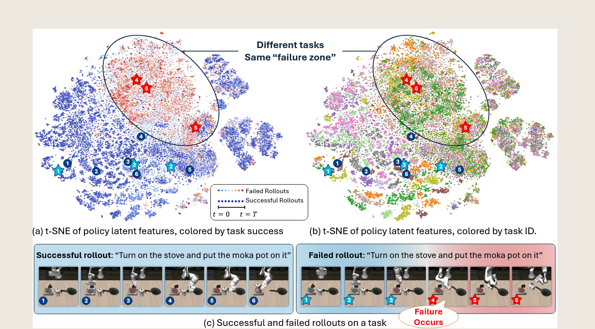

---

# (2025) SAFE: Multitask Failure Detection for Vision-Language-Action Models

| <!-- -->                                                                                                                                                                                                                                                                                                                                                                                                                                                                                                                                                                                                                                                                                                                                                                                                                                                                                                                                                                                                                                                                                                                                                                                                                                                                                                                                                                                                                                                                                                                                                                                                                                                                                                                                                                                                                                                                                    |
| ------------------------------------------------------------------------------------------------------------------------------------------------------------------------------------------------------------------------------------------------------------------------------------------------------------------------------------------------------------------------------------------------------------------------------------------------------------------------------------------------------------------------------------------------------------------------------------------------------------------------------------------------------------------------------------------------------------------------------------------------------------------------------------------------------------------------------------------------------------------------------------------------------------------------------------------------------------------------------------------------------------------------------------------------------------------------------------------------------------------------------------------------------------------------------------------------------------------------------------------------------------------------------------------------------------------------------------------------------------------------------------------------------------------------------------------------------------------------------------------------------------------------------------------------------------------------------------------------------------------------------------------------------------------------------------------------------------------------------------------------------------------------------------------------------------------------------------------------------------------------------------------- |
| **作者:** Qiao Gu; Yuanliang Ju; Shengxiang Sun; Igor Gilitschenski; Haruki Nishimura; Masha Itkina; Florian Shkurti;                                                                                                                                                                                                                                                                                                                                                                                                                                                                                                                                                                                                                                                                                                                                                                                                                                                                                                                                                                                                                                                                                                                                                                                                                                                                                                                                                                                                                                                                                                                                                             |
| **期刊: , 2025.**                                                                                                                                                                                                                                                                                                                                                                                                                                                                                                                                                                                                                                                                                                                                                                                                                                                                                                                                                                                                                                                                                                                                                                                                                                                                                                                                                                                                                                                                                                                                                                                                        |
| **期刊分区:**                                                                                                                                                                                                                                                                                                                                                                                                                                                                                                                                                                                                                                                                                                                                                                                                                                                                                                                                                                                                                                                                                                                                                                                                                                                                                                                                                                                                                                                                                                                                                                                                                                                                                                                                                                             |
| **本地链接: **<a href="zotero://open-pdf/0_G822V9T9" rel="noopener noreferrer nofollow">Gu 等 - 2025 - SAFE Multitask Failure Detection for Vision-Language-Action Models.pdf</a>                                                                                                                                                                                                                                                                                                                                                                                                                                                                                                                                                                                                                                                                                                                                                                                                                                                                                                                                                                                                                                                                                                                                                                                                                                                                                                                                                                                                                                                                                                    |
| **DOI: **<a href="https://doi.org/10.48550/ARXIV.2506.09937" rel="noopener noreferrer nofollow">10.48550/ARXIV.2506.09937</a>                                                                                                                                                                                                                                                                                                                                                                                                                                                                                                                                                                                                                                                                                                                                                                                                                                                                                                                                                                                                                                                                                                                                                                                                                                                                                                                                                                                                                                                                                                                                                   |
| **摘要: ***While vision-language-action models (VLAs) have shown promising robotic behaviors across a diverse set of manipulation tasks, they achieve limited success rates when deployed on novel tasks out of the box. To allow these policies to safely interact with their environments, we need a failure detector that gives a timely alert such that the robot can stop, backtrack, or ask for help. However, existing failure detectors are trained and tested only on one or a few specific tasks, while generalist VLAs require the detector to generalize and detect failures also in unseen tasks and novel environments. In this paper, we introduce the multitask failure detection problem and propose SAFE, a failure detector for generalist robot policies such as VLAs. We analyze the VLA feature space and find that VLAs have sufficient highlevel knowledge about task success and failure, which is generic across different tasks. Based on this insight, we design SAFE to learn from VLA internal features and predict a single scalar indicating the likelihood of task failure. SAFE is trained on both successful and failed rollouts, and is evaluated on unseen tasks. SAFE is compatible with different policy architectures. We test it on OpenVLA, π0, and π0-FAST in both simulated and real-world environments extensively. We compare SAFE with diverse baselines and show that SAFE achieves state-of-the-art failure detection performance and a favorable trade-off between accuracy and detection time using conformal prediction. More qualitative results and code can be found at the project webpage: https://vla-safe.github.io/.* |
| **标签:**                                                                                                                                                                                                                                                                                                                                                                                                                                                                                                                                                                                                                                                                                                                                                                                                                                                                                                                                                                                                                                                                                                                                                                                                                                                                                                                                                                                                                                                                                                                                                                                                                                                                                                                                                                               |
| **笔记日期: **2026/4/2 19:41:40                                                                                                                                                                                                                                                                                                                                                                                                                                                                                                                                                                                                                                                                                                                                                                                                                                                                                                                                                                                                                                                                                                                                                                                                                                                                                                                                                                                                                                                                                                                                                                                                                                                     |

## 📜 研究核心

***

> Tips: 做了什么，解决了什么问题，创新点与不足？
>
> 从 VLA 的最后一层 latent feature 中提取表征，训练一个轻量的分数预测器 SAFE，输出当前时刻失败的可能性，再用 conformal prediction 给出一个带理论保证的动态阈值，超过阈值就报警。

### ⚙️ 内容
#### 相关工作：
##### 1. Vision-Language-Action Models
这一部分先交代论文所处的大背景：近几年随着大规模机器人示范数据和大模型的发展，出现了很多 **VLA 模型**。这类模型通常从大视觉语言模型初始化，继承了图像和语言理解能力，再接一个动作头输出连续控制信号。动作生成方式包括离散分箱、diffusion、频域 tokenization 等。

VLA 的确已经能在新环境中完成熟悉任务，甚至在给出新语言指令时处理部分未见任务，但真实部署效果仍然不稳定。论文里提到，很多当前最强的 VLA 在真实机器人、未见任务指令上的开箱成功率通常只有 **30%–60%**，所以必须配套一个更可靠的 **多任务失败检测器**。

##### 2. Failure Detection in Robot Manipulation
机器人操作里的 failure detection 大致可以分成两类：
- **无监督 OOD 检测**
- **有监督 failure detection**
###### 2.1 无监督 OOD 检测
这类方法把“成功执行”视为正常分布，只要偏离正常分布，就认为可能失败。  
但作者认为这个假设对 **generalist VLA** 不太合适，因为 VLA 在测试时本来就会经常遇到**未见任务**。未见任务和训练分布不同，并不一定代表失败，所以“只要 OOD 就当失败”这个逻辑过于保守。
###### 2.2 有监督失败检测

这类方法会同时利用成功和失败 rollout 来训练检测器。SAFE 被作者归到这一类。  
不过，已有方法大多是 **每个任务单独训练一个检测器、单独校准一个阈值**，更适合单任务 setting，不适合通用型 VLA。SAFE 的不同点在于：它想做的是 ==**一个统一的、多任务共享的 failure detector**==，可以直接服务于 generalist policy。

##### 3. 最近一些多任务方法，以及它们的不足

作者还提到，已经有少量工作开始探索多任务 failure detection，例如：
- 基于 **action consistency score** 的方法
- 通过 **instruction-finetuning 大 VLM** 来做检测的方法
但这些方法有明显问题：
- 要么需要 **多次采样动作**
- 要么需要 **额外查询一个大 VLM**

这会带来比较重的推理开销，不利于真实机器人实时控制。作者借这一点引出 SAFE 的优势：  
**SAFE 不走“多次采样”或“额外大模型查询”这条路，而是==直接利用 VLA 内部特征做轻量检测==。**

#### 问题表述：
- 做一个多任务 failure detector，让它在 generalist VLA 遇到新任务时也能工作。

在时间步 t，VLA 的输入观测 $o_t$​ 包括：

- RGB 图像
- 自然语言指令
- 当前机器人状态

$$
然后 VLA 会输出一个控制信号 A_t​，它不是只输出一步动作，而是输出**未来一小段时间的动作 chunk**：
$$
$$A_t = [a_t, a_{t+1}, \dots, a_{t+H-1}]
$$
也就是一次规划出接下来 H 步的动作。随后系统实际只执行前 H 步执行完后再重新规划:
- 先看当前观测
- 预测一段动作序列
- 执行其中一部分
- 然后再 replanning

##### 1.论文定义了哪些中间变量
作者还定义了两个很关键的内部表示：
###### （1）内部特征向量 $e_t$ ——生成 token 之前，模型内部的隐藏表示
这是 **VLA 在时刻 (t) 的内部 embedding / latent feature**。  
- “==**模型在看完图像、语言指令和机器人状态之后，在脑子里形成的一份“内部语义表示”。**==”
- **神经网络中间层的高维向量**
- 
后面 SAFE 主要就是拿这个东西来做 failure detection。
###### （2）token 序列 $W_t$ ——模型生成的动作 token 序列
有些 ==VLA 在把动作变成真正控制量之前，会先解码出一串 token==：
$$  
W_t = [w_t^1, \dots, w_t^m]  
$$
- 然后再把 token 转成动作向量。==**这个定义主要是为了兼容不同类型的 VLA**==，因为有些 baseline 会利用 token 概率做不确定性估计。
- 所以这一节其实也是在统一符号，让后面不同方法都能放到同一个框架里比较。
- 论文附录里就写了：像 **OpenVLA 和 $\pi0$-FAST** 这类模型，都是**先预测一串离散 token，再把它们转换成连续动作**。作者取的内部特征，就是这些 token 真正被解码成输出 token 之前，最后一个 transformer block 里的隐藏特征。

##### 2. 训练和评测数据是什么样的
作者会让 VLA 去不同任务里跑 rollout，然后收集一条条轨迹：  
$$
\tau_i = {(o_t, e_t, W_t, A_t)}_{t=0,H',...,nH'}  
$$

整条轨迹持续时间是 $T = nH'$。  
每一条 rollout 最后会被标一个**轨迹级标签** $y_i$：
- ($y_i$= 1)：任务失败
- ($y_i$ = 0)：任务成功
==**训练时只需要轨迹级标签，不需要知道“从哪一个具体时刻开始失败”。**==
这意味着作者把标注要求压低了很多。  
不用逐帧人工标“这里开始错了”，只要知道这次 rollout 最终成了还是没成就行。
##### 3. failure detector 的输入输出怎么定义:
作者定义的 detector 是这样工作的：

在时刻 (t)，它接收**截至当前时刻为止的 rollout 信息**，输出一个 failure score $s_t$，表示：
**当前任务执行失败的可能性有多大。**

然后把这个分数和阈值 $(\delta_t)$ 比较：
- 如果$(s_t > \delta_t)$，就触发 $failure flag$
- 一旦触发，就可以：
    - 中止任务
    - 让人类接管
    - 或者触发其他安全机制
这就是它的在线检测定义。

换句话说，这个模块不是最后才判断“成功还是失败”，而是要在==**执行过程中动态报警**。==

##### 4. 阈值怎么来

这一节最后还说了，阈值 $(\delta_t)$ 不是手工随便定的，而是用 **conformal prediction** 来校准。

这点在 Problem Formulation 里只是先提一下，真正的方法细节放在后面。  
==但在问题定义层面，它说明作者不是只做“输出一个分数”，而是连“何时触发报警”这个判定规则也纳入正式框架了。==

##### 5. 训练/测试设定：seen task 和 unseen task
实验里，作者把所有任务分成两部分：
- **seen tasks**
- **unseen tasks**
其中：
- seen tasks 的 rollout 用来训练 $(D_{\text{train}})$
- seen tasks 的一部分验证集 $(D_{\text{eval-seen}})$ 用来调参
- unseen tasks 的 rollout $(D_{\text{eval-unseen}})$ **完全留作最终测试**，专门考察跨任务泛化能力
    
也就是说，failure detector 在测试 unseen tasks 时：
- **不能再收集新任务数据训练**
- **不能在新任务上微调**
- 只能直接拿训练好的 detector 去测
    
这就是这篇论文 problem formulation 最核心的地方：
**它把 failure detection 明确定义成一个“跨任务零样本泛化”的问题。**

###### 8. 这一节真正想表达的核心思想:

==**作者把问题定义为：给定 VLA 执行任务时产生的观测、动作、token 和内部特征轨迹，只利用训练任务上的成功/失败 rollout 来训练一个检测器，使其在执行过程中输出 failure score，并在未见任务上也能通过阈值判断及时报警。**==

### 💡 创新点

“• 我们对VLA特征空间进行分析,结果表明,在不同任务指令和环境中,VLA的内部 特征能够显著区分成功与失败的部署结果。

• 我们提出SAFE,一种专为通用机器人策略设计的多任务故障检测器。通过基于潜 在特征的操作、多任务训练以及共形预测方法的应用,SAFE在检测未见任务上的 故障时展现出良好的泛化能力。

• 我们在多个近期大型VLA模型上对SAFE及多种基线方法进行了仿真与实际场景下 的评估。实验结果表明,SAFE不仅优于基线方法,还实现了最先进的 SOTA 性 能。” (<a href="zotero://select/library/items/S5E4ZDRC">Massarelli 等, 2019, p. 2</a>)

### 🧩 不足

## 🔁 研究内容

***

### 💧 数据

### 👩🏻‍💻 方法
#### 4.1 方法总览

这一部分提出了论文的核心方法 **SAFE**。整体目标是：

在机器人执行任务的过程中，利用 **VLA（Vision-Language-Action）模型的内部特征**，实时判断当前执行是否正在走向失败，并在必要时及时报警。

作者的方法分成三步：

1. **分析** VLA 的 latent space，==证明失败信息确实存在于内部表征==中  
2. **设计**轻量的 ==failure detector==，从 ==latent feature== 中预测 ==failure score==  
3. 使用 ==conformal prediction== 给出==动态阈值==，决定何时触发 failure flag

#### 4.2 VLA latent space 的可视化分析
这一节的作用不是正式提出算法，而是回答一个关键问题：

**为什么可以直接利用 VLA 的内部特征来做失败检测？**

==**任务为：打卡煤气灶，然后把moka锅放在上面**==
- 轨迹：
$$
\tau_i = {(o_t, e_t, W_t, A_t)}_{t=0,H',...,nH'}  
$$
作者对 VLA 的 latent feature 做了可视化分析，发现：

- 成功轨迹和失败轨迹在特征空间中可以区分
- ==不同任务虽然语义不同，但失败**轨迹**往往会进入相似的区域==
- 作者把这个区域称为 **failure zone**

==关于 **failure zone**：==
- ==一条轨迹里有很多时刻==
- ==每个时刻都有一个内部特征 $e_t$==
- ==作者把这些时刻特征都画到特征空间里==
- ==发现**失败轨迹中的后期特征点**，常常聚到某个区域==
- ==于是事后把这块现象上明显对应失败的区域，称为 failure zone==

也就是说，==VLA 的内部表示不仅编码了视觉和语言信息，也编码了“当前执行是否正常”这种高层语义。==

对于失败轨迹，往往在任务开始时和成功轨迹相似，但当真正出现错误后，特征会逐渐偏离正常区域并进入 failure zone。成功轨迹则通常不会进入该区域。

这一观察为后续方法提供了理论和直觉基础：

**如果失败模式在 ==latent space== 中具有可分性，那么就可以训练一个轻量检测器直接从这些特征中读出失败信号。**

---

#### 4.3 基于特征探测的失败检测 failure detector

##### 4.3.1 基本思想
SAFE 的核心思想是：
不重新训练整个 VLA，而是把**已经训练好的 VLA 当成一个强大的表征提取器，然后只在它的内部特征上加一个很小的 probe，来预测失败分数**。

设 VLA 在时刻 $t$ 的内部特征为：
$$e_t$$
那么 SAFE 希望根据截至当前时刻的特征历史 $e_{0:t}$ 输出一个 failure score：
$$s_t = f(e_{0:t})$$
其中：
- $s_t$ 越大，表示当前越可能失败
- $s_t$ 越小，表示当前执行越正常
##### 4.3.2 为什么选择最后一层特征

作者使用的是 **VLA 最后一层的 latent feature**，而不是原始图像特征，也不是最终动作输出。

原因是：
- 最后一层特征已经融合了视觉、语言、机器人状态和动作决策信息
- 这种表征更接近“任务是否被正确执行”的高层语义
- 比单纯的视觉 foundation model 特征更适合 failure detection

所以 SAFE 的输入本质上不是外部观测，而是 **VLA 内部的高层决策表征**。
##### 4.3.3 SAFE-MLP

SAFE 的第一个实现版本是 **SAFE-MLP**。

它的做法是：对每一个时刻的特征 $e_t$，用一个小型 MLP 映射成一个标量，再通过 sigmoid 转换为该时刻的局部失败贡献，最后把这些贡献累计起来形成当前时刻的 failure score。

公式为：

$$f_{\mathrm{MLP}}(e_{0:t}) = \sum_{\tau=1}^{t} \sigma(g(e_\tau))$$

其中：

- $g(\cdot)$ 表示一个 MLP
- $\sigma(\cdot)$ 表示 sigmoid 函数
- $\sigma(g(e_\tau))$ 表示第 $\tau$ 时刻对失败分数的贡献

这个公式的含义可以理解成：

- 每一帧都会被评估一次“危险程度”
- 随着时间推进，这些危险程度不断累积
- 如果轨迹越来越不正常，累计分数就会越来越高

因此 SAFE-MLP 更像是一种 **逐时刻打分再累加** 的机制。
##### 4.3.4 SAFE-MLP 的训练损失

SAFE-MLP 的训练使用的是基于轨迹标签的损失函数。设第 $i$ 条轨迹的标签为 $y_i$：

- $y_i = 1$ 表示失败轨迹
- $y_i = 0$ 表示成功轨迹

其损失写为：

$$L_{\mathrm{MLP}} = \sum_i \left[ y_i \sum_t (t - s_t) + (1-y_i)\sum_t s_t \right]$$

这个损失的直观意义是：

- 对于失败轨迹，希望 $s_t$ 尽可能大
- 对于成功轨迹，希望 $s_t$ 尽可能小

因此模型会学习到：

- 成功轨迹在整个过程中应保持低风险分数
- 失败轨迹应逐渐累积并表现出更高的风险分数

##### 4.3.5 SAFE-LSTM

第二个版本是 **SAFE-LSTM**。

它不是逐帧单独打分，而是把整个特征序列输入 LSTM，让 LSTM 直接根据时序上下文来输出当前 failure score。

公式为：

$$f_{\mathrm{LSTM}}(e_{0:t}) = \sigma(\mathrm{LSTM}(e_{0:t}))$$

这里的含义是：

- LSTM 接收从时刻 $0$ 到时刻 $t$ 的全部特征
- 它通过隐藏状态建模历史信息
- 最后输出一个标量，并通过 sigmoid 压缩到 $[0,1]$ 区间

因此 SAFE-LSTM 更像是在做：

**基于完整历史上下文的时序风险判断。**

和 SAFE-MLP 相比：

- SAFE-MLP 更简单，更偏向逐帧独立评分再累积
- SAFE-LSTM 更强调时间依赖关系和上下文建模

---

##### 4.3.6 SAFE-LSTM 的训练损失

SAFE-LSTM 使用的是 binary cross entropy 损失：

$$L_{\mathrm{LSTM}} = \sum_i \sum_t \left[ y_i \log(s_t) + (1-y_i)\log(1-s_t) \right]$$

它的目标很直接：

- 对失败轨迹的每个时刻，希望 $s_t$ 接近 $1$
- 对成功轨迹的每个时刻，希望 $s_t$ 接近 $0$

这样训练后，模型就可以在在线执行时输出一个连续变化的 failure probability score。

---

#### 4.4 基于 conformal prediction 的阈值选择

#### 4.4.1 为什么还需要阈值

前面 SAFE 已经能够输出 failure score $s_t$，但是仅有分数还不够，因为真正部署时还要回答一个问题：

**多大的分数才意味着“现在应该报警”？**

如果阈值设得太低，会频繁误报。  
如果阈值设得太高，又可能错过真正的失败。

所以作者引入了 **functional conformal prediction**，通过校准成功轨迹的分数分布，自动构造一个动态阈值带。

---

#### 4.4.2 基本思想

作者在 calibration set 上，只使用 **成功轨迹** 的 failure score 曲线进行统计，构造一个随时间变化的 prediction band。

直观上，这个 band 表示：

对于正常成功执行，分数轨迹通常应该落在什么范围内。

如果在测试时，某个 rollout 的 failure score 超出了这个正常范围，就说明它很可能已经偏离成功执行模式，应被判定为失败。

也就是说，阈值不再是一个固定常数，而是一个和时间有关的函数 $\delta_t$。

然后在测试时进行判断：

$$s_t > \delta_t$$

若成立，则触发 failure flag。

---

#### 4.4.3 这种做法的优势

使用 conformal prediction 的好处有三点：

1. 阈值是数据驱动得到的，而不是人工拍脑袋设定  
2. 阈值随时间变化，更适合轨迹这种时序过程  
3. 在一定假设下，它可以给出理论上的覆盖保证，使检测更可信

因此 SAFE 不只是一个打分模型，而是一个完整的在线失败检测框架。

---

#### 4.5 第四部分方法的完整流程

将第四部分串起来，整个方法流程如下：

1. 从 VLA 中提取最后一层 latent feature $e_t$  
2. 将特征序列 $e_{0:t}$ 输入 SAFE-MLP 或 SAFE-LSTM  
3. 得到当前时刻的 failure score $s_t$  
4. 使用成功轨迹的 calibration set 通过 conformal prediction 构造动态阈值 $\delta_t$  
5. 在线测试时，如果

$$s_t > \delta_t$$

则触发 failure flag，认为当前任务正在失败

---

#### 4.6 这一部分的核心贡献总结

第四部分方法的核心贡献可以概括为三点：

1. 发现并验证了 VLA latent space 中存在跨任务共享的 failure zone  
2. 提出了 SAFE，通过轻量的 MLP 或 LSTM 直接 probing VLA 内部特征来预测 failure score  
3. 通过 conformal prediction 将 score 转化为可部署的在线报警机制

---

#### 4.7 一段适合汇报时直接讲的话

第四部分提出了 SAFE 方法。作者首先通过对 VLA latent space 的可视化分析发现，成功轨迹和失败轨迹在内部特征空间中是可分的，而且不同任务的失败状态会聚集到相似的 failure zone。基于这一观察，作者从 VLA 最后一层提取 latent feature，并设计了两种轻量 detector：SAFE-MLP 和 SAFE-LSTM，用来根据特征历史输出当前时刻的 failure score。最后，作者通过 conformal prediction 在成功轨迹上校准出一个随时间变化的阈值，当测试时 failure score 超过该阈值时，就触发失败报警，从而实现在线 failure detection。
### 🔬 实验

### 📜 结论

## 🤔 个人总结

***

> Tips: 你对哪些内容产生了疑问，你认为可以如何改进？

### 🙋‍♀️ 重点记录

### 📌 待解决

### 💭 思考启发
