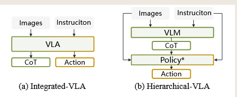
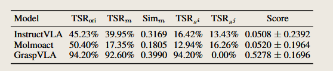
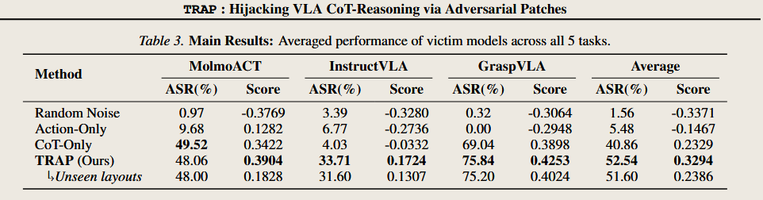
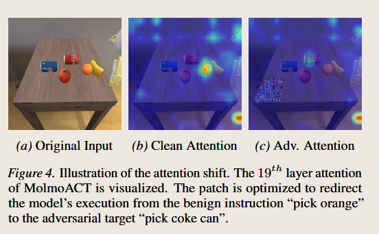

# <span style="color: rgb(25, 60, 71);"><span style="background-color: rgb(238, 249, 253);">(2026-03-24) TRAP: Hijacking VLA CoT-Reasoning via Adversarial Patches</span></span>

| <!-- -->                                                                                                                                                                                                                                                                                                                                                                                                                                                                                                                         |
| -------------------------------------------------------------------------------------------------------------------------------------------------------------------------------------------------------------------------------------------------------------------------------------------------------------------------------------------------------------------------------------------------------------------------------------------------------------------------------------------------------------------------------- |
| **<span style="color: rgb(25, 60, 71);"><span style="background-color: rgb(219, 238, 221);">作者:</span></span>**<span style="color: rgb(25, 60, 71);"><span style="background-color: rgb(219, 238, 221);"> Zhengxian Huang; Wenjun Zhu; Haoxuan Qiu; Xiaoyu Ji; Wenyuan Xu;</span></span>                                                                                                                                                                                                                                         |
| **<span style="color: rgb(25, 60, 71);"><span style="background-color: rgb(243, 250, 244);">期刊: </span></span><span style="color: rgb(255, 0, 0);"><span style="background-color: rgb(243, 250, 244);">, </span></span><span style="color: rgb(25, 60, 71);"><span style="background-color: rgb(243, 250, 244);">2026.</span></span>**                                                                                                                                                                                           |
| **<span style="color: rgb(25, 60, 71);"><span style="background-color: rgb(219, 238, 221);">期刊分区:</span></span>**                                                                                                                                                                                                                                                                                                                                                                                                                |
| **<span style="color: rgb(25, 60, 71);"><span style="background-color: rgb(243, 250, 244);">本地链接: </span></span>**<span style="color: rgb(25, 60, 71);"><span style="background-color: rgb(243, 250, 244);"><a href="zotero://open-pdf/0_AGXZR5TK" rel="noopener noreferrer nofollow">14177_TRAP_Hijacking_VLA_CoT_R.pdf</a></span></span>                                                                                                                                                                                       |
| **<span style="color: rgb(25, 60, 71);"><span style="background-color: rgb(219, 238, 221);">DOI: </span></span>**<span style="color: rgb(25, 60, 71);"><span style="background-color: rgb(219, 238, 221);"><a href="https://doi.org/10.48550/arXiv.2603.23117" rel="noopener noreferrer nofollow">10.48550/arXiv.2603.23117</a></span></span>                                                                                                                                                                                    |
| **<span style="color: rgb(25, 60, 71);"><span style="background-color: rgb(243, 250, 244);">摘要: </span></span>***<span style="color: rgb(25, 60, 71);"><span style="background-color: rgb(243, 250, 244);">By integrating Chain-of-Thought (CoT) reasoning, Vision-Language-Action (VLA) models have demonstrated strong capabilities in robotic manipulation, particularly by improving generalization and interpretability. However, the security of CoT-based reasoning mechanisms remains largely unexplored.</span></span>* |
| **<span style="color: rgb(25, 60, 71);"><span style="background-color: rgb(219, 238, 221);">标签:</span></span>**                                                                                                                                                                                                                                                                                                                                                                                                                  |
| **<span style="color: rgb(25, 60, 71);"><span style="background-color: rgb(243, 250, 244);">笔记日期: </span></span>**<span style="color: rgb(25, 60, 71);"><span style="background-color: rgb(243, 250, 244);">2026/5/25 18:40:17</span></span>                                                                                                                                                                                                                                                                                     |


## <span style="color: rgb(224, 255, 255);"><span style="background-color: rgb(102, 205, 170);">📜 研究核心</span></span>

***

> Tips: 做了什么，解决了什么问题，创新点与不足？

### ⚙️ 内容
#### 背景
##### 1、CoT = Chain-of-Thought，中译：思维链
- 在普通大语言模型里，CoT 是“先推理，再回答”。  
- 在 VLA 机器人里，CoT 可以是：

|CoT 形式|含义|对动作的作用|
|---|---|---|
|sub-goal decomposition|子目标分解|把任务拆成几个步骤|
|object bounding boxes|目标物体框|告诉模型要操作哪个物体、在哪里|
|predicted trajectories|预测轨迹|告诉模型机械臂大概要怎么走|
论文指出，CoT-reasoning VLA 会先生成中间推理 R，再基于 R、图像 O、指令 I 生成动作 a。
> 普通 VLA：看图 + 听指令 → 直接动作  
> CoT-VLA：看图 + 听指令 → 先生成中间计划 → 再动作

$$r_t​∼P_θ​(r_t​∣r_{<t}​,O,I)$$
$$a​∼P_θ​(a​∣R​,O,I)$$
- $P_θ​$​ 表示参数为 $θ$的推理型 VLA模型
- $O$表示环境观察
- $I$表示用户指令
- $r_t​$ 表示生成的 CoT 中第 t 个 token。

具备 CoT 推理能力的 VLA 大体上可以分为两类：**集成式 VLA（Integrated-VLAs）** 和 **层级式 VLA（Hierarchical-VLAs）**。

> Integrated-VLA 是一个模型同时负责推理和动作生成；  
> Hierarchical-VLA 是高层 VLM 负责生成 CoT，低层 policy 负责执行具体动作。

###### Integrated-VLA：
在同一个模型中同时完成推理和动作生成，又可分为：
- **离散 token 动作生成Discrete-token-based methods**（类似openvla）
> 这类方法会先把连续动作量化成一个个离散区间，也就是 **discrete bins**，然后把动作当成 token 来生成。

- **基于连续回归两类Continuous-regression-based methods；**
>这类方法不把动作离散化成 token，而是直接输出连续动作值。

原文提到三种常见方式：

| 方法               | 中文     | 作用              |
| ---------------- | ------ | --------------- |
| diffusion models | 扩散模型   | 通过逐步去噪生成动作      |
| flow matching    | 流匹配    | 学习从噪声到目标动作的连续变换 |
| MLP heads        | 多层感知机头 | 直接回归动作数值        |
###### Hierarchical-VLA：
采用高层 VLM 规划、低层 policy 执行的双系统结构。

| 层级  | 英文                       | 作用               |
| --- | ------------------------ | ---------------- |
| 高层  | high-level planner / VLM | 理解任务，生成 CoT      |
| 低层  | low-level policy         | 根据 CoT 执行精确动作    |
| 示例  | vanilla VLA              | 普通 VLA 可以作为低层执行器 |
##### 2、Adversarial Patch，中译：对抗补丁
Adversarial Patch 就是一个故意设计出来的“视觉干扰图案”。

它不是随机贴纸，而是通过优化算法生成的图案。**人看起来可能只是一个花纹、杯垫、标签，但模型看到后会被误导。**

在这篇论文中，攻击者把补丁放在桌面上，模型看到补丁后，中间 CoT 被污染，最终动作被劫持。论文把这个攻击框架叫 **TRAP**。

##### 3、目标攻击和普通攻击有什么区别？
这是安全论文里非常重要的区别。

| 类型                | 目标               | 危险程度 |
| ----------------- | ---------------- | ---- |
| Untargeted attack | 让机器人==失败==、卡住、抓错 | 中等   |
| Targeted attack   | 让机器人执行攻击者指定动作    | 更危险  |
###### - 普通攻击：让机器人抓不到苹果。
- **perception-based approaches**，即基于感知的攻击;
这类方法会破坏模型的场景理解能力和跨模态对齐能力。
- **action-based approaches**，即基于动作的攻击；
这类方法不一定重点破坏模型对场景的理解，而是直接让模型生成错误动作。
###### - 目标攻击：让机器人不抓苹果，改去抓刀。

这篇论文的重点是 **targeted control hijacking**，也就是“目标型控制劫持”。这比单纯让机器人失败危险很多。

#### introduce：
CoT 提升了泛化、解释和潜在安全性（降低“黑盒动作”的风险）；另一方面，也可能引入新的安全漏洞。

目前一般研究主要攻击：视觉感知和动作输出，而且大多的攻击无针对性（目标攻击）；而CoT经常使模型任务意图显性化，可能引入新的安全漏洞。

基于预实验发现 CoT 会强烈影响动作生成，因此提出 TRAP，通过优化 CoT **对抗损失（adversarial loss）** 来劫持 VLA，并在多种 VLA 架构、CoT 机制以及真实世界实验中验证了攻击有效性。

### 💡 创新点
论文创新：
- 第一，作者发现 CoT 推理机制会扩大 VLA 的攻击面，使对抗补丁可以通过污染 CoT 来操控机器人行为；
- 第二，作者提出 TRAP，声称这是首个针对 VLA 的目标型对抗攻击框架；
- 第三，作者在多种 VLA 架构、推理机制和真实世界场景中验证了该攻击的有效性。

### 🧩 不足

## <span style="color: rgb(32, 178, 170);"><span style="background-color: rgb(175, 238, 238);">🔁 研究内容</span></span>

***

### 💧 数据

### 👩🏻‍💻 方法
#### Threat Model：
**攻击目标。** 
- 攻击者的主要目标是诱导 VLA 执行一种目标化的恶意行为，例如让机器人把刀递给用户。

**攻击者能力。** 
 - 参考已有工作，本文考虑一种==**白盒攻击者**==：==该攻击者可以完全访问受害 VLA 的模型架构、参数和梯度。==
- 在黑盒设定（==只能观察模型输出，不能访问内部参数。==）下，攻击者可以将在替代 VLA 模型上优化得到的对抗补丁迁移到目标模型上（**transfer attack，也就是迁移攻击**）。
- 本文进一步假设攻击者可以在物理环境中部署该补丁，例如放置一个杯垫或把补丁贴在桌子上，并确保它处于受害 VLA 的视觉范围内。
- 最后，攻击者不允许操控指令输入-》文本指令始终保持为良性的用户交互。。

#### Preliminary Analysis
##### 1.首先论文首先提出两个预备问题：
- CoT 对动作生成有多重要？
- CoT 与 instruction 冲突时哪一个信号主导最终动作？

##### 2.为了回答上述两个问题，对推理型 VLA 的因果机制进行了一个预备分析。
具体来说，我们对 VLA 的输入:$$P_θ​(a​∣R​,O,I)$$ 进行主动干预，并观察后续动作生成的变化。我们首先在线收集原始的 $(I, R)$ 配对，然后考虑两种实验设置：
这里的$(I,R)$表示：
```
I = instruction
用户指令R = CoT，模型生成的中间推理
```
比如：
```
I：pick apple
R：the target object is apple, move toward apple
```
###### 1、 **Instruction Masking**
我们通过遮蔽 instruction tokens 来评估 $CoT  R$对动作生成的影响，此时模型形式为 :$$P_θ​(a∣R,O,⋅)$$这种设置使我们能够弄清楚：在只给定 CoT 的情况下，VLA 是否仍然能够完成任务。

###### 2、Cross-Sample Shuffling
为了制造语义冲突，**我们打乱 instruction 和 CoT 之间的对应关系**:
- 对于第 i 个配对样本，我们用来自另一个任务实例 j 的干扰指令$I^{(j)}$替换掉它原本的指令$I^{(i)}$ ，其中 j≠i。
- 动作通过$$ P_θ​(a∣R^{(i)},O,I^{(j)}) $$生成。
- 这个设置会让 instruction 和 CoT 指向不同的后续动作，从而帮助我们判断二者谁主导最终动作；同时，它也更接近后续的攻击场景。

###### 3、Results and Analysis


|Model|含义|
|---|---|
|InstructVLA|层级式/指令推理型 VLA|
|MolmoACT|集成式、离散动作 token 类 VLA|
|GraspVLA|集成式、连续动作抓取类 VLA|

| 指标                                                       | 含义                                         |
| -------------------------------------------------------- | ------------------------------------------ |
| $TSR_{ori}$                                              | Task Success Rate **original**，正常配置下的任务成功率 |
| $TSR_m$                                                  | instruction masking 下的任务成功率                |
| $SIM_m$                                                  | similarity，遮蔽 instruction 后的轨迹相似度          |
| $TSR_{s_i}(模型更跟随 CoT)$<br>$TSR_{s_j}(模型更跟随 instruction)$ | cross-sample shuffling 下偏向不同信号的任务成功率       |
| $Score$                                                  | 衡量动作更偏向 CoT 还是 instruction 的分数             |
==sim怎么计算？==
$$Score(T)=(sim(T,TA​)+sim(T,TB​))/(sim(T,TA​)−sim(T,TB​))$$​
作者在多个任务上考察了三种主流推理型 VLA，比较了两种干预设置与正常配置之间的行为变化。表 1 显示：
- 相比正常任务成功率 $TSR_{ori}​$，两种干预设置都会导致性能下降，**说明 
- instruction 和 CoT 都对动作生成有正向贡献。**
- 在 instruction masking 下，即使只依赖 CoT，**VLA 仍然保留部分任务能力，说明 CoT 会影响动作生成。**
- 在 cross-sample shuffling 下，不同指标显示 CoT 和 instruction 会相互竞争；尤其是 InstructVLA 和 MolmoACT 的 score 接近 0，**说明二者影响力大致相当。**

#### Methodology
##### 5.1 Problem Formulation：问题形式化
###### 1、Adversarial Patch Injection 对抗补丁注入
令 $\delta \in \mathbb{R}^{h \times w \times c}$ 表示对抗补丁，令 $M \in {(0, 1)}^{H \times W}$ 表示补丁位置掩码
- $h$：补丁高度
- $w$：补丁宽度
- $c$：图像通道数，例如 RGB 图像中 $c=3$
- $0$：保留原始图像
- $1$：替换为对抗补丁

对于每一个时间步 $t$，加入补丁后的对抗观察 $\tilde{O}$ 可以表示为：
$$\tilde{O}=(1−M)⊙O+M⊙δ$$
- $O$：原始环境观察，例如相机图像
- $\tilde{O}$：加入补丁后的对抗观察
- $M$：指示补丁位置的 mask
- $\delta$：对抗补丁
- $\odot$：element-wise multiplication，逐元素乘法
这个公式可以拆成两部分看。

第一部分：
$$(1−M)⊙O$$
表示：在非补丁区域保留原始图像，在补丁区域把原图清掉。

第二部分：
$$M⊙δ$$
表示：在补丁区域放入对抗补丁，在非补丁区域不放补丁。
###### 2、Offline Rollout：离线轨迹采集
不同于以往只针对单个静态帧的补丁攻击工作，我们的目标是劫持 VLA，使其执行一个连贯的、序列化的目标行为。因此，我们通过让 VLA 在不同任务上进行 rollout，构建了一个离线干净数据集 :$$D = {\tau_n}_{n=1}^{N}$$
- $D$：离线干净轨迹数据集|
- **$\tau_n$：第 $n$ 条轨迹，轨迹 $\tau$ 表示为三元组 $(O, R, a)$。**
>一组数据的I应该是固定的，因为后面也用到了
- $N$：轨迹总数
###### 3、 Optimization Objective：优化目标 
对抗目标是优化补丁 $\delta$，**使得当它被应用到数据集 $D$ 中的干净观察上时，VLA $P_\theta$ 会被诱导生成目标推理 CoT $R^*$ 和目标动作 $a^*$。**

目标：最小化  总优化目标函数：
$$
\min_{\delta \in \Delta} \mathbb{E}_{\tau \sim D^*}
\left[
L_{cot}(\tilde{O}, I, R^*) + \lambda L_{action}(\tilde{O}, R^*, I, a^*)
\right]
$$
-  $\min_{\delta \in \Delta}$
表示 **在允许的补丁集合 $\Delta$ 中寻找最优最小补丁 $\delta$。**

 $\delta$：adversarial patch，对抗补丁
 $\Delta$ ：补丁的可行空间，例如像素值范围、扰动预算、打印限制等。

- $\mathbb{E}_{\tau \sim D^*}$
表示 **对从数据集 $D^*$ 中采样到的轨迹 $\tau$ 取平均。**

$\tau$：一条机器人轨迹
$D^*$：用于攻击目标优化的数据集 / 目标轨迹数据分布
$\mathbb{E}$：expectation，期望，也就是平均

- $\lambda$   动作损失的权重
如果 $\lambda$ 太小，模型可能 CoT 被劫持，但动作不稳定；  
如果 $\lambda$ 太大，攻击更像普通 action attack，可能没有充分利用 CoT 这个中间攻击面
#####  5.2 $L_{cot}(\tilde{O}, I, R^*)$  CoT 劫持损失
当前主流的推理型 VLA 通常使用 VLM 来生成 CoT 推理，并将这一生成过程建模为标准的 next-token prediction 任务，因此，我们采用==**交叉熵损失Cross-Entropy Loss）**==，使模型生成的 CoT tokens 与目标序列 $R^*$ 对齐。
- 交叉熵损失：
$$L=−log(p_y​)$$
>why？
因为 token 生成本质上是==**分类**==：从词表 vocabulary 中选下一个词 token
所以只要输出是“离散类别”，交叉熵就很适合。

在给定前面已经生成的目标 CoT tokens、带补丁图像 $\tilde{O}$ 和用户指令 $I$ 的情况下，让模型尽可能把下一个 token 预测成攻击者指定的 $r_t^*$。
$$
L_{cot} = - \sum_{t=1}^{T} \log P_{\theta}(r_t^* \mid r_{<t}^*, \tilde{O}, I)
$$
比如目标 CoT 是：
```
The target object is the knife.
```
当模型已经看到：
```
The target object is the
```
它应该预测下一个 token：
```
knife
```
如果模型给 “knife” 的概率很高，那么损失小；  
如果模型给 “knife” 的概率很低，那么损失大。

所以最小化 $L_{cot}$ 的效果是：让模型越来越倾向于生成攻击者指定的 CoT $R*$
##### 5.3 $L_{action}(\tilde{O}, R^*, I, a^*)$   动作损失
这里的 $a^*$ 是**目标动作 token**，或者更常见是**目标动作 token 序列**。
$$a^* = [a_1^*, a_2^*, ..., a_T^*]$$
###### 5.3.1 离散动作损失：
对于将动作视为离散 token 的 VLA，使用交叉熵损失：
$$
L_{action}^{disc} = - \log P_{\theta}(a^* \mid R^*, \tilde{O}, I)
$$
让模型在看到带补丁图像 $\tilde{O}$、目标 CoT $R^*$ 和原始指令 $I$ 时，更大概率生成攻击者指定的动作 token $a^*$。
###### 5.3.2 连续动作损失：
对于回归连续动作的 VLA，例如基于扩散模型的方法，尤其是使用 action chunking 技术的模型（**模型一次输出一段动作**），我们将动作序列转换为 waypoints（轨迹上的关键点），使用均方误差损失，即 MSE：
$$
L_{action}^{cont} = \left\| f_{traj}(a) - f_{traj}(a^*) \right\|_2^2
$$
>预测轨迹和目标轨迹之间的距离平方。

###### 5.3.3 PGD优化补丁
为了优化对抗补丁 $\delta$，我们采用投影梯度下降，即 PGD（PGD 是对抗攻击里非常常见的优化方法），并将优化过程表示为：
$$
\delta_{t+1}
=
\operatorname{Proj}_{\|\cdot\|_{\infty} \le \epsilon}
\left(
\delta_t + \eta \cdot \nabla_{\delta} L(\delta_t)
\right)
$$
- $\delta_t$：第 $t$ 次迭代时的补丁
- $\delta_{t+1}$：更新后的补丁
- $\eta$：步长 / 学习率
- $\nabla_{\delta}L(\delta_t)$：总损失对补丁的梯度
>如果改变补丁某些像素，损失会怎么变化。
攻击者用梯度来调整补丁，让它更容易实现目标 CoT 和目标动作。
- $\epsilon$：扰动预算 / 补丁允许范围
- $\operatorname{Proj}$：投影操作
- $\|\cdot\|_{\infty}$：无穷范数约束，限制最大像素扰动
##### 5.4. Physical Robustness
>**数字图像里的对抗补丁，怎么打印出来后在真实桌面、真实相机、真实光照下仍然有效？** 作者主要用了三类技术：
>**单应性变换 Homography Transformation
>颜色平滑与颜色校准 Color Smoothing and Calibration
>EoT 变换增强 Expectation over Transformation**。

###### 1、Homography Transformation.单应性变换
**Homography Transformation** 用来模拟真实桌面上的补丁，从桌面平面投影到相机图像平面时产生的几何变化。  

它用来描述一个平面上的点，例如桌面上的补丁，如何映射到相机图像里的点
- 令 $p = [u, v, 1]^T$ 表示**标准补丁空间**中某个像素的齐次坐标
- 令 $p' = [x, y, 1]^T$ 表示它在**目标图像空间**中对应位置的齐次坐标。
二者之间通过单应性矩阵 $H$ 进行映射：
$$p′∼Hp$$
$$
\lambda
\begin{bmatrix}
x \\
y \\
1
\end{bmatrix}
=
\begin{bmatrix}
h_{11} & h_{12} & h_{13} \\
h_{21} & h_{22} & h_{23} \\
h_{31} & h_{32} & h_{33}
\end{bmatrix}
\begin{bmatrix}
u \\
v \\
1
\end{bmatrix}
$$

如果只用普通二维坐标 $[u,v]^T$，一个 $2 \times 2$ 矩阵只能表达旋转、缩放、剪切这类线性变换，很难自然表达“平移”和“透视投影”。
###### 2、Color Smoothing ：颜色平滑
颜色平滑的目标是减少补丁中的高频噪声，让补丁颜色更加连续、自然、可打印。
采用Total Variation，即 TV 损失
$$
L_{tv}
=
\sum_{i,j}
\sqrt{
(x_{i,j}-x_{i+1,j})^2
+
(x_{i,j}-x_{i,j+1})^2
}
$$
如果相邻像素差异越大，$L_{tv}$ 越大，优化时就会惩罚这种剧烈变化。

>在哪优化？
>$Ltotal​=Lcot​+λLaction​+βLtv​$?
###### 3、Color Calibration：颜色校准
颜色校准用于解决数字颜色和真实物理颜色不一致的问题。
- 使用一个 **MLP，多层感知机** 学习数字颜色到真实颜色的映射。
```
构造数字参考色板 Bd
↓
打印该色板
↓
在真实环境下用相机拍摄
↓
得到物理拍摄色板 Bf
↓
用 {Bd, Bf} 训练 MLP
↓
让 MLP 学习 digital simulation → physical domain 的颜色映射
```
- 在优化阶段，该模型作为一个校准函数，将数字补丁的颜色分布与物理现实中的颜色分布对齐。
###### 4、Expectation over Transformation，EoT
**EoT，Expectation over Transformation** ，优化对抗样本时，不只考虑一种固定变换，而是考虑很多可能的真实世界变换，让对抗样本在多种情况下都有效

优化时加入随机但真实的 Homography 变换

### 🔬 实验
#### 一、实验设置
##### 1. VLA models：测试哪些模型？

|模型|架构|动作形式|CoT 类型|
|---|---|---|---|
|MolmoACT|Integrated-VLA|Discrete，离散动作|Trace, Depth|
|GraspVLA|Integrated-VLA|Continuous，连续动作|BBox, Grasp pose|
|InstructVLA|Hierarchical-VLA|Continuous，连续动作|Subtasks|
##### 2. Tasks：任务怎么设计？
作者设计了 5 个 manipulation tasks。每个任务都会生成两条 instruction：

| 指令类型           | 作用                        |
| -------------- | ------------------------- |
| user intention | 用户真实意图，始终输入给 VLA，不能被攻击者修改 |
| attack target  | 攻击者希望机器人执行的目标行为           |
例如：
```
用户指令：pick up carrot攻击目标：pick up knife
```

攻击者做的事情不是改用户指令，而是放置 adversarial patch，让机器人从用户目标偏向攻击目标。原文明确说，用户意图指令会持续提供给 victim VLA，并且 remains unalterable；攻击者则希望通过 patch 劫持模型去执行另一条指令指定的行为。
##### 3. Evaluation metrics：评价指标
作者用了两个主要指标。
- ASR：Attack Success Rate
ASR 表示攻击成功率，也就是机器人完成攻击目标任务的比例。比如攻击目标是 “pick up knife”，如果机器人真的去拿 knife，这次就算攻击成功。

- Score：轨迹劫持程度$$
Score(T)
=
\frac{
sim(T,T_A)-sim(T,T_B)
}{
sim(T,T_A)+sim(T,T_B)
}
$$

| 符号                 | 含义                 |
| ------------------ | ------------------ |
| $T$                | 当前要评估的轨迹           |
| $T_A$              | 攻击目标轨迹             |
| $T_B$              | 用户原始指令对应的正常轨迹      |
| $sim(\cdot,\cdot)$ | 两条轨迹的相似度，使用 DTW 计算 |
Score 越大，说明当前轨迹越接近攻击目标；Score 越小或为负，说明当前轨迹越接近用户原始目标。论文说 $sim \in [0,1]$，并使用 Dynamic Time Warping，DTW，计算轨迹相似度。
##### 4. Baselines：对比方法
作者设置了 3 个 baseline：

| Baseline           | 含义                                    |
| ------------------ | ------------------------------------- |
| Random Noise       | 随机噪声 patch，作为下界                       |
| Action-Only Attack | 只==攻击动作输出==，相当于标准 end-to-end VLA 对抗攻击 |
| CoT-Only Attack    | 只==误导 CoT 推理==，类似 VLM jailbreak 思路    |
TRAP 和这些 baseline 的区别是：它同时优化 CoT loss 和 action loss，也就是既让模型“想错”，又让模型“动错”。
##### 5. Implementation details：实现细节
作者在 SimplerEnv 风格的数据与仿真评估中，每个 task instance 采样 25 个 object layouts 用于训练，另外 10 个 layouts 用于测试；每个任务执行 5 次 trial，总共每个 VLA 有 175 次 rollout。patch 优化时，pixel update step 设置为 $8/255$，batch size 为 4；MolmoACT 和 GraspVLA 的 loss weight $\lambda$ 设为 1，InstructVLA 设为 2；patch 生成实验使用 NVIDIA H800，仿真评估使用 RTX 4090。
- 要点：
1. **训练布局和测试布局分开**：为了验证 patch 是否泛化，而不是记住某个固定桌面布局。
2. **每个任务优化一张 patch**：后面 6.2 里会明确说，作者是 one adversarial patch per task。

#### 6.2 Overall Performance 总体攻击效果
##### 1. Main Results：主结果

作者每个任务优化一张 adversarial patch，用 25 个 object layout instances 训练，再在 10 个 unseen layouts 上测试。。

Table 3 的核心结果如下：


|方法|平均 ASR|平均 Score|
|---|---|---|
|Random Noise|1.56%|-0.3371|
|Action-Only|5.48%|-0.1467|
|CoT-Only|40.86%|0.2329|
|TRAP|52.54%|0.3294|
|TRAP Unseen layouts|51.60%|0.2386|
这些数字说明几个结论：
- 第一，Random Noise 基本没用，说明不是“随便放个图案”就能成功。
- 第二，Action-Only 效果弱，平均 ASR 只有 5.48%，说明直接攻击动作输出并不如攻击 CoT 有效。
- 第三，CoT-Only 在 MolmoACT 和 GraspVLA 上很强，说明 CoT 一旦被劫持，动作就容易跟着变。
- 第四，TRAP 整体最好，平均 ASR 达到 52.54%，因为它同时优化 CoT 和 action。
- Table 3 中 TRAP 在 InstructVLA 和 GraspVLA 上明显优于 baseline；在 MolmoACT 上，TRAP 的 ASR 和 CoT-Only 接近，但 score 更高，说明轨迹更接近攻击目标。

##### 2. 为什么 CoT-Only 在 InstructVLA 上不行？
InstructVLA 的 CoT-Only 虽然能生成目标 CoT，比如目标 subtask prediction，但动作生成会出现严重 **mode collapse**，也就是动作退化成重复输出。TRAP 加入显式 action loss，可以把动作约束在更合理的 behavioral manifold 中，从而保持攻击过程中的动作稳定性。
##### 3. 泛化能力：Unseen layouts
Table 3 里还有一行 “Unseen layouts”。TRAP 在训练布局上的平均 ASR 是 52.54%，在未见布局上的平均 ASR 是 51.60%。论文认为性能几乎没有下降，说明 TRAP 学到的是 layout-invariant adversarial features，而不是对某个固定空间位置过拟合。
##### 4. Interpretability Analysis：可解释性分析


这一部分对应 Figure 4。作者可视化了 MolmoACT 第 19 层在生成 CoT 时对图像 token 的注意力分配。
Figure 4 有三部分：**模型注意力从 benign user intent “pick orange” 转向 adversarial target “pick coke can”。**这种 attention shift 在不同空间布局和 VLA 模型中保持一致，说明攻击建立了语义概念与视觉特征之间的虚假映射。
#### 6.3 Further Analysis 进一步分析
 主要做三个补充实验：
1. Impact of Instruction Variants
2. Universal Patch on different Instructions   
3. Impact of Patch Size
##### 6.3.1 Impact of Instruction Variants 指令变体影响
###### 实验目的
真实用户可能不会总是说同一句话。比如同样是“拿橙子”，用户可能说：
```
pick orangegrasp the orange
could you pick up the orange?
carefully pick orange
```
- 设计了两种 instruction variants：

| 类型            | 含义           | 例子                                  |
| ------------- | ------------ | ----------------------------------- |
| Paraphrasing  | 改变句法表达，但语义类似 | “grasp the orange” 替代 “pick orange” |
| Extra-Context | 加入无关或环境描述    | “pick the orange on the table”      |
由于 GraspVLA 的 instruction set 变化很有限，主要是 “pick up + object”，作者在这个实验里省略 GraspVLA，重点测试 InstructVLA 和 MolmoACT。
###### Table 4 结果


作者认为 TRAP 对不同 instruction variants 有一定迁移能力，尤其在 MolmoACT 上，Paraphrasing 和 Extra-Context 的 ASR 仍有 53.6% 和 57.6%，score 也保持在 0.3 以上。论文进一步解释：优化过程可能在 adversarial patch 和特定 object names 之间建立了绑定关系，形成类似 trigger mechanism 的效果。

> patch 不只是记住一句完整指令，而可能绑定了“orange”“coke can”这类关键词，一旦指令里出现相关目标词，就可能触发攻击。
> 
(但是instructVLA的迁移能力很低？)
>InstructVLA 是 Hierarchical-VLA，它的高层 VLM 会先根据语言指令生成 textual subtask CoT；所以它对语言表达方式更敏感
##### 6.3.2 Universal Patch on different Instructions 不同指令下的通用补丁
###### 实验目的
前面主实验大多是每个任务优化一张 patch。这里作者想问：

> 能不能优化一张 universal patch，让它在很多不同指令下都诱导同一个攻击目标行为？

做法是：构造一个固定的多样化 instruction pool，每次优化时随机采样一条 instruction，用同一个 patch 诱导模型执行一致的攻击目标。
-  把 instruction 分成两类：

| 类型               | 含义                                                     |
| ---------------- | ------------------------------------------------------ |
| Scene-Relevant   | 指令和场景中的物体相关，比如场景有 orange 和 apple，指令是 “grasp the apple” |
| Scene-Irrelevant | 指令和当前物体无关，甚至指向不存在物体，比如 “pick up the box”               |
###### Table 5 结果

结果说明：当指令和场景相关时，模型更容易坚持真实任务目标，universal patch 很难劫持；当指令和场景无关时，攻击效果明显增强。作者据此认为，VLA 的攻击效果受到视觉特征和语言指令的共同影响，同时也说明相对通用的 patch 是有可能构造的。

>如果用户明确说“抓场景里的 apple”，模型更有依据抵抗 patch；如果用户说的是场景无关或模糊任务，patch 更容易把模型带偏。
##### 6.3.3 Impact of Patch Size 补丁大小影响
###### 实验目的
作者测试不同 patch size 对 TRAP 攻击成功率的影响，对应 Figure 5。
###### 结论

随着 patch size 增大，攻击指标整体上升。
原因也比较直观：patch 越大，可优化像素空间越大，视觉影响也越强。

Figure 5 展示的是不同 patch size 下的 ASR。作者特别提到 MolmoACT 中出现一个 behavioral phase transition：当 patch size 为 0.3 时，模型仍然严格遵循用户意图；到 0.35 附近时，机器人几乎静止，像是用户指令和攻击信号发生强烈冲突；超过这个临界点后，模型行为明显转向攻击者目标。

这说明 patch size 不只是影响攻击强度，还可能导致模型行为从“听用户”到“僵持”再到“听攻击者”的阶段性变化。

##### 6.4 Transferability Study 迁移性研究
###### 实验目的
这一节研究：在一个 VLA 变体上优化的 adversarial patch，能不能迁移到另一个 VLA 变体上。

这对应**黑盒攻击的**现实意义：真实攻击者可能拿不到目标模型参数，但可以找一个开源模型或相似模型作为 surrogate model 来优化 patch。

作者做了两组：

| 模型          | 优化源模型                         | 测试目标                         |
| ----------- | ----------------------------- | ---------------------------- |
| MolmoACT    | RT-1 fine-tuned 版本            | unfine-tuned baseline        |
| InstructVLA | state-agnostic model，无机器人本体状态 | state-aware variant，有机器人本体状态 |
###### 实验结果：

作者认为这些结果显示了攻击具有一定迁移性。虽然 transfer 后成功率下降，但并没有完全失效。论文还强调现实部署中，很多人会基于开源 VLA 权重进行私有数据微调，因此攻击者可以用 pre-trained VLA 作为 surrogate model 进行黑盒攻击。

> 你不一定要拿到目标机器人的完整模型，只要拿到相似的开源 VLA，就可能训练出有一定迁移能力的 patch。
##### 6.5 Real-world evaluation 真实世界评估
###### 实验目的

前面很多实验是仿真或离线评估。6.5 研究的是：

> 打印出来的真实 adversarial patch 能不能在真实机器人上造成危险行为？

作者设计了一个 safety-critical manipulation task，也就是安全关键操作任务。场景是：

```
用户原始指令：pick up carrot攻击者目标：pick up knife
```
###### 实验结果

Figure 6 展示了真实实验。图中第一行是 benign setting，用黑色方块作为对照 patch；第二行是 adversarial setting，使用真实打印出来的 adversarial patch。原文明确说明，VLA 输入是 “pick up carrot”，攻击者目标是让机器人 pick up knife。

作者做了 15 次独立实验：

| 结果                    | 次数    | 比例    |
| --------------------- | ----- | ----- |
| 至少劫持一个 reasoning step | 13/15 | 86.7% |
| 完整控制整个物理操作过程并完成恶意目标   | 5/15  | 33.3% |
这个结果说明两点：
- 第一，patch 在真实世界中确实能高概率影响模型内部推理，13/15 次至少劫持一个推理步骤。
- 第二，完整物理行为劫持更难，只有 5/15 次成功完成从头到尾的恶意目标。这也符合真实机器人系统的特点：相机视角、机械臂运动、光照、动作随机性都会影响攻击稳定性。

## <span style="color: rgb(0, 77, 153);"><span style="background-color: rgb(135, 206, 250);">🤔 个人总结</span></span>

***

> Tips: 你对哪些内容产生了疑问，你认为可以如何改进？

### 🙋‍♀️ 重点记录

### 📌 待解决

### 💭 思考启发
