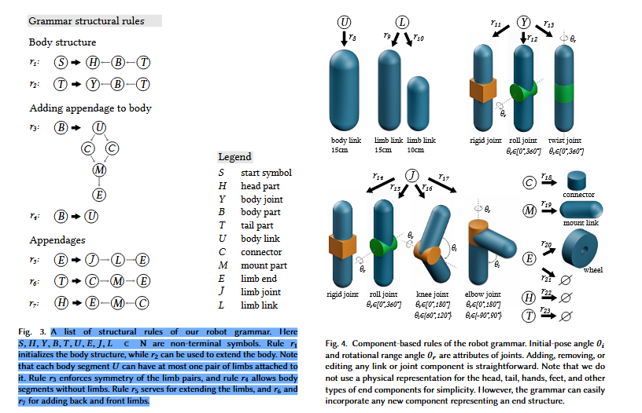

---

将形式语言理论应用于机器人结构设计的巧妙方法，也是整篇论文的基石。
### 1. 核心思想：用“造句”的方式来“造机器人”

想象一下，我们要设计一种语言来描述所有可能的机器人。这种语言的“字母表”就是各种机器人零件（连杆、关节、轮子等）。**递归图语法**就是这套语言的**语法规则**。

*   **普通语法（如英语语法）**：规则规定如何将单词（名词、动词）组合成合法的句子。
*   **图语法**：规则规定如何将**零件（节点）** 通过**连接关系（边）** 组合成合法的**机器人结构图**。
*   **递归**：规则可以引用自身，从而用有限的规则描述出无限复杂或大规模的结构（比如，一条蜈蚣有100条腿，但规则可能只有几条）。

### 2. 图语法的组成部分（The Formal Definition）

论文中将语法定义为一个五元组：**G = (N, T, A, R, S)**

*   **N (Non-terminal Symbols, 非终端符号)**：代表**未完成的、抽象的子组件**。它们不能成为最终机器人的一部分，必须被后续的规则替换掉。例如：`BODY`（身体）、`LEG`（腿）、`APPENDAGE`（附属肢）。**这是实现递归的关键**。
*   **T (Terminal Symbols, 终端符号)**：代表**具体的、物理的机器人组件**。它们是最终的零件，不能再被展开。例如：`Link`（连杆）、`RevoluteJoint`（旋转关节）、`Wheel`（轮子）。
*   **A (Attributes, 属性)**：为**终端符号**赋予具体的参数，使设计多样化。例如：一个`RevoluteJoint`可以有属性 `θ_i`（初始角度）和 `θ_r`（旋转范围）。
*   **R (Production Rules, 产生式规则)**：这是语法的核心，定义了如何将一个符号（通常是非终端符号）替换为一个小的图（由非终端和终端符号共同组成）。规则的形式是：**左值 → 右值**。
*   **S (Start Symbol, 起始符号)**：整个推导过程的开始，通常是一个代表“整个机器人”的非终端符号，如 `ROBOT` 或 `S`。

### 3. 递归图语法的工作流程（Derivation Process）

生成一个机器人就是从一个初始符号开始，不断地应用规则，直到图中**不再包含任何非终端符号**。这个过程称为“推导”。

**举个例子（参照论文中的图5）：**
1.  起始：我们从 `S` (Start) 开始。
2.  应用规则 `r1: S → H B T`：现在图有了三个部分：头(`H`)、身体(`B`)、尾(`T`)。它们都是**非终端符号**。
3.  应用规则 `r2: B → U B`：这体现了**递归**！规则将身体 `B` 扩展成了“一个身体节段 `U`” + “另一个身体 `B`”。这个过程可以重复无数次，从而生成任意长度的身体。
4.  应用规则 `r3: U → D D`：将身体节段 `U` 扩展为两个对称的连接点 `D`（代表左和右），用于添加肢体。
5.  应用规则 `r4: D → C L`：将连接点 `D` 扩展为一个关节(`C`)和一个肢体(`L`)。
6.  应用规则 `r5: L → J L`：**再次递归**！这条规则可以将肢体 `L` 扩展为一个关节(`J`)和另一个肢体(`L`)，从而创造出多段的肢体（像我们的上臂+前臂）。
7.  ...（继续应用规则）
8.  最终，所有非终端符号（如 `J`, `L`, `C`）都会被**组件规则**替换为终端符号（如 `RevoluteJoint`, `Link`, `Wheel`）。

通过这种方式，一个简单的起始符号 `S`，经过一系列递归规则的展开，最终生成了一個复杂的、对称的、可制造的机器人结构图。

### 4. 论文中语法规则的具体设计

论文的规则分为两大类（Fig. 3 & 4）：

**a) 结构规则 (Structural Rules)**
*   **作用**：定义机器人的**拓扑骨架**。它们负责“长身体”、“长腿”，但不管具体是用什么零件。
*   **特点**：规则的右值通常**包含非终端符号**，因此可以继续展开。
*   **示例**：
    *   `r1: S → H B T` (初始化一个带头尾的身体)
    *   `r2: B → U B` (递归地扩展身体)
    *   `r3: U → D D` (在身体节段上添加对称的连接点)

**b) 组件规则 (Component Rules)**
*   **作用**：将抽象的非终端符号**实例化**为具体的物理组件。
*   **特点**：规则的右值**只包含终端符号**（和它们的属性），推导到这一步就停止了。
*   **示例**：
    *   `r16: C → RevoluteJoint(θ_i, θ_r)` (将连接符 `C` 实例化为一个旋转关节)
    *   `r20: L → Link` (将肢体符 `L` 实例化为一根连杆)

### 5. 为什么这个方法如此强大？

1.  **紧凑性与表达性**：只用**几十条规则**（论文中约23条），就能描述**数十万个**独特且合理的机器人设计。它排掉了所有无效的设计（如孤立的连杆、无法连接的关节），极大地压缩了搜索空间。
2.  **保证可制造性**：由语法规则生成的图，天生就保证了零件之间连接关系的合理性，可以直接映射为三维模型用于仿真和制造。
3.  **融合领域知识**：语法规则的设计融入了生物学的启发（如节肢动物的对称性、身体分节），使得生成的设计不仅合理，而且“像那么回事”，提高了搜索效率。
4.  **递归性**：这是实现高度复杂性和多样性的关键。几条递归规则就能覆盖从蜘蛛（8条腿）到蜈蚣（100条腿）的所有可能。
5.  **可扩展性**：如果想加入新的组件（比如一个“抓手”），只需要定义新的终端符号和为它添加几条新的规则即可，整个系统框架不需要改变。

### 对你的专利的启示与区别

*   **启示**：你的专利中的 **“图语”** 完全可以借鉴这种基于图的形式化表示方法。它提供了一种结构化、离散化描述机器人拓扑的优秀范式。
*   **核心区别**：RoboGrammar的语法是**离散的**，它生成一个结构，然后通过**外部搜索算法（GHS）** 在这个离散空间里筛选。而你的专利核心是 **“可微分”**。
    *   **你的机会**：你可以思考如何将**连续参数**（连杆长度、关节刚度、质量等）融入到这个“图语”表示中。你的“可微分物理平台”可以**直接计算性能损失关于这些连续参数的梯度**，从而**优化**它们，而不仅仅是搜索。
    *   **更高阶的想法**：你甚至可以尝试让神经网络**学习语法规则的应用概率**，或者直接**生成满足语法约束的图结构**，从而用梯度下降的方式来“学习”最优的拓扑，这将是一个巨大的突破。

总而言之，**递归图语法是RoboGrammar的“设计语言”，它优雅地将生物学先验知识、可制造性约束和组合爆炸的设计空间管理结合在了一起**。理解了它，就理解了这篇论文一半的精髓。你的工作可以在此基础上，引入可微分性，迈向下一阶段。