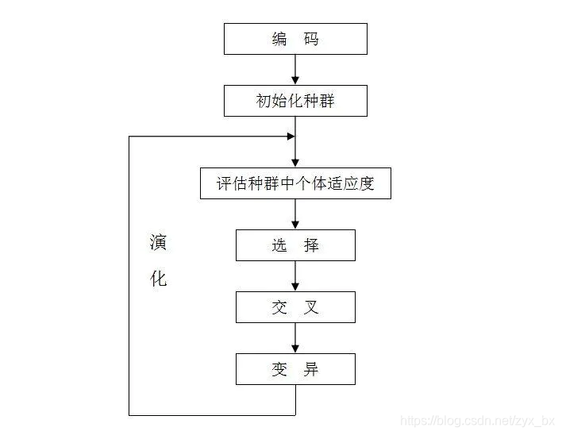

---

## 遗传算法（**Genetic Algorithm，简称 GA**）
https://zhuanlan.zhihu.com/p/100337680
遗传算法（**Genetic Algorithm，简称 GA**）是一种**模拟生物进化过程**的优化算法，属于**进化计算**和**智能优化算法**的一种，常用于解决**复杂、非线性、传统方法难以求解的优化问题**。

遗传算法（Genetic Algorithm，简称GA）起源于对生物系统所进行的计算机模拟研究，是一种**随机全局搜索优化**方法，它模拟了自然选择和遗传中发生的**复制**、**交叉**(crossover)和变异(mutation)等现象，从任一初始种群（Population）出发，通过随机选择、交叉和变异操作，产生一群更适合环境的个体，使群体进化到搜索空间中越来越好的区域，这样一代一代不断繁衍进化，最后收敛到一群最适应环境的个体（Individual），从而求得问题的优质解。

## GNN(Graph Neural Network，图神经网络)
